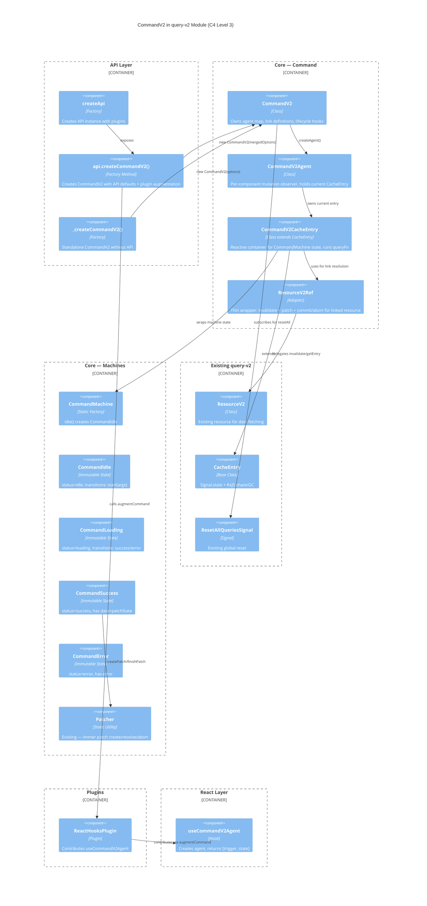
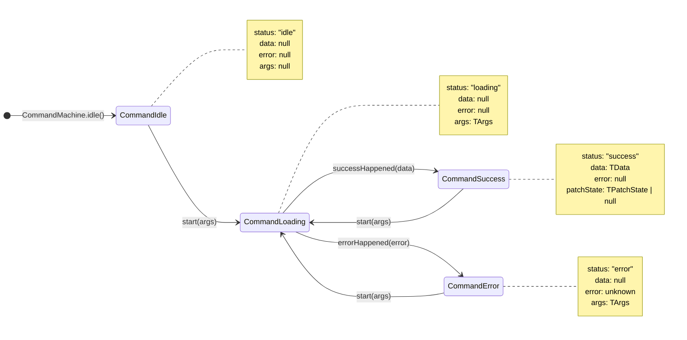
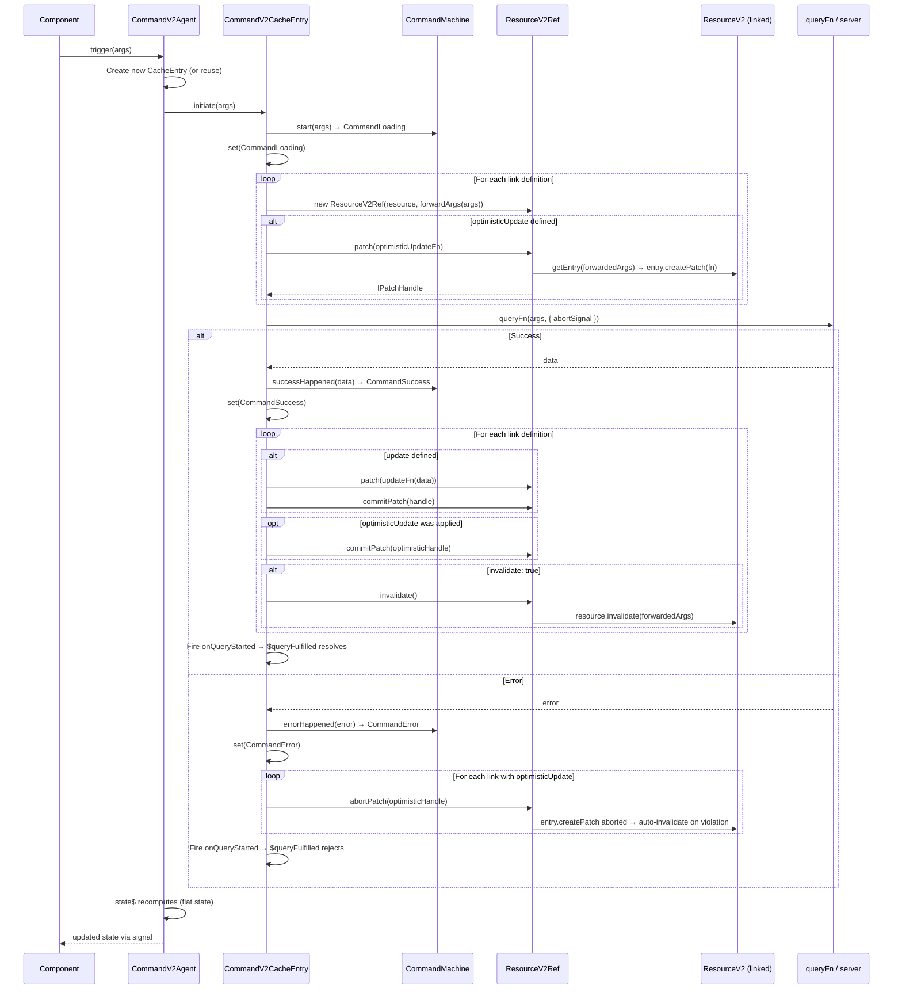

# CommandV2 — System Architecture

## 1. ADR Summary

### ADR-1: Feature Scope — Core + Link Essentials (Q1 → Option 2)

**Status**: Accepted

**Decision**: Port state machine, agent, `invalidate`, `update`, `optimisticUpdate`. Drop `lock`, `create`, `mutate()`, `isRepeating`.

**Rationale**: `lock` and `create` are niche v1 features with minimal adoption. `mutate()` is already deprecated. `isRepeating` is derivable from `agent.state$` history in component state if needed. Keeps API surface lean and consistent with v2 philosophy.
[ref: ../01-research/research-gaps.md#Q1]

### ADR-2: State Machine — Separate CommandMachine Hierarchy (Q2 → Option 2)

**Status**: Accepted

**Decision**: New `CommandIdle → CommandLoading → CommandSuccess | CommandError` hierarchy. Share `Patcher` as standalone utility.

**Rationale**: Commands have no `refreshing` concept (no SWR). Forcing resource machines onto commands creates meaningless states. Patcher is already a static utility class — reuse is trivial.
[ref: ../01-research/research-gaps.md#Q2], [ref: ../01-research/research-query-v2-arch.md#1. State Machine]

### ADR-3: Link Resolution — New ResourceV2Ref Adapter (Q3 → Option 2)

**Status**: Accepted

**Decision**: Thin `ResourceV2Ref` adapter wraps `IResourceV2` + `IResourceV2CacheEntry` for a specific args tuple. Exposes `invalidate()`, `patch()`, `commitPatch()`, `abortPatch()`.

**Rationale**: Clean boundary between Command internals and Resource internals. Mirrors proven v1 `ResourceRef` pattern. Keeps Command testable with mock refs.
[ref: ../01-research/research-gaps.md#Q3], [ref: ../01-research/research-command-v1.md#8. Link / Cache Invalidation Mechanism]

### ADR-4: Caching — Simple Map per Command (Q4 → Option 3)

**Status**: Accepted

**Decision**: `Map<symbol, CommandV2CacheEntry>` per `CommandV2` instance. Each agent gets a unique symbol key.

**Rationale**: Commands are fire-and-forget; arg-keyed CacheMap is overkill. Simple Map still supports lifecycle hooks, `resetAll()`, and GC via `CacheEntry.onClean$`.
[ref: ../01-research/research-gaps.md#Q4], [ref: ../01-research/research-query-v2-arch.md#2. CacheEntry]

### ADR-5: Plugin System — Add augmentCommand() (Q5 → Option 1)

**Status**: Accepted

**Decision**: Add optional `augmentCommand?()` to `IPlugin`. New `PluginCommandContributions` conditional type. `ReactHooksPlugin` contributes `useCommandV2Agent`.

**Rationale**: Symmetry with resource augmentation matters for DX. Existing plugins don't break since `augmentCommand` is optional.
[ref: ../01-research/research-gaps.md#Q5], [ref: ../01-research/research-query-v2-arch.md#9. Plugin System]

### ADR-6: Public API — Both Standalone and API-Integrated (Q6 → Option 3)

**Status**: Accepted

**Decision**: `_createCommandV2(options)` standalone factory + `api.createCommandV2(options)` on API instance.

**Rationale**: Matches resource pattern. Standalone enables simple use cases; API-integrated provides shared defaults, `resetAll()`, and plugin augmentation.
[ref: ../01-research/research-gaps.md#Q6], [ref: ../01-research/research-query-v2-arch.md#8. API Layer]

### ADR-7: Drop select (Q7)

**Status**: Accepted. Consistent with v2 Resource which also lacks `select`.
[ref: ../01-research/research-gaps.md#Q7]

### ADR-8: Exclude from Snapshots (Q8)

**Status**: Accepted. Commands start idle on every page load — snapshotting mutation results has no meaningful SSR use.
[ref: ../01-research/research-gaps.md#Q8]

### ADR-9: No Previous Tracking (Q9)

**Status**: Accepted. Commands are fire-and-forget. SWR previous-data pattern doesn't apply.
[ref: ../01-research/research-gaps.md#Q9]

---

## 2. C4 Component Diagram

### Query-V2 Module — CommandV2 Integration

Shows how new CommandV2 components relate to existing query-v2 infrastructure.



### Component Responsibilities

| Component | Responsibility |
|---|---|
| **CommandV2** | Owns agent map (`Map<symbol, CommandV2CacheEntry>`), link definitions, lifecycle hooks. Creates agents. Subscribes to `ResetAllQueriesSignal`. |
| **CommandV2Agent** | Per-component observer. Holds reference to current `CommandV2CacheEntry`. Exposes `state$` (flat computed signal) and `trigger(args)`. |
| **CommandV2CacheEntry** | Extends `CacheEntry<TCommandMachineInstance>`. Runs `queryFn`, manages AbortController, resolves links (invalidate/patch), fires lifecycle hooks. |
| **CommandMachine** | Static factory — `CommandMachine.idle()`. Produces immutable state objects. |
| **ResourceV2Ref** | Adapter wrapping `IResourceV2<TArgs, TData>` for specific args. Methods: `invalidate()`, `patch(fn)`, `commitPatch(handle)`, `abortPatch(handle)`. |

---

## 3. Command State Machine

### State Diagram



### State Types

```ts
export type TCommandMachineStatus = "idle" | "loading" | "success" | "error";

export interface TCommandIdleState {
    readonly status: "idle";
    readonly args: null;
    readonly data: null;
    readonly error: null;
}

export interface TCommandLoadingState<TArgs> {
    readonly status: "loading";
    readonly args: TArgs;
    readonly data: null;
    readonly error: null;
}

export interface TCommandSuccessState<TArgs, TData> {
    readonly status: "success";
    readonly args: TArgs;
    readonly data: TData;
    readonly error: null;
    readonly patchState: TPatchState<TData> | null;
}

export interface TCommandErrorState<TArgs> {
    readonly status: "error";
    readonly args: TArgs;
    readonly data: null;
    readonly error: unknown;
}

export type TCommandMachineState<TArgs = unknown, TData = unknown> =
    | TCommandIdleState
    | TCommandLoadingState<TArgs>
    | TCommandSuccessState<TArgs, TData>
    | TCommandErrorState<TArgs>;
```

### Transition Table

| From | Event | To | Side Effects |
|---|---|---|---|
| `CommandIdle` | `start(args)` | `CommandLoading` | — |
| `CommandLoading` | `successHappened(data)` | `CommandSuccess` | Sets `data`, clears `error` |
| `CommandLoading` | `errorHappened(error)` | `CommandError` | Sets `error` |
| `CommandSuccess` | `start(args)` | `CommandLoading` | Clears previous `data`/`patchState` |
| `CommandError` | `start(args)` | `CommandLoading` | Clears previous `error` |

### Patcher Integration

`CommandSuccess` carries `patchState` and exposes `createPatch(patchFn)` / `finishPatch()` via `Patcher` — identical to how `MachineWithData` works for resources. This enables optimistic updates on linked resources to track patches through the command's success state. The `Patcher` class is reused as-is from `@/src/query-v2/core/machines/Patcher.ts`.
[ref: ../01-research/research-query-v2-arch.md#1. State Machine]

---

## 4. Data Flow

### Trigger → Link Resolution → QueryFn → Settlement



### Key Data Flow Rules

1. **Abort previous**: When `trigger(args)` is called while a previous execution is in-flight, the previous AbortController is aborted. The new execution replaces it. Only the latest result is committed.
[ref: ../01-research/research-query-v2-arch.md#5. ResourceV2CacheEntry]

2. **Link ordering**: Links are processed in definition order. Optimistic updates are applied *before* `queryFn`, committed/aborted *after*. Update patches and invalidations happen only on success.
[ref: ../01-research/research-command-v1.md#3. Initiation Flow]

3. **Batcher wrapping**: State transitions and link resolution on settlement are wrapped in `Batcher.run()` to batch signal updates, preventing intermediate re-renders.
[ref: ../01-research/research-command-v1.md#3. Initiation Flow]

4. **Consistency violation**: If an optimistic patch abort causes a consistency violation (detected by `Patcher`), the linked resource auto-invalidates.
[ref: ../01-research/research-query-v2-arch.md#5. ResourceV2CacheEntry]

---

## 5. Public API Surface

### 5.1 CommandV2 Creation Options

```ts
/** Link definition — connects a command to a ResourceV2 for post-mutation effects */
export interface ICommandV2LinkOptions<TArgs, TResult, RArgs, RData> {
    /** Target resource to link */
    resource: IResourceV2<RArgs, RData>;
    /** Map command args to resource args */
    forwardArgs: (args: TArgs) => RArgs;
    /** Invalidate the linked resource on success */
    invalidate?: boolean;
    /** Immer-based resource cache update on success */
    update?: (tools: { draft: RData; args: TArgs; data: TResult }) => void;
    /** Immer-based optimistic update applied before queryFn, committed on success, aborted on error */
    optimisticUpdate?: (tools: { draft: RData; args: TArgs }) => void;
}

/** Options for createCommandV2 / api.createCommandV2 */
export interface TCommandV2Options<TArgs, TResult> {
    /** Query function — receives args + abort signal */
    queryFn: (args: TArgs, tools: { abortSignal: AbortSignal }) => Promise<TResult>;
    /** Links to resources for invalidation / optimistic updates */
    link?: ICommandV2LinkOptions<TArgs, TResult, any, any>[];
    /** Lifecycle: fires when a new cache entry is added */
    onCacheEntryAdded?: TOnCommandCacheEntryAdded<TResult>;
    /** Lifecycle: fires when queryFn starts */
    onQueryStarted?: TOnCommandQueryStarted<TArgs, TResult>;
    /** Cache entry lifetime in ms (default: 1000). false = no auto-cleanup */
    cacheLifetime?: number | false;
    /** Devtools integration (deferred — placeholder) */
    devtools?: DevtoolsLike;
    /** Devtools display name */
    devtoolsName?: string;
}
```

### 5.2 CommandV2 Instance

```ts
/** CommandV2 instance — returned by createCommandV2 / api.createCommandV2 */
export interface ICommandV2<TArgs, TResult> {
    /** Create a per-component agent */
    createAgent(): ICommandV2Agent<TArgs, TResult>;
}
```

### 5.3 CommandV2 Agent

```ts
export type TCommandV2AgentState<TArgs, TResult> =
    | {
          readonly status: "loading" | "success" | "error";
          readonly data: TResult | null;
          readonly error: unknown;
          readonly args: TArgs | null;
          readonly isLoading: boolean;
          readonly isSuccess: boolean;
          readonly isError: boolean;
      }
    | {
          readonly status: "idle";
          readonly data: null;
          readonly error: null;
          readonly args: null;
          readonly isLoading: false;
          readonly isSuccess: false;
          readonly isError: false;
      };

/** CommandV2 agent instance — per-component mutation observer */
export interface ICommandV2Agent<TArgs, TResult> {
    /** Reactive state signal */
    readonly state$: ComputeFn<TCommandV2AgentState<TArgs, TResult>>;
    /** Trigger the command. Returns promise that resolves/rejects on settlement. */
    trigger(...args: ArgsOrVoid<TArgs>): Promise<TResult>;
    /** Reset agent to idle state */
    reset(): void;
}
```

### 5.4 React Hook

```ts
/** React hook — creates agent, returns [trigger, state] tuple */
export function useCommandV2Agent<TArgs, TResult>(
    command: ICommandV2<TArgs, TResult>,
): [
    trigger: (...args: ArgsOrVoid<TArgs>) => Promise<TResult>,
    state: TCommandV2AgentState<TArgs, TResult>,
];
```

Pattern: `useConstant(() => command.createAgent())` + `useSignal(agent.state$)`. Returns stable trigger reference. Matches v1 `useCommandAgent` tuple shape.
[ref: ../01-research/research-command-v1.md#6. React Hook], [ref: ../01-research/research-external.md#Comparative Analysis]

### 5.5 Plugin Augmentation Types

```ts
/** Extended IPlugin — adds optional augmentCommand */
export interface IPlugin {
    readonly name: string;
    install(context: IPluginContext): void;
    augmentResource?<TArgs, TData>(resource: IResourceV2<TArgs, TData>, options: TResourceV2Options<TArgs, TData>): Record<string, unknown>;
    augmentCommand?<TArgs, TResult>(command: ICommandV2<TArgs, TResult>, options: TCommandV2Options<TArgs, TResult>): Record<string, unknown>;
}

/** Command-specific contributions from ReactHooksPlugin */
export interface IReactHooksPluginCommandContributions<TArgs, TResult> {
    useCommandV2Agent(): [
        trigger: (...args: ArgsOrVoid<TArgs>) => Promise<TResult>,
        state: TCommandV2AgentState<TArgs, TResult>,
    ];
}

/** Maps plugin → command contributions (parallel to PluginResourceContributions) */
export type PluginCommandContributions<TPlugin, TArgs, TResult> =
    TPlugin extends { name: "ReactHooksPlugin" }
        ? IReactHooksPluginCommandContributions<TArgs, TResult>
        : Record<string, never>;

/** Merged command augmentations from all plugins */
export type PluginCommandAugmentations<TPlugins extends readonly IPlugin[], TArgs, TResult> =
    Prettify<UnionToIntersection<PluginCommandContributions<TPlugins[number], TArgs, TResult>>>;
```

### 5.6 API Extension

```ts
/** Extended IApi — adds createCommandV2 */
export interface IApi<TPlugins extends readonly IPlugin[] = readonly IPlugin[]> {
    createResourceV2<TArgs = void, TData = unknown>(options: TResourceV2Options<TArgs, TData>):
        IResourceV2<TArgs, TData> & PluginAugmentations<TPlugins, TArgs, TData>;

    createCommandV2<TArgs = void, TResult = unknown>(options: TCommandV2Options<TArgs, TResult>):
        ICommandV2<TArgs, TResult> & PluginCommandAugmentations<TPlugins, TArgs, TResult>;

    resetAll(): void;
    getSnapshot(): TApiSnapshot;
}
```

### 5.7 Lifecycle Hook Types

```ts
/** Tools for onCacheEntryAdded (command variant) */
export interface ICommandCacheEntryAddedTools<TResult> {
    readonly $cacheDataLoaded: Promise<TResult>;
    readonly $cacheEntryRemoved: Promise<void>;
}

/** Tools for onQueryStarted (command variant) */
export interface ICommandQueryStartedTools<TArgs, TResult> {
    readonly $queryFulfilled: Promise<{ data: TResult }>;
}

export type TOnCommandCacheEntryAdded<TResult> = (tools: ICommandCacheEntryAddedTools<TResult>) => void | Promise<void>;
export type TOnCommandQueryStarted<TArgs, TResult> = (args: TArgs, tools: ICommandQueryStartedTools<TArgs, TResult>) => void | Promise<void>;
```

Note: Command lifecycle hooks omit `getCacheEntry` from tools (no public entry access — commands are agent-scoped).
[ref: ../01-research/research-query-v2-arch.md#6. ResourceV2Agent]

### 5.8 ResourceV2Ref Adapter

```ts
/** Adapter for linking a command to a specific resource + args */
export interface IResourceV2Ref<RArgs, RData> {
    /** Invalidate the linked resource entry */
    invalidate(): void;
    /** Create optimistic/update patch. Returns null if entry has no data. */
    patch(patchFn: (draft: RData) => void): IPatchHandle | null;
}
```

Implementation: ~30 LOC. Resolves `resource.getEntry(args)` lazily, delegates to `entry.createPatch()` / `entry.invalidate()` / `resource.invalidate()`.
[ref: ../01-research/research-gaps.md#Q3]

---

## 6. File Structure

```
src/query-v2/
├── core/
│   ├── command/
│   │   ├── CommandV2.ts              # CommandV2 class — agent map, link defs, lifecycle
│   │   ├── CommandV2Agent.ts         # Per-component agent — state$, trigger(), reset()
│   │   ├── CommandV2CacheEntry.ts    # CacheEntry<TCommandMachineInstance> — queryFn, links, abort
│   │   ├── ResourceV2Ref.ts          # Adapter: invalidate/patch for linked resource
│   │   └── index.ts                  # Barrel export
│   ├── machines/
│   │   ├── CommandMachine.ts         # Static factory: idle()
│   │   ├── CommandIdle.ts            # Immutable state class, start() → CommandLoading
│   │   ├── CommandLoading.ts         # Immutable state class, success/error transitions
│   │   ├── CommandSuccess.ts         # Immutable state class, data + patchState, start()
│   │   ├── CommandError.ts           # Immutable state class, error, start()
│   │   ├── Patcher.ts               # EXISTING — unchanged, shared with resource machines
│   │   └── index.ts                  # Updated barrel — add command machine exports
│   └── ...existing resource/CacheEntry/CacheMap files...
├── api/
│   ├── createApi.ts                  # MODIFIED — add createCommandV2(), register for resetAll
│   ├── _createCommandV2.ts           # NEW — standalone factory: new CommandV2(options)
│   └── ...existing files...
├── plugins/
│   ├── ReactHooksPlugin.ts           # MODIFIED — add augmentCommand returning { useCommandV2Agent }
│   └── ...existing files...
├── react/
│   ├── useCommandV2Agent.ts          # NEW — hook: [trigger, state] tuple
│   └── ...existing files...
├── types/
│   ├── command.types.ts              # NEW — TCommandV2Options, ICommandV2, ICommandV2Agent, state types
│   ├── command-machine.types.ts      # NEW — TCommandMachineStatus, state interfaces, TCommandMachineState
│   ├── command-lifecycle.types.ts    # NEW — ICommandCacheEntryAddedTools, ICommandQueryStartedTools
│   ├── plugin.types.ts              # MODIFIED — add augmentCommand?, PluginCommandContributions
│   ├── api.types.ts                 # MODIFIED — add createCommandV2 to IApi
│   └── ...existing files...
├── index.ts                          # MODIFIED — export command types + factories
└── ...existing files...
```

### New Files: 13

| File | LOC Estimate | Key Exports |
|---|---|---|
| `core/command/CommandV2.ts` | ~80 | `CommandV2` class |
| `core/command/CommandV2Agent.ts` | ~70 | `CommandV2Agent` class |
| `core/command/CommandV2CacheEntry.ts` | ~120 | `CommandV2CacheEntry` class |
| `core/command/ResourceV2Ref.ts` | ~30 | `ResourceV2Ref` class |
| `core/command/index.ts` | ~5 | Barrel |
| `core/machines/CommandMachine.ts` | ~10 | `CommandMachine` static factory |
| `core/machines/CommandIdle.ts` | ~15 | `CommandIdle` class |
| `core/machines/CommandLoading.ts` | ~20 | `CommandLoading` class |
| `core/machines/CommandSuccess.ts` | ~35 | `CommandSuccess` class (Patcher) |
| `core/machines/CommandError.ts` | ~15 | `CommandError` class |
| `api/_createCommandV2.ts` | ~8 | `_createCommandV2` factory |
| `react/useCommandV2Agent.ts` | ~25 | `useCommandV2Agent` hook |
| `types/command.types.ts` | ~60 | All command types |
| `types/command-machine.types.ts` | ~40 | Machine state types |
| `types/command-lifecycle.types.ts` | ~20 | Lifecycle hook types |

### Modified Files: 5

| File | Change |
|---|---|
| `types/plugin.types.ts` | Add `augmentCommand?`, `PluginCommandContributions`, `PluginCommandAugmentations` |
| `types/api.types.ts` | Add `createCommandV2` to `IApi` |
| `plugins/ReactHooksPlugin.ts` | Add `augmentCommand()` returning `{ useCommandV2Agent }` |
| `api/createApi.ts` | Add `createCommandV2()` method, register commands for `resetAll()` |
| `core/machines/index.ts` | Add command machine barrel exports |
| `index.ts` | Export new public types and factories |

**Total estimated new code**: ~550 LOC (excluding tests)

---

## Design Amendments

Fixes for issues identified in [design-review.md](design-review.md).

### Amendment 1 — Agent State Type: Proper 4-Branch Discriminated Union (Issue #1, Medium)

Replace the 2-branch `TCommandV2AgentState` (§5.3) with a 4-branch discriminated union matching `TResourceV2AgentState` pattern. This enables correct TypeScript narrowing on `status`.

**Replaces §5.3 type definition:**

```ts
export type TCommandV2AgentState<TArgs, TResult> =
    | {
          readonly status: "idle";
          readonly data: null;
          readonly error: null;
          readonly args: null;
          readonly isLoading: false;
          readonly isSuccess: false;
          readonly isError: false;
      }
    | {
          readonly status: "loading";
          readonly data: TResult | null;   // null on first load, TResult on re-trigger from success
          readonly error: null;
          readonly args: TArgs;
          readonly isLoading: true;
          readonly isSuccess: false;
          readonly isError: false;
      }
    | {
          readonly status: "success";
          readonly data: TResult;
          readonly error: null;
          readonly args: TArgs;
          readonly isLoading: false;
          readonly isSuccess: true;
          readonly isError: false;
      }
    | {
          readonly status: "error";
          readonly data: null;
          readonly error: Error;
          readonly args: TArgs;
          readonly isLoading: false;
          readonly isSuccess: false;
          readonly isError: true;
      };
```

Narrowing guarantee: `if (state.status === "success") { state.data /* TResult */ }`.

### Amendment 2 — ResourceV2Ref: No-Entry Handling (Issue #2, Medium)

**Addendum to §5.8 (ResourceV2Ref Adapter):**

`ResourceV2Ref` resolves the linked resource entry via `resource.getEntry(forwardedArgs)` with `doInitiate: false`. This performs a lookup-only — it does NOT create or initiate a resource entry.

**Behavior when no entry exists for the forwarded args:**

- `patch()` returns `null` (no patch handle). The optimistic update is silently skipped.
- `invalidate()` is a no-op (nothing to invalidate if resource was never queried for those args).

**On command success** — even if the optimistic update was skipped, `invalidate: true` still calls `resource.invalidate(forwardedArgs)`, which triggers a refetch if the resource is mounted by then. This ensures eventual consistency regardless of whether an entry existed at command trigger time.

**Rationale**: Diverges from v1 `ResourceRef` which gets-or-creates entries. In v2, creating an entry without a subscriber is wasteful since nobody observes it. Skip-and-invalidate is sufficient.

### Amendment 3 — CacheEntry Reuse Semantics on Re-Trigger (Issue #3, Medium)

**Addendum to §4 Data Flow / ADR-4:**

Re-trigger **reuses** the same `CommandV2CacheEntry` (same symbol key in `Map<symbol, CommandV2CacheEntry>`). A new entry is NOT created on re-trigger.

On re-trigger:
1. The existing `AbortController` is aborted (fires `abort` event on signal).
2. A new `AbortController` is created on the same entry.
3. The state machine transitions: `Idle`/`Success`/`Error` → `Loading` (via `start(args)`).
4. The new `queryFn` execution begins with the new abort signal.

**Entry lifecycle**: A `CommandV2CacheEntry` is created on the first `trigger()` call for a given agent and remains in the Map until one of:
- `CommandV2.reset()` (global reset via `resetAll()`) removes all entries.
- `cacheLifetime` timer expires after the last agent unsubscribes (GC).

This ensures lifecycle hooks (`onCacheEntryAdded`) fire only once per agent, not on every re-trigger.

### Amendment 4 — Agent.reset() Specification (Issue #4, Low)

**Addendum to §5.3 (ICommandV2Agent):**

`agent.reset()` behavior:
1. Aborts the in-flight `AbortController` (if any execution is pending).
2. Transitions the state machine to `CommandIdle` (status: `"idle"`, data: null, error: null).
3. Does NOT remove the `CommandV2CacheEntry` from the Map — the entry remains allocated. Lifetime-based GC handles cleanup after unmount.
4. Does NOT fire `onCacheEntryAdded` or `onQueryStarted` lifecycle hooks.

### Amendment 5 — Concurrent trigger() Promise Behavior (Issue #5, Low)

**Addendum to §4 Data Flow Rule #1 (Abort Previous):**

When a new `trigger()` supersedes an in-flight execution:
- The old `AbortController` is aborted.
- The old `trigger()` promise **rejects with `AbortError`** (`new DOMException("The operation was aborted", "AbortError")`).
- The new `trigger()` promise tracks the new execution and resolves/rejects on its settlement.

This allows callers to distinguish between user-initiated aborts and server errors via `error.name === "AbortError"`.

### Amendment 6 — Component Unmount Abort Policy (Issue #6, Low)

**Addendum to §5.4 (React Hook):**

When the component unmounts, `useCommandV2Agent` calls `agent.unsubscribe()` which stops observing `state$`. The in-flight command is **NOT aborted** on unmount. The `queryFn` continues to completion, link resolution (invalidation, update) proceeds normally, and lifecycle hooks fire as usual.

**Rationale**: Matches v1 `useCommandAgent` behavior. Commands are fire-and-forget — the mutation should reach the server regardless of component lifecycle. If the user needs cancellation, they can call `agent.reset()` before unmount via a cleanup effect.

### Amendment 7 — cacheLifetime for Commands (Issue #7, Low)

**Clarification for §5.1 (TCommandV2Options.cacheLifetime):**

`cacheLifetime` controls GC delay for the `CommandV2CacheEntry` in the Map after the last agent unsubscribes (component unmount).

- **Default: `0` (immediate cleanup)**. Commands are ephemeral — once no component observes the entry, it is removed immediately. This differs from the `1000ms` stated earlier; `0ms` is the correct default for fire-and-forget semantics.
- If set to a positive value (e.g., `5000`), the entry survives that duration after unmount. If the agent remounts within the window, it reuses the existing entry (preserving last result state).
- `false` disables auto-cleanup entirely — entry lives until `resetAll()`.

**Interaction with agent lifecycle**: Agent subscribe → entry created (if first trigger) or reused (if within cacheLifetime window). Agent unsubscribe → cacheLifetime timer starts. Timer expires → entry removed from Map, `$cacheEntryRemoved` resolves.

### Amendment 8 — Stale Settlement Guard (Issue #8, Low)

**Addendum to §4 Data Flow (Settlement handling in CommandV2CacheEntry):**

After `queryFn` resolves or rejects, `CommandV2CacheEntry` checks `abortSignal.aborted` before applying state transitions. If the signal is aborted (superseded by a newer execution), the stale settlement is **silently ignored** — no state machine transition, no link resolution, no lifecycle hook firing.

```
queryFn settles → if (abortSignal.aborted) return; → proceed with success/error handling
```

This prevents race conditions where a slow previous execution's result overwrites the newer execution's loading state.
