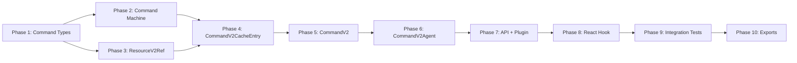

## Overview

Implement CommandV2 for the query-v2 module: state machine, cache entry, agent, link resolution (optimistic updates + invalidation), plugin integration, React hook, and barrel exports. Tests-first approach — every phase writes tests before implementation.

## Phase Map



## Phase Summary

| Phase | Name | Type | Dependencies | Complexity | Est. LOC (src+test) | Files |
|-------|------|------|--------------|------------|----------------------|-------|
| 1 | Command Types | Sequential | None | Low | ~160+30 | 4 new, 1 modify |
| 2 | Command Machine | Parallel w/ P3 | P1 | Medium | ~100+120 | 5 new, 1 modify |
| 3 | ResourceV2Ref | Parallel w/ P2 | P1 | Low | ~35+60 | 1 new, 1 new test |
| 4 | CommandV2CacheEntry | Sequential | P2, P3 | High | ~150+180 | 1 new, 1 new test |
| 5 | CommandV2 | Sequential | P4 | Medium | ~90+80 | 2 new, 1 new test |
| 6 | CommandV2Agent | Sequential | P5 | Medium | ~80+120 | 1 new, 1 new test |
| 7 | API + Plugin | Sequential | P6 | Medium | ~60+80 | 3 modify, 1 new |
| 8 | React Hook | Sequential | P7 | Low | ~25+70 | 1 new, 1 modify |
| 9 | Integration Tests | Sequential | P8 | High | ~0+350 | 3 new tests, 1 modify helper |
| 10 | Exports | Sequential | P9 | Low | ~30+0 | 3 modify |

## Execution Rules
- Phases without dependencies on incomplete phases may be executed in parallel (P2 ‖ P3)
- Sequential phases require verification before proceeding
- Every phase must leave the project in a compilable state (`npm run ts-check` passes)

---

## Phase 1: Command Types

### Goal
Define all CommandV2 type definitions. No implementation — types only. Foundation for all subsequent phases.

### Dependencies
- **Requires**: None
- **Blocks**: P2, P3, P4, P5, P6, P7, P8

### Execution
Sequential (first phase)

### Tasks

#### Task 1.1: Create command machine types
- **File**: `src/query-v2/types/command-machine.types.ts` (Create)
- **Action**: Create
- **Description**: Command state machine type definitions. All state interfaces, status literal type, machine state union, and machine instance union.
  [ref: design-architecture.md#3. Command State Machine]

```ts
import type { TPatchState } from "./machine.types";

export type TCommandMachineStatus = "idle" | "loading" | "success" | "error";

export interface TCommandIdleState {
    readonly status: "idle";
    readonly args: null;
    readonly data: null;
    readonly error: null;
}

export interface TCommandLoadingState<TArgs> {
    readonly status: "loading";
    readonly args: TArgs;
    readonly data: null;
    readonly error: null;
}

export interface TCommandSuccessState<TArgs, TData> {
    readonly status: "success";
    readonly args: TArgs;
    readonly data: TData;
    readonly error: null;
    readonly patchState: TPatchState<TData> | null;
}

export interface TCommandErrorState<TArgs> {
    readonly status: "error";
    readonly args: TArgs;
    readonly data: null;
    readonly error: unknown;
}

export type TCommandMachineState<TArgs = unknown, TData = unknown> =
    | TCommandIdleState
    | TCommandLoadingState<TArgs>
    | TCommandSuccessState<TArgs, TData>
    | TCommandErrorState<TArgs>;

/** Union of command machine class instances (parallel to TMachineInstance for resources) */
export type TCommandMachineInstance<TArgs = unknown, TData = unknown> =
    | import("../core/machines/CommandIdle").CommandIdle<TArgs, TData>
    | import("../core/machines/CommandLoading").CommandLoading<TArgs, TData>
    | import("../core/machines/CommandSuccess").CommandSuccess<TArgs, TData>
    | import("../core/machines/CommandError").CommandError<TArgs, TData>;
```

#### Task 1.2: Create command lifecycle types
- **File**: `src/query-v2/types/command-lifecycle.types.ts` (Create)
- **Action**: Create
- **Description**: Lifecycle hook types for command cache entries.
  [ref: design-architecture.md#5.7 Lifecycle Hook Types]

```ts
export interface ICommandCacheEntryAddedTools<TResult> {
    readonly $cacheDataLoaded: Promise<TResult>;
    readonly $cacheEntryRemoved: Promise<void>;
}

export interface ICommandQueryStartedTools<TArgs, TResult> {
    readonly $queryFulfilled: Promise<{ data: TResult }>;
}

export type TOnCommandCacheEntryAdded<TResult> =
    (tools: ICommandCacheEntryAddedTools<TResult>) => void | Promise<void>;

export type TOnCommandQueryStarted<TArgs, TResult> =
    (args: TArgs, tools: ICommandQueryStartedTools<TArgs, TResult>) => void | Promise<void>;
```

#### Task 1.3: Create command types (options, interfaces, agent state)
- **File**: `src/query-v2/types/command.types.ts` (Create)
- **Action**: Create
- **Description**: Main CommandV2 public types: options, instance interface, agent interface, agent state discriminated union, link options, ResourceV2Ref interface.
  [ref: design-architecture.md#5.1–5.3, 5.8, Amendment 1]

```ts
import type { ComputeFn } from "@/signals/types";
import type { IPatchHandle } from "./machine.types";
import type { IResourceV2 } from "./resource.types";
import type { ArgsOrVoid } from "./shared.types";
import type { TOnCommandCacheEntryAdded, TOnCommandQueryStarted } from "./command-lifecycle.types";

/** Query function for commands — receives args + abort tools */
export type TCommandQueryFn<TArgs, TResult> =
    (args: TArgs, tools: { abortSignal: AbortSignal }) => Promise<TResult>;

/** Link definition — connects a command to a ResourceV2 for post-mutation effects */
export interface ICommandV2LinkOptions<TArgs, TResult, RArgs, RData> {
    resource: IResourceV2<RArgs, RData>;
    forwardArgs: (args: TArgs) => RArgs;
    invalidate?: boolean;
    update?: (tools: { draft: RData; args: TArgs; data: TResult }) => void;
    optimisticUpdate?: (tools: { draft: RData; args: TArgs }) => void;
}

/** Options for createCommandV2 / api.createCommandV2 */
export interface TCommandV2Options<TArgs, TResult> {
    queryFn: TCommandQueryFn<TArgs, TResult>;
    link?: ICommandV2LinkOptions<TArgs, TResult, any, any>[];
    onCacheEntryAdded?: TOnCommandCacheEntryAdded<TResult>;
    onQueryStarted?: TOnCommandQueryStarted<TArgs, TResult>;
    cacheLifetime?: number | false;
    devtools?: unknown;
    devtoolsName?: string;
}

/** CommandV2 instance — returned by createCommandV2 / api.createCommandV2 */
export interface ICommandV2<TArgs, TResult> {
    createAgent(): ICommandV2Agent<TArgs, TResult>;
    resetCache(): void;
}

/** Adapter for linking a command to a specific resource + args */
export interface IResourceV2Ref<RArgs, RData> {
    invalidate(): void;
    patch(patchFn: (draft: RData) => void): IPatchHandle | null;
}

/** CommandV2 agent state — 4-branch discriminated union */
export type TCommandV2AgentState<TArgs, TResult> =
    | {
          readonly status: "idle";
          readonly data: null;
          readonly error: null;
          readonly args: null;
          readonly isLoading: false;
          readonly isSuccess: false;
          readonly isError: false;
      }
    | {
          readonly status: "loading";
          readonly data: TResult | null;
          readonly error: null;
          readonly args: TArgs;
          readonly isLoading: true;
          readonly isSuccess: false;
          readonly isError: false;
      }
    | {
          readonly status: "success";
          readonly data: TResult;
          readonly error: null;
          readonly args: TArgs;
          readonly isLoading: false;
          readonly isSuccess: true;
          readonly isError: false;
      }
    | {
          readonly status: "error";
          readonly data: null;
          readonly error: unknown;
          readonly args: TArgs;
          readonly isLoading: false;
          readonly isSuccess: false;
          readonly isError: true;
      };

/** CommandV2 agent instance — per-component mutation observer */
export interface ICommandV2Agent<TArgs, TResult> {
    readonly state$: ComputeFn<TCommandV2AgentState<TArgs, TResult>>;
    trigger(...args: ArgsOrVoid<TArgs>): Promise<TResult>;
    reset(): void;
}
```

#### Task 1.4: Update types barrel
- **File**: `src/query-v2/types/index.ts` (Modify)
- **Action**: Modify — append 3 new re-exports
- **Description**: Add barrel exports for the 3 new type files.

```ts
// Append to existing index.ts:
export * from "./command-machine.types";
export * from "./command-lifecycle.types";
export * from "./command.types";
```

### Verification
- [ ] `npm run ts-check` passes
- [ ] All 3 new type files compile without errors
- [ ] Types barrel re-exports all new symbols
- [ ] No circular dependencies introduced

---

## Phase 2: Command Machine

### Goal
Implement the 4 immutable command machine state classes (`CommandIdle`, `CommandLoading`, `CommandSuccess`, `CommandError`) and the `CommandMachine` static factory. Tests first.

### Dependencies
- **Requires**: Phase 1 (types)
- **Blocks**: Phase 4 (CacheEntry)

### Execution
Parallel with Phase 3

### Tasks

#### Task 2.1: Create test file for command machine
- **File**: `src/query-v2/__tests__/command-machine.test.ts` (Create)
- **Action**: Create
- **Description**: Tests T01–T08 from QA strategy. Write all tests before implementing machine classes.
  [ref: design-qa-strategy.md#Unit: CommandMachine States]

**Test cases:**
- `T01`: `CommandMachine.idle()` returns CommandIdle with `{ status: "idle", args: null, data: null, error: null }`
- `T02`: `CommandIdle.start({ id: 1 })` → CommandLoading `{ status: "loading", args: { id: 1 } }`
- `T03`: `CommandLoading.successHappened({ ok: true })` → CommandSuccess `{ status: "success", data: { ok: true }, patchState: null }`
- `T04`: `CommandLoading.errorHappened(new Error("fail"))` → CommandError `{ status: "error", error: Error("fail") }`
- `T05`: `CommandSuccess.start({ id: 2 })` → CommandLoading `{ status: "loading", args: { id: 2 }, data: null }`
- `T06`: `CommandError.start({ id: 3 })` → CommandLoading `{ status: "loading", error: null }`
- `T07`: CommandSuccess carries patchState from Patcher — `createPatch(draft => ...)` yields `patchState !== null`
- `T08`: Invalid transitions — CommandIdle has no `successHappened`, CommandError has no `successHappened` (verify method absence)

#### Task 2.2: Implement CommandIdle
- **File**: `src/query-v2/core/machines/CommandIdle.ts` (Create)
- **Action**: Create
- **Description**: Immutable idle state. Single transition: `start(args) → CommandLoading`.
  [ref: design-architecture.md#3. Command State Machine]

```ts
export class CommandIdle<TArgs, TData> {
    readonly status = "idle" as const;
    readonly args = null;
    readonly data = null;
    readonly error = null;

    get state(): TCommandIdleState { /* return frozen state */ }
    start(args: TArgs): CommandLoading<TArgs, TData> { /* return new CommandLoading */ }
}
```

~15 LOC

#### Task 2.3: Implement CommandLoading
- **File**: `src/query-v2/core/machines/CommandLoading.ts` (Create)
- **Action**: Create
- **Description**: Immutable loading state. Transitions: `successHappened(data)`, `errorHappened(error)`.
  [ref: design-architecture.md#3. Command State Machine]

```ts
export class CommandLoading<TArgs, TData> {
    readonly status = "loading" as const;
    readonly args: TArgs;
    readonly data = null;
    readonly error = null;

    constructor(args: TArgs);
    get state(): TCommandLoadingState<TArgs> { /* ... */ }
    successHappened(data: TData): CommandSuccess<TArgs, TData> { /* ... */ }
    errorHappened(error: unknown): CommandError<TArgs, TData> { /* ... */ }
}
```

~20 LOC

#### Task 2.4: Implement CommandSuccess
- **File**: `src/query-v2/core/machines/CommandSuccess.ts` (Create)
- **Action**: Create
- **Description**: Immutable success state. Carries `data` + `patchState`. Transition: `start(args) → CommandLoading`.
  Uses `Patcher` for `createPatch` / `finishPatch` integration.
  [ref: design-architecture.md#3. Command State Machine, Patcher Integration]

```ts
export class CommandSuccess<TArgs, TData> {
    readonly status = "success" as const;
    readonly args: TArgs;
    readonly data: TData;
    readonly error = null;
    readonly patchState: TPatchState<TData> | null;

    constructor(args: TArgs, data: TData, patchState: TPatchState<TData> | null);
    get state(): TCommandSuccessState<TArgs, TData> { /* ... */ }
    start(args: TArgs): CommandLoading<TArgs, TData> { /* ... */ }
}
```

~35 LOC

#### Task 2.5: Implement CommandError
- **File**: `src/query-v2/core/machines/CommandError.ts` (Create)
- **Action**: Create
- **Description**: Immutable error state. Transition: `start(args) → CommandLoading`.
  [ref: design-architecture.md#3. Command State Machine]

```ts
export class CommandError<TArgs, TData> {
    readonly status = "error" as const;
    readonly args: TArgs;
    readonly data = null;
    readonly error: unknown;

    constructor(args: TArgs, error: unknown);
    get state(): TCommandErrorState<TArgs> { /* ... */ }
    start(args: TArgs): CommandLoading<TArgs, TData> { /* ... */ }
}
```

~15 LOC

#### Task 2.6: Implement CommandMachine static factory
- **File**: `src/query-v2/core/machines/CommandMachine.ts` (Create)
- **Action**: Create
- **Description**: Static factory class with single method `idle<TArgs, TData>() → CommandIdle`.
  [ref: design-architecture.md#§2 CommandMachine component]

```ts
export class CommandMachine {
    static idle<TArgs, TData>(): CommandIdle<TArgs, TData> {
        return new CommandIdle<TArgs, TData>();
    }
}
```

~10 LOC

#### Task 2.7: Update machines barrel
- **File**: `src/query-v2/core/machines/index.ts` (Modify)
- **Action**: Modify — add command machine exports
- **Description**: Export `CommandMachine`, `CommandIdle`, `CommandLoading`, `CommandSuccess` (as `CommandMachineSuccess` to avoid naming clash with `MachineSuccess`), `CommandError` (as `CommandMachineError`).

Note: Naming collision with existing `MachineSuccess`/`MachineError`. Export command variants with `Command` prefix to disambiguate if needed. Alternatively, keep original names since they're in separate files — consumers import explicitly. Decision: keep class names as `CommandSuccess`/`CommandError` (different namespace from `MachineSuccess`/`MachineError`). Barrel exports them as-is.

```ts
// Append to existing machines/index.ts:
export { CommandMachine } from "./CommandMachine";
export { CommandIdle } from "./CommandIdle";
export { CommandLoading } from "./CommandLoading";
export { CommandSuccess as CommandMachineSuccess } from "./CommandSuccess";
export { CommandError as CommandMachineError } from "./CommandError";
```

### Verification
- [ ] `npm run ts-check` passes
- [ ] All T01–T08 tests pass (`npx vitest run src/query-v2/__tests__/command-machine.test.ts`)
- [ ] Every transition returns new immutable instance (no mutation)
- [ ] Invalid transitions don't exist as methods on the class

---

## Phase 3: ResourceV2Ref

### Goal
Implement the thin `ResourceV2Ref` adapter that wraps `IResourceV2 + args` for link resolution. Tests first.

### Dependencies
- **Requires**: Phase 1 (types)
- **Blocks**: Phase 4 (CacheEntry)

### Execution
Parallel with Phase 2

### Tasks

#### Task 3.1: Create test file for ResourceV2Ref
- **File**: `src/query-v2/__tests__/resource-v2-ref.test.ts` (Create)
- **Action**: Create
- **Description**: Tests T50–T53 from QA strategy. Mock `IResourceV2` + `IResourceV2CacheEntry`.
  [ref: design-qa-strategy.md#Unit: ResourceV2Ref]

**Test cases:**
- `T50`: `invalidate()` delegates to `resource.invalidate(forwardedArgs)`
- `T51`: `patch(fn)` gets entry via `resource.getEntry(args)`, calls `entry.createPatch(fn)`, returns `IPatchHandle`
- `T52`: `patch()` returns `null` when `resource.getEntry(args)` returns `null` (no entry)
- `T53`: `patch()` returns `null` when entry exists but `entry.createPatch()` returns `null` (entry not in success/refreshing)

#### Task 3.2: Implement ResourceV2Ref
- **File**: `src/query-v2/core/command/ResourceV2Ref.ts` (Create)
- **Action**: Create
- **Description**: ~30 LOC adapter. Resolves entry lazily via `resource.getEntry(args)`.
  [ref: design-architecture.md#5.8 ResourceV2Ref, Amendment 2]

```ts
import type { IPatchHandle } from "@/query-v2/types";
import type { IResourceV2 } from "@/query-v2/types";

export class ResourceV2Ref<RArgs, RData> {
    private _resource: IResourceV2<RArgs, RData>;
    private _args: RArgs;

    constructor(resource: IResourceV2<RArgs, RData>, args: RArgs);

    /** Invalidate the linked resource for these args */
    invalidate(): void;

    /** Create patch on the linked resource entry. Returns null if no entry or no data. */
    patch(patchFn: (draft: RData) => void): IPatchHandle | null;
}
```

- `invalidate()` → `this._resource.invalidate(this._args)` (resource-level invalidate, not entry-level)
- `patch(fn)` → `entry = this._resource.getEntry(this._args)` → if null, return null → `entry.createPatch(fn)`
- No `commitPatch`/`abortPatch` on ResourceV2Ref — the `IPatchHandle` returned by `patch()` already has `commit()`/`abort()` methods.

### Verification
- [ ] `npm run ts-check` passes
- [ ] T50–T53 pass (`npx vitest run src/query-v2/__tests__/resource-v2-ref.test.ts`)
- [ ] `patch()` returns `null` gracefully when no entry exists (Amendment 2)

---

## Phase 4: CommandV2CacheEntry

### Goal
Implement `CommandV2CacheEntry` — extends `CacheEntry<TCommandMachineInstance>`. Owns `AbortController`, runs `queryFn`, resolves links, fires lifecycle hooks. Tests first.

### Dependencies
- **Requires**: Phase 2 (CommandMachine classes), Phase 3 (ResourceV2Ref)
- **Blocks**: Phase 5 (CommandV2)

### Execution
Sequential

### Tasks

#### Task 4.1: Create test file for CommandV2CacheEntry
- **File**: `src/query-v2/__tests__/command-v2-cache-entry.test.ts` (Create)
- **Action**: Create
- **Description**: Tests T30–T40 from QA strategy. Use `createControllableQueryFn` from existing helpers.
  [ref: design-qa-strategy.md#Unit: CommandV2CacheEntry]

**Test cases:**
- `T30`: Extends CacheEntry — `peek().status === "idle"` initially
- `T31`: `initiate(args)` calls queryFn with `(args, { abortSignal })`
- `T32`: On queryFn resolve → `peek().status === "success"`, `peek().data === result`
- `T33`: On queryFn reject → `peek().status === "error"`, `peek().error` set
- `T34`: Re-initiate aborts previous AbortController, first signal `.aborted === true`
- `T35`: `onQueryStarted` callback fires, `$queryFulfilled` resolves on success
- `T36`: `onCacheEntryAdded` callback fires, `$cacheDataLoaded` resolves on first success
- `T37`: queryFn sync throw → `peek().status === "error"` (not stuck in loading)
- `T38`: Link resolution: `invalidate: true` → `ResourceV2Ref.invalidate()` called on success
- `T39`: Link resolution: `optimisticUpdate` → patch applied before queryFn, committed on success, aborted on error
- `T40`: State transitions + link updates wrapped in `Batcher.run()` — single batch

#### Task 4.2: Implement CommandV2CacheEntry
- **File**: `src/query-v2/core/command/CommandV2CacheEntry.ts` (Create)
- **Action**: Create
- **Description**: Core cache entry for commands. Extends `CacheEntry`. Manages execution lifecycle.
  [ref: design-architecture.md#4. Data Flow, §2 Component Responsibilities, Amendments 3, 5, 8]

```ts
import { CacheEntry } from "../CacheEntry";
import type { TCommandMachineInstance, TCommandV2Options, ICommandV2LinkOptions } from "@/query-v2/types";
import { CommandMachine } from "../machines/CommandMachine";
import { ResourceV2Ref } from "./ResourceV2Ref";

interface ICommandV2CacheEntryOptions<TArgs, TResult> {
    queryFn: TCommandV2Options<TArgs, TResult>["queryFn"];
    link?: ICommandV2LinkOptions<TArgs, TResult, any, any>[];
    onCacheEntryAdded?: TCommandV2Options<TArgs, TResult>["onCacheEntryAdded"];
    onQueryStarted?: TCommandV2Options<TArgs, TResult>["onQueryStarted"];
    cacheLifetime?: number | false;
}

export class CommandV2CacheEntry<TArgs, TResult> extends CacheEntry<TCommandMachineInstance<TArgs, TResult>> {
    private _queryFn: TCommandQueryFn<TArgs, TResult>;
    private _link: ICommandV2LinkOptions<TArgs, TResult, any, any>[];
    private _abortController: AbortController | null;
    private _onCacheEntryAdded: TOnCommandCacheEntryAdded<TResult> | undefined;
    private _onQueryStarted: TOnCommandQueryStarted<TArgs, TResult> | undefined;
    private _entryDataLoaded: PromiseResolver<TResult> | null;
    private _entryRemoved: PromiseResolver<void> | null;
    private _queryFulfilled: PromiseResolver<{ data: TResult }> | null;

    constructor(options: ICommandV2CacheEntryOptions<TArgs, TResult>);

    /** Execute command with given args. Returns promise of result. */
    initiate(args: TArgs): Promise<TResult>;

    /** Reset to idle, abort in-flight */
    resetToIdle(): void;

    /** Override CacheEntry.complete() for cleanup */
    override complete(): void;
}
```

Key implementation details:
- Constructor: `super(CommandMachine.idle())`, stores options, fires `onCacheEntryAdded`
- `initiate(args)`:
  1. Abort previous `_abortController`
  2. Reject previous `trigger()` promise with `AbortError` (Amendment 5)
  3. Create new `AbortController`
  4. Transition machine: current → `start(args)` → `CommandLoading`
  5. Apply optimistic updates on linked resources via `ResourceV2Ref.patch()`
  6. Fire `onQueryStarted`, create `_queryFulfilled` resolver
  7. Call `queryFn(args, { abortSignal })`
  8. On success: guard stale settlement (Amendment 8), transition → `CommandSuccess`, commit optimistic patches, apply `update` patches, fire invalidations, resolve `$queryFulfilled`
  9. On error: guard stale settlement, transition → `CommandError`, abort optimistic patches, reject `$queryFulfilled`
  10. Wrap settlement in `Batcher.run()` for batched signal updates
- `resetToIdle()`: abort controller, set `CommandMachine.idle()`, no lifecycle hooks (Amendment 4)
- `complete()`: abort controller, resolve `$cacheEntryRemoved`, reject pending resolvers, call `super.complete()`

~150 LOC

### Verification
- [ ] `npm run ts-check` passes
- [ ] All T30–T40 tests pass (`npx vitest run src/query-v2/__tests__/command-v2-cache-entry.test.ts`)
- [ ] Stale settlement after abort is silently ignored (Amendment 8)
- [ ] Sync-throwing queryFn transitions to error correctly (T37)
- [ ] Optimistic patches aborted on error, committed on success

---

## Phase 5: CommandV2

### Goal
Implement `CommandV2` class — owns `Map<symbol, CommandV2CacheEntry>`, creates agents, handles `resetAll()` subscription. Tests first.

### Dependencies
- **Requires**: Phase 4 (CacheEntry)
- **Blocks**: Phase 6 (Agent)

### Execution
Sequential

### Tasks

#### Task 5.1: Create test file for CommandV2
- **File**: `src/query-v2/__tests__/command-v2.test.ts` (Create)
- **Action**: Create
- **Description**: Tests T10–T13 from QA strategy.
  [ref: design-qa-strategy.md#Unit: CommandV2]

**Test cases:**
- `T10`: `createAgent()` returns object with `state$`, `trigger`, `reset`
- `T11`: Multiple `createAgent()` calls return agents with unique symbol keys
- `T12`: Subscribes to `ResetAllQueriesSignal` — firing reset clears all cache entries
- `T13`: Stores link definitions from options — accessible during entry execution

#### Task 5.2: Implement CommandV2
- **File**: `src/query-v2/core/command/CommandV2.ts` (Create)
- **Action**: Create
- **Description**: Command class managing agents and cache entries.
  [ref: design-architecture.md#§2 Component Responsibilities, ADR-4]

```ts
import type { TCommandV2Options, ICommandV2, ICommandV2Agent } from "@/query-v2/types";
import { CommandV2Agent } from "./CommandV2Agent";
import { CommandV2CacheEntry } from "./CommandV2CacheEntry";

export class CommandV2<TArgs, TResult> implements ICommandV2<TArgs, TResult> {
    private _options: TCommandV2Options<TArgs, TResult>;
    private _entries: Map<symbol, CommandV2CacheEntry<TArgs, TResult>>;
    private _resetSubscription: (() => void) | null;

    constructor(options: TCommandV2Options<TArgs, TResult>);

    /** Create a per-component agent */
    createAgent(): ICommandV2Agent<TArgs, TResult>;

    /** Clear all cache entries (called by resetAll) */
    resetCache(): void;

    /** Internal: get or create cache entry for an agent key */
    _getOrCreateEntry(key: symbol): CommandV2CacheEntry<TArgs, TResult>;
}
```

Key implementation details:
- Constructor: store options, create `Map`, subscribe to `ResetAllQueriesSignal`
- `createAgent()`: create unique `Symbol()`, return `new CommandV2Agent(this, key)`
- `resetCache()`: iterate entries, call `entry.complete()`, clear map
- `_getOrCreateEntry(key)`: if exists return it, else create `new CommandV2CacheEntry(options)` and store

~90 LOC

#### Task 5.3: Create command core barrel
- **File**: `src/query-v2/core/command/index.ts` (Create)
- **Action**: Create
- **Description**: Barrel export for command core module.

```ts
export { CommandV2 } from "./CommandV2";
export { CommandV2Agent } from "./CommandV2Agent";
export { CommandV2CacheEntry } from "./CommandV2CacheEntry";
export { ResourceV2Ref } from "./ResourceV2Ref";
```

### Verification
- [ ] `npm run ts-check` passes
- [ ] T10–T13 pass (`npx vitest run src/query-v2/__tests__/command-v2.test.ts`)
- [ ] `resetCache()` completes all entries and clears the map

---

## Phase 6: CommandV2Agent

### Goal
Implement `CommandV2Agent` — per-component mutation observer. Exposes `state$` (computed signal), `trigger()`, `reset()`. Tests first.

### Dependencies
- **Requires**: Phase 5 (CommandV2)
- **Blocks**: Phase 7 (API + Plugin)

### Execution
Sequential

### Tasks

#### Task 6.1: Create test file for CommandV2Agent
- **File**: `src/query-v2/__tests__/command-v2-agent.test.ts` (Create)
- **Action**: Create
- **Description**: Tests T20–T26 from QA strategy.
  [ref: design-qa-strategy.md#Unit: CommandV2Agent]

**Test cases:**
- `T20`: Initial `state$()` is idle `{ status: "idle", isLoading: false, isSuccess: false, isError: false }`
- `T21`: `trigger({ id: 1 })` transitions to loading — `state$().status === "loading"`
- `T22`: `trigger()` returns promise that resolves with data on success
- `T23`: `trigger()` returns promise that rejects on error
- `T24`: After success, `reset()` returns to idle — `state$().status === "idle"`
- `T25`: Re-trigger while loading aborts previous — first AbortSignal aborted, only second result committed, first promise rejects with AbortError
- `T26`: `state$` exposes flat computed fields — after success: `{ isLoading: false, isSuccess: true, isError: false, data: result }`

#### Task 6.2: Implement CommandV2Agent
- **File**: `src/query-v2/core/command/CommandV2Agent.ts` (Create)
- **Action**: Create
- **Description**: Agent implementation. Delegates to CommandV2 for entry management.
  [ref: design-architecture.md#§2 Component Responsibilities, §5.3, Amendments 4, 5]

```ts
import { Signal } from "@/signals";
import type { ComputeFn } from "@/signals/types";
import type { ICommandV2Agent, TCommandV2AgentState, ArgsOrVoid } from "@/query-v2/types";
import type { CommandV2 } from "./CommandV2";
import type { CommandV2CacheEntry } from "./CommandV2CacheEntry";

export class CommandV2Agent<TArgs, TResult> implements ICommandV2Agent<TArgs, TResult> {
    private _command: CommandV2<TArgs, TResult>;
    private _key: symbol;
    private _entry: CommandV2CacheEntry<TArgs, TResult> | null;

    readonly state$: ComputeFn<TCommandV2AgentState<TArgs, TResult>>;

    constructor(command: CommandV2<TArgs, TResult>, key: symbol);

    /** Trigger the command. Returns promise resolving/rejecting on settlement. */
    trigger(...args: ArgsOrVoid<TArgs>): Promise<TResult>;

    /** Reset agent to idle, abort in-flight */
    reset(): void;
}
```

Key implementation details:
- Constructor: store command + key, `state$ = Signal.compute(() => flattenMachineState(entry?.state$() ?? idle))`
- `trigger(args)`: `entry = command._getOrCreateEntry(key)` → `entry.initiate(args)`
- `reset()`: if entry exists, `entry.resetToIdle()` (Amendment 4)
- `state$` compute flattens `TCommandMachineInstance` → `TCommandV2AgentState` with boolean flags

~80 LOC

### Verification
- [ ] `npm run ts-check` passes
- [ ] T20–T26 pass (`npx vitest run src/query-v2/__tests__/command-v2-agent.test.ts`)
- [ ] `state$` correctly narrows as 4-branch discriminated union
- [ ] `reset()` aborts in-flight and transitions to idle (Amendment 4)
- [ ] Superseded trigger promise rejects with AbortError (Amendment 5)

---

## Phase 7: API + Plugin Integration

### Goal
Add `api.createCommandV2()` to `createApi`, extend `IPlugin` with `augmentCommand?`, update `ReactHooksPlugin`, create standalone `_createCommandV2` factory.

### Dependencies
- **Requires**: Phase 6 (CommandV2Agent)
- **Blocks**: Phase 8 (React Hook)

### Execution
Sequential

### Tasks

#### Task 7.1: Extend plugin types
- **File**: `src/query-v2/types/plugin.types.ts` (Modify)
- **Action**: Modify
- **Description**: Add `augmentCommand?` to `IPlugin`. Add `PluginCommandContributions`, `IReactHooksPluginCommandContributions`, `PluginCommandAugmentations`.
  [ref: design-architecture.md#5.5 Plugin Augmentation Types]

Add to `IPlugin`:
```ts
augmentCommand?<TArgs, TResult>(
    command: ICommandV2<TArgs, TResult>,
    options: TCommandV2Options<TArgs, TResult>,
): Record<string, unknown>;
```

Add new types:
```ts
export interface IReactHooksPluginCommandContributions<TArgs, TResult> {
    useCommandV2Agent(): [
        trigger: (...args: ArgsOrVoid<TArgs>) => Promise<TResult>,
        state: TCommandV2AgentState<TArgs, TResult>,
    ];
}

export type PluginCommandContributions<TPlugin, TArgs, TResult> =
    TPlugin extends { name: "ReactHooksPlugin" }
        ? IReactHooksPluginCommandContributions<TArgs, TResult>
        : Record<string, never>;

export type PluginCommandAugmentations<TPlugins extends readonly IPlugin[], TArgs, TResult> =
    Prettify<UnionToIntersection<PluginCommandContributions<TPlugins[number], TArgs, TResult>>>;
```

#### Task 7.2: Extend API types
- **File**: `src/query-v2/types/api.types.ts` (Modify)
- **Action**: Modify
- **Description**: Add `createCommandV2` method to `IApi`.
  [ref: design-architecture.md#5.6 API Extension]

```ts
// Add to IApi interface:
createCommandV2<TArgs = void, TResult = unknown>(
    options: TCommandV2Options<TArgs, TResult>,
): ICommandV2<TArgs, TResult> & PluginCommandAugmentations<TPlugins, TArgs, TResult>;
```

#### Task 7.3: Create standalone factory
- **File**: `src/query-v2/api/_createCommandV2.ts` (Create)
- **Action**: Create
- **Description**: Standalone factory: `_createCommandV2(options) → new CommandV2(options)`.
  [ref: design-architecture.md#ADR-6]

```ts
import type { TCommandV2Options, ICommandV2 } from "@/query-v2/types";
import { CommandV2 } from "../core/command";

export function _createCommandV2<TArgs = void, TResult = unknown>(
    options: TCommandV2Options<TArgs, TResult>,
): ICommandV2<TArgs, TResult> {
    return new CommandV2(options);
}
```

~8 LOC

#### Task 7.4: Modify createApi — add createCommandV2
- **File**: `src/query-v2/api/createApi.ts` (Modify)
- **Action**: Modify
- **Description**: Add `apiCreateCommandV2` function inside `createApi`. Register commands for `resetAll()`. Add to returned API object.
  [ref: design-architecture.md#§2 createApi component, ADR-6]

Changes:
1. Add `_commands = new Set<CommandV2<any, any>>()` alongside `_resources`
2. Add `apiCreateCommandV2<TArgs, TResult>(options)` function:
   - Merge API-level `cacheLifetime` default (use `0` for commands, per Amendment 7)
   - `new CommandV2(mergedOptions)`
   - Register in `_commands` set
   - Run plugin augmentation loop (call `plugin.augmentCommand` if defined)
   - Return augmented command
3. Update `resetAll()` to also iterate `_commands` and call `command.resetCache()`
4. Add `createCommandV2: apiCreateCommandV2` to returned object

#### Task 7.5: Test API + Plugin integration (unit-level)
- **File**: `src/query-v2/__tests__/command-api.test.ts` (Create)
- **Action**: Create
- **Description**: Unit tests for standalone factory and createApi integration. Verifies command registration and plugin augmentation.

**Test cases:**
- `_createCommandV2(options)` returns ICommandV2 with `createAgent`
- `api.createCommandV2(options)` returns augmented command
- `resetAll()` calls resetCache() on registered commands
- Plugin `augmentCommand?` is called if defined

### Verification
- [ ] `npm run ts-check` passes
- [ ] `IPlugin` type is backward-compatible (augmentCommand is optional)
- [ ] `IApi.createCommandV2` return type includes plugin augmentations
- [ ] API unit tests pass
- [ ] Existing resource tests still pass (`npx vitest run src/query-v2/`)

---

## Phase 8: React Hook

### Goal
Implement `useCommandV2Agent` hook. Update `ReactHooksPlugin` to contribute it via `augmentCommand`.

### Dependencies
- **Requires**: Phase 7 (API + Plugin)
- **Blocks**: Phase 9 (Integration Tests)

### Execution
Sequential

### Tasks

#### Task 8.1: Implement useCommandV2Agent
- **File**: `src/query-v2/react/useCommandV2Agent.ts` (Create)
- **Action**: Create
- **Description**: React hook wrapping `command.createAgent()`. Returns `[trigger, state]` tuple. Uses `useConstant` + `useSignal` pattern.
  [ref: design-architecture.md#5.4 React Hook, Amendment 6]

```ts
import React from "react";
import { useConstant } from "@/common/react";
import { useSignal } from "@/signals";
import type { ICommandV2, TCommandV2AgentState, ArgsOrVoid } from "@/query-v2/types";

export function useCommandV2Agent<TArgs, TResult>(
    command: ICommandV2<TArgs, TResult>,
): [
    trigger: (...args: ArgsOrVoid<TArgs>) => Promise<TResult>,
    state: TCommandV2AgentState<TArgs, TResult>,
] {
    const agent = useConstant(() => command.createAgent());
    const state = useSignal(agent.state$);
    const trigger = React.useCallback(
        (...args: ArgsOrVoid<TArgs>) => agent.trigger(...args),
        [agent],
    );
    return [trigger, state];
}
```

~25 LOC. No abort on unmount (Amendment 6).

#### Task 8.2: Update ReactHooksPlugin
- **File**: `src/query-v2/plugins/ReactHooksPlugin.ts` (Modify)
- **Action**: Modify
- **Description**: Add `augmentCommand` method returning `{ useCommandV2Agent }`.
  [ref: design-architecture.md#ADR-5, §5.5]

```ts
// Add to ReactHooksPlugin class:
augmentCommand<TArgs, TResult>(
    command: ICommandV2<TArgs, TResult>,
    _options: TCommandV2Options<TArgs, TResult>,
): Record<string, unknown> {
    return {
        useCommandV2Agent() {
            return useCommandV2Agent(command);
        },
    };
}
```

#### Task 8.3: Update react barrel
- **File**: `src/query-v2/react/index.ts` (Modify — if exists, check)
- **Action**: Modify
- **Description**: Export `useCommandV2Agent` from react barrel.

### Verification
- [ ] `npm run ts-check` passes
- [ ] `useCommandV2Agent` returns stable trigger reference
- [ ] `ReactHooksPlugin.augmentCommand` returns hook closure
- [ ] Existing `useResourceV2Agent` hook tests still pass

---

## Phase 9: Integration Tests

### Goal
Full end-to-end tests: command→resource flows, optimistic updates, plugin augmentation, React hook rendering. Uses existing `createControllableQueryFn` + new helpers.

### Dependencies
- **Requires**: Phase 8 (React Hook)
- **Blocks**: Phase 10 (Exports)

### Execution
Sequential

### Tasks

#### Task 9.1: Add test helpers
- **File**: `src/query-v2/__tests__/helpers/index.ts` (Modify)
- **Action**: Modify
- **Description**: Add `createTestCommand` and `createMockResourceV2` helpers.
  [ref: design-qa-strategy.md#Test Utilities Needed]

```ts
// createTestCommand<TArgs, TResult>(overrides?) → { command, queryFn, controllable }
// createMockResourceV2<TArgs, TData>(initialData, queryFn?) → { resource, queryFn, controllable }
```

#### Task 9.2: Command + Resource invalidation integration tests
- **File**: `src/query-v2/__tests__/integration/command-invalidation.test.ts` (Create)
- **Action**: Create
- **Description**: Tests INT-C01 through INT-C07.
  [ref: design-qa-strategy.md#Integration: Command + Resource Invalidation]

**Test cases:**
- `INT-C01`: Command success invalidates linked resource → resource re-fetches
- `INT-C02`: Command success applies `update` patch to resource → data updated without refetch
- `INT-C03`: Optimistic update applied before queryFn, committed on success
- `INT-C04`: Optimistic update rolled back on error → resource data reverts
- `INT-C05`: Multiple links processed in definition order
- `INT-C06`: `update` + `invalidate` on same link — patch applied then invalidation fires
- `INT-C07`: Consistency violation on abort → resource auto-invalidates

#### Task 9.3: Plugin augmentation integration tests
- **File**: `src/query-v2/__tests__/integration/command-plugin.test.ts` (Create)
- **Action**: Create
- **Description**: Tests INT-C10 through INT-C12.
  [ref: design-qa-strategy.md#Integration: Plugin Augmentation]

**Test cases:**
- `INT-C10`: `api.createCommandV2()` with ReactHooksPlugin → `.useCommandV2Agent` exists
- `INT-C11`: `augmentCommand` called with command + options
- `INT-C12`: `resetAll()` clears all command caches → agents back to idle

#### Task 9.4: React hook integration tests
- **File**: `src/query-v2/__tests__/integration/command-react-hook.test.ts` (Create)
- **Action**: Create
- **Description**: Tests RH01 through RH06 using `@testing-library/react`.
  [ref: design-qa-strategy.md#React Hook: useCommandV2Agent]

**Test cases:**
- `RH01`: Returns `[trigger, state]` tuple — trigger is function, `state.status === "idle"`
- `RH02`: `trigger()` → loading → success render cycle
- `RH03`: `trigger()` → loading → error render cycle
- `RH04`: Stable trigger reference across re-renders
- `RH05`: Multiple triggers — only latest result committed
- `RH06`: Unmount while loading — no console errors

### Verification
- [ ] `npm run ts-check` passes
- [ ] All INT-C01–INT-C12 pass
- [ ] All RH01–RH06 pass
- [ ] Full test suite passes: `npx vitest run src/query-v2/`
- [ ] No regressions in existing resource tests

---

## Phase 10: Exports

### Goal
Update all barrel exports: `src/query-v2/index.ts`, `src/query-v2/core/index.ts`. Make all public types and factories available to consumers.

### Dependencies
- **Requires**: Phase 9 (Integration Tests pass)
- **Blocks**: None

### Execution
Sequential (final phase)

### Tasks

#### Task 10.1: Update core barrel
- **File**: `src/query-v2/core/index.ts` (Modify)
- **Action**: Modify
- **Description**: Add command core exports.

```ts
// Append:
export { CommandV2, CommandV2Agent, CommandV2CacheEntry, ResourceV2Ref } from "./command";
```

#### Task 10.2: Update api barrel
- **File**: `src/query-v2/api/index.ts` (Modify)
- **Action**: Modify
- **Description**: Export standalone command factory.

```ts
// Append:
export { _createCommandV2 } from "./_createCommandV2";
```

#### Task 10.3: Update main barrel
- **File**: `src/query-v2/index.ts` (Modify)
- **Action**: Modify
- **Description**: Export all new public types and factories.

Add to type exports:
```ts
// command-machine.types
TCommandMachineStatus,
TCommandIdleState,
TCommandLoadingState,
TCommandSuccessState,
TCommandErrorState,
TCommandMachineState,
TCommandMachineInstance,
// command-lifecycle.types
ICommandCacheEntryAddedTools,
ICommandQueryStartedTools,
TOnCommandCacheEntryAdded,
TOnCommandQueryStarted,
// command.types
TCommandQueryFn,
ICommandV2LinkOptions,
TCommandV2Options,
ICommandV2,
IResourceV2Ref,
TCommandV2AgentState,
ICommandV2Agent,
// plugin.types (new additions)
IReactHooksPluginCommandContributions,
PluginCommandContributions,
PluginCommandAugmentations,
```

Add value exports:
```ts
// Command machine classes
export {
    CommandMachine,
    CommandIdle,
    CommandLoading,
    CommandMachineSuccess,
    CommandMachineError,
} from "./core/machines";

// Command API
export { _createCommandV2 } from "./api";

// Command React hook
export { useCommandV2Agent } from "./react";
```

### Verification
- [ ] `npm run ts-check` passes
- [ ] All exports resolve: `import { CommandMachine, _createCommandV2, useCommandV2Agent } from "@/query-v2"`
- [ ] Full test suite green: `npx vitest run`
- [ ] No circular dependency warnings

---

## Next Steps

Proceeds to implementation after human review.
