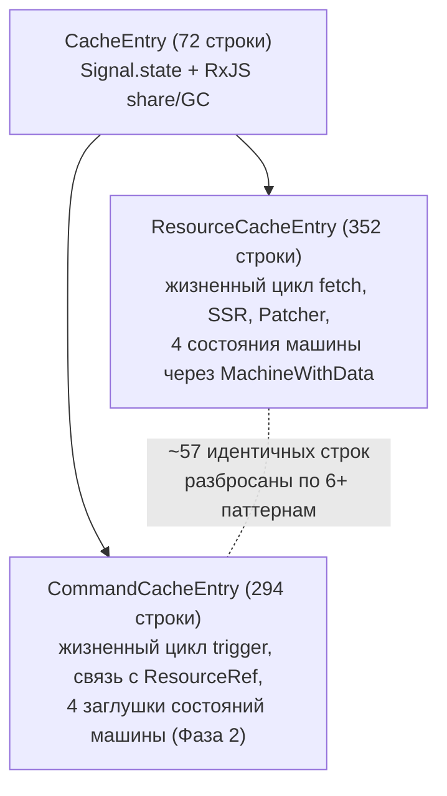

# Резюме для руководства

## Постановка проблемы

`ResourceCacheEntry` (352 строки) и `CommandCacheEntry` (294 строки) оба наследуют `CacheEntry` (72 строки) и реализуют параллельные механики жизненного цикла: управление прерыванием (abort management), хуки на основе `PromiseResolver` (`onCacheEntryAdded`, `onQueryStarted`) и очистку в `complete()`. Это создаёт **57 строк буквально идентичного кода**, разбросанных по 6+ паттернам, причём наибольший непрерывный блок составляет всего 13 строк.

## Ключевые выводы

**Дублирование меньше и более фрагментировано, чем предполагалось изначально.** Ранние анализы указывали на ~78 общих строк; построчная верификация снизила эту цифру до **57 буквально идентичных + 6 структурно схожих** строк. Дублирование распределено небольшими блоками по 4–5 строк с резолверами (паттерны `if/reject/null`), перемежающимися с доменно-специфичным кодом, — а не единый извлекаемый участок.

**Машины состояний команд намеренно проще.** Все четыре класса машин Command содержат комментарии «Phase 2 stub», но функционально полны для семантики одноразовых мутаций (one-shot mutation). Им не нужны наследование от `MachineWithData`, состояние обновления (refreshing state), SSR-гидратация и интеграция с `Patcher` — эти возможности семантически нерелевантны для команд (Commands). Третий тип сущности нигде не упоминается в исходном коде, документации или журнале изменений.

**Консенсус OSS: запросы и мутации должны оставаться раздельными.** TanStack Query, Apollo, SWR и urql — все поддерживают независимые жизненные циклы для запросов (queries) и мутаций (mutations). Ни одна библиотека не разделяет машины состояний между ними. Единственное исключение — **RTK Query** — разделяет ~90% своей среды выполнения через единый payload creator `executeEndpoint` и общие колбэки `onQueryStarted`/`onCacheEntryAdded`. RTK Query является наиболее архитектурно релевантным сравнением, поскольку API жизненного цикла rx-toolkit был смоделирован по его образцу.

## Оценённые подходы

Четыре стратегии извлечения были проанализированы на основе скорректированного базового уровня дублирования:

| Подход | Механизм | Реальная экономия | Риск |
|--------|----------|-------------------|------|
| A. Обогатить `CacheEntry` | Перенести abort + резолверы в существующий базовый класс | ~38 строк | Нарушение SRP (принципа единственной ответственности) — универсальный реактивный контейнер получает концепции, специфичные для fetch |
| B. Промежуточный класс `FetchableCacheEntry` | 3-уровневая иерархия | Завышена (заявлено 65 строк, реальное дублирование — 57) | Переусложнение для 2 потребителей; связанность через protected-поля; вектор ошибок в `_abortInflight` |
| C. Композиция `FetchEngine` | Делегирование жизненного цикла fetch отдельному классу | ~30–35 строк в класс из 75 строк — чистое увеличение LOC | Шаблонный код связывания заменяет дублирование 1:1 |
| **D. Утилитарные функции** | Отдельные `cleanupLifecycleResolvers()` + `createLifecycleTools()` | ~19 строк устранено, ~15 LOC добавлено | **Нулевое структурное изменение, нулевой риск** |

## Итог

Дублирование реально, но невелико (~10,5% от суммарного LOC классов) и фрагментировано. Подходы A–C вносят структурную сложность — новые иерархии классов, связанность через protected-поля или шаблонный код композиции — которая сопоставима с устраняемым дублированием или превышает его. **Утилитарные функции (Подход D) — простейший эффективный вариант**: ~15 строк чистых функций, без изменения иерархии, независимо тестируемые, согласуются с тем, как TanStack Query и RTK Query обрабатывают общие хелперы.

Расширяемость под гипотетический третий тип сущности не является подтверждённой потребностью и не должна определять стратегию извлечения.
