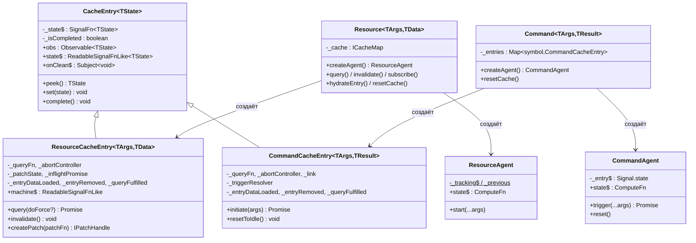

## Краткое описание

Модуль query использует двухсущностную модель (Resource для чтения, Command для записи), построенную на общей базе `CacheEntry`, двух непересекающихся иерархиях конечных автоматов (state machine) и реактивном слое на основе signals/RxJS. Между сущностями существует значительное структурное дублирование, несмотря на различную семантику.

## Иерархия классов

## Базовый CacheEntry и подклассы

**CacheEntry** (`@/src/query/core/CacheEntry.ts`, 72 строки) предоставляет:
- `Signal.state<TState>` в качестве единственной реактивной ячейки
- RxJS `share({ resetOnRefCountZero: () => timer(lifetime) })` для сборки мусора (GC) по счётчику подписчиков
- Мост `signalize(obs)` из RxJS → signal для чтения
- Subject `onClean$` для уведомления о сборке мусора; `peek()` / `set()` / `complete()`

**Оба подкласса независимо добавляют** (дублирование):
- `_abortController` + идентичный цикл abort/create/null (~12 строк в каждом)
- Три поля `PromiseResolver` (`_entryDataLoaded`, `_entryRemoved`, `_queryFulfilled`) + идентичная очистка в `complete()` (~15 строк в каждом)
- `_fireCacheEntryAdded()` — структурно идентичная настройка resolver/callback

**ResourceCacheEntry** (`@/src/query/core/Resource/ResourceCacheEntry.ts`, ~296 LOC) добавляет: собственный жизненный цикл запроса (`_doFetch`), сравнение аргументов, оптимистичное обновление через `Patcher`, дедупликацию активных запросов (`_inflightPromise`), `invalidate()`, поддержку гидратации (hydration).

**CommandCacheEntry** (`@/src/query/core/command/CommandCacheEntry.ts`, ~249 LOC) добавляет: императивный `initiate(args)` для каждого вызова, связанные эффекты Resource через `ResourceRef` (оптимистичное обновление + обновление данных + инвалидация), `_triggerResolver` для внешнего промиса, `resetToIdle()`.

## Архитектура Resource

- **Жизненный цикл**: Конструктор → автоматический `_doFetch` → Pending → Success/Error; повторный запрос через `query(force)` или `invalidate()` → Refreshing → Success.
- **Кэширование**: `CacheMap` (стратегия serialize или compare) формирует ключи записей по аргументам. Один `ResourceCacheEntry` на уникальный набор аргументов. Сборка мусора через таймер счётчика ссылок RxJS (`по умолчанию 60 с`).
- **Конечный автомат**: 4 неизменяемых (immutable) состояния (`MachinePending → MachineSuccess ↔ MachineRefreshing`, `→ MachineError`). Абстрактная база `MachineWithData` предоставляет методы обновления (patch) для Success и Refreshing. Файлы в `@/src/query/core/machines/`.
- **Агент (Agent)**: `ResourceAgent` отслеживает текущую и предыдущую записи для семантики SWR (stale-while-revalidate); `state$` — это `Signal.compute`, вычисляющий `TResourceAgentState`.

## Архитектура Command

- **Жизненный цикл**: Idle до вызова `trigger()` → Loading → Success/Error. Повторный вызов прерывает предыдущий, запускает новый Loading. Автоматического запроса нет.
- **Кэширование**: `Map<symbol, CommandCacheEntry>` — одна запись на агент (ключ — symbol, а не аргументы). По умолчанию `cacheLifetime: 0` (немедленная сборка мусора).
- **Конечный автомат**: 4 автономных класса (`CommandIdle → CommandLoading → CommandSuccess/CommandError`). Нет общей базы, нет встроенного обновления (patching). Файлы в `@/src/query/core/machines/Command*.ts`.
- **Агент (Agent)**: `CommandAgent` хранит единственный сигнал `_entry$`; `trigger()` делегирует вызов `initiate(args)` записи и возвращает `Promise<TResult>`.

## Общая инфраструктура

| Компонент | Расположение | Назначение |
|---|---|---|
| `CacheEntry` | `@/src/query/core/CacheEntry.ts` | Реактивный контейнер Signal+RxJS, сборка мусора через таймер share |
| `CacheMap` | `@/src/query/core/CacheMap/` | Хранилище аргументов→записей на основе стратегии (`serialize`/`compare`) |
| `Signal.state` / `Signal.compute` | `@/src/signals/` | Реактивные примитивы — используются в CacheEntry, Resource, агентах |
| `Batcher` | `@/src/signals/base/Batcher.ts` | Пакетная обработка транзакций, откладывает повторный запуск эффектов до завершения внешнего вызова |
| `signalize` | `@/src/signals/operators/signalize.ts` | Мост Observable→Signal |
| `PromiseResolver` | `@/src/common/utils/PromiseResolver.ts` | Внешнее разрешение/отклонение промисов для хуков жизненного цикла |
| `Patcher` | `@/src/query/core/machines/Patcher.ts` | Движок оптимистичных обновлений на основе Immer |
| `IPlugin` | `@/src/query/types/plugin.types.ts` | `install()`, `augmentResource()`, `augmentCommand()` |
| `ReactHooksPlugin` | `@/src/query/plugins/ReactHooksPlugin.ts` | Единственный плагин: привязывает `useResourceAgent`/`useCommandAgent` к экземплярам |
| `useSignal` | `@/src/signals/react/useSignal.ts` | Мост `useSyncExternalStore` для signal→React |

## Ключевые асимметрии

| Аспект | Resource | Command |
|---|---|---|
| **Использование Batcher** | Только в `resetCache()`; переходы при запросе опираются на микро-пакеты отдельных `State.set` | Явный `Batcher.run()` в путях успеха, синхронной ошибки и асинхронной ошибки в `initiate()` |
| **Проверка устаревания (stale-check)** | `this._abortController !== controller` (по идентичности) | `controller.signal.aborted` (по флагу сигнала) |
| **Поведение при устаревании** | Возвращает/выбрасывает значение вызывающему | Тихо игнорирует (новый вызов владеет промисом) |
| **Оптимистичные обновления (optimistic patches)** | Собственные через `MachineWithData` + `Patcher` | Делегирует связанному `ResourceCacheEntry.createPatch()` через `ResourceRef` |
| **Devtools** | Хук `_beforeDevtoolsPush`, `_key` для маркировки снимков | Хуки devtools отсутствуют |
| **Гидратация/Снимки (Hydration/Snapshot)** | `hydrateEntry()`, `Machine.fromSnapshot()`, `Snapshot.ts` | Не поддерживается |
| **SKIP_TOKEN** | Поддерживается в `getEntry$` / `start()` агента | Не поддерживается |
| **Иерархия автоматов (Machine hierarchy)** | Абстрактная база `MachineWithData` с методами обновления | Автономные классы, нет общей базы |
| **Ключ кэша (Cache key)** | На основе аргументов (serialize или compare) | На основе Symbol (по агенту) |
| **Аргументы колбэка жизненного цикла** | `onCacheEntryAdded(args, tools)` | `onCacheEntryAdded(tools)` — без аргументов |
