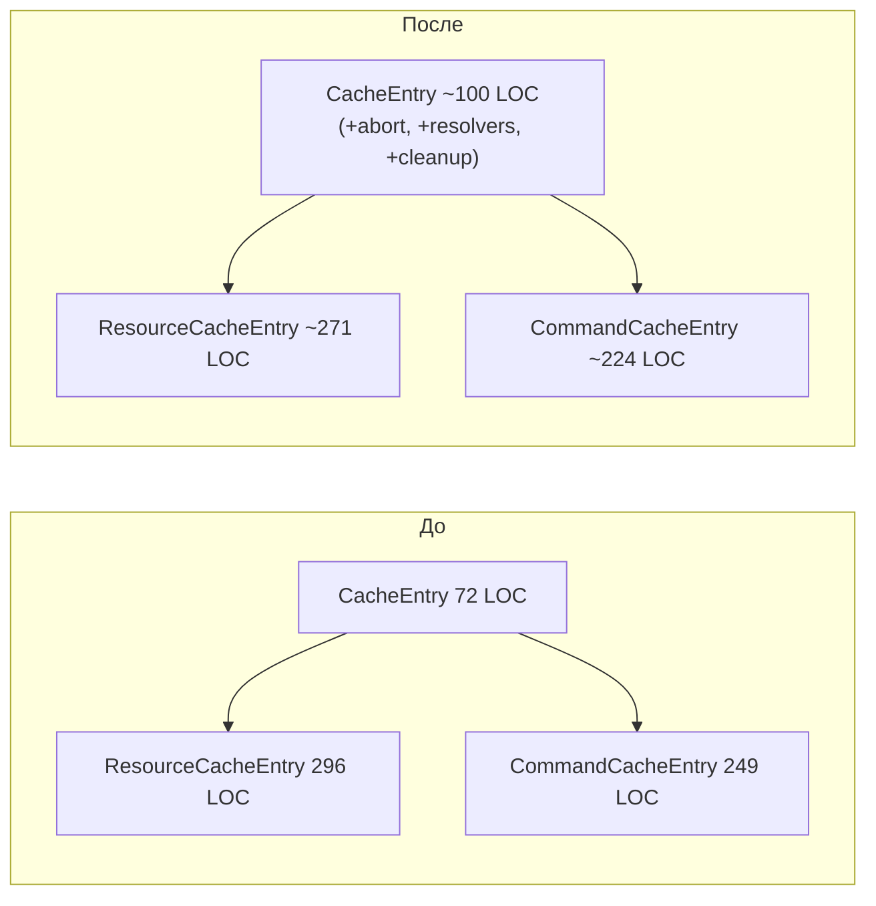
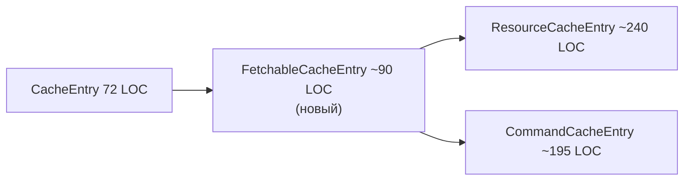
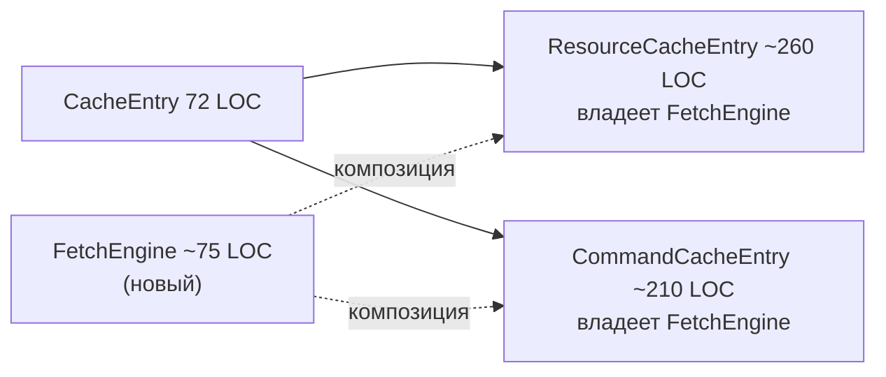
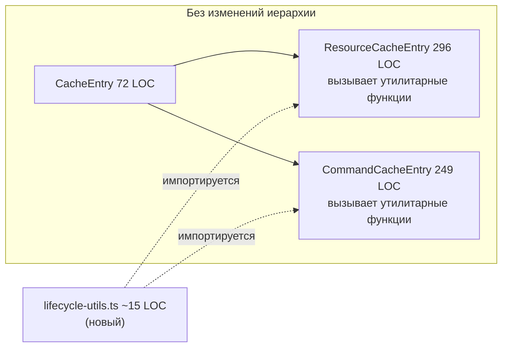

## Исходное состояние

57 идентичных + 6 структурно схожих строк в `ResourceCacheEntry` (296 LOC) и `CommandCacheEntry` (249 LOC). Все классы внутренние — не экспортируются через `src/query/index.ts`. [ref: 03-duplication-analysis.md#Summary] [ref: ../tmp/public-api-audit.md#4]

Ключевые ограничения: машины состояний Command — заглушки фазы 2 (могут расширяться) [ref: ../tmp/phase2-stubs.md#5], использование Batcher асимметрично (Command использует его, Resource — нет) [ref: ../tmp/critical-analysis-2.md#5.2], паттерны проверки устаревания (stale-check) семантически расходятся [ref: ../tmp/duplication-verification.md#Category 6].

---

## Подход A: Обогащение CacheEntry

Перенести общие поля и очистку в существующий базовый класс `CacheEntry`. Новых файлов нет.

**Что переносится:** поле `_abortController` + вспомогательный метод `_abortInflight()`, 3 поля PromiseResolver, блок очистки резолверов в `complete()`, вспомогательный метод настройки `_setupLifecycleResolvers()`.

**Что остаётся в подклассах:** вызовы колбэков (расходящиеся сигнатуры), инструменты `_onQueryStarted` (различные формы), очистка `_inflightPromise`/`_patchState` только для Resource, очистка `_triggerResolver` только для Command, вся логика fetch.



| Метрика | Значение |
|---------|----------|
| Извлечено строк (дедуплицировано) | ~25 |
| Добавлено строк (в CacheEntry) | ~24 |
| Чистое изменение LOC | ~−26 |
| Уровень риска | Низкий |
| Влияние на публичный API | Отсутствует |
| Тестируемость | Защищённые поля — тестирование только через конкретный подкласс |
| Асимметрия Batcher | Не затронута — остаётся в подклассах |
| Расхождение stale-check | Не затронуто — остаётся в подклассах |
| Совместимость с фазой 2 | Высокая — базовый класс получает только инфраструктуру, не поведение |

**Плюсы:** Ноль новых файлов. Сохраняется 2-уровневая иерархия. Минимальные усилия миграции — перенос полей, корректировка видимости. Тесты устойчивы к рефакторингу (основаны на поведении, без проверок `instanceof`). [ref: ../tmp/extraction-approaches.md#Approach A Pros]

**Минусы:** CacheEntry растёт на ~30% и получает fetch-специфичные ответственности (ослабление SRP). Устраняется лишь ~25 из 57 идентичных строк. Защищённые члены позволяют подклассам мутировать состояние жизненного цикла базового класса. Гипотетический будущий потребитель CacheEntry без fetch унаследует мёртвый груз. [ref: ../tmp/critical-analysis-2.md#3 Approach A]

---

## Подход B: Промежуточный класс FetchableCacheEntry

Новый абстрактный класс между `CacheEntry` и обоими потребителями. Владеет всей инфраструктурой abort + резолверов.

**Что переносится:** Все поля из подхода A плюс `_resetQueryFulfilled()`, `_resolveEntryDataLoaded()`, `_resolveQueryFulfilled()`, `_rejectQueryFulfilled()` как защищённые вспомогательные методы. Полная очистка резолверов в `complete()`.



| Метрика | Значение |
|---------|----------|
| Извлечено строк (дедуплицировано) | ~35–40 |
| Добавлено строк (новый класс + обёртки) | ~90 + ~40 тест |
| Чистое изменение LOC | ~+10 |
| Уровень риска | Средний |
| Влияние на публичный API | Отсутствует |
| Тестируемость | Защищённые — то же ограничение, что и у A |
| Асимметрия Batcher | Не затронута — подклассы владеют переходами состояний |
| Расхождение stale-check | `_abortInflight()` обнуляет контроллер, **ломает проверку идентичности Resource**, если вызван до проверки устаревания [ref: ../tmp/critical-analysis-2.md#5.3] |
| Совместимость с фазой 2 | Средняя — расширение Command может потребовать рефакторинга FetchableCacheEntry |

**Плюсы:** Максимальная дедупликация общих паттернов. CacheEntry остаётся чистым. Чёткое 3-уровневое разделение ответственности (контейнер → fetch-инфраструктура → сущность). Расширяемость для гипотетического третьего типа сущности.

**Минусы:** 3-уровневая иерархия для 2 потребителей — избыточное проектирование (over-engineering) для ~35 реальных строк. [ref: ../tmp/critical-analysis-2.md#3 Approach B] Методы-обёртки (`_resolveEntryDataLoaded(data)` вместо `this._entryDataLoaded.resolve(data)`) не добавляют ясности — однострочные обёртки для однострочных вызовов. Двойной дженерик `<TState, TData>` не имеет прецедента в кодовой базе. Чистый LOC *увеличивается*. Показатель «83% извлечения» из оригинального анализа был основан на завышенном базовом показателе в 78 строк — фактическая доля извлечения ~35/57 ≈ 61%. [ref: ../tmp/critical-analysis-2.md#2]

---

## Подход C: Композиция (FetchEngine)

Самостоятельный объект `FetchEngine<TData>`, которым владеет каждый подкласс через композицию. Изменения иерархии нет.

**Что переносится:** Управление abort + поля резолверов + очистка + создание инструментов жизненного цикла — в `FetchEngine`. Подклассы вызывают `this._engine.method()` вместо `this._field.action()`.



| Метрика | Значение |
|---------|----------|
| Извлечено строк (дедуплицировано) | ~30 |
| Добавлено строк (новый класс + связывание + тест) | ~75 + ~50 тест |
| Чистое изменение LOC | ~+35 |
| Уровень риска | Средний |
| Влияние на публичный API | Отсутствует |
| Тестируемость | **Лучшая** — FetchEngine независимо тестируется модульными тестами |
| Асимметрия Batcher | Не затронута |
| Расхождение stale-check | Геттер `.controller` предоставляет AbortController — оба паттерна работают |
| Совместимость с фазой 2 | Высокая — Engine ортогонален изменениям машин состояний |

**Плюсы:** CacheEntry не затронут. 2-уровневая иерархия сохранена. FetchEngine независимо тестируется (без зависимостей от фреймворка). Композиция вместо наследования (composition over inheritance).

**Минусы:** Шаблонный код связывания (boilerplate) заменяет дупликацию практически 1:1 (`this._engine.resolveDataLoaded(data)` вместо `this._entryDataLoaded.resolve(data)`). [ref: ../tmp/critical-analysis-2.md#3 Approach C] Чистый LOC *увеличивается* на ~35. Косвенность без упрощения — проброс методов добавляет лишний шаг навигации. Паттерн срабатывания `_onQueryStarted` по-прежнему дублируется (~10 строк в каждом).

---

## Подход D: Утилитарные функции (без структурных изменений)

Извлечь две самостоятельные функции. Ноль изменений иерархии или композиции. [ref: ../tmp/critical-analysis-2.md#4]

**Что переносится:** Только явно механические паттерны — очистка резолверов и создание резолверов — в чистые функции.

```typescript
// ~15 LOC всего
function cleanupLifecycleResolvers(resolvers: {
    entryDataLoaded: PromiseResolver | null;
    entryRemoved: PromiseResolver | null;
    queryFulfilled: PromiseResolver | null;
}): void { /* reject entryDataLoaded, resolve entryRemoved, reject queryFulfilled, обнулить все */ }

function createLifecycleTools<T>(
    entryDataLoaded: PromiseResolver<T>,
    entryRemoved: PromiseResolver<void>,
): { $cacheDataLoaded: Promise<T>; $cacheEntryRemoved: Promise<void> } { /* вернуть свойства промисов */ }
```



| Метрика | Значение |
|---------|----------|
| Извлечено строк (дедуплицировано) | ~19 (9 строк очистки + 10 строк настройки инструментов) |
| Добавлено строк | ~15 (утилитарный файл) |
| Чистое изменение LOC | ~−23 |
| Уровень риска | **Минимальный** |
| Влияние на публичный API | Отсутствует |
| Тестируемость | **Лучшая** — чистые функции, тривиально тестируемые |
| Асимметрия Batcher | Не затронута — нет структурной связности |
| Расхождение stale-check | Не затронуто — не изменяется |
| Совместимость с фазой 2 | **Наивысшая** — нулевая связность с формой классов |

**Плюсы:** Следует паттерну RTK Query — совместное использование обработчика `onQueryStarted` реализовано как самостоятельная функция, а не метод класса. [ref: ../tmp/rtk-query-deep-dive.md#2] [ref: 04-oss-comparison.md] Нулевой структурный риск. Расширение Command в фазе 2 не может его сломать. Независимо тестируемые чистые функции. Охватывает наиболее явно идентичные блоки (очистка complete() = 13 идентичных строк, настройка резолверов жизненного цикла = 8 идентичных строк). Минимально возможный diff для код-ревью.

**Минусы:** Устраняется лишь ~19/57 идентичных строк (33%). Управление abort, паттерн срабатывания `_onQueryStarted` и блоки резолверов success/error остаются дублированными. Не улучшает архитектуру и расширяемость. Оставшиеся ~38 идентичных строк остаются как есть.

---

## Сводное сравнение

| Критерий | A: Обогащение базы | B: Промежуточный класс | C: Композиция | D: Утилитарные функции |
|----------|-------------------|----------------------|---------------|----------------------|
| Устранено идентичных строк | ~25/57 | ~35/57 | ~30/57 | ~19/57 |
| Новые файлы | 0 | 2 | 2 | 1 |
| Чистое изменение LOC | −26 | +10 | +35 | −23 |
| Глубина иерархии | 2 (без изменений) | 3 (+1) | 2 (без изменений) | 2 (без изменений) |
| SRP CacheEntry | Ослаблен | Сохранён | Сохранён | Сохранён |
| Уровень риска | Низкий | Средний | Средний | **Минимальный** |
| Изолированная тестируемость | Нет | Нет | Да | **Да** |
| Безопасность для фазы 2 | Высокая | Средняя | Высокая | **Наивысшая** |
| Безопасность для Batcher | Да | Да | Да | Да |
| Безопасность для stale-check | Да | **Вектор ошибки** | Да | Да |
| Соответствие OSS-паттернам | Частичное | Низкое | Частичное | **Высокое (RTK)** |
