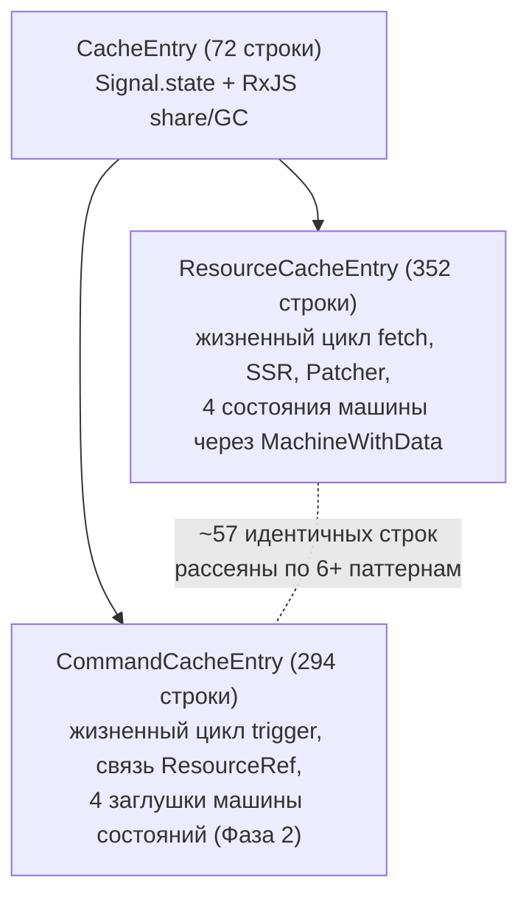
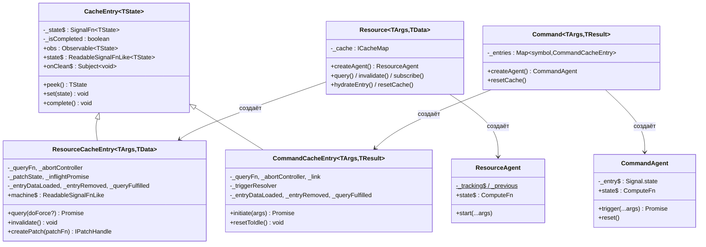
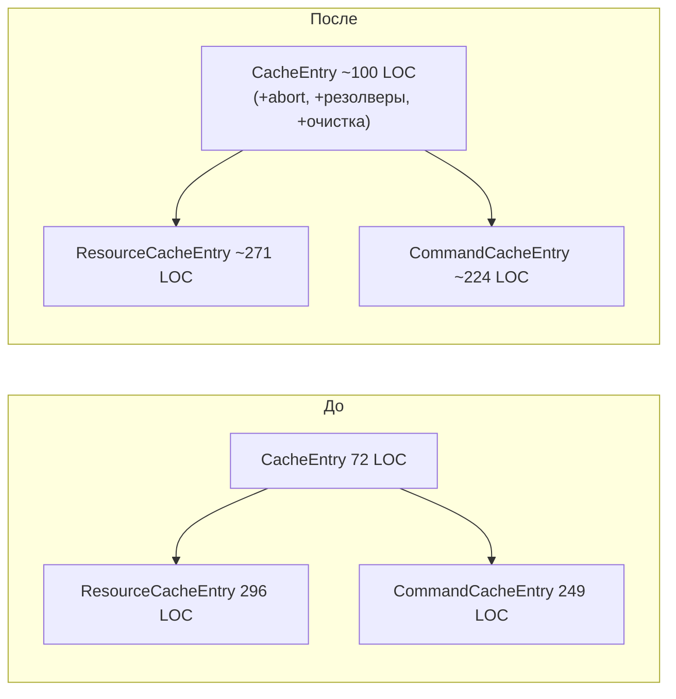
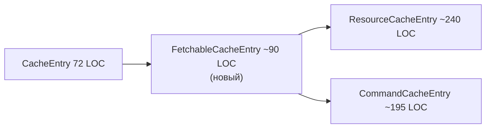
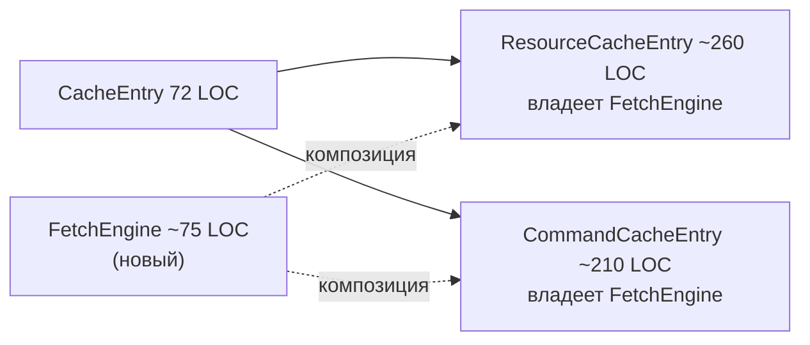
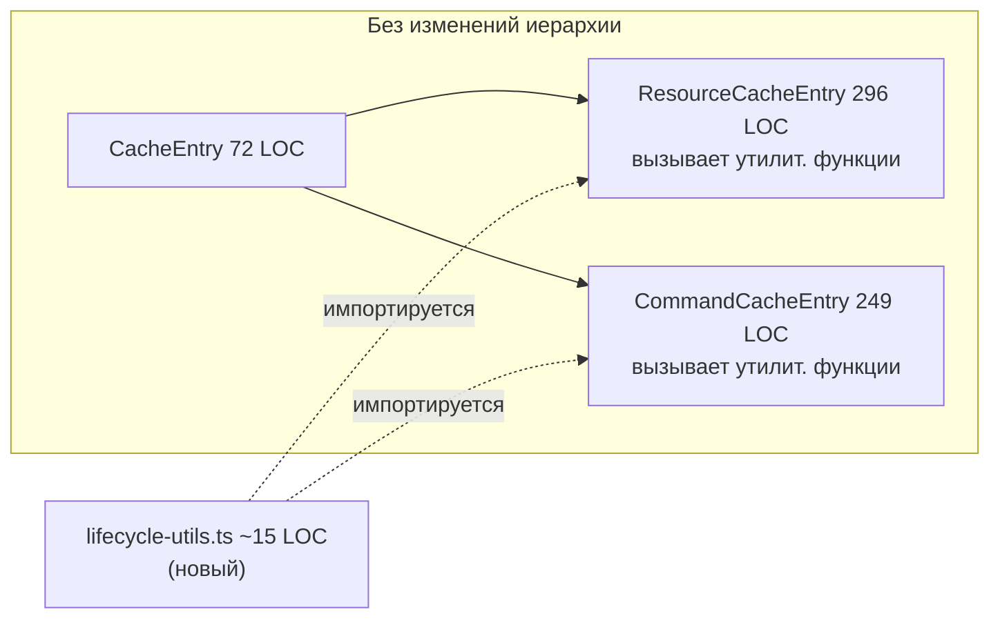

# Извлечение ядра Query: повторное использование ядра Resource в Commands

## Содержание

1. [Краткое резюме](#1-краткое-резюме)
2. [Текущая архитектура](#2-текущая-архитектура)
3. [Анализ дублирования](#3-анализ-дублирования)
4. [Сравнение с OSS](#4-сравнение-с-oss)
5. [Подходы к извлечению](#5-подходы-к-извлечению)
6. [Рекомендация](#6-рекомендация)
7. [Приложения](#приложения)

> **Проверка качества:** см. [REVIEW.md](./REVIEW.md) — результаты чек-листа и обнаруженные проблемы.

> **Примечание о метриках:** «Всего строк» (например, 352/294 в §1) = полная длина файла, включая импорты, пустые строки и комментарии. «LOC» (например, 296/249 в §3–§6) = непустые, некомментарные строки (тело класса). В аналитических разделах LOC используется как основная метрика.

---

## 1. Краткое резюме

### Постановка проблемы

`ResourceCacheEntry` (352 строки) и `CommandCacheEntry` (294 строки) оба наследуют `CacheEntry` (72 строки) и реализуют параллельные механики жизненного цикла: управление отменой (abort), хуки на основе `PromiseResolver` (`onCacheEntryAdded`, `onQueryStarted`) и очистку в `complete()`. Это порождает **57 строк буквально идентичного кода**, фрагментированных по 6+ паттернам, при этом наибольший непрерывный блок составляет всего 13 строк.



### Ключевые выводы

**Дублирование меньше и более фрагментировано, чем предполагалось изначально.** Ранние оценки указывали на ~78 общих строк; построчная верификация сократила это число до **57 буквально идентичных + 6 структурно схожих** строк (см. [§3 Анализ дублирования](#3-анализ-дублирования)). Дублирование распределено мелкими блоками резолверов (resolver) по 4–5 строк (паттерны `if/reject/null`), вперемежку с доменно-специфичным кодом — это не единый извлекаемый регион.

**Машины состояний (state machines) Command намеренно проще.** Все четыре класса машин состояний Command содержат комментарии «Phase 2 stub», однако функционально завершены для семантики одноразовых мутаций. В них отсутствует наследование от `MachineWithData`, состояние refreshing, гидратация SSR и интеграция с `Patcher` — всё это семантически нерелевантно для Command. В исходниках, документации и журнале изменений не фигурирует третий тип сущности.

**Консенсус OSS: query и mutation следует разделять.** TanStack Query, Apollo, SWR и urql поддерживают независимые жизненные циклы для запросов (query) и мутаций (mutation). Ни одна библиотека не разделяет машины состояний между ними. Единственное исключение — **RTK Query** — разделяет ~90% среды выполнения через единый payload creator `executeEndpoint` и общие колбэки (callbacks) `onQueryStarted`/`onCacheEntryAdded`. RTK Query наиболее архитектурно релевантен, поскольку API жизненного цикла rx-toolkit был смоделирован по его образцу. См. [§4 Сравнение с OSS](#4-сравнение-с-oss).

### Рассмотренные подходы

Четыре стратегии извлечения были проанализированы с учётом скорректированной базовой линии дублирования. Числа из [§5 Подходы к извлечению](#5-подходы-к-извлечению):

| Подход | Механизм | Дедуплицировано строк | Чистая дельта LOC | Риск |
|--------|----------|----------------------|-------------------|------|
| A. Обогатить `CacheEntry` | Перенос abort + резолверов в существующий базовый класс | ~25/57 | −26 | Нарушение SRP — обобщённый реактивный контейнер получает концепции, специфичные для fetch |
| B. Промежуточный `FetchableCacheEntry` | 3-уровневая иерархия | ~35/57 | +10 | Переусложнение для 2 потребителей; вектор ошибки в `_abortInflight` |
| C. Композиция `FetchEngine` | Делегирование жизненного цикла fetch отдельному классу | ~30/57 | +35 | Шаблонный код маршрутизации замещает дублирование 1:1 |
| **D. Утилитарные функции** | Автономные `cleanupLifecycleResolvers()` + `createLifecycleTools()` | ~19/57 | −23 | **Нулевые структурные изменения, нулевой риск** |

### Итог

Дублирование реально, но умеренно (~10,5% от совокупных 545 LOC) и фрагментировано. Подходы A–C вносят структурную сложность — новые иерархии классов, связывание через protected-поля или проброс вызовов при композиции — сопоставимую с дублированием, которое они устраняют, или превышающую его. **Утилитарные функции (Подход D) — простейший эффективный вариант**: ~15 строк чистых функций, без изменений иерархии, независимо тестируемые, в соответствии с тем, как TanStack Query и RTK Query работают с общими хелперами.

Расширяемость для гипотетического 3-го типа сущности не является доказанной потребностью и не должна определять стратегию извлечения.

---

## 2. Текущая архитектура

### Обзор

Модуль query использует двухсущностную модель (Resource для чтения, Command для записи), построенную на общем базовом классе `CacheEntry`, двух непересекающихся иерархиях машин состояний и реактивном слое на основе signals/RxJS. Между сущностями существует значительное структурное дублирование, несмотря на различную семантику.

### Иерархия классов



### Базовый CacheEntry и подклассы

**CacheEntry** (`@/src/query/core/CacheEntry.ts`, 72 строки / 61 LOC) предоставляет:
- `Signal.state<TState>` как единственную реактивную ячейку
- RxJS `share({ resetOnRefCountZero: () => timer(lifetime) })` для GC по счётчику подписчиков
- Мост `signalize(obs)` из RxJS → чтение сигнала
- Subject `onClean$` для уведомления о GC; `peek()` / `set()` / `complete()`

**Оба подкласса независимо добавляют** (дублирование — см. [§3](#3-анализ-дублирования) для точной инвентаризации):
- `_abortController` + идентичный цикл abort/create/null (~12 строк каждый)
- Три поля `PromiseResolver` (`_entryDataLoaded`, `_entryRemoved`, `_queryFulfilled`) + идентичная очистка в `complete()` (~15 строк каждый)
- `_fireCacheEntryAdded()` — структурно идентичная настройка резолвера/колбэка

**ResourceCacheEntry** (`@/src/query/core/resource/ResourceCacheEntry.ts`, 296 LOC) добавляет: собственный жизненный цикл fetch (`_doFetch`), сравнение аргументов, оптимистичные патчи через `Patcher`, дедупликация in-flight запросов (`_inflightPromise`), `invalidate()`, поддержка гидратации.

**CommandCacheEntry** (`@/src/query/core/command/CommandCacheEntry.ts`, 249 LOC) добавляет: императивный `initiate(args)` на каждый триггер, связанные эффекты Resource через `ResourceRef` (оптимистичное обновление + обновление + инвалидация), `_triggerResolver` для внешнего промиса (Promise), `resetToIdle()`.

### Архитектура Resource

- **Жизненный цикл**: Конструктор → авто-`_doFetch` → Pending → Success/Error; повторный fetch через `query(force)` или `invalidate()` → Refreshing → Success.
- **Кеширование**: `CacheMap` (стратегия serialize или compare) ключует записи по аргументам. Один `ResourceCacheEntry` на уникальный набор аргументов. GC через таймер RxJS ref-count (по умолчанию 60 с).
- **Машина состояний**: 4 неизменяемых состояния (`MachinePending → MachineSuccess ↔ MachineRefreshing`, `→ MachineError`). Абстрактный базовый класс `MachineWithData` предоставляет методы патчинга для Success и Refreshing. Файлы в `@/src/query/core/machines/`.
- **Агент (Agent)**: `ResourceAgent` отслеживает текущую + предыдущую запись для семантики SWR (stale-while-revalidate); `state$` — это `Signal.compute`, вычисляющий `TResourceAgentState`.

### Архитектура Command

- **Жизненный цикл**: Idle до `trigger()` → Loading → Success/Error. Повторный trigger отменяет предыдущий, запускает новый Loading. Нет авто-fetch.
- **Кеширование**: `Map<symbol, CommandCacheEntry>` — одна запись на агент (ключ — symbol, не аргументы). `cacheLifetime: 0` по умолчанию (немедленный GC).
- **Машина состояний**: 4 автономных класса (`CommandIdle → CommandLoading → CommandSuccess/CommandError`). Нет общего базового класса, нет встроенного патчинга. Файлы в `@/src/query/core/machines/Command*.ts`.
- **Агент (Agent)**: `CommandAgent` хранит единственный сигнал `_entry$`; `trigger()` делегирует `initiate(args)` записи и возвращает `Promise<TResult>`.

### Общая инфраструктура

| Компонент | Расположение | Роль |
|---|---|---|
| `CacheEntry` | `@/src/query/core/CacheEntry.ts` | Реактивный контейнер Signal+RxJS, GC через таймер share |
| `CacheMap` | `@/src/query/core/CacheMap/` | Хранилище args→entry на основе стратегий (`serialize`/`compare`) |
| `Signal.state` / `Signal.compute` | `@/src/signals/` | Реактивные примитивы — используются в CacheEntry, Resource, агентах |
| `Batcher` | `@/src/signals/base/Batcher.ts` | Транзакционная пакетизация, откладывает перезапуск эффектов до завершения внешнего вызова |
| `signalize` | `@/src/signals/operators/signalize.ts` | Мост Observable→Signal |
| `PromiseResolver` | `@/src/common/utils/PromiseResolver.ts` | Внешнее resolve/reject промисов для хуков жизненного цикла |
| `Patcher` | `@/src/query/core/machines/Patcher.ts` | Движок оптимистичных обновлений на базе Immer |
| `IPlugin` | `@/src/query/types/plugin.types.ts` | `install()`, `augmentResource()`, `augmentCommand()` |
| `ReactHooksPlugin` | `@/src/query/plugins/ReactHooksPlugin.ts` | Единственный плагин: привязывает `useResourceAgent`/`useCommandAgent` к экземплярам |
| `useSignal` | `@/src/signals/react/useSignal.ts` | Мост `useSyncExternalStore` для signal→React |

### Ключевые асимметрии

| Аспект | Resource | Command |
|---|---|---|
| **Использование Batcher** | Только в `resetCache()`; переходы fetch полагаются на микропакеты по `State.set` | Явный `Batcher.run()` в путях success, sync-error и async-error в `initiate()` |
| **Проверка устаревания (stale-check)** | `this._abortController !== controller` (по идентичности) | `controller.signal.aborted` (по флагу сигнала) |
| **Поведение при устаревании** | Возвращает/выбрасывает значение вызывающему | Молча игнорирует (новый trigger владеет промисом) |
| **Оптимистичные патчи** | Собственные через `MachineWithData` + `Patcher` | Делегирует в связанный `ResourceCacheEntry.createPatch()` через `ResourceRef` |
| **Devtools** | Хук `_beforeDevtoolsPush`, `_key` для маркировки снимков | Нет хуков devtools |
| **Гидратация/Снимки** | `hydrateEntry()`, `Machine.fromSnapshot()`, `Snapshot.ts` | Не поддерживается |
| **SKIP_TOKEN** | Поддерживается в `getEntry$` / `start()` агента | Не поддерживается |
| **Иерархия машин** | Абстрактный базовый `MachineWithData` с методами патчинга | Автономные классы, без общего базового |
| **Ключ кеша** | На основе аргументов (serialize или compare) | На основе Symbol (по агенту) |
| **Аргументы колбэков жизненного цикла** | `onCacheEntryAdded(args, tools)` | `onCacheEntryAdded(tools)` — без args |

---

## 3. Анализ дублирования

### Обзор

57 строк буквально идентичного кода существуют в `ResourceCacheEntry` (296 LOC) и `CommandCacheEntry` (249 LOC). Дублирование **фрагментировано** — распределено по 6 категориям паттернов, и ни один непрерывный блок не превышает 13 строк. Большинство блоков — это последовательности в 3–5 строк вида guard-resolve/reject-null для `PromiseResolver`.

### Инвентаризация дублирования

| # | Паттерн | Расположение в Resource | Расположение в Command | Строки | Класс |
|---|---------|------------------------|------------------------|-------:|-------|
| 1 | Объявление поля `_abortController` | `:48` | `:27` | 1 | ИДЕНТИЧНЫЙ |
| 2 | Объявление поля `_entryRemoved` | `:54` | `:31` | 1 | ИДЕНТИЧНЫЙ |
| 3 | Разрушение abort в `complete()` | `:147–150` | `:251–254` | 4 | ИДЕНТИЧНЫЙ |
| 4 | Reject `_entryDataLoaded` в `complete()` | `:155–158` | `:261–264` | 4 | ИДЕНТИЧНЫЙ |
| 5 | Resolve `_entryRemoved` в `complete()` | `:159–162` | `:265–268` | 4 | ИДЕНТИЧНЫЙ |
| 6 | Reject `_queryFulfilled` в `complete()` | `:163–166` | `:269–272` | 4 | ИДЕНТИЧНЫЙ |
| 7 | Вызов `super.complete()` | `:169` | `:274` | 1 | ИДЕНТИЧНЫЙ |
| 8 | `_fireCacheEntryAdded` сигнатура+guard+резолверы+tools+try/catch | `:172–187` | `:277–292` | 8 | ИДЕНТИЧНЫЙ |
| 9 | Reject `_queryFulfilled` «superseded» | `:210–213` | `:92–95` | 4 | ИДЕНТИЧНЫЙ |
| 10 | `_onQueryStarted` guard+prop+try/catch | `:216–229` | `:98–110` | 5 | ИДЕНТИЧНЫЙ |
| 11 | Abort предыдущего контроллера | `:199–201` | `:50–52` | 3 | ИДЕНТИЧНЫЙ |
| 12 | Создание нового AbortController | `:206–207` | `:61–62` | 2 | ИДЕНТИЧНЫЙ |
| 13 | Resolve `_entryDataLoaded` при успехе | `:272–275` | `:183–186` | 4 | ИДЕНТИЧНЫЙ |
| 14 | Resolve `_queryFulfilled` при успехе | `:278–281` | `:189–192` | 4 | ИДЕНТИЧНЫЙ |
| 15 | Reject `_queryFulfilled` при ошибке | `:309–312` | `:220–223` | 4 | ИДЕНТИЧНЫЙ |
| 16 | Reject `_queryFulfilled` при синхронной ошибке | `:238–241` | `:131–134` | 4 | ИДЕНТИЧНЫЙ |
| | | | **Итого ИДЕНТИЧНЫХ** | **57** | |
| 17 | 4 объявления полей (отличается параметр типа) | `:51–53,55` | `:28–30,32` | 4 | СХОЖИЙ |
| 18 | Создание `_entryDataLoaded` | `:175` | `:280` | 1 | СХОЖИЙ |
| 19 | Создание `_queryFulfilled` | `:217` | `:99` | 1 | СХОЖИЙ |
| | | | **Итого СХОЖИХ** | **6** | |

### Что НЕ является дублированием

Код, часто ошибочно учитываемый как общий, но принадлежащий исключительно одной стороне:

| Код | Владелец | Строки | Почему уникален |
|-----|----------|-------:|-----------------|
| Проверка гидратации в `_fireCacheEntryAdded` | Resource `:189–194` | 6 | У Command нет SSR-гидратации; нет аналога |
| `_inflightPromise = null` в `complete()` | Resource `:151` | 1 | Command использует `_triggerResolver` |
| `_patchState = null` в `complete()` | Resource `:152` | 1 | Command патчит связанные Resource, а не себя |
| Reject `_triggerResolver` в `complete()` | Command `:256–259` | 4 | Resource дедуплицирует через `_inflightPromise` |
| `getCacheEntry` в tools onQueryStarted | Resource `:221` | 1 | У объекта tools Command нет аналогичного свойства |
| Механизм проверки устаревания | Оба | — | РАЗЛИЧАЕТСЯ: по идентичности (`!== controller`) vs по сигналу (`.aborted`) |

### Оценка извлекаемости

| Метрика | Значение |
|---------|----------|
| Всего идентичных строк | 57 |
| Наибольший непрерывный блок | **13 строк** — цепочка резолверов в `complete()` (паттерны #4–7) |
| Блоков ≤ 5 строк | 12 из 16 паттернов |
| Блоков ровно в 4 строки | 9 паттернов (все — guard-action-null для `PromiseResolver`) |
| Процент от совокупных LOC (545) | 10,5% |

**Профиль фрагментации**: 57 строк разбиваются на **16 дискретных блоков** со средним размером 3,6 строки. Только очистка в `complete()` предлагает связный 13-строчный объект извлечения. Оставшиеся 44 строки распределены по `_fireCacheEntryAdded`, `_onQueryStarted`, настройке abort и 4 отдельным обработчикам success/error.

**Практические последствия**: общий базовый класс или миксин должен предоставить ~6 мелких protected-хелперов для покрытия этих фрагментов. Экономия на каждый хелпер составляет 3–5 строк, что делает стоимость абстракции (новый класс/миксин + проброс) сопоставимой со стоимостью дублирования.

### Визуализация параллельного жизненного цикла

```
ResourceCacheEntry._doFetch()              CommandCacheEntry.initiate()
═══════════════════════════                ═══════════════════════════
│                                          │
├─ прерв. пред. контроллера ───────────── ├─ прерв. пред. контроллера      [3 строки идентичны]
├─ _inflightPromise?.catch ← УНИКАЛЬНО    ├─ reject _triggerResolver ← УНИКАЛЬНО
├─ создать новый AbortController ──────── ├─ создать новый AbortController  [2 строки идентичны]
│                                          │
├─ reject _queryFulfilled «superseded» ── ├─ reject _queryFulfilled        [4 строки идентичны]
├─ вызвать _onQueryStarted ──────────────  ├─ вызвать _onQueryStarted       [5 строк идентичны]
│  └─ tools: {$queryFulfilled,             │  └─ tools: {$queryFulfilled}
│             getCacheEntry} ← УНИКАЛЬНО   │
│                                          ├─ машина → Loading ← УНИКАЛЬНО (inline)
│                                          ├─ применить оптимист. патчи ← УНИКАЛЬНО (связан. Resources)
│                                          │
├─ await queryFn(args, {abortSignal}) ──── ├─ await queryFn(args, {abortSignal})
│                                          │
│  ┌─ ПРИ УСПЕХЕ ─────────────────────┐    │  ┌─ ПРИ УСПЕХЕ ─────────────────────┐
│  │ проверка устаревания:            │    │  │ проверка устаревания:             │  ← РАЗЛИЧАЕТСЯ
│  │   ctrl !== this._ac              │    │  │   signal.aborted                  │
│  │ resolve _entryDataLoaded ───────────── │ resolve _entryDataLoaded           │  [4 строки идентичны]
│  │ resolve _queryFulfilled ───────────── │ resolve _queryFulfilled            │  [4 строки идентичны]
│  │ машина → Success                 │    │  │ машина → CommandSuccess           │
│  │ _updateMachineData ← УНИКАЛЬНО   │    │  │ обновить связан. Resources ← УНИКАЛЬНО │
│  └──────────────────────────────────┘    │  └──────────────────────────────────┘
│                                          │
│  ┌─ ПРИ ОШИБКЕ ────────────────────┐    │  ┌─ ПРИ ОШИБКЕ ────────────────────┐
│  │ проверка устаревания:            │    │  │ проверка устаревания:             │  ← РАЗЛИЧАЕТСЯ
│  │   ctrl !== this._ac              │    │  │   signal.aborted                  │
│  │ reject _queryFulfilled ─────────────── │ reject _queryFulfilled            │  [4 строки идентичны]
│  │ машина → Error / Success+err     │    │  │ машина → CommandError             │
│  └──────────────────────────────────┘    │  │ откатить оптимист. патчи ← УНИКАЛЬНО│
                                           │  └──────────────────────────────────┘

complete() — вызывается при вытеснении из кеша
═══════════════════════════════════════
├─ прерывание контроллера ────────────── ├─ прерывание контроллера          [4 строки идентичны]
├─ _inflightPromise = null ← УНИКАЛЬНО   ├─ reject _triggerResolver ← УНИКАЛЬНО
├─ _patchState = null      ← УНИКАЛЬНО   │
├─ reject _entryDataLoaded ────────────── ├─ reject _entryDataLoaded       [4 строки идентичны]
├─ resolve _entryRemoved ─────────────── ├─ resolve _entryRemoved         [4 строки идентичны]
├─ reject _queryFulfilled ────────────── ├─ reject _queryFulfilled        [4 строки идентичны]
├─ super.complete() ──────────────────── ├─ super.complete()              [1 строка идентична]
```

**Легенда**: `────────` = идентичный код с обеих сторон; `← УНИКАЛЬНО` = существует только на одной стороне.

---

## 4. Сравнение с OSS

### Матрица сравнения

| Измерение | TanStack Query v5 | RTK Query | Apollo Client | SWR v2 | urql | rx-toolkit |
|---|---|---|---|---|---|---|
| **Общий базовый класс** | `Subscribable` + `Removable` (~65 LOC) | `CommonEndpointDefinition` + единый `executeEndpoint` (~90% общей среды выполнения) | Монолитный `QueryManager` (~1850 LOC, без разделения) | Ядро `_internal`: `Cache`, `internalMutate`, `serialize` | `Operation` с тегом `kind`, единый `executeRequestOperation` | Базовый `CacheEntry` (~72 LOC), разделённые иерархии |
| **Машины состояний** | Inline-редьюсеры на сущность, **не общие** | Отдельные Redux-слайсы, общий enum `QueryStatus` | `ObservableQuery` (~1700 LOC) vs inline Promise (~180 LOC) | Нет машин — плоские объекты `{ data, error }` | Нет машин — `OperationResult` — плоские данные | Неизменяемые иерархии классов (4+4), **не общие** |
| **Кеш** | Два раздельных: `QueryCache` (Map) + `MutationCache` (Set) | Один редьюсер, раздельные подсрезы (`queries` + `mutations` + `provided`) | Единый `InMemoryCache`, общие оптимистичные слои | Единый плоский `Map<string, State>`, общее пространство ключей | Поэкземплярный exchange; `cacheExchange` хранит запросы, инвалидирует при мутации | Раздельные `CacheMap` на Resource; `Map` на Command |
| **Общий жизненный цикл** | Раздельный: авто-fetch + таймеры устаревания vs idle-до-мутации | **Общее**: `onQueryStarted` + `onCacheEntryAdded` для обоих, единый конвейер middleware | Раздельное: `ObservableQuery` vs одноразовый Promise; общий `broadcastQueries()` | Раздельные хуки; `internalMutate` — общий путь записи | Единый dispatch `Client`, расходящийся dedup + teardown | Раздельное, но параллельное: оба имеют `onQueryStarted` + `onCacheEntryAdded` (~57 строк дубл.) |
| **Плагины / расширяемость** | Нет системы плагинов; адаптеры фреймворков оборачивают observer'ы | `buildCreateApi(...modules)` — композируемая модульная система | Цепочка `ApolloLink` + `typePolicies` | Массив `use: [...middlewares]` | Конвейер exchange'ей (функции `ExchangeIO`) | `IPlugin` с `augmentResource` + `augmentCommand` |
| **React-привязка** | `useSyncExternalStore` поверх core observer'ов | `useSelector` + сгенерированные per-endpoint хуки | `ObservableQuery` → обёртка `useQuery` | `useSyncExternalStore` + отслеживание зависимостей | Потоки Wonka → хуки | Signals + `useSyncExternalStore` |

### Профили отдельных библиотек

**TanStack Query v5.** Два крошечных базовых класса (`Subscribable` для pub/sub, `Removable` для GC) — всё остальное независимо: классы сущностей, observer'ы, кеши, редьюсеры, типы результатов. Наиболее близок к текущей структуре rx-toolkit, где query и mutation имеют общим лишь минимальный реактивный контейнер. Ключевое наблюдение: *намеренное дублирование* между `QueryObserver` (745 LOC) и `MutationObserver` (227 LOC) — нет общего базового observer'а, несмотря на структурное сходство. **Достоверность: Высокая.**

**RTK Query.** Наиболее глубокое совместное использование кода в экосистеме: единый payload creator `executeEndpoint` обрабатывает thunk'и как для query, так и для mutation (~90% общего кода); колбэки жизненного цикла `onQueryStarted` и `onCacheEntryAdded` проходят через единый обработчик middleware, сопоставляющий оба типа thunk'ов через `isPending(queryThunk, mutationThunk)`. Разделение происходит на уровне slice (раздельные редьюсеры, селекторы, хуки) и в стратегии ключей кеша (args-hash vs requestId). API жизненного цикла rx-toolkit был смоделирован по образцу RTK Query, что делает его наиболее архитектурно релевантным эталоном. **Достоверность: Высокая.**

**Apollo Client.** Нет разделения query/mutation на уровне ядра — монолитный `QueryManager` (~1850 LOC) обрабатывает всё. Реальная асимметрия существует на уровне результата: `ObservableQuery` (насыщенный, долгоживущий, ~1700 LOC) vs inline mutation Promise (fire-and-forget, ~180 LOC). Единый `InMemoryCache` с общими оптимистичными слоями. Ключевое наблюдение: монолитный подход работает, но делает tree-shaking невозможным, а код мутаций занимает ~10% от веса инфраструктуры запросов. **Достоверность: Высокая.**

**SWR v2.** Мутация — буквально middleware, оборачивающий хук запроса (`useSWRMutation = withMiddleware(useSWR, mutation)`). Общее: плоский key-value `Cache`, `internalMutate` для записи, `serialize` для ключей. Но мутация поддерживает собственное состояние через `useStateWithDeps`, отдельно от подписки на кеш запросов. Ключевое наблюдение: общий путь записи, раздельное поведение чтения. **Достоверность: Высокая.**

**urql.** Потоковая унификация через exchange'и: каждый запрос становится `Operation` с явным тегом `kind` (`query`/`mutation`/`subscription`), диспетчеризуемым через `executeRequestOperation`. Exchange'и фильтруют по `operation.kind` — так что операции используют общий конвейер, но немедленно расходятся. Ключевое наблюдение: диспетчеризация по тегу kind чистая, но фильтрация на уровне каждого exchange воссоздаёт разделение. **Достоверность: Высокая.**

### Две референсные модели

#### 1. TanStack Query — минимальный общий базовый класс

Имеет общими лишь ~65 строк инфраструктуры. Иерархии сущностей, observer'ы, кеши и машины состояний полностью независимы. Это валидирует текущий подход rx-toolkit с `CacheEntry` (~72 LOC общих) — масштаб совместного использования сопоставим. TanStack доказывает, что раздельное хранение query/mutation работает в масштабе (20 000+ звёзд GitHub, адаптирован для 4 фреймворков). Цена — структурное дублирование (~50% логики observer'ов параллельна), принятое как компромисс ради простоты.

#### 2. RTK Query — глубокое совместное использование жизненного цикла

Использует совместно ~90% среды выполнения через `executeEndpoint`, плюс унифицированный middleware жизненного цикла для `onQueryStarted`/`onCacheEntryAdded`. Это напрямую релевантно, поскольку rx-toolkit скопировал дизайн API жизненного цикла RTK Query. RTK Query доказывает, что более глубокое совместное использование инфраструктуры жизненного цикла жизнеспособно и проверено в продакшене. Граница разделения проходит по редьюсерам, селекторам и хукам — не по уровню выполнения или жизненного цикла.

### Экосистемный консенсус (скорректированный)

Экосистема НЕ сходится к единому ответу. Два жизнеспособных паттерна сосуществуют:

1. **Минимальный базовый класс** (TanStack, urql, SWR): используют совместно лишь тончайшую инфраструктуру (pub/sub, GC, примитивы кеша). Машины, логика fetch и жизненный цикл — раздельные. Оптимизировано для простоты и независимости.

2. **Общее выполнение + жизненный цикл** (RTK Query): используют общий исполнитель fetch и механизм хуков жизненного цикла; разделяют на уровне state/selector/hook. Оптимизировано для консистентности и сокращения дублирования жизненного цикла.

**Универсальное согласие**: ни одна библиотека не разделяет машины состояний между запросами и мутациями. Enum'ы статусов могут пересекаться, но логика редьюсеров всегда расходится (авто-fetch + отслеживание устаревания vs fire-and-forget + состояние idle).

### Уроки для rx-toolkit

| Источник | Урок | Применимость |
|---|---|---|
| TanStack | ~65 LOC общего базового класса достаточно; не стоит переабстрагировать observer'ы/машины | Валидирует текущий размер `CacheEntry`; подтверждает, что машины должны оставаться раздельными |
| RTK Query | Middleware жизненного цикла можно унифицировать для обоих типов сущностей без слияния логики состояний | Напрямую применимо — rx-toolkit уже имеет параллельные `onQueryStarted`/`onCacheEntryAdded`; общие хелперы жизненного цикла доказали жизнеспособность |
| RTK Query | `executeEndpoint` ветвится по типу сущности в рантайме — работает при ~90% общего кода | Рассмотреть для общей оркестрации fetch, если дублирование вырастет за пределы текущих ~57 строк |
| Apollo | Монолитный подход создаёт долг tree-shaking и поддерживаемости | Подтверждает: избегать слияния Resource + Command в единый класс |
| SWR | Чистые утилитарные функции (`internalMutate`, `serialize`) — легчайший механизм совместного использования | Поддерживает подход утилитарных функций для очистки жизненного цикла (~15 LOC, нулевые структурные изменения) |
| urql | Модель kind-тегированных `Operation` чиста, но exchange'и немедленно фильтруют — разделение по-прежнему реально | Не стоит ожидать, что унифицированная абстракция «операции» устранит per-type логику |

### Источники

- [TanStack/query — subscribable.ts, removable.ts, query.ts, mutation.ts](https://github.com/TanStack/query/tree/main/packages/query-core/src) — архитектура ядра
- [RTK Query — buildThunks.ts, queryLifecycle.ts, cacheLifecycle.ts](https://github.com/reduxjs/redux-toolkit/tree/master/packages/toolkit/src/query/core) — общее выполнение + жизненный цикл
- [Apollo Client — QueryManager.ts, ObservableQuery.ts](https://github.com/apollographql/apollo-client/tree/main/src/core) — монолитный подход
- [SWR — _internal/, mutation/](https://github.com/vercel/swr/tree/main/src) — совместное использование через middleware
- [urql — core/client.ts, exchanges/](https://github.com/urql-graphql/urql/tree/main/packages/core/src) — конвейер exchange'ей

---

## 5. Подходы к извлечению

### Базовая линия

57 идентичных + 6 структурно схожих строк в `ResourceCacheEntry` (296 LOC) и `CommandCacheEntry` (249 LOC). Все классы внутренние — не экспортируются через `src/query/index.ts`. См. [§3 инвентаризация](#инвентаризация-дублирования).

Ключевые ограничения: машины Command — заглушки Фазы 2 (могут расти), использование Batcher асимметрично (Command использует, Resource — нет), паттерны проверки устаревания семантически расходятся (см. [§2 Ключевые асимметрии](#ключевые-асимметрии)).

---

### Подход 0: Ничего не делать (базовая линия)

Оставить текущий код как есть. Никакого извлечения, никаких новых абстракций.

57 идентичных строк распределены по 2 файлам общим объёмом 545 LOC (~10,5% совокупно, ~8% если измерять как долю только двух файлов подклассов). Дублирование фрагментировано на 16 мелких блоков со средним размером 3,6 строки. Оба файла внутренние (не экспортируются через публичный API), и дублированные паттерны стабильны — они не расходились с момента первоначальной реализации.

**Почему это допустимый вариант:** Затраты на поддержку 57 строк дублированного, но стабильного шаблонного кода невелики. Оба подкласса поддерживаются одним и тем же разработчиком (разработчиками), в одной директории, с одним циклом ревью. Паттерны механические (guard-цепочки `if/reject/null` для резолверов) и вряд ли будут эволюционировать независимо. Любой подход к извлечению должен обосновать себя относительно этой базовой линии — а не относительно теоретического идеала нулевого дублирования.

**Цена бездействия:** Будущий контрибьютор, незнакомый с кодовой базой, может изменить одну сторону, не обновив другую. Вероятность низкая — код внутренний — но ненулевая. Отсутствие структурного улучшения в направлении расширяемости.

Все нижеследующие подходы следует оценивать относительно этой базовой линии.

---

### Подход A: Обогатить CacheEntry

Перенести общие поля и очистку в существующий базовый класс `CacheEntry`. Без новых файлов.

**Что переносится:** Поле `_abortController` + хелпер `_abortInflight()`, 3 поля PromiseResolver, блок очистки резолверов в `complete()`, хелпер настройки резолверов `_setupLifecycleResolvers()`.

**Что остаётся в подклассах:** Вызовы колбэков (расходящиеся сигнатуры), tools для `_onQueryStarted` (различная форма), очистка `_inflightPromise`/`_patchState` только для Resource, очистка `_triggerResolver` только для Command, вся логика fetch.



| Метрика | Значение |
|---------|----------|
| Извлечено LOC (дедуплицировано) | ~25 |
| Добавлено LOC (в CacheEntry) | ~24 |
| Чистое изменение LOC | ~−26 |
| Уровень риска | Низкий |
| Влияние на публичный API | Нет |
| Тестируемость | Protected-поля — тестировать можно только через конкретный подкласс |
| Асимметрия Batcher | Не затронута — остаётся в подклассах |
| Расхождение проверки устаревания | Не затронуто — остаётся в подклассах |
| Совместимость с Фазой 2 | Высокая — базовый класс получает только инфраструктуру, не поведение |

**Плюсы:** Нет новых файлов. Сохраняется 2-уровневая иерархия. Минимальные усилия миграции — перенести поля, скорректировать видимость. Тесты рефактороустойчивы (основаны на поведении, нет проверок `instanceof`).

**Минусы:** CacheEntry вырастает на ~30% и приобретает fetch-специфичные концепции (ослабление SRP). CacheEntry сейчас — обобщённый реактивный контейнер (signal + RxJS share/GC); наделение его fetch-осведомлённостью связывает его с семантикой query, нарушая SRP для любого не-query потребителя. Устраняется лишь ~25 из 57 идентичных строк. Protected-члены позволяют подклассам мутировать состояние жизненного цикла базового класса. Будущий не-fetch потребитель CacheEntry наследует мёртвый груз.

---

### Подход B: Промежуточный FetchableCacheEntry

Новый абстрактный класс между `CacheEntry` и обоими потребителями. Владеет всей инфраструктурой abort + резолверов.

**Что переносится:** Все поля из Подхода A плюс `_resetQueryFulfilled()`, `_resolveEntryDataLoaded()`, `_resolveQueryFulfilled()`, `_rejectQueryFulfilled()` как protected-хелперы. Полная очистка резолверов в `complete()`.



| Метрика | Значение |
|---------|----------|
| Извлечено LOC (дедуплицировано) | ~35–40 |
| Добавлено LOC (новый класс + обёртки) | ~90 + ~40 тест |
| Чистое изменение LOC | ~+10 |
| Уровень риска | Средний |
| Влияние на публичный API | Нет |
| Тестируемость | Protected — аналогичное ограничение, как в A |
| Асимметрия Batcher | Не затронута — подклассы владеют переходами состояний |
| Расхождение проверки устаревания | `_abortInflight()` обнуляет контроллер, **нарушает проверку по идентичности Resource**, если вызван до проверки устаревания |
| Совместимость с Фазой 2 | Средняя — расширение Command может потребовать рефакторинга FetchableCacheEntry |

**Плюсы:** Максимальная дедупликация общих паттернов. CacheEntry остаётся чистым. Чёткое 3-уровневое распределение ответственности (контейнер → инфраструктура fetch → сущность). Расширяемость для гипотетического 3-го типа сущности.

**Минусы:** 3-уровневая иерархия для 2 потребителей — переусложнение ради ~35 реальных строк. Методы-обёртки (`_resolveEntryDataLoaded(data)` vs `this._entryDataLoaded.resolve(data)`) не добавляют ясности — однострочные обёртки для однострочных вызовов. Двойной дженерик `<TState, TData>` не имеет прецедента в кодовой базе. Чистый LOC *увеличивается*. Показатель «83% извлечения» из первоначального анализа основывался на завышенной базовой линии в 78 строк — фактическая степень извлечения ~35/57 ≈ 61%.

---

### Подход C: Композиция (FetchEngine)

Автономный объект `FetchEngine<TData>`, которым каждый подкласс владеет через композицию. Без изменений иерархии.

**Что переносится:** Управление abort + поля резолверов + очистка + создание инструментов жизненного цикла (lifecycle tools) в `FetchEngine`. Подклассы вызывают `this._engine.method()` вместо `this._field.action()`.



| Метрика | Значение |
|---------|----------|
| Извлечено LOC (дедуплицировано) | ~30 |
| Добавлено LOC (новый класс + проброс + тест) | ~75 + ~50 тест |
| Чистое изменение LOC | ~+35 |
| Уровень риска | Средний |
| Влияние на публичный API | Нет |
| Тестируемость | **Лучшая** — FetchEngine тестируется независимо как unit |
| Асимметрия Batcher | Не затронута |
| Расхождение проверки устаревания | Геттер `.controller` предоставляет AbortController — оба паттерна работают |
| Совместимость с Фазой 2 | Высокая — Engine ортогонален изменениям машин |

**Плюсы:** CacheEntry не затронут. 2-уровневая иерархия сохранена. FetchEngine тестируется независимо (без зависимостей от фреймворка). Композиция вместо наследования.

**Минусы:** Шаблонный код проброса замещает дублирование практически 1:1 (`this._engine.resolveDataLoaded(data)` vs `this._entryDataLoaded.resolve(data)`). Чистый LOC *увеличивается* на ~35. Индирекция без упрощения — проброс методов добавляет шаг навигации. Паттерн вызова `_onQueryStarted` по-прежнему дублируется (~10 строк каждый).

---

### Подход D: Утилитарные функции (без структурных изменений)

Извлечение двух автономных функций. Нулевые изменения иерархии или композиции.

**Что переносится:** Только явно механические паттерны — очистка резолверов и создание резолверов — в чистые функции.

```typescript
// ~15 LOC итого
function cleanupLifecycleResolvers(resolvers: {
    entryDataLoaded: PromiseResolver | null;
    entryRemoved: PromiseResolver | null;
    queryFulfilled: PromiseResolver | null;
}): void { /* reject entryDataLoaded, resolve entryRemoved, reject queryFulfilled, null all */ }

function createLifecycleTools<T>(
    entryDataLoaded: PromiseResolver<T>,
    entryRemoved: PromiseResolver<void>,
): { $cacheDataLoaded: Promise<T>; $cacheEntryRemoved: Promise<void> } { /* return promise props */ }
```



| Метрика | Значение |
|---------|----------|
| Извлечено LOC (дедуплицировано) | ~19 (9 строк очистки + 10 строк настройки tools) |
| Добавлено LOC | ~15 (утилитарный файл) |
| Чистое изменение LOC | ~−23 |
| Уровень риска | **Минимальный** |
| Влияние на публичный API | Нет |
| Тестируемость | **Лучшая** — чистые функции, тривиально тестируются |
| Асимметрия Batcher | Не затронута — нулевое структурное связывание |
| Расхождение проверки устаревания | Не затронуто — не трогается |
| Совместимость с Фазой 2 | **Наивысшая** — нулевое связывание с формой классов |

**Плюсы:** Следует паттерну RTK Query — общий обработчик `onQueryStarted` является автономной функцией, а не методом класса (см. [§4 профиль RTK Query](#профили-отдельных-библиотек)). Нулевой структурный риск. Расширение Command в Фазе 2 не может сломать его. Независимо тестируемые чистые функции. Нацелен на наиболее явно идентичные блоки (очистка в complete() = 13 идентичных строк, настройка резолверов жизненного цикла = 8 идентичных строк). Минимально возможный diff для код-ревью.

**Минусы:** Устраняется лишь ~19/57 идентичных строк (33%). Управление abort, паттерн вызова `_onQueryStarted` и блоки резолверов success/error остаются дублированными. Не улучшает архитектуру или расширяемость. Оставшиеся ~38 идентичных строк остаются как есть.

---

### Сводное сравнение

| Критерий | A: Обогатить базовый | B: Промежуточный | C: Композиция | D: Утилит. функции |
|----------|---------------------|-----------------|---------------|-------------------|
| Устранено идентичных строк | ~25/57 | ~35/57 | ~30/57 | ~19/57 |
| Новые файлы | 0 | 2 | 2 | 1 |
| Чистая дельта LOC | −26 | +10 | +35 | −23 |
| Глубина иерархии | 2 (без изм.) | 3 (+1) | 2 (без изм.) | 2 (без изм.) |
| SRP CacheEntry | Ослаблен | Сохранён | Сохранён | Сохранён |
| Уровень риска | Низкий | Средний | Средний | **Минимальный** |
| Изолированная тестируемость | Нет | Нет | Да | **Да** |
| Безопасность для Фазы 2 | Высокая | Средняя | Высокая | **Наивысшая** |
| Безопасность для Batcher | Да | Да | Да | Да |
| Безопасность для stale-check | Да | **Вектор ошибки** | Да | Да |
| Соответствие паттернам OSS | Частичное | Низкое | Частичное | **Высокое (RTK)** |

---

## 6. Рекомендация

### Основная: Подход D — утилитарные функции (немедленное применение)

Извлечь две автономные функции: `cleanupLifecycleResolvers()` и `createLifecycleTools()`. Это устраняет ~19 из 57 буквально идентичных строк — наиболее плотные, наиболее явно дублированные блоки — с помощью ~15 строк нового кода и **нулевых структурных изменений**.

**Почему это правильное решение:**

- Верифицированное дублирование составляет 57 идентичных + 6 структурно схожих строк при совокупных 545 LOC (~10,5%). Подходы A–C вносят иерархии классов, связывание через protected-поля или проброс композиции, что сопоставимо с дублированием, которое они устраняют, или превышает его.
- Утилитарные функции — паттерн, используемый TanStack Query (автономные хелперы, без общего базового observer'а) и RTK Query (общая функция `handleNewKey` для `onCacheEntryAdded`). Ни одна библиотека из [§4 матрицы сравнения](#матрица-сравнения) не решает это промежуточным классом.
- Нулевой риск: чистые функции, независимо тестируемые, без изменения роли `CacheEntry` как обобщённого реактивного контейнера.
- Обратная совместимость гарантирована. Никаких изменений публичного API, сигнатур типов, иерархии.

**Оценка трудозатрат:** Минимальные — один файл, две функции, обновление двух точек вызова, добавление unit-тестов.

### Вторичная: Повторная оценка после завершения Фазы 2

Все четыре класса машин состояний Command содержат комментарии «Phase 2 stub». Они функционально завершены для семантики одноразовых мутаций, но структурно расходятся с машинами Resource (нет `MachineWithData`, нет состояния refreshing, нет SSR). Извлечение общей инфраструктуры из нестабильной цели означает повторное извлечение, когда заглушки дозреют.

**Когда пересмотреть:**
- После того как Фаза 2 Command будет завершена и структура машин стабилизируется.
- Если планируется конкретный 3-й тип сущности (InfiniteQuery, Subscription), Подход A (обогащение `CacheEntry` полями abort + резолверов) становится оправданным.
- Если после Фазы 2 машины Command приобретут значительное сходство с Resource — пересмотреть Подход B, но только тогда.

### Чего НЕ делать

| Антипаттерн | Причина |
|-------------|---------|
| Промежуточный класс `FetchableCacheEntry` (B) | 3-уровневая иерархия для 2 потребителей ~57 общих строк. Вектор ошибки: `_abortInflight()` обнуляет контроллер, нарушая проверку устаревания Resource по идентичности. |
| Композиция `FetchEngine` (C) | Шаблонный код проброса замещает дублирование 1:1. Чистый LOC увеличивается. `resolveDataLoaded(data)` не проще `this._entryDataLoaded.resolve(data)` — индирекция без упрощения. |
| Унификация машин состояний | Ни одна библиотека этого не делает (см. [§4 Экосистемный консенсус](#экосистемный-консенсус-скорректированный)). Асимметрия намеренна: у запросов есть устаревание/обновление/SSR; мутации — одноразовые. |

### Матрица принятия решений

| Если... | Тогда... |
|---------|----------|
| Цель — только DRY | Подход D сейчас — перманентное решение |
| Планируется 3-й тип сущности | Подход D сейчас, Подход A после Фазы 2 |
| Машины Command после созревания сильно схожи с Resource | Подход D сейчас, пересмотр B после Фазы 2 |
| 3-й тип сущности никогда не появится | Подход D — перманентное решение |

### Урок RTK Query

RTK Query доказывает, что более глубокое совместное использование кода ЖИЗНЕСПОСОБНО — единый `executeEndpoint` обрабатывает запросы, мутации и бесконечные запросы (infinite queries) с ~90% общего кода. Обработчики `onQueryStarted` и `onCacheEntryAdded` полностью общие в рантайме с расхождением лишь на уровне типов. API жизненного цикла rx-toolkit был смоделирован по образцу RTK Query.

Однако RTK Query использует Redux как инфраструктуру — единый конвейер middleware, диспетчеризующий через один стор. rx-toolkit использует сигналы и поэкземплярные потоки RxJS. Архитектурный субстрат фундаментально различается. **Следует перенять паттерн хелперов жизненного цикла RTK** (общий `handleNewKey`, общая настройка промисов), **а не его монолитный подход middleware**.

### Открытые вопросы владельцу проекта

1. **Планируется ли 3-й тип сущности?** (InfiniteQuery, Subscription, StreamResource) — это единственный сценарий, при котором структурные затраты Подхода A оправданы.
2. **Должна ли Фаза 2 Command приблизить структуру машин к Resource?** (базовый `MachineWithData`, `cloneWith`, состояние refreshing) — определяет, вырастет ли поверхность для извлечения в будущем.
3. **Основная цель — DRY или расширяемость?** Если DRY: Подхода D достаточно. Если расширяемость: дождаться Фазы 2, чтобы выявить стабильные общие паттерны.
4. **Должны ли API жизненного цикла (`onCacheEntryAdded`, `onQueryStarted`) сойтись к единой сигнатуре типа для Resource и Command?** Сейчас Resource передаёт `(args, tools)`, а Command — только `(tools)` — сведение сигнатур увеличит общую поверхность, но может не соответствовать семантическому замыслу.
5. **Каков бюджет рефакторинга — только нулевой риск или допустима минимальная внутренняя перестройка?** Это определяет, является ли Подход D (нулевые структурные изменения) потолком, или Подход A (обогащение базового класса) также на столе.

---

## Приложения

- [Приложение A: Фрагменты кода — предлагаемые утилитарные функции](appendix-a-code-snippets.md)
- [Приложение B: Структурное сравнение с RTK Query](appendix-b-rtk-comparison.md)
- [Приложение C: Диаграммы потоков жизненного цикла](appendix-c-lifecycle-diagrams.md)
- [Приложение D: Анализ связывания сигналов](appendix-d-signal-coupling.md)

---

> **Примечание о номерах строк:** Все номера строк, приведённые в этом отчёте (например, `:154–157`), являются приблизительными и основаны на исходном коде на момент исследования. Они могут сместиться при будущих изменениях. Используйте их как отправные точки для верификации, а не как абсолютные ориентиры.
