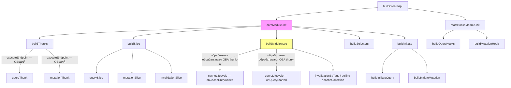

## Архитектура RTK Query (Mermaid)

**Обозначения**: `coreModule` (розовый) — единственный оркестратор. `buildMiddleware` (жёлтый) — место, где хуки жизненного цикла совместно используются для query/mutation через унифицированные матчеры действий.

## Таблица соответствий

| Концепция RTK Query | Эквивалент в rx-toolkit | Примечания |
|---|---|---|
| `executeEndpoint` (общий payload thunk-а) | `ResourceCacheEntry._doFetch` / `CommandCacheEntry.initiate` | RTK использует одну общую функцию; rx-toolkit имеет **две отдельные** реализации |
| `querySlice` (reducer) | Конечный автомат `Resource` (Pending→Success→Refreshing→Error) | rx-toolkit использует автоматы на основе классов, а не Redux-слайсы |
| `mutationSlice` (reducer) | Конечный автомат `Command` (Idle→Loading→Success→Error) | Различные наборы состояний (Idle vs Pending) |
| `QueryCache` (сериализованный ключ → состояние) | `CacheMap` (стратегия serialize или compare) | rx-toolkit поддерживает ключи на основе сравнения; RTK — только сериализация |
| `buildMiddleware` (6 обработчиков) | **Нет эквивалента** | rx-toolkit встраивает логику жизненного цикла непосредственно в классы CacheEntry |
| `coreModule.init` (оркестратор) | **Нет эквивалента** | Это архитектурный пробел — отсутствует единый конвейер сборки |
| `onQueryStarted` | `onQueryStarted` (и Resource, и Command) | Та же концепция; rx-toolkit вызывает из `_doFetch`/`initiate` инлайново, RTK — через middleware |
| `onCacheEntryAdded` | `onCacheEntryAdded` (и Resource, и Command) | Та же концепция; rx-toolkit вызывает из конструктора, RTK — через middleware по pending-действию |
| `buildInitiate` | `Resource.query()` / `CommandAgent.trigger()` | RTK оборачивает dispatch; rx-toolkit вызывает напрямую |
| `buildSelectors` | Основанные на сигналах `machine$` / `ResourceAgent` | Нет фабрики селекторов — сигналы являются реактивным примитивом |
| `reactHooksModule` | `useResource()` / `useCommand()` | Хуки rx-toolkit написаны вручную, а не генерируются для каждого эндпоинта |

## Ключевой вывод

`coreModule` + `buildMiddleware` в RTK — ближайший аналог того, что означает «извлечение ядра» для rx-toolkit. В RTK:

1. **`coreModule.init`** последовательно вызывает `buildThunks` → `buildSlice` → `buildMiddleware` → `buildSelectors` → `buildInitiate`, связывая всё воедино.
2. **`buildMiddleware`** — это место, где логика жизненного цикла query/mutation **действительно является общей** — единый обработчик матчит действия как `queryThunk`, так и `mutationThunk` через `isPending(queryThunk, mutationThunk)`.

В rx-toolkit **нет слоя middleware** и **нет центрального оркестратора**. Логика жизненного цикла (`_doFetch`, `_fireCacheEntryAdded`, `complete()`) дублируется в `ResourceCacheEntry` и `CommandCacheEntry` — именно тот код, который должно унифицировать извлечение ядра.

Паттерн не переносится напрямую: совместное использование в RTK основано на конвейере Redux «action → middleware → reducer». Совместное использование в rx-toolkit должно происходить на уровне классов/миксинов, поскольку используются прямые вызовы методов и сигналы, а не диспатч действий.

## Источники

- [RTK Query `core/module.ts`](https://github.com/reduxjs/redux-toolkit/blob/master/packages/toolkit/src/query/core/module.ts) — оркестратор coreModule
- [RTK Query `core/buildThunks.ts`](https://github.com/reduxjs/redux-toolkit/blob/master/packages/toolkit/src/query/core/buildThunks.ts) — общий `executeEndpoint`
- [RTK Query `core/buildMiddleware/`](https://github.com/reduxjs/redux-toolkit/tree/master/packages/toolkit/src/query/core/buildMiddleware) — обработчики жизненного цикла
- [Внутренняя документация RTK Query](https://github.com/reduxjs/redux-toolkit/blob/master/docs/rtk-query/internal/overview.mdx) — обзор архитектуры
- Исходный код rx-toolkit: `src/query/core/resource/ResourceCacheEntry.ts`, `src/query/core/command/CommandCacheEntry.ts`
