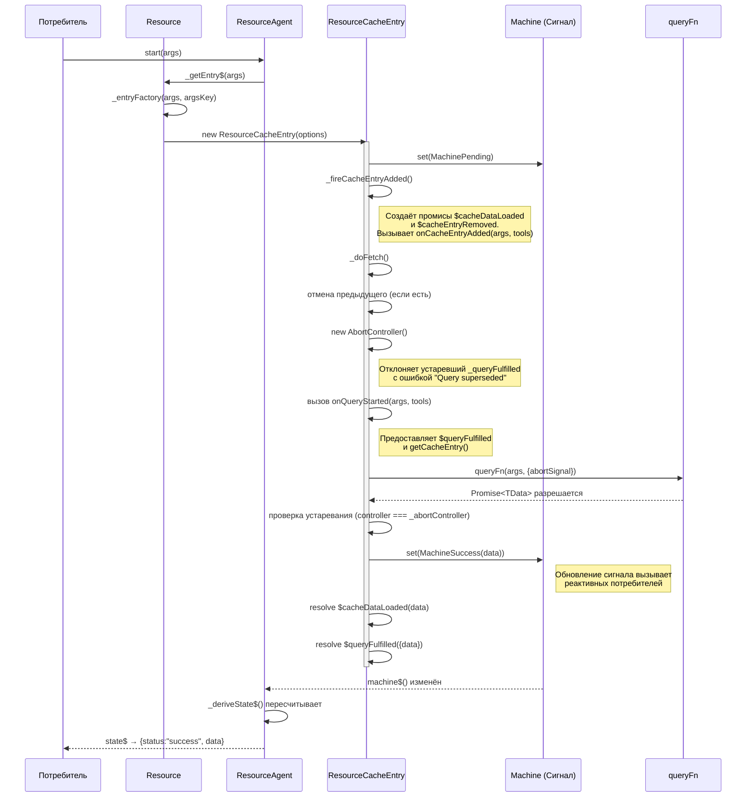
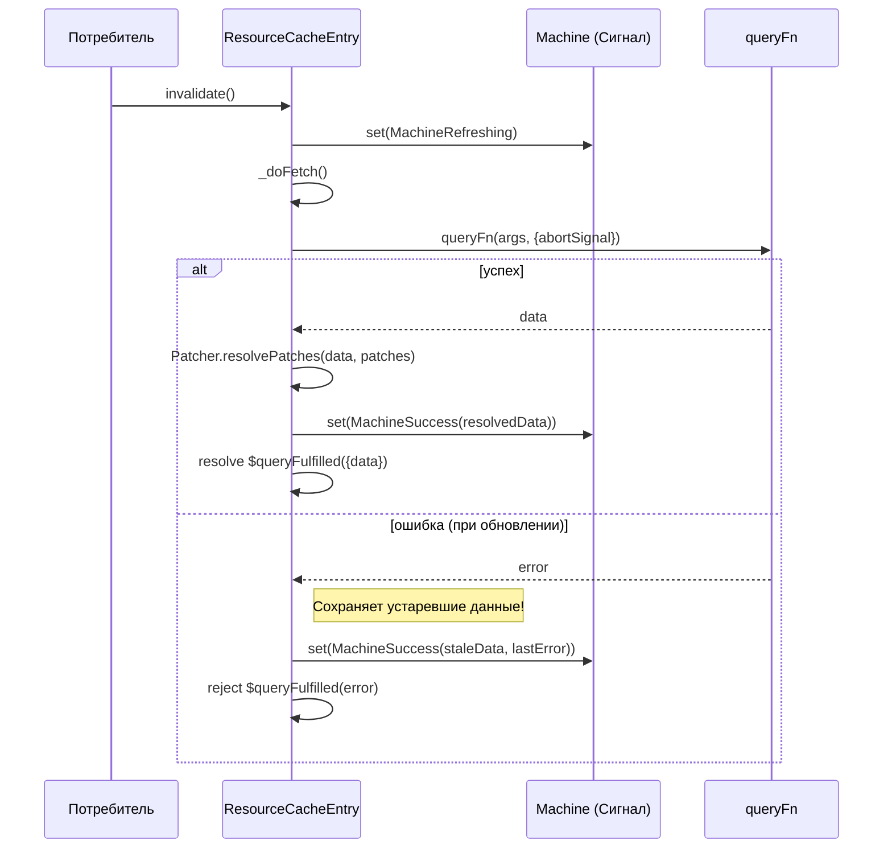
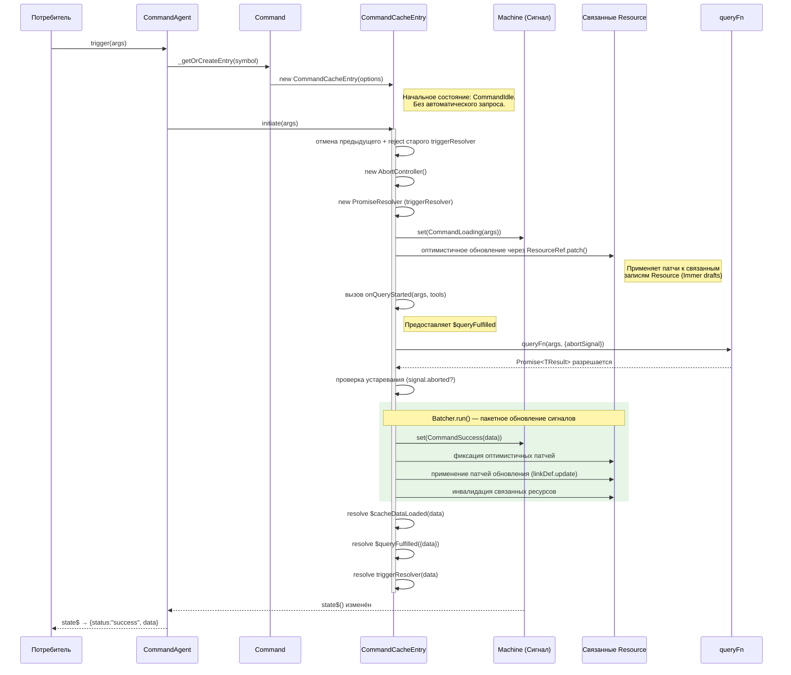
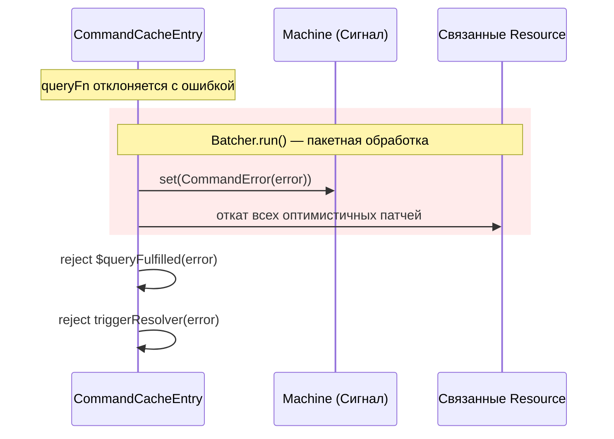

## 1. Жизненный цикл запроса Resource

Диаграмма показывает успешный путь запроса (fetch), инициируемого при создании записи (auto-fetch в конструкторе), включая хуки жизненного цикла и обновления сигналов.

### Подпроцесс инвалидации / обновления Resource

---

## 2. Жизненный цикл выполнения Command

Диаграмма показывает поток вызова, включая эффекты связанных Resource (оптимистичные обновления, пост-мутационные патчи, инвалидация).

### Подпроцесс ошибки Command

---

## 3. Сравнение бок о бок

```mermaid
sequenceDiagram
    participant RS as Поток Resource
    participant CS as Поток Command

    Note over RS,CS: ── ИДЕНТИЧНЫЕ ШАГИ ──

    rect rgb(220, 240, 255)
        Note over RS: отмена предыдущего _abortController
        Note over CS: отмена предыдущего _abortController
    end

    rect rgb(220, 240, 255)
        Note over RS: new AbortController()
        Note over CS: new AbortController()
    end

    rect rgb(220, 240, 255)
        Note over RS: _fireCacheEntryAdded()
        Note over CS: _fireCacheEntryAdded()
    end

    rect rgb(220, 240, 255)
        Note over RS: reject устаревшего _queryFulfilled
        Note over CS: reject устаревшего _queryFulfilled
    end

    rect rgb(220, 240, 255)
        Note over RS: вызов onQueryStarted(args, tools)
        Note over CS: вызов onQueryStarted(args, tools)
    end

    rect rgb(220, 240, 255)
        Note over RS: queryFn(args, {abortSignal})
        Note over CS: queryFn(args, {abortSignal})
    end

    rect rgb(220, 240, 255)
        Note over RS: проверка устаревания после async
        Note over CS: проверка устаревания после async
    end

    rect rgb(220, 240, 255)
        Note over RS: resolve $cacheDataLoaded
        Note over CS: resolve $cacheDataLoaded
    end

    rect rgb(220, 240, 255)
        Note over RS: resolve $queryFulfilled
        Note over CS: resolve $queryFulfilled
    end

    rect rgb(220, 240, 255)
        Note over RS: complete() → отмена + 3× очистка resolver-ов + super
        Note over CS: complete() → отмена + 3× очистка resolver-ов + super
    end

    Note over RS,CS: ── ПОХОЖИЕ (тот же паттерн, разные детали) ──

    rect rgb(255, 248, 220)
        Note over RS: Machine: Pending → Success/Error
        Note over CS: Machine: Idle → Loading → Success/Error
    end

    rect rgb(255, 248, 220)
        Note over RS: onCacheEntryAdded(args, tools)
        Note over CS: onCacheEntryAdded(tools) — без args
    end

    rect rgb(255, 248, 220)
        Note over RS: _inflightPromise для дедупликации
        Note over CS: _triggerResolver для промиса вызывающей стороны
    end

    Note over RS,CS: ── РАЗЛИЧАЮЩИЕСЯ ШАГИ ──

    rect rgb(255, 230, 230)
        Note over RS: Автозапрос в конструкторе
        Note over CS: Запуск по требованию через initiate()
    end

    rect rgb(255, 230, 230)
        Note over RS: Собственный Patcher (resolvePatches)
        Note over CS: Делегирует патчи связанным Resource
    end

    rect rgb(255, 230, 230)
        Note over RS: Refreshing сохраняет устаревшие данные
        Note over CS: Нет концепции refresh — повторный trigger = новый Loading
    end

    rect rgb(255, 230, 230)
        Note over RS: Нет эффектов связанных ресурсов
        Note over CS: Batcher.run оборачивает commit + update + invalidate на связях
    end

    rect rgb(255, 230, 230)
        Note over RS: SWR через ResourceAgent._previous$
        Note over CS: Нет SWR — CommandAgent привязан 1:1 к записи
    end

    rect rgb(255, 230, 230)
        Note over RS: Поддержка гидратации (SSR-снимок)
        Note over CS: Нет гидратации
    end
```

---

## 4. Сводная таблица

| Шаг | Resource | Command | Классификация |
|---|---|---|---|
| Управление AbortController | `_doFetch():195-209` | `initiate():50-65` | **Идентично** |
| `_fireCacheEntryAdded()` | `:169-191` | `:253-268` | **Похоже** (Resource передаёт `args`) |
| Вызов `onQueryStarted` | `_doFetch():218-230` | `initiate():98-113` | **Похоже** (Resource имеет `getCacheEntry`) |
| `queryFn(args, {abortSignal})` | `_doFetch():236` | `initiate():115` | **Идентично** |
| Проверка устаревания | `controller === _abortController` | `controller.signal.aborted` | **Похоже** (тот же смысл) |
| Resolve `$cacheDataLoaded` | `_doFetch():272-275` | `initiate():189-192` | **Идентично** |
| Resolve `$queryFulfilled` | `_doFetch():278-281` | `initiate():195-198` | **Идентично** |
| Очистка `complete()` | `:136-167` | `:233-258` | **Похоже** (Resource очищает `_patchState`, Command очищает `_triggerResolver`) |
| Переход Machine (успех) | `set(MachineSuccess)` | `Batcher.run → set(CommandSuccess)` | **Различается** (Command пакетирует с эффектами связей) |
| Оптимистичное обновление (своих данных) | `Patcher.resolvePatches` на себе | Н/Д — патчит связанные Resource | **Различается** |
| Эффекты связанных ресурсов | Н/Д | `commit + update + invalidate` в Batcher | **Только Command** |
| Refresh / SWR | `MachineRefreshing` + `_previous$` | Не поддерживается | **Только Resource** |
| Автозапрос в конструкторе | Да (если не гидратирован) | Нет — `CommandIdle` в состоянии покоя | **Различается** |
