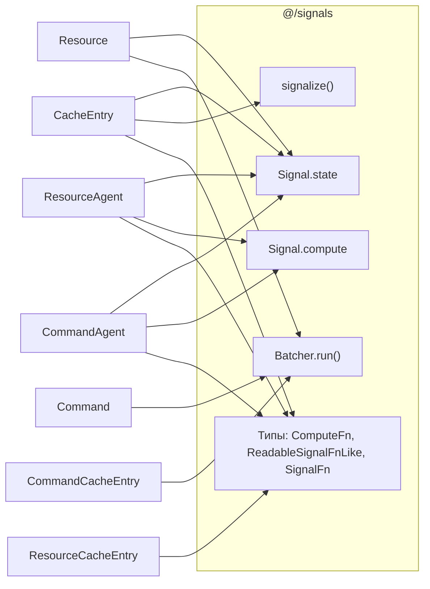

# Приложение D — Анализ связанности с сигналами

## Сигнальные примитивы, используемые ядром Query

| Примитив | Файлы | Строки | Назначение |
|---|---|---|---|
| `Signal.state()` | CacheEntry, Resource (×2), ResourceAgent, CommandAgent | `:28`, `:32,:36`, `:22`, `:75` | Записываемая реактивная ячейка — хранит мутабельное состояние (состояние кэша, последняя запись, статус, отслеживание, текущая запись) |
| `Signal.compute()` | ResourceAgent (×2), CommandAgent | `:36,:72`, `:83` | Вычисляемая реактивная ячейка — вычисляет `state$` и `current$` на основе отслеживающих сигналов |
| `signalize()` | CacheEntry | `:46` | Преобразует RxJS `Observable` → `ReadableSignalFnLike` для синхронного чтения через `.peek()` |
| `Batcher.run()` | Resource, Command, CommandCacheEntry (×3) | `:108`, `:25`, `:118,:148,:206` | Атомарная группировка — объединяет несколько вызовов `Signal.state.set()` в один цикл уведомлений |

**Примечание об асимметрии:** `Batcher.run` обладает уникальной связанностью — он управляет *семантикой порядка обновлений*, а не просто чтением. Его абстрагирование потребовало бы воспроизведения контракта группировки.

**Связанность на уровне типов:** `ComputeFn`, `ReadableSignalFnLike`, `SignalFn`, `SignalOptions` проникают в публичный API `@/query/types/` (`agent.types.ts:1`, `command.types.ts:1`, `resource.types.ts:2`).

## Диаграмма зависимостей

## Гипотетическое разделение связей

Чтобы сделать ядро query независимым от сигналов, потребуется ~4 интерфейса:

| Интерфейс | Заменяет | Сигнатура |
|---|---|---|
| `WritableCell<T>` | `Signal.state` | `{ (): T; peek(): T; set(v: T): void; obs: Observable<T> }` |
| `ComputedCell<T>` | `Signal.compute` | `{ (): T; peek(): T; obs: Observable<T> }` |
| `signalize<T>` | `signalize` | `(obs: Observable<T>) => ReadableCell<T>` |
| `batch` | `Batcher.run` | `(fn: () => void) => void` |

**Стоит ли это делать? Нет.** Сигналы — это ключевая функциональность rx-toolkit; библиотека *спроектирована* вокруг них. Разделение связей добавит уровень косвенности без реального потребителя: никто не будет использовать query без сигналов. Это преждевременная абстракция.

## Влияние на извлечение (Подход D)

Подход D извлекает **утилитарные функции** — `createCacheMap`, `createLifetimeHooks`, `PromiseResolver`, вспомогательные функции сравнения. Эти утилиты работают с простыми объектами, RxJS-наблюдаемыми и колбэками. **Ни одна из них не импортирует и не ссылается на какой-либо сигнальный примитив.** Связанность с сигналами полностью сосредоточена на уровне классов (`CacheEntry`, `Resource`, `Command`, агенты).

Это означает, что извлечение по Подходу D **по умолчанию независимо от сигналов** — без слоя адаптеров, без подгонки интерфейсов, без нарушения реактивного контракта. Это структурное преимущество перед Подходами A–C, каждый из которых потребовал бы переноса зависимостей от сигналов в совместно используемый пакет.
