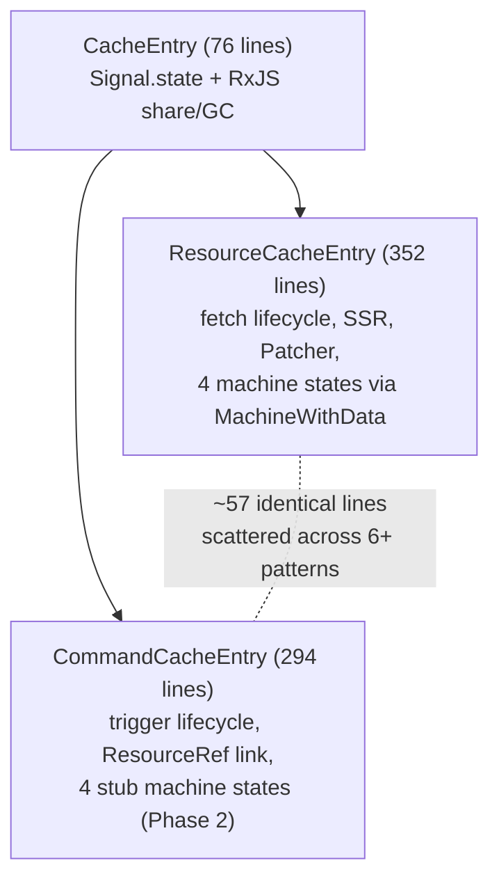

# Executive Summary

## Problem Statement

`ResourceCacheEntry` (352 lines) and `CommandCacheEntry` (294 lines) both extend `CacheEntry` (76 lines) and implement parallel lifecycle mechanics: abort management, `PromiseResolver`-based hooks (`onCacheEntryAdded`, `onQueryStarted`), and cleanup in `complete()`. This creates **57 lines of literally identical code**, fragmented across 6+ patterns with the largest contiguous block at only 13 lines.

## Key Findings

**Duplication is smaller and more fragmented than initially estimated.** Earlier analyses cited ~78 shared lines; line-by-line verification reduced this to **57 literally identical + 6 structurally similar** lines. The duplication is distributed as small 4–5 line resolver blocks (`if/reject/null` patterns) interleaved with domain-specific code — not a single extractable region.

**Command machines are intentionally simpler.** All four Command machine classes carry "Phase 2 stub" comments but are functionally complete for one-shot mutation semantics. They lack `MachineWithData` inheritance, refreshing state, SSR hydration, and `Patcher` integration — features that are semantically irrelevant for Commands. No 3rd entity type appears anywhere in source, docs, or changelog.

**OSS consensus: keep query and mutation separate.** TanStack Query, Apollo, SWR, and urql all maintain independent lifecycles for queries and mutations. No library shares state machines between the two. The one exception — **RTK Query** — shares ~90% of its runtime through a single `executeEndpoint` payload creator and shared `onQueryStarted`/`onCacheEntryAdded` callbacks. RTK Query is the most architecturally relevant comparison since rx-toolkit's lifecycle API was modelled after it.

## Approaches Evaluated

Four extraction strategies were analysed against the corrected duplication baseline:

| Approach | Mechanism | Real savings | Risk |
|----------|-----------|-------------|------|
| A. Enrich `CacheEntry` | Move abort + resolvers into existing base | ~38 lines | SRP violation — generic reactive container gains fetch-specific concepts |
| B. `FetchableCacheEntry` middle class | 3-level hierarchy | Overstated (claims 65 lines, real duplication is 57) | Over-engineering for 2 consumers; protected-field coupling; bug vector in `_abortInflight` |
| C. `FetchEngine` composition | Delegate fetch lifecycle to separate class | ~30–35 lines into 75-line class — net LOC increase | Wiring boilerplate replaces duplication 1:1 |
| **D. Utility functions** | Standalone `cleanupLifecycleResolvers()` + `createLifecycleTools()` | ~19 lines eliminated, ~15 LOC added | **Zero structural change, zero risk** |

## Bottom Line

The duplication is real but modest (~9% of combined class LOC) and fragmented. Approaches A–C introduce structural complexity — new class hierarchies, protected-field coupling, or composition wiring — that rivals or exceeds the duplication they eliminate. **Utility functions (Approach D) are the simplest effective option**: ~15 lines of pure functions, no hierarchy changes, independently testable, consistent with how TanStack Query and RTK Query handle shared helpers.

Extensibility to a hypothetical 3rd entity type is not a proven need and should not drive the extraction strategy.
