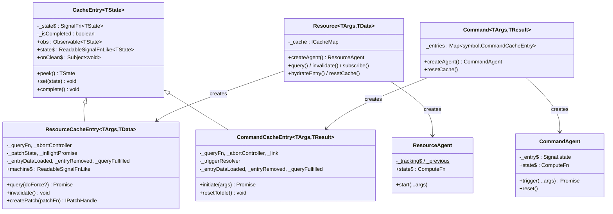

## Summary

The query module uses a two-entity model (Resource for reads, Command for writes) built on a shared `CacheEntry` base, two disjoint state-machine hierarchies, and a signals/RxJS reactive layer. Significant structural duplication exists between the entities despite differing semantics.

## Class Hierarchy

## CacheEntry Base vs Subclasses

**CacheEntry** (`@/src/query/core/CacheEntry.ts`, 74 LOC) provides:
- `Signal.state<TState>` as the single reactive cell
- RxJS `share({ resetOnRefCountZero: () => timer(lifetime) })` for subscriber-count GC
- `signalize(obs)` bridge from RxJS → signal read
- `onClean$` Subject for GC notification; `peek()` / `set()` / `complete()`

**Both subclasses independently add** (duplicated):
- `_abortController` + identical abort/create/null cycle (~12 lines each)
- Three `PromiseResolver` fields (`_entryDataLoaded`, `_entryRemoved`, `_queryFulfilled`) + identical cleanup in `complete()` (~15 lines each)
- `_fireCacheEntryAdded()` — structurally identical resolver/callback setup

**ResourceCacheEntry** (`@/src/query/core/Resource/ResourceCacheEntry.ts`, ~290 LOC) adds: self-owned fetch lifecycle (`_doFetch`), args comparison, optimistic patching via `Patcher`, inflight dedup (`_inflightPromise`), `invalidate()`, hydration support.

**CommandCacheEntry** (`@/src/query/core/command/CommandCacheEntry.ts`, ~280 LOC) adds: imperative `initiate(args)` per-trigger, linked Resource effects via `ResourceRef` (optimistic + update + invalidate), `_triggerResolver` for external promise, `resetToIdle()`.

## Resource Architecture

- **Lifecycle**: Constructor → auto-`_doFetch` → Pending → Success/Error; re-fetch via `query(force)` or `invalidate()` → Refreshing → Success.
- **Caching**: `CacheMap` (serialize or compare strategy) keys entries by args. One `ResourceCacheEntry` per unique args. GC via RxJS ref-count timer (`default 60s`).
- **State machine**: 4 immutable states (`MachinePending → MachineSuccess ↔ MachineRefreshing`, `→ MachineError`). `MachineWithData` abstract base provides patch methods for Success and Refreshing. Files at `@/src/query/core/machines/`.
- **Agent**: `ResourceAgent` tracks current + previous entry for SWR semantics; `state$` is a `Signal.compute` deriving `TResourceAgentState`.

## Command Architecture

- **Lifecycle**: Idle until `trigger()` → Loading → Success/Error. Re-trigger aborts previous, starts new Loading. No auto-fetch.
- **Caching**: `Map<symbol, CommandCacheEntry>` — one entry per agent (keyed by symbol, not args). Default `cacheLifetime: 0` (immediate GC).
- **State machine**: 4 standalone classes (`CommandIdle → CommandLoading → CommandSuccess/CommandError`). No shared base, no built-in patching. Files at `@/src/query/core/machines/Command*.ts`.
- **Agent**: `CommandAgent` holds a single `_entry$` signal; `trigger()` delegates to entry's `initiate(args)` and returns a `Promise<TResult>`.

## Shared Infrastructure

| Component | Location | Role |
|---|---|---|
| `CacheEntry` | `@/src/query/core/CacheEntry.ts` | Signal+RxJS reactive container, GC via share timer |
| `CacheMap` | `@/src/query/core/CacheMap/` | Strategy-based (`serialize`/`compare`) args→entry storage |
| `Signal.state` / `Signal.compute` | `@/src/signals/` | Reactive primitives — used in CacheEntry, Resource, agents |
| `Batcher` | `@/src/signals/base/Batcher.ts` | Transaction batching, defers effect re-runs until outermost call |
| `signalize` | `@/src/signals/operators/signalize.ts` | Observable→Signal bridge |
| `PromiseResolver` | `@/src/common/utils/PromiseResolver.ts` | Externally resolve/reject promises for lifecycle hooks |
| `Patcher` | `@/src/query/core/machines/Patcher.ts` | Immer-based optimistic update engine |
| `IPlugin` | `@/src/query/types/plugin.types.ts` | `install()`, `augmentResource()`, `augmentCommand()` |
| `ReactHooksPlugin` | `@/src/query/plugins/ReactHooksPlugin.ts` | Sole plugin: binds `useResourceAgent`/`useCommandAgent` to instances |
| `useSignal` | `@/src/signals/react/useSignal.ts` | `useSyncExternalStore` bridge for signal→React |

## Key Asymmetries

| Aspect | Resource | Command |
|---|---|---|
| **Batcher usage** | Only in `resetCache()`; fetch transitions rely on per-`State.set` micro-batches | Explicit `Batcher.run()` in success, sync-error, and async-error paths of `initiate()` |
| **Stale-check** | `this._abortController !== controller` (identity) | `controller.signal.aborted` (signal flag) |
| **Stale-check behavior** | Returns/throws value to caller | Swallows silently (new trigger owns the promise) |
| **Optimistic patches** | Self-owned via `MachineWithData` + `Patcher` | Delegates to linked `ResourceCacheEntry.createPatch()` via `ResourceRef` |
| **Devtools** | `_beforeDevtoolsPush` hook, `_key` for snapshot labeling | No devtools hooks |
| **Hydration/Snapshot** | `hydrateEntry()`, `Machine.fromSnapshot()`, `Snapshot.ts` | Not supported |
| **SKIP_TOKEN** | Supported in `getEntry$` / agent `start()` | Not supported |
| **Machine hierarchy** | `MachineWithData` abstract base with patch methods | Standalone classes, no shared base |
| **Cache key** | Args-based (serialize or compare) | Symbol-based (per agent) |
| **Lifecycle callback args** | `onCacheEntryAdded(args, tools)` | `onCacheEntryAdded(tools)` — no args |
