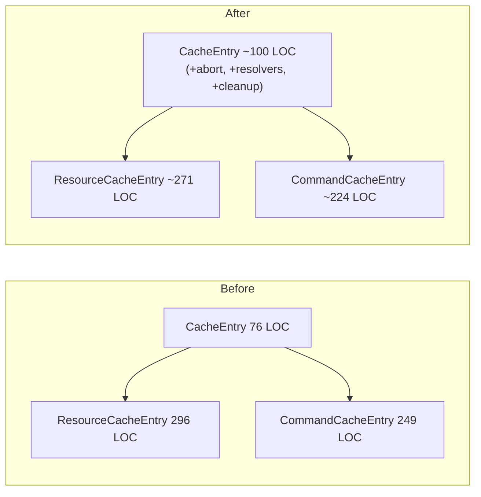
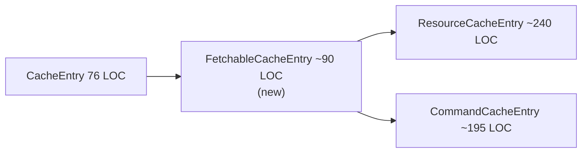
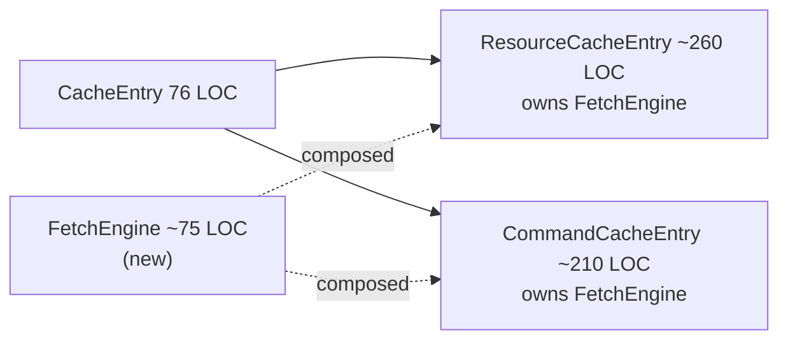
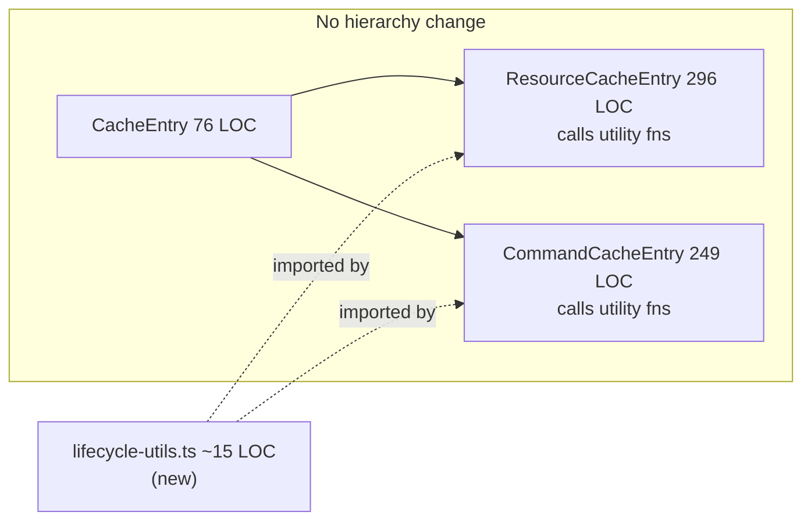

## Baseline

57 identical + 6 structurally similar lines across `ResourceCacheEntry` (296 LOC) and `CommandCacheEntry` (249 LOC). All classes are internal — not exported through `src/query/index.ts`. [ref: 03-duplication-analysis.md#Summary] [ref: ../tmp/public-api-audit.md#4]

Key constraints: Command machines are Phase 2 stubs (may grow) [ref: ../tmp/phase2-stubs.md#5], Batcher usage is asymmetric (Command uses it, Resource does not) [ref: ../tmp/critical-analysis-2.md#5.2], stale-check patterns diverge semantically [ref: ../tmp/duplication-verification.md#Category 6].

---

## Approach A: Enrich CacheEntry

Push shared fields and cleanup into the existing `CacheEntry` base class. No new files.

**What moves:** `_abortController` field + `_abortInflight()` helper, 3 PromiseResolver fields, resolver cleanup block in `complete()`, resolver setup helper `_setupLifecycleResolvers()`.

**What stays in subclasses:** callback invocations (divergent signatures), `_onQueryStarted` tools (different shapes), Resource-only `_inflightPromise`/`_patchState` cleanup, Command-only `_triggerResolver` cleanup, all fetch logic.



| Metric | Value |
|--------|-------|
| LOC extracted (deduplicated) | ~25 |
| LOC added (to CacheEntry) | ~24 |
| Net LOC change | ~−26 |
| Risk level | Low |
| Public API impact | None |
| Testability | Protected fields — must test via concrete subclass |
| Batcher asymmetry | Unaffected — stays in subclasses |
| Stale-check divergence | Unaffected — stays in subclasses |
| Phase 2 compatibility | High — base gains only infrastructure, not behavior |

**Pros:** Zero new files. Preserves 2-level hierarchy. Lowest migration effort — move fields, adjust visibility. Tests refactor-safe (behavior-based, no `instanceof` checks). [ref: ../tmp/extraction-approaches.md#Approach A Pros]

**Cons:** CacheEntry grows ~30% and gains fetch-specific concerns (SRP weakened). Only ~25 of 57 identical lines eliminated. Protected members allow subclass mutation of base lifecycle state. A future non-fetch CacheEntry consumer inherits dead weight. [ref: ../tmp/critical-analysis-2.md#3 Approach A]

---

## Approach B: FetchableCacheEntry Intermediate

New abstract class between `CacheEntry` and both consumers. Owns all abort + resolver infrastructure.

**What moves:** All fields from Approach A plus `_resetQueryFulfilled()`, `_resolveEntryDataLoaded()`, `_resolveQueryFulfilled()`, `_rejectQueryFulfilled()` as protected helpers. Full `complete()` resolver cleanup.



| Metric | Value |
|--------|-------|
| LOC extracted (deduplicated) | ~35–40 |
| LOC added (new class + wrappers) | ~90 + ~40 test |
| Net LOC change | ~+10 |
| Risk level | Medium |
| Public API impact | None |
| Testability | Protected — same limitation as A |
| Batcher asymmetry | Unaffected — subclasses own state transitions |
| Stale-check divergence | `_abortInflight()` nulls controller, **breaks Resource identity check** if called before stale check [ref: ../tmp/critical-analysis-2.md#5.3] |
| Phase 2 compatibility | Medium — Command expansion may need FetchableCacheEntry refactor |

**Pros:** Maximum dedup of shared patterns. CacheEntry stays clean. Clear 3-tier responsibility (container → fetch infra → entity). Extensibility for hypothetical 3rd entity type.

**Cons:** 3-level hierarchy for 2 consumers is over-engineering for ~35 real lines. [ref: ../tmp/critical-analysis-2.md#3 Approach B] Wrapper methods (`_resolveEntryDataLoaded(data)` vs `this._entryDataLoaded.resolve(data)`) add no clarity — 1-line wrappers for 1-line calls. Dual generic `<TState, TData>` has no precedent in codebase. Net LOC *increases*. The "83% extraction" figure from the original analysis was based on inflated 78-line baseline — actual extraction rate is ~35/57 ≈ 61%. [ref: ../tmp/critical-analysis-2.md#2]

---

## Approach C: Composition (FetchEngine)

Standalone `FetchEngine<TData>` object owned by each subclass via composition. No hierarchy change.

**What moves:** Abort management + resolver fields + cleanup + lifecycle tools creation into `FetchEngine`. Subclasses call `this._engine.method()` instead of `this._field.action()`.



| Metric | Value |
|--------|-------|
| LOC extracted (deduplicated) | ~30 |
| LOC added (new class + wiring + test) | ~75 + ~50 test |
| Net LOC change | ~+35 |
| Risk level | Medium |
| Public API impact | None |
| Testability | **Best** — FetchEngine is independently unit-testable |
| Batcher asymmetry | Unaffected |
| Stale-check divergence | `.controller` getter exposes AbortController — both patterns work |
| Phase 2 compatibility | High — Engine is orthogonal to machine changes |

**Pros:** CacheEntry untouched. 2-level hierarchy preserved. FetchEngine independently testable (no framework deps). Composition-over-inheritance.

**Cons:** Wiring boilerplate replaces duplication nearly 1:1 (`this._engine.resolveDataLoaded(data)` vs `this._entryDataLoaded.resolve(data)`). [ref: ../tmp/critical-analysis-2.md#3 Approach C] Net LOC *increases* by ~35. Indirection without simplification — method forwarding adds a navigation hop. `_onQueryStarted` fire pattern still duplicated (~10 lines each).

---

## Approach D: Utility Functions (No Structural Change)

Extract two standalone functions. Zero hierarchy or composition changes. [ref: ../tmp/critical-analysis-2.md#4]

**What moves:** Only the clearly mechanical patterns — resolver cleanup and resolver creation — into pure functions.

```typescript
// ~15 LOC total
function cleanupLifecycleResolvers(resolvers: {
    entryDataLoaded: PromiseResolver | null;
    entryRemoved: PromiseResolver | null;
    queryFulfilled: PromiseResolver | null;
}): void { /* reject entryDataLoaded, resolve entryRemoved, reject queryFulfilled, null all */ }

function createLifecycleTools<T>(
    entryDataLoaded: PromiseResolver<T>,
    entryRemoved: PromiseResolver<void>,
): { $cacheDataLoaded: Promise<T>; $cacheEntryRemoved: Promise<void> } { /* return promise props */ }
```



| Metric | Value |
|--------|-------|
| LOC extracted (deduplicated) | ~19 (9-line cleanup + 10-line tools setup) |
| LOC added | ~15 (utility file) |
| Net LOC change | ~−23 |
| Risk level | **Minimal** |
| Public API impact | None |
| Testability | **Best** — pure functions, trivial to test |
| Batcher asymmetry | Unaffected — no structural coupling |
| Stale-check divergence | Unaffected — not touched |
| Phase 2 compatibility | **Highest** — zero coupling to class shapes |

**Pros:** Follows RTK Query pattern — shared `onQueryStarted` handler is a standalone function, not a class method. [ref: ../tmp/rtk-query-deep-dive.md#2] [ref: 04-oss-comparison.md] Zero structural risk. Phase 2 Command expansion cannot break it. Independently testable pure functions. Addresses the most clearly identical blocks (complete() cleanup = 13 identical lines, lifecycle resolver setup = 8 identical lines). Smallest possible diff for code review.

**Cons:** Only eliminates ~19/57 identical lines (33%). Leaves abort management, `_onQueryStarted` fire pattern, and success/error resolver blocks duplicated. Does not improve architecture or extensibility. The remaining ~38 identical lines stay as-is.

---

## Summary Comparison

| Criterion | A: Enrich Base | B: Intermediate | C: Composition | D: Utility Fns |
|-----------|---------------|----------------|----------------|----------------|
| Identical lines removed | ~25/57 | ~35/57 | ~30/57 | ~19/57 |
| New files | 0 | 2 | 2 | 1 |
| Net LOC delta | −26 | +10 | +35 | −23 |
| Hierarchy depth | 2 (same) | 3 (+1) | 2 (same) | 2 (same) |
| CacheEntry SRP | Weakened | Preserved | Preserved | Preserved |
| Risk level | Low | Medium | Medium | **Minimal** |
| Isolated testability | No | No | Yes | **Yes** |
| Phase 2 safe | High | Medium | High | **Highest** |
| Batcher-safe | Yes | Yes | Yes | Yes |
| Stale-check safe | Yes | **Bug vector** | Yes | Yes |
| OSS pattern match | Partial | Low | Partial | **High (RTK)** |
