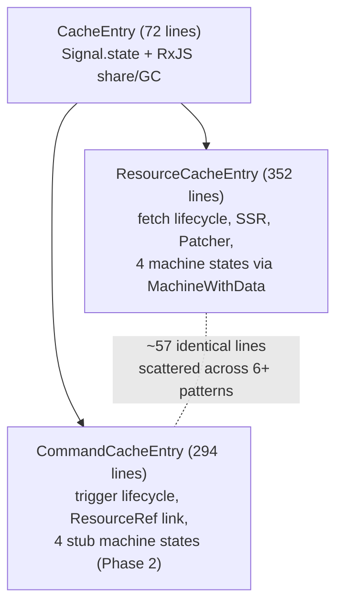
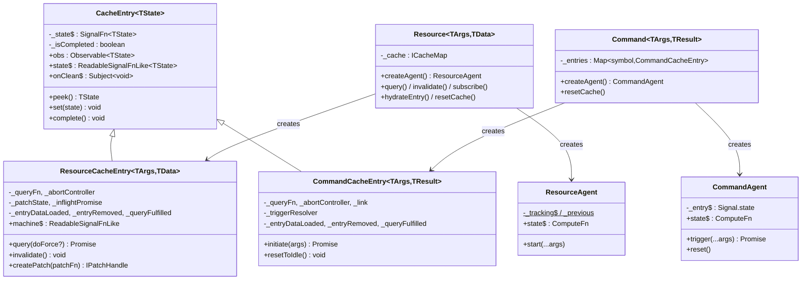
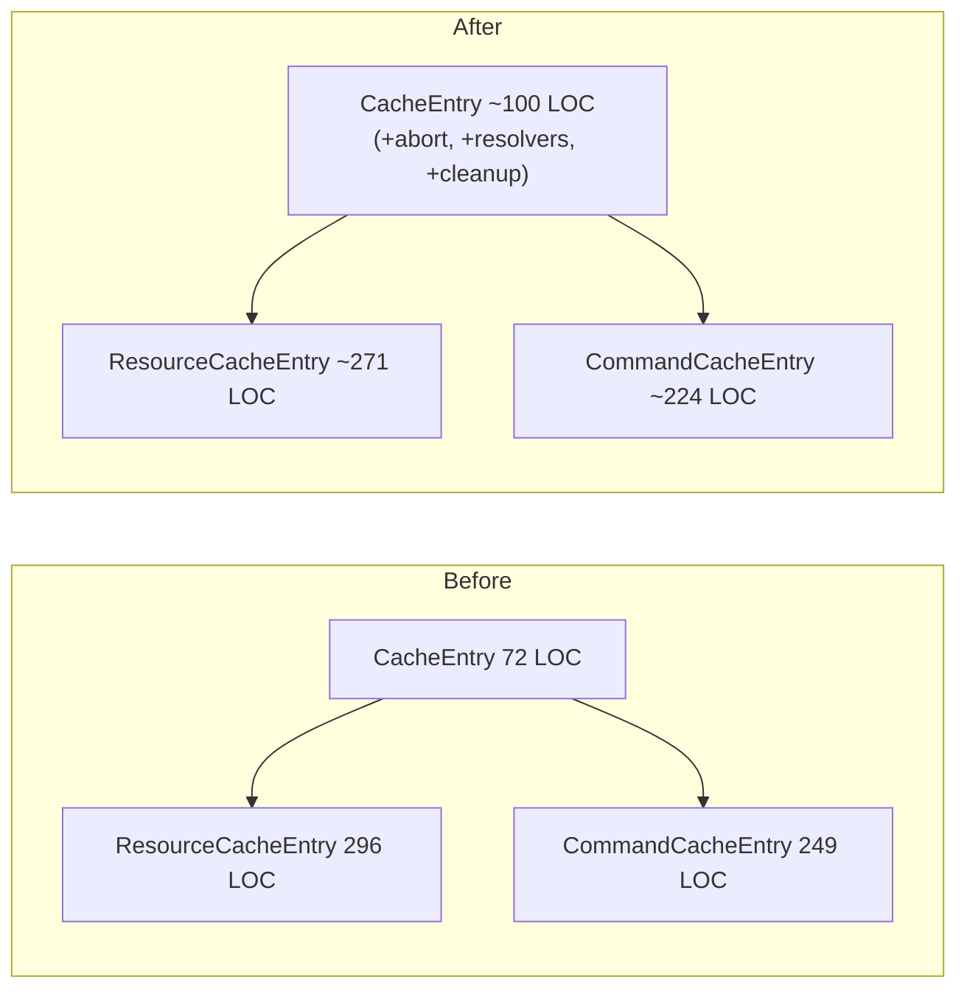
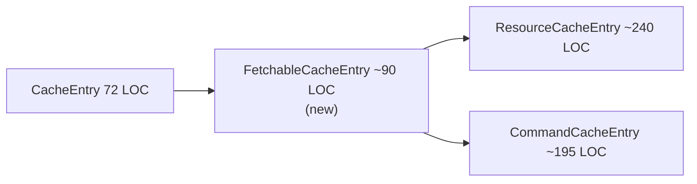
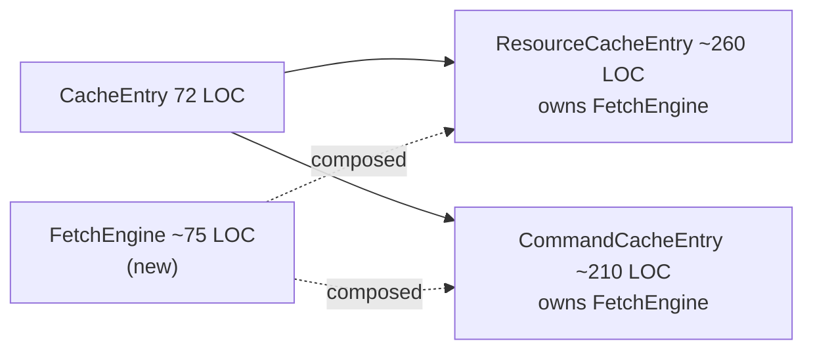
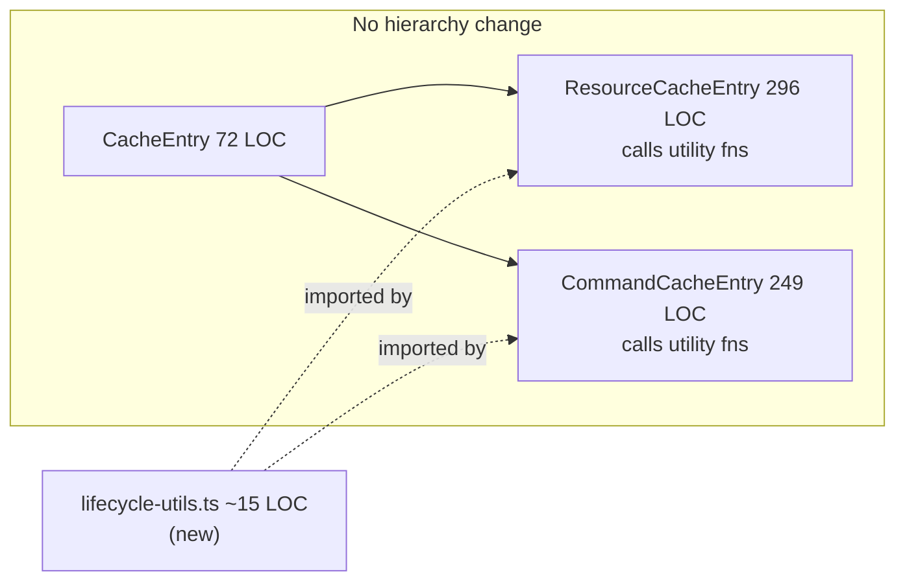

# Query Core Extraction: Reusing Resource Core in Commands

## Table of Contents

1. [Executive Summary](#1-executive-summary)
2. [Current Architecture](#2-current-architecture)
3. [Duplication Analysis](#3-duplication-analysis)
4. [OSS Comparison](#4-oss-comparison)
5. [Extraction Approaches](#5-extraction-approaches)
6. [Recommendation](#6-recommendation)
7. [Appendices](#appendices)

> **Quality Review:** See [REVIEW.md](./REVIEW.md) for checklist results and issues found.

> **Metrics note:** "Total lines" (e.g., 352/294 in §1) = full file length including imports, whitespace, and comments. "LOC" (e.g., 296/249 in §3–§6) = non-blank, non-comment lines (class body). The analysis sections use LOC as the primary metric.

---

## 1. Executive Summary

### Problem Statement

`ResourceCacheEntry` (352 lines) and `CommandCacheEntry` (294 lines) both extend `CacheEntry` (72 lines) and implement parallel lifecycle mechanics: abort management, `PromiseResolver`-based hooks (`onCacheEntryAdded`, `onQueryStarted`), and cleanup in `complete()`. This creates **57 lines of literally identical code**, fragmented across 6+ patterns with the largest contiguous block at only 13 lines.



### Key Findings

**Duplication is smaller and more fragmented than initially estimated.** Earlier analyses cited ~78 shared lines; line-by-line verification reduced this to **57 literally identical + 6 structurally similar** lines (see [§3 Duplication Analysis](#3-duplication-analysis)). The duplication is distributed as small 4–5 line resolver blocks (`if/reject/null` patterns) interleaved with domain-specific code — not a single extractable region.

**Command machines are intentionally simpler.** All four Command machine classes carry "Phase 2 stub" comments but are functionally complete for one-shot mutation semantics. They lack `MachineWithData` inheritance, refreshing state, SSR hydration, and `Patcher` integration — features that are semantically irrelevant for Commands. No 3rd entity type appears anywhere in source, docs, or changelog.

**OSS consensus: keep query and mutation separate.** TanStack Query, Apollo, SWR, and urql all maintain independent lifecycles for queries and mutations. No library shares state machines between the two. The one exception — **RTK Query** — shares ~90% of its runtime through a single `executeEndpoint` payload creator and shared `onQueryStarted`/`onCacheEntryAdded` callbacks. RTK Query is the most architecturally relevant comparison since rx-toolkit's lifecycle API was modelled after it. See [§4 OSS Comparison](#4-oss-comparison).

### Approaches Evaluated

Four extraction strategies were analysed against the corrected duplication baseline. Numbers from [§5 Extraction Approaches](#5-extraction-approaches):

| Approach | Mechanism | Lines deduplicated | Net LOC delta | Risk |
|----------|-----------|-------------------|---------------|------|
| A. Enrich `CacheEntry` | Move abort + resolvers into existing base | ~25/57 | −26 | SRP violation — generic reactive container gains fetch-specific concepts |
| B. `FetchableCacheEntry` middle class | 3-level hierarchy | ~35/57 | +10 | Over-engineering for 2 consumers; bug vector in `_abortInflight` |
| C. `FetchEngine` composition | Delegate fetch lifecycle to separate class | ~30/57 | +35 | Wiring boilerplate replaces duplication 1:1 |
| **D. Utility functions** | Standalone `cleanupLifecycleResolvers()` + `createLifecycleTools()` | ~19/57 | −23 | **Zero structural change, zero risk** |

### Bottom Line

The duplication is real but modest (~10.5% of combined 545 LOC) and fragmented. Approaches A–C introduce structural complexity — new class hierarchies, protected-field coupling, or composition wiring — that rivals or exceeds the duplication they eliminate. **Utility functions (Approach D) are the simplest effective option**: ~15 lines of pure functions, no hierarchy changes, independently testable, consistent with how TanStack Query and RTK Query handle shared helpers.

Extensibility to a hypothetical 3rd entity type is not a proven need and should not drive the extraction strategy.

---

## 2. Current Architecture

### Summary

The query module uses a two-entity model (Resource for reads, Command for writes) built on a shared `CacheEntry` base, two disjoint state-machine hierarchies, and a signals/RxJS reactive layer. Significant structural duplication exists between the entities despite differing semantics.

### Class Hierarchy



### CacheEntry Base vs Subclasses

**CacheEntry** (`@/src/query/core/CacheEntry.ts`, 72 lines / 61 LOC) provides:
- `Signal.state<TState>` as the single reactive cell
- RxJS `share({ resetOnRefCountZero: () => timer(lifetime) })` for subscriber-count GC
- `signalize(obs)` bridge from RxJS → signal read
- `onClean$` Subject for GC notification; `peek()` / `set()` / `complete()`

**Both subclasses independently add** (duplicated — see [§3](#3-duplication-analysis) for precise inventory):
- `_abortController` + identical abort/create/null cycle (~12 lines each)
- Three `PromiseResolver` fields (`_entryDataLoaded`, `_entryRemoved`, `_queryFulfilled`) + identical cleanup in `complete()` (~15 lines each)
- `_fireCacheEntryAdded()` — structurally identical resolver/callback setup

**ResourceCacheEntry** (`@/src/query/core/resource/ResourceCacheEntry.ts`, 296 LOC) adds: self-owned fetch lifecycle (`_doFetch`), args comparison, optimistic patching via `Patcher`, inflight dedup (`_inflightPromise`), `invalidate()`, hydration support.

**CommandCacheEntry** (`@/src/query/core/command/CommandCacheEntry.ts`, 249 LOC) adds: imperative `initiate(args)` per-trigger, linked Resource effects via `ResourceRef` (optimistic + update + invalidate), `_triggerResolver` for external promise, `resetToIdle()`.

### Resource Architecture

- **Lifecycle**: Constructor → auto-`_doFetch` → Pending → Success/Error; re-fetch via `query(force)` or `invalidate()` → Refreshing → Success.
- **Caching**: `CacheMap` (serialize or compare strategy) keys entries by args. One `ResourceCacheEntry` per unique args. GC via RxJS ref-count timer (default 60s).
- **State machine**: 4 immutable states (`MachinePending → MachineSuccess ↔ MachineRefreshing`, `→ MachineError`). `MachineWithData` abstract base provides patch methods for Success and Refreshing. Files at `@/src/query/core/machines/`.
- **Agent**: `ResourceAgent` tracks current + previous entry for SWR semantics; `state$` is a `Signal.compute` deriving `TResourceAgentState`.

### Command Architecture

- **Lifecycle**: Idle until `trigger()` → Loading → Success/Error. Re-trigger aborts previous, starts new Loading. No auto-fetch.
- **Caching**: `Map<symbol, CommandCacheEntry>` — one entry per agent (keyed by symbol, not args). Default `cacheLifetime: 0` (immediate GC).
- **State machine**: 4 standalone classes (`CommandIdle → CommandLoading → CommandSuccess/CommandError`). No shared base, no built-in patching. Files at `@/src/query/core/machines/Command*.ts`.
- **Agent**: `CommandAgent` holds a single `_entry$` signal; `trigger()` delegates to entry's `initiate(args)` and returns a `Promise<TResult>`.

### Shared Infrastructure

| Component | Location | Role |
|---|---|---|
| `CacheEntry` | `@/src/query/core/CacheEntry.ts` | Signal+RxJS reactive container, GC via share timer |
| `CacheMap` | `@/src/query/core/CacheMap/` | Strategy-based (`serialize`/`compare`) args→entry storage |
| `Signal.state` / `Signal.compute` | `@/src/signals/` | Reactive primitives — used in CacheEntry, Resource, agents |
| `Batcher` | `@/src/signals/base/Batcher.ts` | Transaction batching, defers effect re-runs until outermost call |
| `signalize` | `@/src/signals/operators/signalize.ts` | Observable→Signal bridge |
| `PromiseResolver` | `@/src/common/utils/PromiseResolver.ts` | Externally resolve/reject promises for lifecycle hooks |
| `Patcher` | `@/src/query/core/machines/Patcher.ts` | Immer-based optimistic update engine |
| `IPlugin` | `@/src/query/types/plugin.types.ts` | `install()`, `augmentResource()`, `augmentCommand()` |
| `ReactHooksPlugin` | `@/src/query/plugins/ReactHooksPlugin.ts` | Sole plugin: binds `useResourceAgent`/`useCommandAgent` to instances |
| `useSignal` | `@/src/signals/react/useSignal.ts` | `useSyncExternalStore` bridge for signal→React |

### Key Asymmetries

| Aspect | Resource | Command |
|---|---|---|
| **Batcher usage** | Only in `resetCache()`; fetch transitions rely on per-`State.set` micro-batches | Explicit `Batcher.run()` in success, sync-error, and async-error paths of `initiate()` |
| **Stale-check** | `this._abortController !== controller` (identity) | `controller.signal.aborted` (signal flag) |
| **Stale-check behavior** | Returns/throws value to caller | Swallows silently (new trigger owns the promise) |
| **Optimistic patches** | Self-owned via `MachineWithData` + `Patcher` | Delegates to linked `ResourceCacheEntry.createPatch()` via `ResourceRef` |
| **Devtools** | `_beforeDevtoolsPush` hook, `_key` for snapshot labeling | No devtools hooks |
| **Hydration/Snapshot** | `hydrateEntry()`, `Machine.fromSnapshot()`, `Snapshot.ts` | Not supported |
| **SKIP_TOKEN** | Supported in `getEntry$` / agent `start()` | Not supported |
| **Machine hierarchy** | `MachineWithData` abstract base with patch methods | Standalone classes, no shared base |
| **Cache key** | Args-based (serialize or compare) | Symbol-based (per agent) |
| **Lifecycle callback args** | `onCacheEntryAdded(args, tools)` | `onCacheEntryAdded(tools)` — no args |

---

## 3. Duplication Analysis

### Summary

57 lines of literally identical code exist across `ResourceCacheEntry` (296 LOC) and `CommandCacheEntry` (249 LOC). The duplication is **fragmented** — spread across 6 pattern categories with no contiguous block exceeding 13 lines. Most blocks are 3–5 line `PromiseResolver` guard-resolve/reject-null sequences.

### Duplication Inventory

| # | Pattern | Resource Location | Command Location | Lines | Class |
|---|---------|-------------------|------------------|------:|-------|
| 1 | `_abortController` field decl | `:48` | `:27` | 1 | IDENTICAL |
| 2 | `_entryRemoved` field decl | `:54` | `:31` | 1 | IDENTICAL |
| 3 | Abort teardown in `complete()` | `:147–150` | `:251–254` | 4 | IDENTICAL |
| 4 | `_entryDataLoaded` reject in `complete()` | `:155–158` | `:261–264` | 4 | IDENTICAL |
| 5 | `_entryRemoved` resolve in `complete()` | `:159–162` | `:265–268` | 4 | IDENTICAL |
| 6 | `_queryFulfilled` reject in `complete()` | `:163–166` | `:269–272` | 4 | IDENTICAL |
| 7 | `super.complete()` call | `:169` | `:274` | 1 | IDENTICAL |
| 8 | `_fireCacheEntryAdded` signature+guard+resolvers+tools+try/catch | `:172–187` | `:277–292` | 8 | IDENTICAL |
| 9 | `_queryFulfilled` reject "superseded" | `:210–213` | `:92–95` | 4 | IDENTICAL |
| 10 | `_onQueryStarted` guard+prop+try/catch | `:216–229` | `:98–110` | 5 | IDENTICAL |
| 11 | Abort prev controller | `:199–201` | `:50–52` | 3 | IDENTICAL |
| 12 | Create new AbortController | `:206–207` | `:61–62` | 2 | IDENTICAL |
| 13 | `_entryDataLoaded` resolve on success | `:272–275` | `:183–186` | 4 | IDENTICAL |
| 14 | `_queryFulfilled` resolve on success | `:278–281` | `:189–192` | 4 | IDENTICAL |
| 15 | `_queryFulfilled` reject on error | `:309–312` | `:220–223` | 4 | IDENTICAL |
| 16 | `_queryFulfilled` reject on sync error | `:238–241` | `:131–134` | 4 | IDENTICAL |
| | | | **Total IDENTICAL** | **57** | |
| 17 | 4 field decls (type param differs) | `:51–53,55` | `:28–30,32` | 4 | SIMILAR |
| 18 | `_entryDataLoaded` creation | `:175` | `:280` | 1 | SIMILAR |
| 19 | `_queryFulfilled` creation | `:217` | `:99` | 1 | SIMILAR |
| | | | **Total SIMILAR** | **6** | |

### What Is NOT Duplication

Code often miscounted as shared but exclusive to one side:

| Code | Owner | Lines | Why it's unique |
|------|-------|------:|-----------------|
| Hydration check in `_fireCacheEntryAdded` | Resource `:189–194` | 6 | Command has no SSR hydration; no counterpart exists |
| `_inflightPromise = null` in `complete()` | Resource `:151` | 1 | Command uses `_triggerResolver` instead |
| `_patchState = null` in `complete()` | Resource `:152` | 1 | Command patches linked Resources, not self |
| `_triggerResolver` reject in `complete()` | Command `:256–259` | 4 | Resource deduplicates via `_inflightPromise` |
| `getCacheEntry` in onQueryStarted tools | Resource `:221` | 1 | Command tools object has no equivalent property |
| Stale check mechanism | Both | — | DIFFERENT: identity (`!== controller`) vs signal (`.aborted`) |

### Extractability Assessment

| Metric | Value |
|--------|-------|
| Total identical lines | 57 |
| Largest contiguous block | **13 lines** — resolver chain in `complete()` (patterns #4–7) |
| Blocks ≤ 5 lines | 12 of 16 patterns |
| Blocks of exactly 4 lines | 9 patterns (all `PromiseResolver` guard-action-null) |
| Percentage of combined LOC (545) | 10.5% |

**Fragmentation profile**: the 57 lines break into **16 discrete blocks** averaging 3.6 lines each. Only `complete()` cleanup offers a coherent 13-line extraction target. The remaining 44 lines are scattered across `_fireCacheEntryAdded`, `_onQueryStarted`, abort setup, and 4 separate success/error handlers.

**Practical implication**: a shared base class or mixin must expose ~6 small protected helpers to cover these fragments. The per-helper savings is 3–5 lines, making the abstraction cost (new class/mixin + wiring) comparable to the duplication cost.

### Parallel Lifecycle Visualization

```
ResourceCacheEntry._doFetch()              CommandCacheEntry.initiate()
═══════════════════════════                ═══════════════════════════
│                                          │
├─ abort prev controller ──────────────── ├─ abort prev controller        [3 lines identical]
├─ _inflightPromise?.catch ← UNIQUE       ├─ reject _triggerResolver ← UNIQUE
├─ create new AbortController ─────────── ├─ create new AbortController   [2 lines identical]
│                                          │
├─ reject _queryFulfilled "superseded" ── ├─ reject _queryFulfilled       [4 lines identical]
├─ fire _onQueryStarted ─────────────────  ├─ fire _onQueryStarted        [5 lines identical]
│  └─ tools: {$queryFulfilled,             │  └─ tools: {$queryFulfilled}
│             getCacheEntry} ← UNIQUE      │
│                                          ├─ machine → Loading ← UNIQUE (inline)
│                                          ├─ apply optimistic patches ← UNIQUE (linked Resources)
│                                          │
├─ await queryFn(args, {abortSignal}) ──── ├─ await queryFn(args, {abortSignal})
│                                          │
│  ┌─ ON SUCCESS ─────────────────────┐    │  ┌─ ON SUCCESS ─────────────────────┐
│  │ stale check: ctrl !== this._ac   │    │  │ stale check: signal.aborted      │  ← DIFFERENT
│  │ resolve _entryDataLoaded ───────────── │ resolve _entryDataLoaded           │  [4 lines identical]
│  │ resolve _queryFulfilled ───────────── │ resolve _queryFulfilled            │  [4 lines identical]
│  │ machine → Success                │    │  │ machine → CommandSuccess          │
│  │ _updateMachineData ← UNIQUE      │    │  │ update linked Resources ← UNIQUE │
│  └──────────────────────────────────┘    │  └──────────────────────────────────┘
│                                          │
│  ┌─ ON ERROR ───────────────────────┐    │  ┌─ ON ERROR ───────────────────────┐
│  │ stale check: ctrl !== this._ac   │    │  │ stale check: signal.aborted      │  ← DIFFERENT
│  │ reject _queryFulfilled ─────────────── │ reject _queryFulfilled            │  [4 lines identical]
│  │ machine → Error / Success+err    │    │  │ machine → CommandError            │
│  └──────────────────────────────────┘    │  │ revert optimistic patches ← UNIQUE│
                                           │  └──────────────────────────────────┘

complete() — called on cache eviction
═══════════════════════════════════════
├─ abort controller ──────────────────── ├─ abort controller               [4 lines identical]
├─ _inflightPromise = null ← UNIQUE      ├─ reject _triggerResolver ← UNIQUE
├─ _patchState = null      ← UNIQUE      │
├─ reject _entryDataLoaded ────────────── ├─ reject _entryDataLoaded       [4 lines identical]
├─ resolve _entryRemoved ─────────────── ├─ resolve _entryRemoved         [4 lines identical]
├─ reject _queryFulfilled ────────────── ├─ reject _queryFulfilled        [4 lines identical]
├─ super.complete() ──────────────────── ├─ super.complete()              [1 line  identical]
```

**Legend**: `────────` = identical code on both sides; `← UNIQUE` = exists only on that side.

---

## 4. OSS Comparison

### Comparison Matrix

| Dimension | TanStack Query v5 | RTK Query | Apollo Client | SWR v2 | urql | rx-toolkit |
|---|---|---|---|---|---|---|
| **Shared base** | `Subscribable` + `Removable` (~65 LOC) | `CommonEndpointDefinition` + single `executeEndpoint` (~90% shared runtime) | Monolithic `QueryManager` (~1850 LOC, no separation) | `_internal` core: `Cache`, `internalMutate`, `serialize` | `Operation` with `kind` tag, single `executeRequestOperation` | `CacheEntry` base (~72 LOC), separate hierarchies |
| **Machines** | Inline reducers per entity, **not shared** | Separate Redux slices, shared `QueryStatus` enum | `ObservableQuery` (~1700 LOC) vs inline Promise (~180 LOC) | No machine — flat `{ data, error }` objects | No machine — `OperationResult` is flat data | Immutable class hierarchies (4+4), **not shared** |
| **Cache** | Two separate: `QueryCache` (Map) + `MutationCache` (Set) | Single reducer, separate sub-slices (`queries` + `mutations` + `provided`) | Single `InMemoryCache`, shared optimistic layers | Single flat `Map<string, State>`, shared key space | Per-exchange; `cacheExchange` stores queries, invalidates on mutation | Separate `CacheMap` per Resource; `Map` per Command |
| **Lifecycle sharing** | Separate: auto-fetch + stale timers vs idle-until-mutate | **Shared**: `onQueryStarted` + `onCacheEntryAdded` for both, single middleware pipeline | Separate: `ObservableQuery` vs one-shot Promise; shared `broadcastQueries()` | Separate hooks; `internalMutate` is shared write path | Same `Client` dispatch, divergent dedup + teardown | Separate but parallel: both have `onQueryStarted` + `onCacheEntryAdded` (~57 LOC dup) |
| **Plugin / extension** | No plugin system; framework adapters wrap observers | `buildCreateApi(...modules)` — composable module system | `ApolloLink` chain + `typePolicies` | `use: [...middlewares]` array | Exchange pipeline (`ExchangeIO` functions) | `IPlugin` with `augmentResource` + `augmentCommand` |
| **React binding** | `useSyncExternalStore` wrapping core observers | `useSelector` + generated per-endpoint hooks | `ObservableQuery` → `useQuery` wrapper | `useSyncExternalStore` + dependency tracking | Wonka streams → hooks | Signals + `useSyncExternalStore` |

### Per-Library Profiles

**TanStack Query v5.** Two tiny base classes (`Subscribable` for pub/sub, `Removable` for GC) — everything else is independent: entity classes, observers, caches, reducers, result types. Closest to rx-toolkit's current structure where query and mutation share only a minimal reactive container. Key insight: *deliberate duplication* between `QueryObserver` (745 LOC) and `MutationObserver` (227 LOC) — no shared observer base despite structural similarity. **Confidence: High.**

**RTK Query.** Deepest sharing in the ecosystem: single `executeEndpoint` payload creator handles both query and mutation thunks (~90% shared code); `onQueryStarted` and `onCacheEntryAdded` lifecycle callbacks run through a single middleware handler that matches both thunk types via `isPending(queryThunk, mutationThunk)`. Separation happens at the slice level (separate reducers, selectors, hooks) and in cache key strategy (args-hash vs requestId). rx-toolkit's lifecycle API was modeled on RTK Query's, making it the most architecturally relevant reference. **Confidence: High.**

**Apollo Client.** No query/mutation separation at the core — monolithic `QueryManager` (~1850 LOC) handles everything. The real asymmetry is at the result level: `ObservableQuery` (rich, long-lived, ~1700 LOC) vs inline mutation Promise (fire-and-forget, ~180 LOC). Single `InMemoryCache` with shared optimistic layers. Key insight: monolithic approach works but makes tree-shaking impossible and mutation code is ~10% of query infrastructure weight. **Confidence: High.**

**SWR v2.** Mutation is literally a middleware wrapping the query hook (`useSWRMutation = withMiddleware(useSWR, mutation)`). Shared: flat key-value `Cache`, `internalMutate` for writes, `serialize` for keys. But mutation maintains its own state via `useStateWithDeps`, separate from the query cache subscription. Key insight: shared write path, separate read behavior. **Confidence: High.**

**urql.** Stream-based unification via exchanges: every request becomes an `Operation` with explicit `kind` tag (`query`/`mutation`/`subscription`), dispatched through `executeRequestOperation`. Exchanges filter by `operation.kind` — so operations share the pipeline but diverge immediately. Key insight: kind-tagged dispatch is clean, but per-exchange filtering recreates the separation. **Confidence: High.**

### Two Reference Models

#### 1. TanStack Query — Minimal Shared Base

Shares only ~65 lines of infrastructure. Entity hierarchies, observers, caches, and state machines are fully independent. This validates rx-toolkit's current `CacheEntry` approach (~72 LOC shared) — the scale of sharing is comparable. TanStack proves that keeping query/mutation separate works at scale (20k+ GitHub stars, adopted across 4 framework adapters). The cost is structural duplication (~50% of observer logic is parallel), accepted as a tradeoff for simplicity.

#### 2. RTK Query — Deep Lifecycle Sharing

Shares ~90% of the execution runtime via `executeEndpoint`, plus unified lifecycle middleware for `onQueryStarted`/`onCacheEntryAdded`. This is directly relevant because rx-toolkit copied RTK Query's lifecycle API design. RTK Query proves that deeper sharing of lifecycle plumbing is viable and well-tested in production. The separation boundary is at reducers, selectors, and hooks — not at the execution or lifecycle layer.

### Ecosystem Consensus (Corrected)

The ecosystem does NOT converge on a single answer. Two viable patterns coexist:

1. **Minimal base** (TanStack, urql, SWR): share only the thinnest infrastructure (pub/sub, GC, cache primitives). Keep machines, fetch logic, and lifecycle separate. Optimizes for simplicity and independence.

2. **Shared execution + lifecycle** (RTK Query): share the fetch executor and lifecycle hook machinery; separate at the state/selector/hook layer. Optimizes for consistency and reduces lifecycle duplication.

**Universal agreement**: no library shares state machines between queries and mutations. Status enums may overlap, but reducer logic always diverges (auto-fetch + stale tracking vs fire-and-forget + idle state).

### Lessons for rx-toolkit

| Source | Lesson | Applicability |
|---|---|---|
| TanStack | ~65 LOC shared base is sufficient; don't over-abstract observers/machines | Validates current `CacheEntry` size; confirms machines should stay separate |
| RTK Query | Lifecycle middleware can be unified for both entity types without merging state logic | Directly applicable — rx-toolkit already has parallel `onQueryStarted`/`onCacheEntryAdded`; shared lifecycle helpers are proven viable |
| RTK Query | `executeEndpoint` branches on entity type at runtime — works for ~90% shared code | Consider for shared fetch orchestration if duplication grows beyond current ~57 lines |
| Apollo | Monolithic approach creates tree-shaking and maintainability debt | Confirms: avoid merging Resource + Command into a single class |
| SWR | Pure utility functions (`internalMutate`, `serialize`) are the lightest sharing mechanism | Supports utility-function approach for lifecycle cleanup (~15 LOC, zero structural change) |
| urql | Kind-tagged `Operation` model is clean but exchanges immediately filter — separation is still real | Don't expect a unified "operation" abstraction to eliminate per-type logic |

### Sources

- [TanStack/query — subscribable.ts, removable.ts, query.ts, mutation.ts](https://github.com/TanStack/query/tree/main/packages/query-core/src) — core architecture
- [RTK Query — buildThunks.ts, queryLifecycle.ts, cacheLifecycle.ts](https://github.com/reduxjs/redux-toolkit/tree/master/packages/toolkit/src/query/core) — shared execution + lifecycle
- [Apollo Client — QueryManager.ts, ObservableQuery.ts](https://github.com/apollographql/apollo-client/tree/main/src/core) — monolithic approach
- [SWR — _internal/, mutation/](https://github.com/vercel/swr/tree/main/src) — middleware-based sharing
- [urql — core/client.ts, exchanges/](https://github.com/urql-graphql/urql/tree/main/packages/core/src) — exchange pipeline

---

## 5. Extraction Approaches

### Baseline

57 identical + 6 structurally similar lines across `ResourceCacheEntry` (296 LOC) and `CommandCacheEntry` (249 LOC). All classes are internal — not exported through `src/query/index.ts`. See [§3 inventory](#duplication-inventory).

Key constraints: Command machines are Phase 2 stubs (may grow), Batcher usage is asymmetric (Command uses it, Resource does not), stale-check patterns diverge semantically (see [§2 Key Asymmetries](#key-asymmetries)).

---

### Approach 0: Do Nothing (Baseline)

Keep the current code as-is. No extraction, no new abstractions.

The 57 identical lines are spread across 2 files totaling 545 LOC (~10.5% combined, ~8% if measured as proportion of the two subclass files only). The duplication is fragmented into 16 small blocks averaging 3.6 lines each. Both files are internal (not exported via public API) and the duplicated patterns are stable — they have not diverged since initial implementation.

**Why this is a valid option:** The maintenance burden of 57 lines of duplicated-but-stable boilerplate is low. Both subclasses are maintained by the same developer(s), in the same directory, with the same review cycle. The patterns are mechanical (`if/reject/null` resolver guards) and unlikely to evolve independently. Any extraction approach must justify itself against this baseline — not against a theoretical ideal of zero duplication.

**Cost of doing nothing:** A future contributor unfamiliar with the codebase may modify one side without updating the other. The probability is low given the code is internal, but non-zero. No structural improvement toward extensibility.

All approaches below should be judged against this baseline.

---

### Approach A: Enrich CacheEntry

Push shared fields and cleanup into the existing `CacheEntry` base class. No new files.

**What moves:** `_abortController` field + `_abortInflight()` helper, 3 PromiseResolver fields, resolver cleanup block in `complete()`, resolver setup helper `_setupLifecycleResolvers()`.

**What stays in subclasses:** callback invocations (divergent signatures), `_onQueryStarted` tools (different shapes), Resource-only `_inflightPromise`/`_patchState` cleanup, Command-only `_triggerResolver` cleanup, all fetch logic.



| Metric | Value |
|--------|-------|
| LOC extracted (deduplicated) | ~25 |
| LOC added (to CacheEntry) | ~24 |
| Net LOC change | ~−26 |
| Risk level | Low |
| Public API impact | None |
| Testability | Protected fields — must test via concrete subclass |
| Batcher asymmetry | Unaffected — stays in subclasses |
| Stale-check divergence | Unaffected — stays in subclasses |
| Phase 2 compatibility | High — base gains only infrastructure, not behavior |

**Pros:** Zero new files. Preserves 2-level hierarchy. Lowest migration effort — move fields, adjust visibility. Tests refactor-safe (behavior-based, no `instanceof` checks).

**Cons:** CacheEntry grows ~30% and gains fetch-specific concerns (SRP weakened). CacheEntry is currently a generic reactive container (signal + RxJS share/GC); making it fetch-aware couples it to query semantics, violating SRP for any non-query consumer. Only ~25 of 57 identical lines eliminated. Protected members allow subclass mutation of base lifecycle state. A future non-fetch CacheEntry consumer inherits dead weight.

---

### Approach B: FetchableCacheEntry Intermediate

New abstract class between `CacheEntry` and both consumers. Owns all abort + resolver infrastructure.

**What moves:** All fields from Approach A plus `_resetQueryFulfilled()`, `_resolveEntryDataLoaded()`, `_resolveQueryFulfilled()`, `_rejectQueryFulfilled()` as protected helpers. Full `complete()` resolver cleanup.



| Metric | Value |
|--------|-------|
| LOC extracted (deduplicated) | ~35–40 |
| LOC added (new class + wrappers) | ~90 + ~40 test |
| Net LOC change | ~+10 |
| Risk level | Medium |
| Public API impact | None |
| Testability | Protected — same limitation as A |
| Batcher asymmetry | Unaffected — subclasses own state transitions |
| Stale-check divergence | `_abortInflight()` nulls controller, **breaks Resource identity check** if called before stale check |
| Phase 2 compatibility | Medium — Command expansion may need FetchableCacheEntry refactor |

**Pros:** Maximum dedup of shared patterns. CacheEntry stays clean. Clear 3-tier responsibility (container → fetch infra → entity). Extensibility for hypothetical 3rd entity type.

**Cons:** 3-level hierarchy for 2 consumers is over-engineering for ~35 real lines. Wrapper methods (`_resolveEntryDataLoaded(data)` vs `this._entryDataLoaded.resolve(data)`) add no clarity — 1-line wrappers for 1-line calls. Dual generic `<TState, TData>` has no precedent in codebase. Net LOC *increases*. The "83% extraction" figure from the original analysis was based on inflated 78-line baseline — actual extraction rate is ~35/57 ≈ 61%.

---

### Approach C: Composition (FetchEngine)

Standalone `FetchEngine<TData>` object owned by each subclass via composition. No hierarchy change.

**What moves:** Abort management + resolver fields + cleanup + lifecycle tools creation into `FetchEngine`. Subclasses call `this._engine.method()` instead of `this._field.action()`.



| Metric | Value |
|--------|-------|
| LOC extracted (deduplicated) | ~30 |
| LOC added (new class + wiring + test) | ~75 + ~50 test |
| Net LOC change | ~+35 |
| Risk level | Medium |
| Public API impact | None |
| Testability | **Best** — FetchEngine is independently unit-testable |
| Batcher asymmetry | Unaffected |
| Stale-check divergence | `.controller` getter exposes AbortController — both patterns work |
| Phase 2 compatibility | High — Engine is orthogonal to machine changes |

**Pros:** CacheEntry untouched. 2-level hierarchy preserved. FetchEngine independently testable (no framework deps). Composition-over-inheritance.

**Cons:** Wiring boilerplate replaces duplication nearly 1:1 (`this._engine.resolveDataLoaded(data)` vs `this._entryDataLoaded.resolve(data)`). Net LOC *increases* by ~35. Indirection without simplification — method forwarding adds a navigation hop. `_onQueryStarted` fire pattern still duplicated (~10 lines each).

---

### Approach D: Utility Functions (No Structural Change)

Extract two standalone functions. Zero hierarchy or composition changes.

**What moves:** Only the clearly mechanical patterns — resolver cleanup and resolver creation — into pure functions.

```typescript
// ~15 LOC total
function cleanupLifecycleResolvers(resolvers: {
    entryDataLoaded: PromiseResolver | null;
    entryRemoved: PromiseResolver | null;
    queryFulfilled: PromiseResolver | null;
}): void { /* reject entryDataLoaded, resolve entryRemoved, reject queryFulfilled, null all */ }

function createLifecycleTools<T>(
    entryDataLoaded: PromiseResolver<T>,
    entryRemoved: PromiseResolver<void>,
): { $cacheDataLoaded: Promise<T>; $cacheEntryRemoved: Promise<void> } { /* return promise props */ }
```



| Metric | Value |
|--------|-------|
| LOC extracted (deduplicated) | ~19 (9-line cleanup + 10-line tools setup) |
| LOC added | ~15 (utility file) |
| Net LOC change | ~−23 |
| Risk level | **Minimal** |
| Public API impact | None |
| Testability | **Best** — pure functions, trivial to test |
| Batcher asymmetry | Unaffected — no structural coupling |
| Stale-check divergence | Unaffected — not touched |
| Phase 2 compatibility | **Highest** — zero coupling to class shapes |

**Pros:** Follows RTK Query pattern — shared `onQueryStarted` handler is a standalone function, not a class method (see [§4 RTK Query profile](#per-library-profiles)). Zero structural risk. Phase 2 Command expansion cannot break it. Independently testable pure functions. Addresses the most clearly identical blocks (complete() cleanup = 13 identical lines, lifecycle resolver setup = 8 identical lines). Smallest possible diff for code review.

**Cons:** Only eliminates ~19/57 identical lines (33%). Leaves abort management, `_onQueryStarted` fire pattern, and success/error resolver blocks duplicated. Does not improve architecture or extensibility. The remaining ~38 identical lines stay as-is.

---

### Summary Comparison

| Criterion | A: Enrich Base | B: Intermediate | C: Composition | D: Utility Fns |
|-----------|---------------|----------------|----------------|----------------|
| Identical lines removed | ~25/57 | ~35/57 | ~30/57 | ~19/57 |
| New files | 0 | 2 | 2 | 1 |
| Net LOC delta | −26 | +10 | +35 | −23 |
| Hierarchy depth | 2 (same) | 3 (+1) | 2 (same) | 2 (same) |
| CacheEntry SRP | Weakened | Preserved | Preserved | Preserved |
| Risk level | Low | Medium | Medium | **Minimal** |
| Isolated testability | No | No | Yes | **Yes** |
| Phase 2 safe | High | Medium | High | **Highest** |
| Batcher-safe | Yes | Yes | Yes | Yes |
| Stale-check safe | Yes | **Bug vector** | Yes | Yes |
| OSS pattern match | Partial | Low | Partial | **High (RTK)** |

---

## 6. Recommendation

### Primary: Approach D — Utility Functions (Immediate)

Extract two standalone functions: `cleanupLifecycleResolvers()` and `createLifecycleTools()`. This eliminates ~19 of the 57 literally identical lines — the densest, most clearly duplicated blocks — with ~15 lines of new code and **zero structural changes**.

**Why this is the right call:**

- The verified duplication is 57 identical + 6 structurally similar lines across 545 combined LOC (~10.5%). Approaches A–C introduce class hierarchies, protected-field coupling, or composition wiring that rivals or exceeds the duplication they remove.
- Utility functions are the pattern used by TanStack Query (standalone helpers, no shared observer base) and RTK Query (shared `handleNewKey` function for `onCacheEntryAdded`). No library in the [§4 comparison matrix](#comparison-matrix) solves this with a middle class.
- Zero risk: pure functions, independently testable, no change to `CacheEntry`'s role as a generic reactive container.
- Backward compatibility: guaranteed. No public API changes, no type signature changes, no hierarchy changes.

**Estimated effort:** Minimal — one file, two functions, update two call sites, add unit tests.

### Secondary: Re-evaluate After Phase 2 Completion

All four Command machine classes carry "Phase 2 stub" comments. They are functionally complete for one-shot mutation semantics but structurally diverge from Resource machines (no `MachineWithData`, no refreshing state, no SSR). Extracting shared infrastructure against an unstable target means re-extracting when stubs mature.

**When to revisit:**
- After Command Phase 2 lands and machine structure stabilizes.
- If a concrete 3rd entity type (InfiniteQuery, Subscription) is planned, Approach A (enrich `CacheEntry` with abort + resolver fields) becomes justified.
- If Command machines gain heavy Resource similarity post-Phase 2, re-evaluate Approach B — but only then.

### What NOT to Do

| Anti-pattern | Reason |
|---|---|
| `FetchableCacheEntry` middle class (B) | 3-level hierarchy for 2 consumers of ~57 shared lines. Bug vector: `_abortInflight()` nulls controller, breaking Resource's identity-based stale check. |
| `FetchEngine` composition (C) | Wiring boilerplate replaces duplication 1:1. Net LOC increases. `resolveDataLoaded(data)` is no simpler than `this._entryDataLoaded.resolve(data)` — indirection without simplification. |
| Unify state machines | Zero libraries do this (see [§4 Ecosystem Consensus](#ecosystem-consensus-corrected)). The asymmetry is intentional: queries have staleness/refresh/SSR; mutations are one-shot. |

### Decision Matrix

| If... | Then... |
|---|---|
| Goal is DRY only | Approach D now — permanent solution |
| 3rd entity type is planned | Approach D now, Approach A after Phase 2 |
| Command machines mature with heavy Resource similarity | Approach D now, re-evaluate B post-Phase 2 |
| Never a 3rd entity type | Approach D is the permanent solution |

### RTK Query Lesson

RTK Query proves deeper sharing IS viable — a single `executeEndpoint` handles queries, mutations, and infinite queries with ~90% shared code. Its `onQueryStarted` and `onCacheEntryAdded` handlers are fully shared at runtime with type-level divergence only. rx-toolkit's lifecycle API was modelled after RTK Query's.

However, RTK Query has Redux as infrastructure — a single middleware pipeline dispatching through one store. rx-toolkit uses signals and per-instance RxJS streams. The architectural substrate is fundamentally different. **Adopt RTK's lifecycle helper pattern** (shared `handleNewKey`, shared promise setup), **not its monolithic middleware approach**.

### Open Questions for Project Owner

1. **Is a 3rd entity type planned?** (InfiniteQuery, Subscription, StreamResource) — this is the only scenario where Approach A's structural cost is justified.
2. **Should Command Phase 2 bring machine structure closer to Resource?** (`MachineWithData` base, `cloneWith`, refreshing state) — determines whether future extraction surface grows.
3. **Is DRY the primary goal or extensibility?** If DRY: Approach D is sufficient. If extensibility: wait for Phase 2 to reveal stable shared patterns.
4. **Should lifecycle APIs (`onCacheEntryAdded`, `onQueryStarted`) converge to a single type signature across Resource and Command?** Currently Resource passes `(args, tools)` while Command passes `(tools)` only — converging signatures would increase the shared surface but may not match semantic intent.
5. **What is the refactoring budget — zero-risk only, or willing to accept minor internal restructuring?** This determines whether Approach D (zero structural change) is the ceiling, or whether Approach A (base class enrichment) is on the table.

---

## Appendices

- [Appendix A: Code Snippets — Proposed Utility Functions](appendix-a-code-snippets.md)
- [Appendix B: RTK Query Structural Comparison](appendix-b-rtk-comparison.md)
- [Appendix C: Lifecycle Flow Diagrams](appendix-c-lifecycle-diagrams.md)
- [Appendix D: Signal Coupling Analysis](appendix-d-signal-coupling.md)

---

> **Note on line references:** All line numbers cited in this report (e.g., `:154–157`) are approximate and based on the source as of the research date. They may drift with future changes. Use them as starting points for verification, not absolute anchors.
