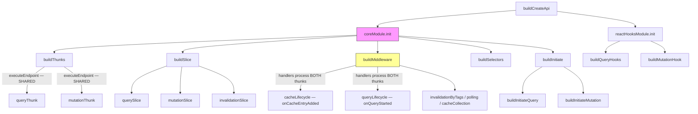

## RTK Query Architecture (Mermaid)

**Key**: `coreModule` (pink) is the single orchestrator. `buildMiddleware` (yellow) is where lifecycle hooks are shared across query/mutation via unified action matchers.

## Mapping Table

| RTK Query Concept | rx-toolkit Equivalent | Notes |
|---|---|---|
| `executeEndpoint` (shared thunk payload) | `ResourceCacheEntry._doFetch` / `CommandCacheEntry.initiate` | RTK shares one function; rx-toolkit has **two separate** implementations |
| `querySlice` (reducer) | `Resource` state machine (Pending→Success→Refreshing→Error) | rx-toolkit uses class-based machines, not Redux slices |
| `mutationSlice` (reducer) | `Command` state machine (Idle→Loading→Success→Error) | Different state sets (Idle vs Pending) |
| `QueryCache` (serialized key → state) | `CacheMap` (serialize or compare strategy) | rx-toolkit supports compare-based keys; RTK is serialize-only |
| `buildMiddleware` (6 handlers) | **No equivalent** | rx-toolkit embeds lifecycle logic directly in CacheEntry classes |
| `coreModule.init` (orchestrator) | **No equivalent** | This is the architectural gap — no single build pipeline |
| `onQueryStarted` | `onQueryStarted` (both Resource & Command) | Same concept; rx-toolkit fires from `_doFetch`/`initiate` inline, RTK via middleware |
| `onCacheEntryAdded` | `onCacheEntryAdded` (both Resource & Command) | Same concept; rx-toolkit fires from constructor, RTK via middleware on pending action |
| `buildInitiate` | `Resource.query()` / `CommandAgent.trigger()` | RTK wraps dispatch; rx-toolkit calls directly |
| `buildSelectors` | Signal-based `machine$` / `ResourceAgent` | No selector factory — signals are the reactive primitive |
| `reactHooksModule` | `useResource()` / `useCommand()` | rx-toolkit hooks are handwritten, not generated per-endpoint |

## Key Lesson

RTK's `coreModule` + `buildMiddleware` is the closest analogue to what "core extraction" means for rx-toolkit. In RTK:

1. **`coreModule.init`** calls `buildThunks` → `buildSlice` → `buildMiddleware` → `buildSelectors` → `buildInitiate` in sequence, wiring everything together.
2. **`buildMiddleware`** is where query/mutation lifecycle logic is **truly shared** — a single handler matches both `queryThunk` and `mutationThunk` actions via `isPending(queryThunk, mutationThunk)`.

rx-toolkit has **no middleware layer** and **no central orchestrator**. Lifecycle logic (`_doFetch`, `_fireCacheEntryAdded`, `complete()`) is duplicated across `ResourceCacheEntry` and `CommandCacheEntry` — the exact code that core extraction should unify.

The pattern doesn't transfer directly: RTK's sharing relies on Redux's action → middleware → reducer pipeline. rx-toolkit's sharing must happen at the class/mixin level since it uses direct method calls and signals, not dispatched actions.

## Sources

- [RTK Query `core/module.ts`](https://github.com/reduxjs/redux-toolkit/blob/master/packages/toolkit/src/query/core/module.ts) — coreModule orchestrator
- [RTK Query `core/buildThunks.ts`](https://github.com/reduxjs/redux-toolkit/blob/master/packages/toolkit/src/query/core/buildThunks.ts) — shared `executeEndpoint`
- [RTK Query `core/buildMiddleware/`](https://github.com/reduxjs/redux-toolkit/tree/master/packages/toolkit/src/query/core/buildMiddleware) — lifecycle handlers
- [RTK Query internal docs](https://github.com/reduxjs/redux-toolkit/blob/master/docs/rtk-query/internal/overview.mdx) — architecture overview
- rx-toolkit source: `src/query/core/resource/ResourceCacheEntry.ts`, `src/query/core/command/CommandCacheEntry.ts`
