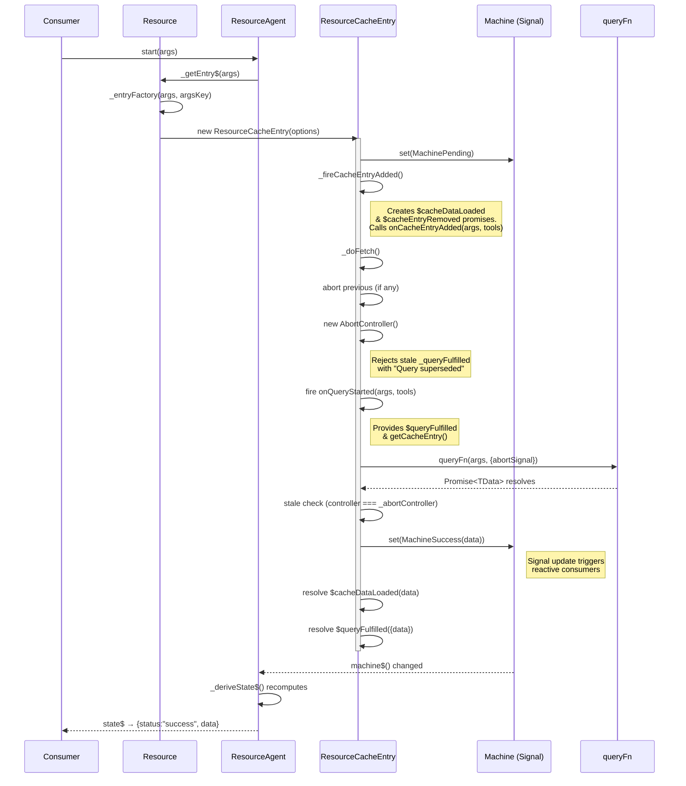
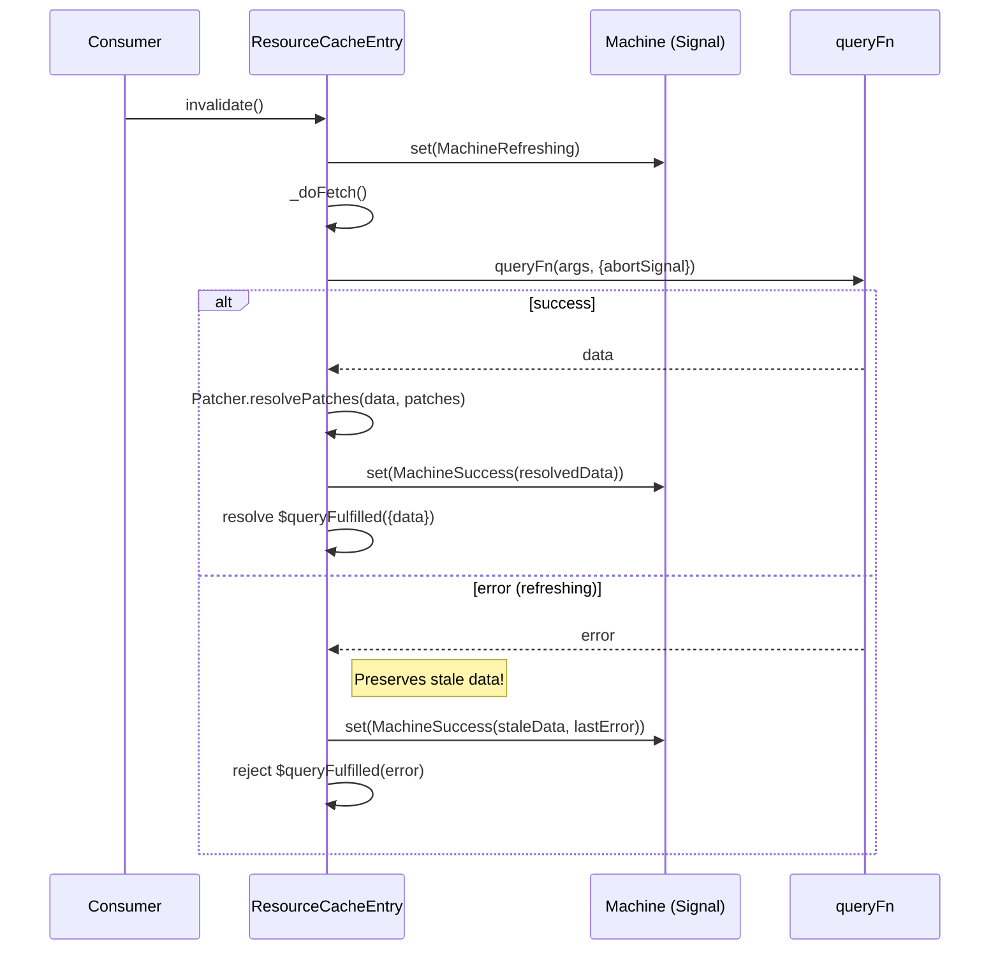
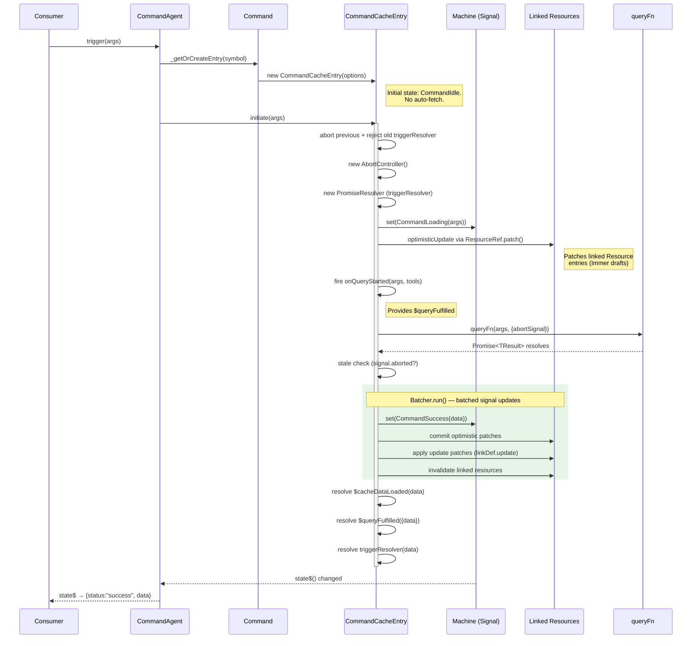
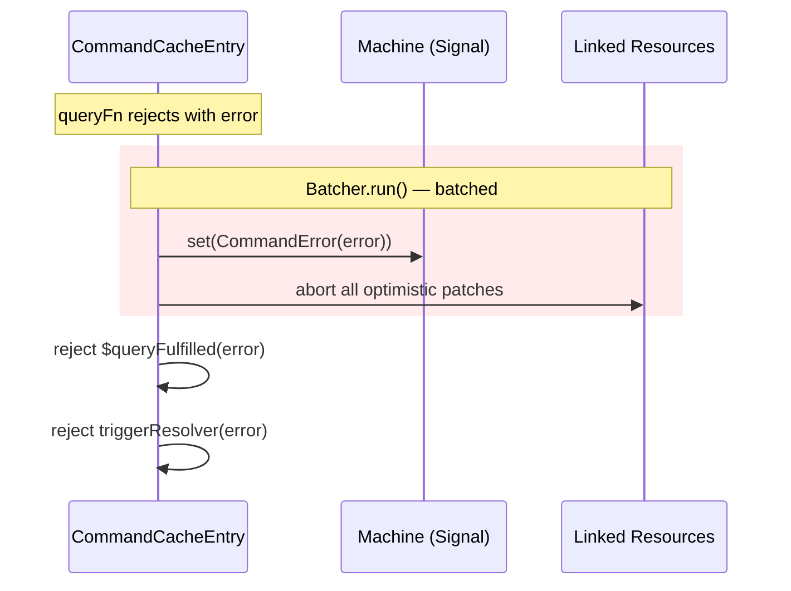

## 1. Resource Fetch Lifecycle

The diagram shows the happy-path fetch triggered on entry creation (constructor auto-fetch), including lifecycle hooks and signal updates.

### Resource Invalidate / Refresh Sub-Flow

---

## 2. Command Execution Lifecycle

The diagram shows a trigger flow including linked Resource effects (optimistic updates, post-mutation patches, invalidation).

### Command Error Sub-Flow

---

## 3. Side-by-Side Comparison

```mermaid
sequenceDiagram
    participant RS as Resource Flow
    participant CS as Command Flow

    Note over RS,CS: ── IDENTICAL STEPS ──

    rect rgb(220, 240, 255)
        Note over RS: abort previous _abortController
        Note over CS: abort previous _abortController
    end

    rect rgb(220, 240, 255)
        Note over RS: new AbortController()
        Note over CS: new AbortController()
    end

    rect rgb(220, 240, 255)
        Note over RS: _fireCacheEntryAdded()
        Note over CS: _fireCacheEntryAdded()
    end

    rect rgb(220, 240, 255)
        Note over RS: reject stale _queryFulfilled
        Note over CS: reject stale _queryFulfilled
    end

    rect rgb(220, 240, 255)
        Note over RS: fire onQueryStarted(args, tools)
        Note over CS: fire onQueryStarted(args, tools)
    end

    rect rgb(220, 240, 255)
        Note over RS: queryFn(args, {abortSignal})
        Note over CS: queryFn(args, {abortSignal})
    end

    rect rgb(220, 240, 255)
        Note over RS: stale check after async
        Note over CS: stale check after async
    end

    rect rgb(220, 240, 255)
        Note over RS: resolve $cacheDataLoaded
        Note over CS: resolve $cacheDataLoaded
    end

    rect rgb(220, 240, 255)
        Note over RS: resolve $queryFulfilled
        Note over CS: resolve $queryFulfilled
    end

    rect rgb(220, 240, 255)
        Note over RS: complete() → abort + 3× resolver cleanup + super
        Note over CS: complete() → abort + 3× resolver cleanup + super
    end

    Note over RS,CS: ── SIMILAR (same pattern, different details) ──

    rect rgb(255, 248, 220)
        Note over RS: Machine: Pending → Success/Error
        Note over CS: Machine: Idle → Loading → Success/Error
    end

    rect rgb(255, 248, 220)
        Note over RS: onCacheEntryAdded(args, tools)
        Note over CS: onCacheEntryAdded(tools) — no args
    end

    rect rgb(255, 248, 220)
        Note over RS: _inflightPromise for dedup
        Note over CS: _triggerResolver for caller promise
    end

    Note over RS,CS: ── DIFFERENT STEPS ──

    rect rgb(255, 230, 230)
        Note over RS: Auto-fetch in constructor
        Note over CS: Fire-on-demand via initiate()
    end

    rect rgb(255, 230, 230)
        Note over RS: Self-owned Patcher (resolvePatches)
        Note over CS: Delegates patches to linked Resources
    end

    rect rgb(255, 230, 230)
        Note over RS: Refreshing preserves stale data
        Note over CS: No refresh concept — re-trigger = new Loading
    end

    rect rgb(255, 230, 230)
        Note over RS: No linked-resource effects
        Note over CS: Batcher.run wraps commit + update + invalidate on links
    end

    rect rgb(255, 230, 230)
        Note over RS: SWR via ResourceAgent._previous$
        Note over CS: No SWR — CommandAgent is 1:1 with entry
    end

    rect rgb(255, 230, 230)
        Note over RS: Hydration support (SSR snapshot)
        Note over CS: No hydration
    end
```

---

## 4. Summary Table

| Step | Resource | Command | Classification |
|---|---|---|---|
| AbortController management | `_doFetch():195-209` | `initiate():50-65` | **Identical** |
| `_fireCacheEntryAdded()` | `:169-191` | `:253-268` | **Similar** (Resource passes `args`) |
| `onQueryStarted` fire | `_doFetch():218-230` | `initiate():98-113` | **Similar** (Resource has `getCacheEntry`) |
| `queryFn(args, {abortSignal})` | `_doFetch():236` | `initiate():115` | **Identical** |
| Stale check | `controller === _abortController` | `controller.signal.aborted` | **Similar** (same intent) |
| `$cacheDataLoaded` resolve | `_doFetch():272-275` | `initiate():189-192` | **Identical** |
| `$queryFulfilled` resolve | `_doFetch():278-281` | `initiate():195-198` | **Identical** |
| `complete()` cleanup | `:136-167` | `:233-258` | **Similar** (Resource clears `_patchState`, Command clears `_triggerResolver`) |
| Machine transition (success) | `set(MachineSuccess)` | `Batcher.run → set(CommandSuccess)` | **Different** (Command batches with link effects) |
| Optimistic update (own data) | `Patcher.resolvePatches` on self | N/A — patches linked Resources | **Different** |
| Linked resource effects | N/A | `commit + update + invalidate` in Batcher | **Command-only** |
| Refresh / SWR | `MachineRefreshing` + `_previous$` | Not supported | **Resource-only** |
| Constructor auto-fetch | Yes (unless hydrated) | No — `CommandIdle` at rest | **Different** |
