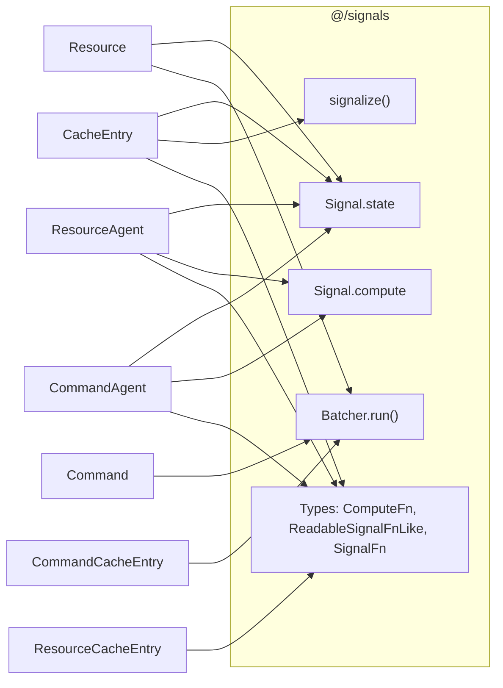

# Appendix D — Signal Coupling Analysis

## Signal Primitives Used by Query Core

| Primitive | Files | Lines | Purpose |
|---|---|---|---|
| `Signal.state()` | CacheEntry, Resource (×2), ResourceAgent, CommandAgent | `:28`, `:32,:36`, `:22`, `:75` | Writable reactive cell — holds mutable state (cache state, last entry, status, tracking, current entry) |
| `Signal.compute()` | ResourceAgent (×2), CommandAgent | `:36,:72`, `:83` | Derived reactive cell — computes `state$` and `current$` from tracking signals |
| `signalize()` | CacheEntry | `:46` | Converts RxJS `Observable` → `ReadableSignalFnLike` for synchronous `.peek()` reads |
| `Batcher.run()` | Resource, Command, CommandCacheEntry (×3) | `:108`, `:25`, `:118,:148,:206` | Atomic batching — coalesces multiple `Signal.state.set()` calls into one notification cycle |

**Asymmetry note:** `Batcher.run` is uniquely coupled — it controls *update ordering semantics*, not just reads. Abstracting it would require replicating the batching contract.

**Type-level coupling:** `ComputeFn`, `ReadableSignalFnLike`, `SignalFn`, `SignalOptions` leak into `@/query/types/` public API (`agent.types.ts:1`, `command.types.ts:1`, `resource.types.ts:2`).

## Dependency Diagram

## Hypothetical Decoupling

To make query core signal-agnostic you would need ~4 interfaces:

| Interface | Replaces | Shape |
|---|---|---|
| `WritableCell<T>` | `Signal.state` | `{ (): T; peek(): T; set(v: T): void; obs: Observable<T> }` |
| `ComputedCell<T>` | `Signal.compute` | `{ (): T; peek(): T; obs: Observable<T> }` |
| `signalize<T>` | `signalize` | `(obs: Observable<T>) => ReadableCell<T>` |
| `batch` | `Batcher.run` | `(fn: () => void) => void` |

**Is this worth doing? No.** Signals are a core feature of rx-toolkit — the library is *designed* around them. Decoupling would add indirection without a realistic consumer: nobody will use query without signals. This is premature abstraction.

## Impact on Extraction (Approach D)

Approach D extracts **utility functions** — `createCacheMap`, `createLifetimeHooks`, `PromiseResolver`, comparison helpers. These utilities operate on plain objects, RxJS observables, and callbacks. **None of them import or reference any signal primitive.** Signal coupling lives entirely in the class layer (`CacheEntry`, `Resource`, `Command`, agents).

This means Approach D extraction is **signal-agnostic by default** — no adapter layer, no interface shimming, no breaking changes to the reactive contract. This is a structural advantage over Approaches A–C, which would all need to carry signal dependencies into the shared package.
