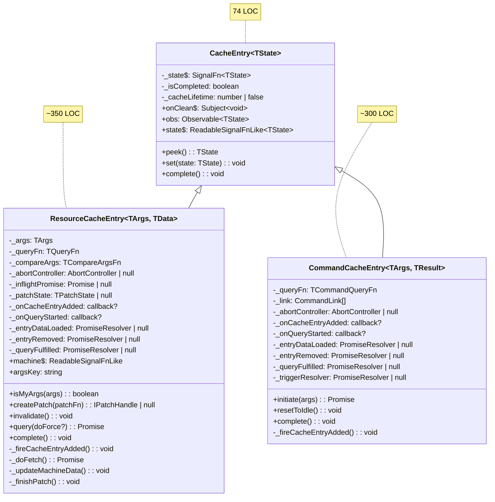
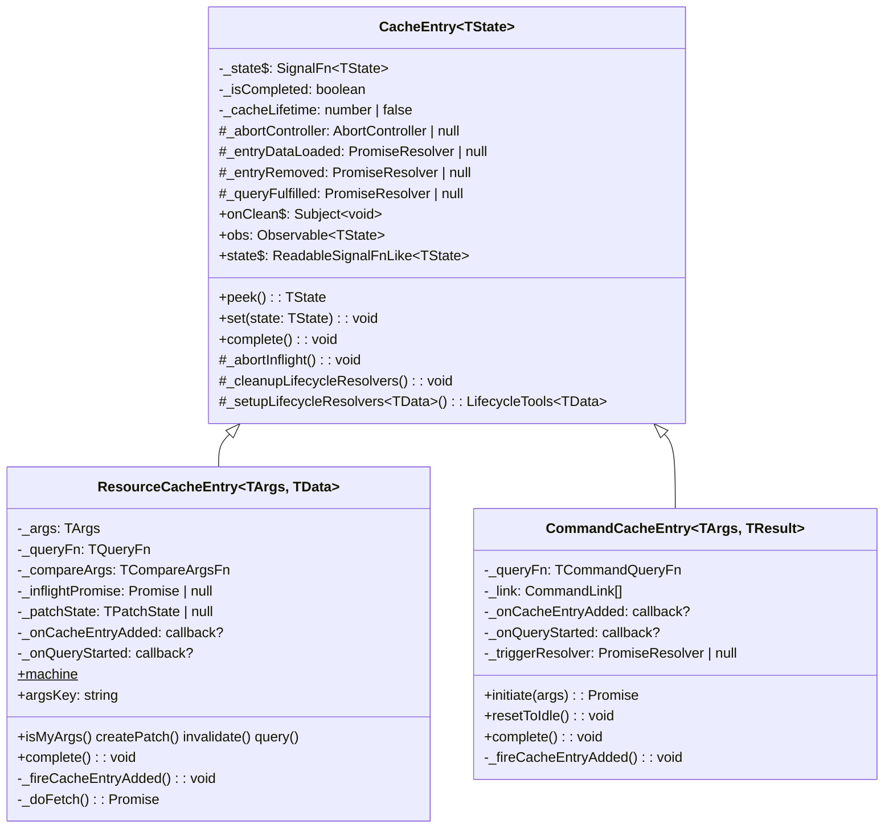
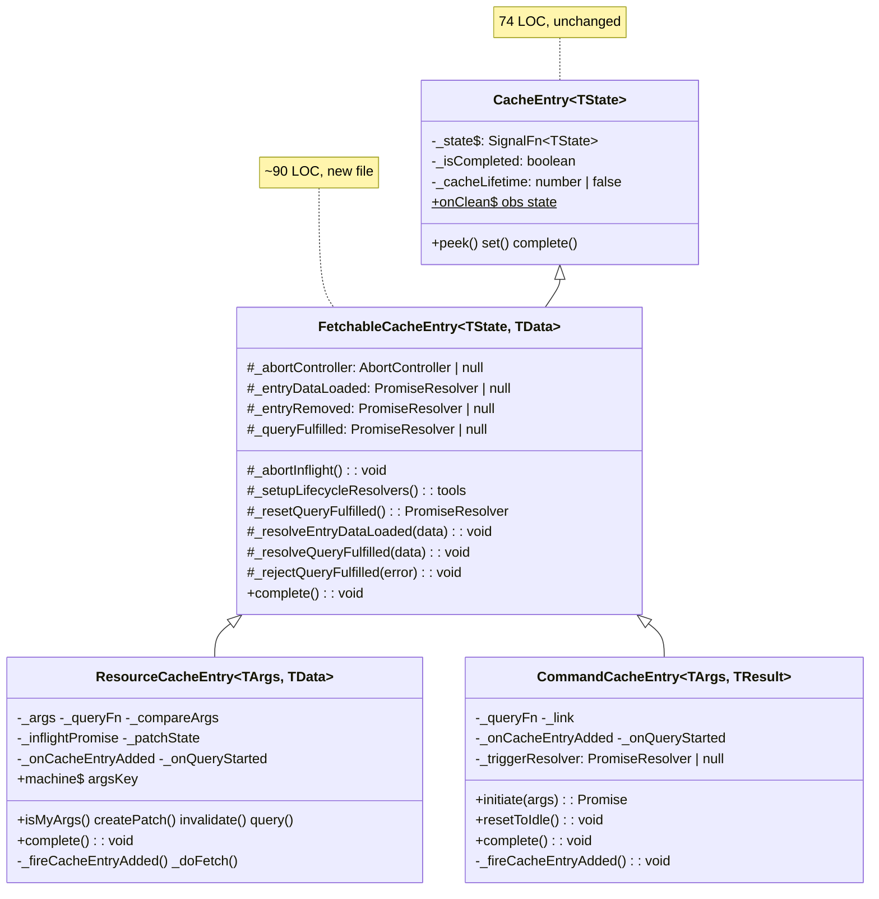
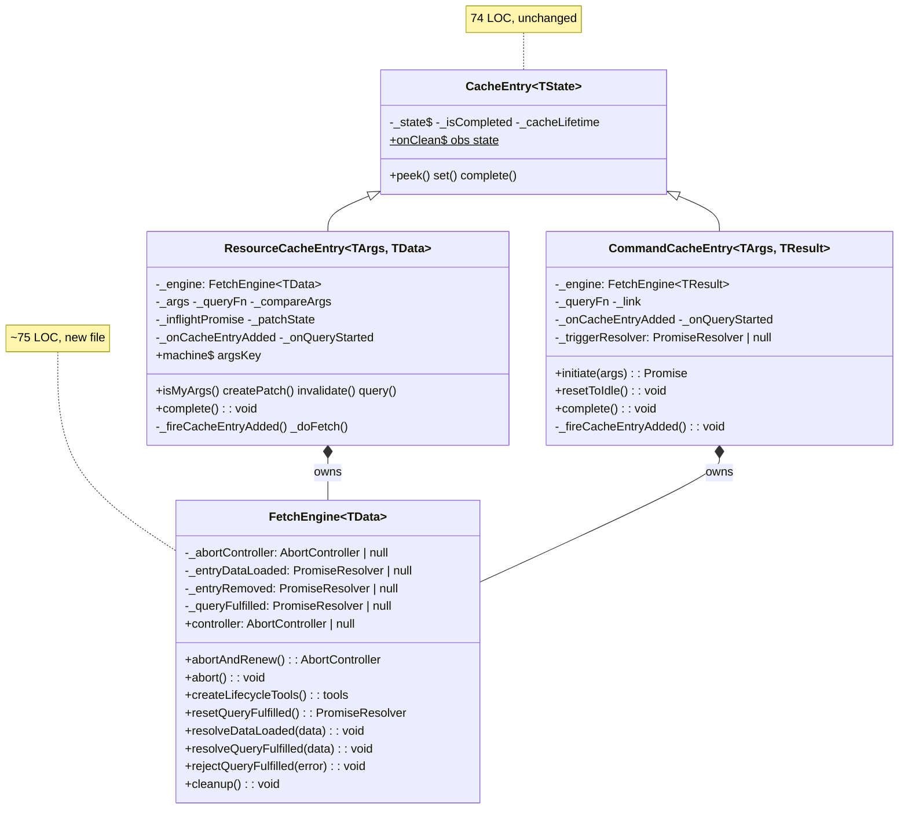

# Extraction Approaches

Three approaches for extracting ~78 lines of duplicated code between `ResourceCacheEntry` (~350 LOC) and `CommandCacheEntry` (~300 LOC). Each approach addresses the same duplication matrix [ref: ../01-research/tmp/cache-entry-comparison.md#6. Summary Duplication Matrix].

**Shared context for all approaches:**
- `CacheEntry`, `ResourceCacheEntry`, `CommandCacheEntry` are **internal** classes — NOT in the public API [ref: ../01-research/tmp/public-api-audit.md#4. CacheEntry, ResourceCacheEntry, CommandCacheEntry]
- Lifecycle hook **types** (`TOnCacheEntryAdded`, `TOnCommandCacheEntryAdded`, etc.) ARE public [ref: ../01-research/tmp/public-api-audit.md#6. Lifecycle hook types — export status]
- Machine hierarchies are fully disjoint and should remain separate [ref: ../01-research/tmp/critical-analysis-1.md#Q4]
- Tests are behavior-based — no `instanceof` assertions, no internal field checks [ref: ../01-research/tmp/test-analysis.md#Q5]
- `Batcher` is a signals-layer primitive, not an extraction target [ref: ../01-research/tmp/batcher-analysis.md#7. Is it a shared extraction concern?]

---

## Current State (Before)



**Duplicated code** (marked with ≈ where structurally identical):
- `_abortController` field + abort/create/null cycle (~12 lines each)
- `_entryDataLoaded`, `_entryRemoved`, `_queryFulfilled` PromiseResolver fields + cleanup (~28 lines each)
- `_fireCacheEntryAdded()` body (~16–23 lines each, diverges on args param)
- `complete()` resolver cleanup block (~12 lines each)
- `_onQueryStarted` fire pattern (~10 lines each, diverges on tools shape)

---

## Approach A: Enrich CacheEntry (Minimal)

### Strategy

Push the shared lifecycle infrastructure directly into the existing `CacheEntry` base class. No new classes, no hierarchy changes.

### What moves where

| Code | From | To | Lines saved |
|------|------|----|-------------|
| `_abortController` field + `_abortAndClear()` helper | Both subclasses | `CacheEntry` protected method | ~10 |
| `_entryDataLoaded`, `_entryRemoved`, `_queryFulfilled` fields | Both subclasses | `CacheEntry` protected fields | ~6 (field decls) |
| Resolver cleanup in `complete()` | Both subclasses' `complete()` override | `CacheEntry.complete()` | ~12 |
| `_fireCacheEntryAdded()` core (resolver setup + try/catch) | Both subclasses | `CacheEntry._setupLifecycleResolvers()` base method | ~10 |
| **Total duplication removed** | | | **~38 lines** |

**What stays in subclasses:**
- `ResourceCacheEntry.complete()`: clears `_inflightPromise`, `_patchState` (Resource-only)
- `CommandCacheEntry.complete()`: rejects `_triggerResolver` (Command-only)
- `_fireCacheEntryAdded()`: the actual callback invocation (divergent signatures — `(args, tools)` vs `(tools)`)
- `_onQueryStarted` fire pattern (divergent tools shape — Resource has `getCacheEntry`)
- All fetch logic (`_doFetch`, `initiate`)
- All unique methods (`createPatch`, `invalidate`, `query`, `resetToIdle`, etc.)

### API changes

**None.** No public types change. CacheEntry gains protected members, but it's internal.

### After diagram



### Pros

1. **Minimal structural change** — no new files, no new class. Existing 2-level hierarchy preserved. [ref: ../01-research/tmp/critical-analysis-1.md#Q1, option 1]
2. **Lowest risk** — protected fields are still co-located with usage; subclasses remain in control of their `complete()` and `_fireCacheEntryAdded()` flows.
3. **Test impact minimal** — only import paths remain identical; constructor APIs unchanged; `CacheEntry.test.ts` (CE01–CE10) needs extension for new protected methods. [ref: ../01-research/tmp/test-analysis.md#Q5]
4. **Consistent with OSS patterns** — TanStack Query and RTK Query keep query/mutation infrastructure minimal-shared [ref: ../01-research/tmp/critical-analysis-1.md#Researcher recommendation under Q1].

### Cons

1. **Partial extraction only (~38 of 78 lines)** — the `_fireCacheEntryAdded` callback invocation and `_onQueryStarted` tools divergence cannot be unified without changing public lifecycle types, so ~40 lines of structural duplication remain.
2. **CacheEntry grows** — currently 74 LOC, would grow to ~110 LOC. It gains abort/lifecycle concerns that are only relevant to fetchable subclasses, weakening SRP. A future non-fetch `CacheEntry` consumer (e.g., a pure computed cache) would inherit dead weight.
3. **Protected fields** — TypeScript protected members create a looser contract than private; subclasses can accidentally mutate base lifecycle state.

### Risk assessment

| Risk | Severity | Mitigation |
|------|----------|------------|
| SRP violation in CacheEntry | Low | No current non-fetch CacheEntry consumers exist; if one appears, extract at that time |
| Protected field misuse | Low | Only 2 known subclasses, both internal |
| Incomplete extraction frustration | Medium | Sets expectation that ~50% of duplication is structural similarity, not extractable without API change |

### LOC impact

- CacheEntry: 74 → ~110 (+36)
- ResourceCacheEntry: ~350 → ~315 (−35)
- CommandCacheEntry: ~300 → ~265 (−35)
- Net: ~−30 LOC (overhead from protected wrappers)

---

## Approach B: FetchableCacheEntry Intermediate

### Strategy

Introduce a new abstract class `FetchableCacheEntry` between `CacheEntry` and the two concrete entries. It owns all fetch-related infrastructure: abort, lifecycle resolvers, lifecycle fire, queryFulfilled management. Subclasses implement a template method for the actual fetch/trigger execution.

### What moves where

| Code | From | To | Lines saved |
|------|------|----|-------------|
| `_abortController` + abort cycle | Both subclasses | `FetchableCacheEntry` | ~10 |
| All 3 PromiseResolver fields + cleanup | Both subclasses | `FetchableCacheEntry` | ~28 |
| `complete()` resolver cleanup | Both `complete()` overrides | `FetchableCacheEntry.complete()` | ~12 |
| `_fireCacheEntryAdded()` resolver setup | Both subclasses | `FetchableCacheEntry._setupAndFireCacheEntryAdded(callback)` | ~14 |
| `_onQueryStarted` pre-call setup | Both subclasses | `FetchableCacheEntry._fireQueryStarted(args, toolsFactory)` | ~8 |
| `_queryFulfilled` reject-before-new pattern | Both subclasses | `FetchableCacheEntry._resetQueryFulfilled()` | ~6 |
| **Total duplication removed** | | | **~65 lines** |

**What stays in subclasses:**
- `ResourceCacheEntry.complete()`: clears `_inflightPromise`, `_patchState`, calls `super.complete()`
- `CommandCacheEntry.complete()`: rejects `_triggerResolver`, calls `super.complete()`
- `ResourceCacheEntry._fireCacheEntryAdded()`: passes `(args, tools)` to callback + hydration check
- `CommandCacheEntry._fireCacheEntryAdded()`: passes `(tools)` to callback
- All fetch logic (`_doFetch`, `initiate`) — too divergent to unify
- All unique methods

### New class: `FetchableCacheEntry`

```typescript
// src/query/core/FetchableCacheEntry.ts (~90 LOC)
export abstract class FetchableCacheEntry<TState, TData> extends CacheEntry<TState> {
    protected _abortController: AbortController | null = null;
    protected _entryDataLoaded: PromiseResolver<TData> | null = null;
    protected _entryRemoved: PromiseResolver<void> | null = null;
    protected _queryFulfilled: PromiseResolver<{ data: TData }> | null = null;

    /** Aborts current inflight and nulls the controller */
    protected _abortInflight(): void { ... }

    /** Rejects leftover _queryFulfilled, creates new one, returns it */
    protected _resetQueryFulfilled(): PromiseResolver<{ data: TData }> { ... }

    /** Creates _entryDataLoaded + _entryRemoved, returns tools object */
    protected _setupLifecycleResolvers(): { $cacheDataLoaded: Promise<TData>; $cacheEntryRemoved: Promise<void> } { ... }

    /** Resolves _entryDataLoaded on first data arrival */
    protected _resolveEntryDataLoaded(data: TData): void { ... }

    /** Resolves _queryFulfilled with data */
    protected _resolveQueryFulfilled(data: TData): void { ... }

    /** Rejects _queryFulfilled with error */
    protected _rejectQueryFulfilled(error: unknown): void { ... }

    override complete(): void {
        this._abortInflight();
        // Resolver cleanup (identical block)
        if (this._entryDataLoaded) { reject("before data loaded"); null; }
        if (this._entryRemoved) { resolve(); null; }
        if (this._queryFulfilled) { reject("removed"); null; }
        super.complete();
    }
}
```

### API changes

**None public.** `FetchableCacheEntry` is internal (not exported from `src/query/index.ts`). Public lifecycle types unchanged.

### After diagram



### Pros

1. **Most duplication eliminated (~65 of 78 lines, 83%)** — only the callback invocation divergence and subclass-specific `complete()` cleanup remain duplicated.
2. **CacheEntry stays clean** — no abort/lifecycle concerns leak into the base. A future non-fetch CacheEntry consumer is unaffected.
3. **Clear separation of concerns** — CacheEntry = reactive container; FetchableCacheEntry = fetch infrastructure; concrete = entity-specific behavior.
4. **Extensibility** — a hypothetical 3rd entity (InfiniteQuery, Subscription) would extend `FetchableCacheEntry` and get abort + lifecycle for free. [ref: ../01-research/tmp/critical-analysis-1.md#Q2, option 3]
5. **Protected method API is focused** — small, well-scoped helpers that map directly to the duplicated patterns.

### Cons

1. **3-level hierarchy** — deeper inheritance can make debugging harder; stack traces gain one more frame. [ref: ../01-research/tmp/critical-analysis-1.md#Q1, option 2 cons]
2. **Extra generic parameter** — `FetchableCacheEntry<TState, TData>` needs both the machine state type AND the data type (for PromiseResolver typing). This is manageable but adds cognitive load.
3. **New file + test file** — `FetchableCacheEntry.ts` (~90 LOC) + `FetchableCacheEntry.test.ts` (~40 LOC for extracted helper tests). Not onerous but is net new code.
4. **`_fireCacheEntryAdded` still diverges** — the callback signature difference (`(args, tools)` vs `(tools)`) means the actual callback invocation stays in subclasses. Base provides `_setupLifecycleResolvers()` but calling the user callback must remain subclass responsibility.

### Risk assessment

| Risk | Severity | Mitigation |
|------|----------|------------|
| 3-level hierarchy complexity | Low | All internal; no consumer-facing change; TypeScript makes hierarchy explicit |
| Generic parameter explosion | Low | `TState` is already parameterized; `TData` is just the resolver data type |
| Over-abstraction for 2 consumers | Medium | Justified by 83% duplication removal; if a 3rd entity never appears, the intermediate is still a net clarity win |
| `complete()` override chain bug risk | Low | Each level calls `super.complete()` — tested pattern; existing tests cover complete behavior |

### LOC impact

- CacheEntry: 74 → 74 (unchanged)
- NEW FetchableCacheEntry: +90
- ResourceCacheEntry: ~350 → ~290 (−60)
- CommandCacheEntry: ~300 → ~240 (−60)
- NEW FetchableCacheEntry.test.ts: +40
- Net: ~+10 LOC (new file offsets savings), but duplication drops from 78 → ~13 lines

---

## Approach C: Composition (FetchEngine)

### Strategy

Extract a standalone `FetchEngine` object that encapsulates abort management + lifecycle resolver infrastructure. Both `ResourceCacheEntry` and `CommandCacheEntry` create and own a `FetchEngine` instance. No inheritance changes — `CacheEntry` remains untouched.

### What moves where

| Code | From | To | Lines saved |
|------|------|----|-------------|
| `_abortController` + abort cycle | Both subclasses | `FetchEngine._abortController` + `abort()` | ~10 |
| All 3 PromiseResolver fields | Both subclasses | `FetchEngine._entryDataLoaded/Removed/queryFulfilled` | ~6 |
| Resolver cleanup sequence | Both `complete()` | `FetchEngine.cleanup()` | ~12 |
| `_fireCacheEntryAdded` resolver setup | Both subclasses | `FetchEngine.createLifecycleTools()` | ~10 |
| `_queryFulfilled` reject-before-new | Both subclasses | `FetchEngine.resetQueryFulfilled()` | ~6 |
| Resolver resolution/rejection helpers | Both subclasses | `FetchEngine.resolveDataLoaded()/resolveQueryFulfilled()/rejectQueryFulfilled()` | ~8 |
| **Total duplication removed** | | | **~52 lines** |

### New module: `FetchEngine`

```typescript
// src/query/core/FetchEngine.ts (~75 LOC)
export class FetchEngine<TData> {
    private _abortController: AbortController | null = null;
    private _entryDataLoaded: PromiseResolver<TData> | null = null;
    private _entryRemoved: PromiseResolver<void> | null = null;
    private _queryFulfilled: PromiseResolver<{ data: TData }> | null = null;

    /** Abort current inflight. Returns the new AbortController. */
    abortAndRenew(): AbortController { ... }

    /** Abort without renewing (for cleanup). */
    abort(): void { ... }

    /** Create lifecycle tools ($cacheDataLoaded + $cacheEntryRemoved). */
    createLifecycleTools(): { $cacheDataLoaded: Promise<TData>; $cacheEntryRemoved: Promise<void> } { ... }

    /** Reject old _queryFulfilled if exists, create new one. */
    resetQueryFulfilled(): PromiseResolver<{ data: TData }> { ... }

    /** Resolve _entryDataLoaded on first success. */
    resolveDataLoaded(data: TData): void { ... }

    /** Resolve _queryFulfilled. */
    resolveQueryFulfilled(data: TData): void { ... }

    /** Reject _queryFulfilled. */
    rejectQueryFulfilled(error: unknown): void { ... }

    /** Full cleanup: abort + reject/resolve all resolvers. */
    cleanup(): void { ... }

    /** Read the current AbortController (for stale checks). */
    get controller(): AbortController | null { return this._abortController; }
}
```

### Usage in subclasses (sketch)

```typescript
// ResourceCacheEntry — constructor
this._engine = new FetchEngine<TData>();

// ResourceCacheEntry — _fireCacheEntryAdded
const tools = this._engine.createLifecycleTools();
this._onCacheEntryAdded(this._args, tools);

// ResourceCacheEntry — _doFetch
const controller = this._engine.abortAndRenew();
this._engine.resetQueryFulfilled();
// ...
this._queryFn(this._args, { abortSignal: controller.signal });
// ... on success:
this._engine.resolveDataLoaded(data);
this._engine.resolveQueryFulfilled(data);

// ResourceCacheEntry — complete
this._inflightPromise = null;
this._patchState = null;
this._engine.cleanup();
super.complete();
```

### API changes

**None public.** `FetchEngine` is internal. Public lifecycle types unchanged.

### After diagram



### Pros

1. **No inheritance change** — 2-level hierarchy preserved. `CacheEntry` stays clean. No "inheritance tax" or `super.complete()` chains to reason about.
2. **FetchEngine is independently testable** — pure state machine with no framework dependencies (no signals, no RxJS). Easy to unit test in isolation. [ref: ../01-research/tmp/critical-analysis-1.md#Q1, option 3 pros]
3. **Composition over inheritance** — follows Go/Rust-style "embed" pattern. Each subclass explicitly wires the engine, making control flow visible.
4. **Flexible for future entities** — a hypothetical 3rd entity can compose `FetchEngine` without inheriting from anything except `CacheEntry`.
5. **TypeScript private stays private** — `FetchEngine` fields are truly private; subclasses cannot accidentally reach into resolver state.

### Cons

1. **More wiring boilerplate** — each call site must do `this._engine.resolveDataLoaded(data)` instead of `this._entryDataLoaded.resolve(data)`. Roughly 1:1 line replacement, so net savings come only from field declarations and complete cleanup. **Total duplication removed (~52 lines) is less than Approach B (~65 lines).**
2. **Breaks field-access locality** — instead of `this._entryDataLoaded`, code reads `this._engine.resolveDataLoaded(data)`. Debugging requires navigating into the engine object. [ref: ../01-research/tmp/critical-analysis-1.md#Q1, option 3 cons]
3. **Stale check divergence unaddressed** — Resource checks `this._abortController !== controller` (identity); Command checks `controller.signal.aborted`. FetchEngine exposes `.controller` getter, but each subclass still implements its own stale check pattern. [ref: ../01-research/tmp/cache-entry-comparison.md#4.3 Stale Check Divergence]
4. **`_onQueryStarted` fire pattern still duplicated** — the tools object construction diverges (Resource adds `getCacheEntry`), so the `onQueryStarted` pre-call setup stays in subclasses (~10 lines each).
5. **Extra indirection** — every abort/resolve/reject goes through one more method call, which slightly impacts stack trace readability and micro-performance (negligible in practice).

### Risk assessment

| Risk | Severity | Mitigation |
|------|----------|------------|
| Wiring boilerplate bugs | Low | Engine API is small (~8 methods); TypeScript catches misuse at compile time |
| Indirection harms debugging | Low | FetchEngine is ~75 LOC, easy to step through |
| Engine lifecycle mismatch | Medium | If engine.cleanup() isn't called before super.complete(), resolvers leak. Must document/enforce call order |
| Under-extraction (~52 vs 78 lines) | Medium | Composition naturally leaves more line-for-line wiring at call sites; tradeoff for avoiding inheritance |

### LOC impact

- CacheEntry: 74 → 74 (unchanged)
- NEW FetchEngine: +75
- ResourceCacheEntry: ~350 → ~305 (−45)
- CommandCacheEntry: ~300 → ~255 (−45)
- NEW FetchEngine.test.ts: +50
- Net: ~+35 LOC, but duplication drops from 78 → ~26 lines

---

## Comparison Matrix

| Criterion | A: Enrich CacheEntry | B: FetchableCacheEntry | C: FetchEngine |
|-----------|---------------------|----------------------|----------------|
| **Duplication removed** | ~38/78 (49%) | ~65/78 (83%) | ~52/78 (67%) |
| **New files** | 0 | 1 class + 1 test | 1 class + 1 test |
| **Hierarchy depth** | 2 (unchanged) | 3 | 2 (unchanged) |
| **CacheEntry changes** | Yes (grows ~50%) | No | No |
| **Public API changes** | None | None | None |
| **Net LOC delta** | −30 | +10 | +35 |
| **SRP preservation** | Weakened for CacheEntry | Strong (each layer has clear role) | Strong (composition) |
| **Testability** | Existing CacheEntry tests need extending | New isolated test file | New isolated test file |
| **Future entity support** | Weak (inherits dead weight) | Strong (extend FetchableCacheEntry) | Strong (compose FetchEngine) |
| **Debugging overhead** | Minor (protected fields) | Minor (one more super layer) | Moderate (indirection) |
| **Risk level** | Low | Low-Medium | Medium |
| **Consistency with OSS** | ✓ Minimal extraction | Partial (TanStack doesn't use intermediates) | ✓ Composition pattern used by SWR |

---

## Recommendation Summary

- **Approach A** is best if the goal is pure DRY with minimal disruption. It addresses only half the duplication but carries near-zero risk and zero new files.

- **Approach B** is best if the goal is clean architecture with maximum extraction. It removes 83% of duplication, preserves CacheEntry's SRP, and provides the clearest extensibility path. The cost is a 3-level hierarchy.

- **Approach C** is best if composition-over-inheritance is a project principle. It avoids hierarchy deepening but achieves less extraction than B due to wiring overhead. FetchEngine is independently testable.

From the research evidence:
- The project goal is "extract core logic so it can be reused by Commands" [ref: ../01-research/tmp/critical-analysis-1.md#Q2] — this favors B or C over A.
- No 3rd entity type is planned [ref: ../01-research/tmp/critical-analysis-1.md#Q2, Researcher recommendation] — this tempers extensibility arguments.
- OSS consensus favors minimal shared abstractions [ref: ../01-research/tmp/critical-analysis-1.md#Q1] — this favors A or C over B.
- Tests are behavior-based and refactor-safe [ref: ../01-research/tmp/test-analysis.md#Q5] — all three approaches are viable from a test risk perspective.
