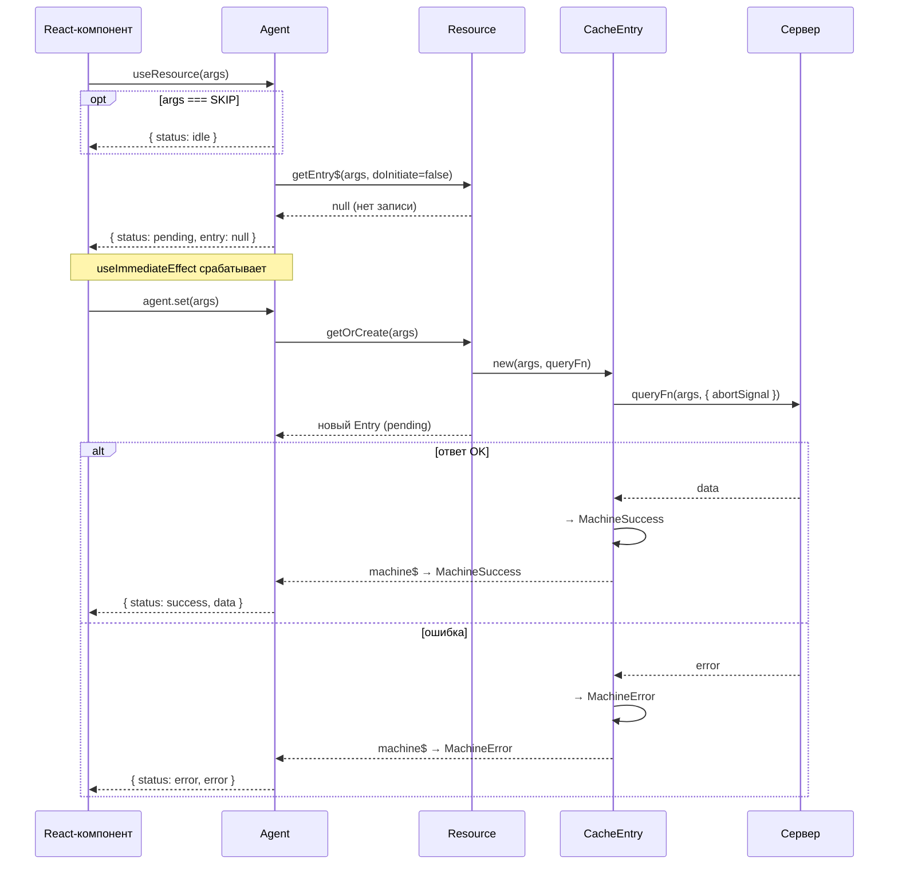

## Поток данных

### Первый запрос (cache miss)

Последовательность шагов при первом обращении компонента к ресурсу, когда в кеше ещё нет записи.

> **Попадание в кеш (cache hit):** если запись уже существует и находится в `status: success`, [Agent][agent] возвращает данные синхронно — запроса к серверу не происходит.
