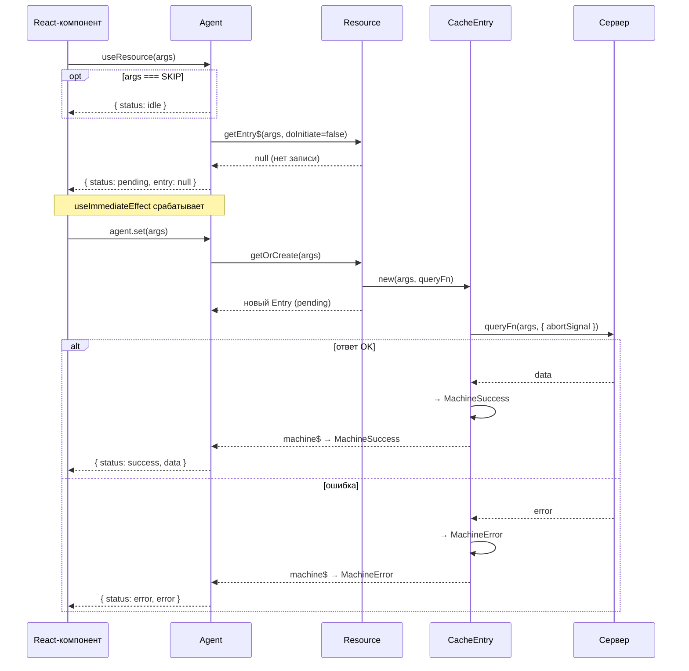

# Missing Arrows in "Первый запрос (cache miss)" Diagram

## Source

File: `docs/query/concepts/architecture.md`, section "### Первый запрос (cache miss)".

## Current Arrows (complete inventory)

Numbered for reference:

| # | Arrow | Message |
|---|-------|---------|
| 1 | `UI->>Agent` | `useResource(args)` |
| 2 | `Agent-->>UI` | `{ status: idle }` (inside `opt args === SKIP`) |
| 3 | `Agent->>Res` | `getEntry$(args, doInitiate=false)` |
| 4 | `Res-->>Agent` | `null (нет записи)` |
| 5 | `Agent-->>UI` | `{ status: pending, entry: null }` |
| 6 | `UI->>Agent` | `agent.set(args)` (after Note about useImmediateEffect) |
| 7 | `Agent->>Res` | `getOrCreate(args)` |
| 8 | `Res-->>Agent` | `новый Entry (pending)` |
| 9 | `Entry->>Server` | `queryFn(args, { abortSignal })` |
| 10 | `Server-->>Entry` | `data` (alt OK) |
| 11 | `Entry->>Entry` | `→ MachineSuccess` (alt OK) |
| 12 | `Agent-->>UI` | `{ status: success, data }` (alt OK) |
| 13 | `Server-->>Entry` | `error` (alt error) |
| 14 | `Entry->>Entry` | `→ MachineError` (alt error) |
| 15 | `Agent-->>UI` | `{ status: error, error }` (alt error) |

Total: 15 arrows (including opt/alt branches).

## Identified Gaps

### Gap A: Between arrows 8 and 9 — no trigger for Entry to fetch

**Current diagram**: Arrow 8 (`Res-->>Agent: новый Entry (pending)`) jumps directly to arrow 9 (`Entry->>Server: queryFn(...)`). The Entry participant has received no message causing it to act.

**What actually happens in code** (`@/query/core/resource/ResourceCacheEntry.ts`, constructor lines 55–71):
1. `Resource` calls `CacheMap.getOrCreate(args)` which instantiates `new ResourceCacheEntry(...)`.
2. The constructor initializes the machine as `new MachinePending(args)`.
3. The constructor auto-calls `this._doFetch()` — this is where `queryFn` is invoked.

**Missing arrow**:
```
Res->>Entry: new(args, queryFn)
```

This arrow should be inserted **after** arrow 8 and **before** arrow 9. It represents Resource (via CacheMap) creating the Entry, which triggers the constructor auto-fetch chain.

Note: Arrow 8 (`Res-->>Agent: новый Entry (pending)`) is a return arrow (dashed `-->>`) — it shows Resource returning the Entry reference to Agent. But nothing in the diagram shows Resource _creating_ that Entry. The creation is what triggers the fetch.

### Gap B: Between arrows 11 and 12 — no reactive notification from Entry to Agent (success)

**Current diagram**: Arrow 11 (`Entry->>Entry: → MachineSuccess`) jumps directly to arrow 12 (`Agent-->>UI: { status: success, data }`). There is no arrow explaining how Agent learns of the state change.

**What actually happens in code** (`@/query/core/resource/ResourceAgent.ts`, `_deriveState$` lines 106–155):
1. Entry calls `this.set(new MachineSuccess(...))` — updates its `machine$` Signal.
2. Agent's `state$` is a `Signal.compute(() => this._deriveState$())`.
3. `_deriveState$()` reads `currentEntry.machine$()` — a reactive dependency.
4. When `machine$` updates, Agent's `state$` automatically re-evaluates.
5. `useSignal(agent.state$)` in the React hook triggers a re-render.

**Missing arrow**:
```
Entry-->>Agent: machine$ → MachineSuccess
```

This arrow should be inserted **after** arrow 11 (`Entry->>Entry: → MachineSuccess`) and **before** arrow 12 (`Agent-->>UI: { status: success, data }`). It represents the Signal-based reactive notification.

### Gap C: Between arrows 14 and 15 — no reactive notification from Entry to Agent (error)

**Current diagram**: Arrow 14 (`Entry->>Entry: → MachineError`) jumps directly to arrow 15 (`Agent-->>UI: { status: error, error }`). Same gap as B, for the error path.

**What actually happens in code**: Identical reactive chain as Gap B, but with `MachineError` instead of `MachineSuccess`.

**Missing arrow**:
```
Entry-->>Agent: machine$ → MachineError
```

This arrow should be inserted **after** arrow 14 (`Entry->>Entry: → MachineError`) and **before** arrow 15 (`Agent-->>UI: { status: error, error }`).

## Summary of Required Additions

| Insert after | New arrow | Message | Rationale |
|-------------|-----------|---------|-----------|
| Arrow 8 (`Res-->>Agent: новый Entry (pending)`) | `Res->>Entry` | `new(args, queryFn)` | Shows Entry creation by Resource/CacheMap; constructor triggers auto-fetch |
| Arrow 11 (`Entry->>Entry: → MachineSuccess`) | `Entry-->>Agent` | `machine$ → MachineSuccess` | Signal-based reactive notification to Agent |
| Arrow 14 (`Entry->>Entry: → MachineError`) | `Entry-->>Agent` | `machine$ → MachineError` | Signal-based reactive notification to Agent |

## Corrected Diagram (proposed)



## Evidence Sources

- `@/query/core/resource/ResourceCacheEntry.ts` — constructor (lines 55–71), `_doFetch()` (lines 197–283), success handler (lines 251–283), error handler (lines 285–315).
- `@/query/core/resource/ResourceAgent.ts` — `start()` (lines 45–88), `_deriveState$()` (lines 106–155), reactive chain via `Signal.compute`.
- `@/query/react/useResourceAgent.ts` — `useSignal(agent.state$)` (line 19), `React.useEffect` calling `agent.start()` (lines 14–16).
- `@/query/core/resource/Resource.ts` — `createAgent()` (lines 60–64), wires `_getEntry$` with `doInitiate=true`.
