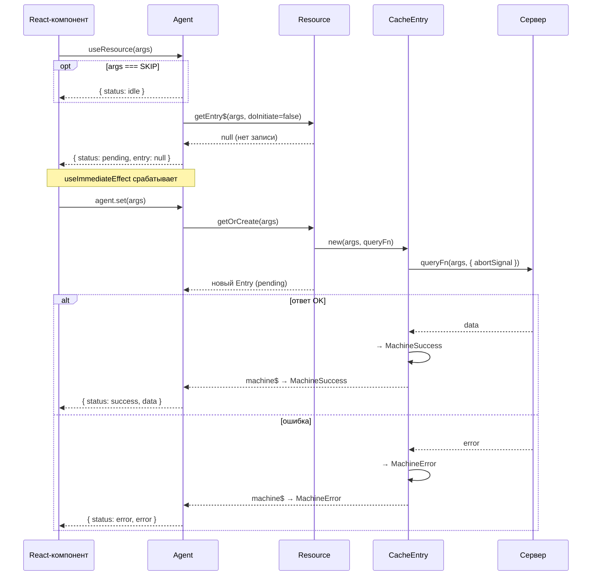

# Research: Agent concept — existing docs extraction

## Definition (architecture.md glossary)
- **Agent** — SWR-наблюдатель, связывающий UI-компонент с записью кеша
- Lives in React-integration layer; created by `useResource` / `useCommand` hooks
- Component diagram: `HOOKS -- создаёт --> AGENT -- наблюдает --> ENTRY`

## SKIP semantics
- `SKIP` — special symbol passed instead of args to defer the request
- Agent transitions to `idle` state; no fetch is executed, state resets to `idle`
- Type: `SKIP_TOKEN` alias, argument typing via `ArgsOrVoidOrSkip` [ref: docs-toc.md notes]
- `agent.start(SKIP)` → `{ status: "idle", data: null }`

## Status flags (from resource.md state table)
| status | description |
|--------|-------------|
| `idle` | SKIP state — no active observation |
| `pending` | Initial fetch in progress |
| `success` | Data received |
| `error` | Last request failed |
| `refreshing` | Background re-fetch (SWR), stale data still shown |
| `refresh-error` | Background re-fetch failed, stale data preserved |

Boolean flags: `isLoading`, `isInitialLoading`, `isSuccess`, `isError`, `isRefreshing`, `isRefreshError`

## SWR / cross-entry fallback (resource.md § createAgent + § Плавная смена аргументов)
- On `start(newArgs)`: if previous entry has data (`success`/`refreshing`), agent keeps it in `data` and sets `status: "refreshing"` until new response arrives
- Allows showing stale data instead of empty state during arg change
- On cache hit (`status: success`), agent returns data synchronously — no server request

## useResource → Agent relationship
- `useResource(args)` internally creates an Agent
- Agent observes current and (if needed) previous CacheEntry
- Merges them into a flat computed signal (`state$`)
- No explicit destruction needed — internal signals deactivate when subscribers drop

## useCommand → Agent relationship
- `createAgent({ key })` binds agent to a specific cache entry by key
- `agent.trigger(args)` runs the mutation
- `agent.state$()` returns `{ status, data, error, isLoading, isSuccess, isError }`

## Notes from docs-toc.md for agent.md (P1)
- Cover `SKIP` semantics: `SKIP_TOKEN` type, idle state, `ArgsOrVoidOrSkip`
- Explain SWR fallback: previous entry data shown while current entry loads
- Cover `compareArgs` for arg identity

## Sequence diagram — first request (cache miss) [verbatim from moved-flow-diagrams.md]

> Cache hit: если запись существует в `status: success`, Agent возвращает данные синхронно.
