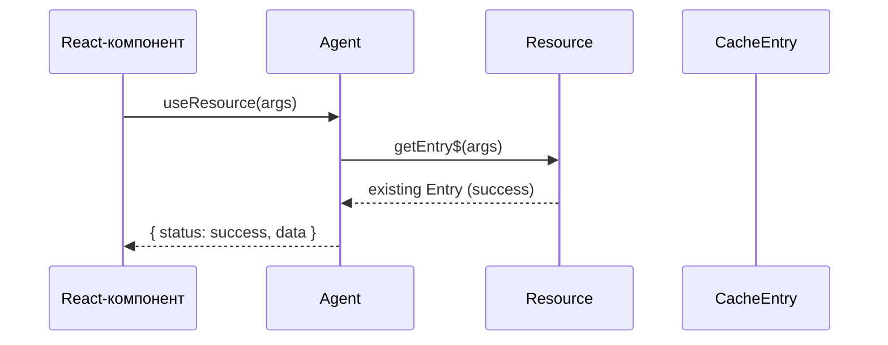

```mermaid
sequenceDiagram
    participant UI as React-компонент
    participant Agent as Agent
    participant Res as Resource
    participant Entry as CacheEntry

    UI->>Agent: useResource(args)
    Agent->>Res: getEntry$(args)
    Res-->>Agent: existing Entry (success)
    Agent-->>UI: { status: success, data }
```
