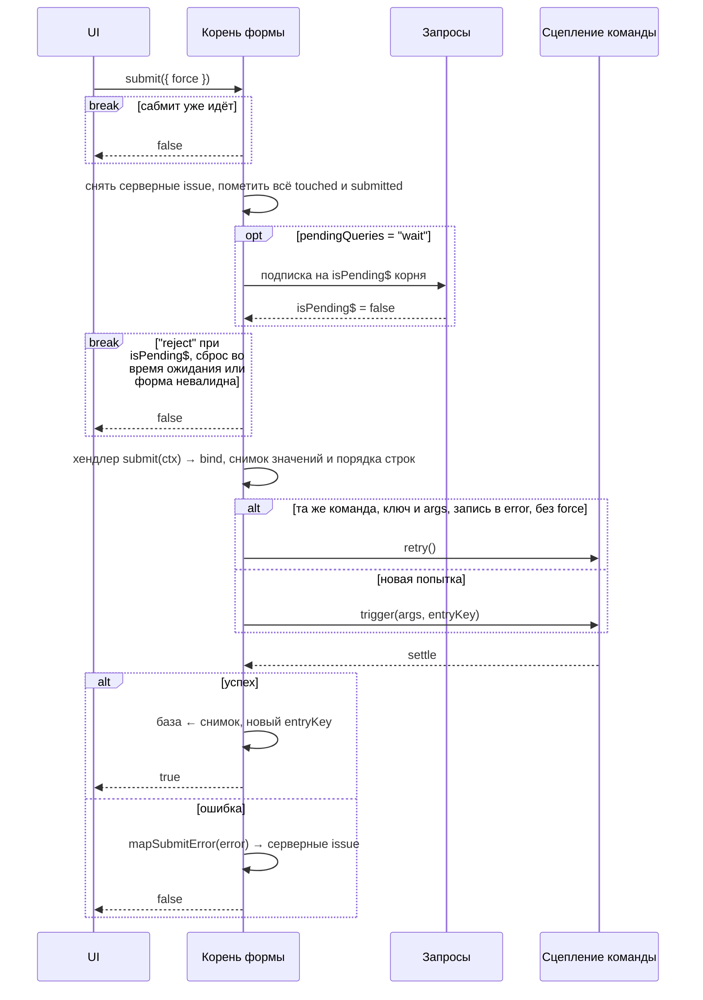

# Сабмит

`form.submit({ force? })` корня проверяет форму и отправляет её командой, которую возвращает опция `submit`. Возвращает `Promise<boolean>`: `true` — успех. Промис не отклоняется, кроме [ошибок конфигурации](validation.md#ошибки-конфигурации).

## Содержание

- [Попытка](#попытка)
- [Ожидание запросов](#ожидание-запросов)
- [Хендлер submit](#хендлер-submit)
- [Состояние сабмита](#состояние-сабмита)
- [Серверные ошибки](#серверные-ошибки)
- [Повтор](#повтор)
- [База после успеха](#база-после-успеха)
- [Сброс во время попытки](#сброс-во-время-попытки)


## Попытка



- **Корень без `submit`** только валидирует: `true` и `status$ = "success"` для валидной формы, без фиксации базы.
- **Повторный `submit()`**, пока идёт предыдущий, сразу резолвится `false`: двойной клик не отправит команду дважды.
- **Невалидная форма** — `false` и `status$ = "invalid"`. Пометка touched и `submitted` уже сделана, поэтому ошибки видны под любой [политикой](validation.md#видимость-ошибок).
- **Запись команды удалили в полёте** (`api.resetAll()`) — попытка прервана: `false`, без issue.
- **Размонтирование не прерывает попытку**: она доходит до settle и применяется к инстансу.


## Ожидание запросов

`pendingQueries` корня решает, что делать с запросами в полёте или в debounce:

| Значение | Поведение |
|---|---|
| `"wait"` (по умолчанию) | ждёт `!isPending$` корня, перепроверяя после каждого settle: учитываются зависимые запросы, debounce, начатый во время ожидания, и новые строки. Подписка активирует все запросы дерева, в том числе те, на которые никто не смотрит |
| `"ignore"` | не ждёт: правила судят по тому, что есть сейчас, включая устаревший fallback |
| `"reject"` | при `isPending$` резолвится `false`, `status$` не меняется |

Запросы отключённых узлов не ждутся. `canSubmit$` не учитывает `isPending$` и `isValid$`: иначе кнопка мигала бы на каждый символ при debounce-проверке email.


## Хендлер submit

Хендлер вызывается на каждой попытке, после проверки валидности, и возвращает одно из двух:

- **`command.bind(args)`** — команда query. Её ошибка приходит в `mapSubmitError` типизированной.
- **Промис** — оборачивается во внутреннюю команду с тем же `submission$`. У формы из `api.defineForm` эта команда создаётся на `api`: её ошибка проходит `mapError`, `api.resetAll()` её прерывает. Промис не повторяется через `retry()`: следующая попытка вызывает хендлер заново.

```typescript
submit: ({ parsed$ }) => registerCommand.bind(parsed$().value),

// или промис
submit: async ({ parsed$, context$ }) => {
    await saveDraft(context$().id, parsed$().value);
},
```

Промис, разрешившийся в `bind` команды, — `FormConfigError`: возвращайте `bind` из обычной функции, а не из `async`. Контекст хендлера — в [Что видит колбэк](definition.md#что-видит-колбэк).


## Состояние сабмита

| Член корня | Что это |
|---|---|
| `status$` | `"submitting"`, пока идёт попытка, иначе исход последней завершённой: `"idle" \| "invalid" \| "error" \| "success"` |
| `isSubmitting$` | попытка идёт — от входа в `submit()` до settle, включая ожидание запросов |
| `canSubmit$` | `!isSubmitting$` |
| `submission$` | состояние [сцепления команды](../query/api/command-clutch.md#состояние-tcommandclutchstate) без `retry`; `null`, пока ни одна попытка не дошла до команды |
| `submitAttempts$` | все вызовы `submit()`, монотонный |
| `submitCount$` | попытки, дошедшие до команды, монотонный |
| `entryKey` | ключ записи команды, которую отражает `submission$` |

- `status$ = "invalid"` — «последняя попытка остановлена валидацией», а не живой `!isValid$`. Отказы (сабмит уже идёт, `"reject"`) `status$` не меняют.
- **`entryKey`** берётся в порядке сцепления команды: ключ keyed-аргументов, `entryKey` из `bind`, иначе ключ формы. Ключ формы меняется после успеха и после сброса состояния сабмита.
- **Сброс состояния сабмита** — `status$ → "idle"`, новый `entryKey`, `submission$ → null`; счётчики не сбрасываются. Его делает `reset()` корня и `initialize` (кроме `keepDirtyValues` и `initialize({ context })`), см. [reset и initialize](instance.md#reset-и-initialize).


## Серверные ошибки

При ошибке команды `mapSubmitError` превращает её в `IssueInput[]`; `source: { type: "server" }` ставит форма.

```typescript
type IssueInput = { path?: IssuePath; message: string; severity?: "error" | "warning"; code?: string };

// error — ApiError, который вернул mapError у api
mapSubmitError: (error) => error.fields?.map((f) => ({ path: f.path, message: f.message })) ?? [{ message: error.message }],
```

- **Какой маппер.** Свой `mapSubmitError` корня, иначе опция плагина (для форм из `api.defineForm`), иначе встроенный. Маппер, который бросил или вернул не массив, уходит в `console.error`, issue строит встроенный.
- **Тип `error`.** У `FormSignal.group` — тип ошибки команды из `bind`, у `api.defineForm` — тип ошибки `api` (после `mapError`).
- **Встроенный маппер:** `error.issues` в формате Standard Schema раскладываются по путям; иначе непустой `error.message` становится одной ошибкой формы; иначе ошибка формы «The form could not be submitted» с `code: "unknown"`. Severity всегда `"error"`.
- **Раскладка по снимку попытки.** Сервер отвечает индексами строк (`["phones", 2, "number"]`), а пользователь мог удалить или переставить строки, пока шёл запрос. Индекс разрешается через порядок строк на момент отправки в узел, живой сейчас. Путь, которого не было в отправке, или удалённая с тех пор строка — issue ложится на ближайшего предка, который был. Ошибка поля, значение которого уже не `equals` отправленному, отбрасывается. `Issue.path` остаётся таким, каким его прислал сервер.
- **Где видны.** Ошибки с путём внутрь — у полей, без пути — в `ownIssues$` корня (ошибка формы).
- **Когда снимаются.** С поля — при его `set()`; все — при входе в `submit()`, по `clearIssues()` и по `reset()` / `initialize()` (с `keepDirtyValues` — только у полей с заменённым значением).


## Повтор

Повтор той же упавшей мутации идёт только через `form.submit()`: `submission$` не отдаёт `retry`. `submit()` вызывает `retry()` сцепления (тот же request id — бэкенд может дедуплицировать), если совпадают команда, итоговый `entryKey` и аргументы (`deepEqual`), а запись существует и в `error`. Иначе — `trigger()` с тем же `entryKey` и новым request id. `submit({ force: true })` всегда отправляет новый запрос.


## База после успеха

Успешный сабмит делает базой то, что отправлено, — снимок значений (вход схемы, не `parsed`), поэтому `isDirty$` сразу `false`. Правка, сделанная во время запроса, остаётся черновиком. У списков базой становится порядок строк на момент отправки: строки, добавленные в полёте, остаются черновиком, удалённые в полёте — в базе. touched не снимается.

«Очистить форму после успеха» — `form.initialize()` после `true`.


## Сброс во время попытки

`reset()` или `initialize()` корня, сбрасывающие [состояние сабмита](#состояние-сабмита), во время попытки вытесняют её. Попытка, которая ещё ждёт запросы, на этом заканчивается: хендлер не вызывается, `submit()` резолвится `false`, а новый `submit()` принимается сразу. У попытки, дошедшей до команды, issue и исход не применяются, а `submit()` резолвится по результату команды. После `initialize()` отправленное не становится базой там, где initialize её переписал (новая база важнее) — `initialize()` вложенной группы отменяет коммит только своего поддерева, остальные отправленные поля базой становятся. После `reset()` отправленное становится базой. Состояние сабмита сбрасывается, когда попытка закончится.
