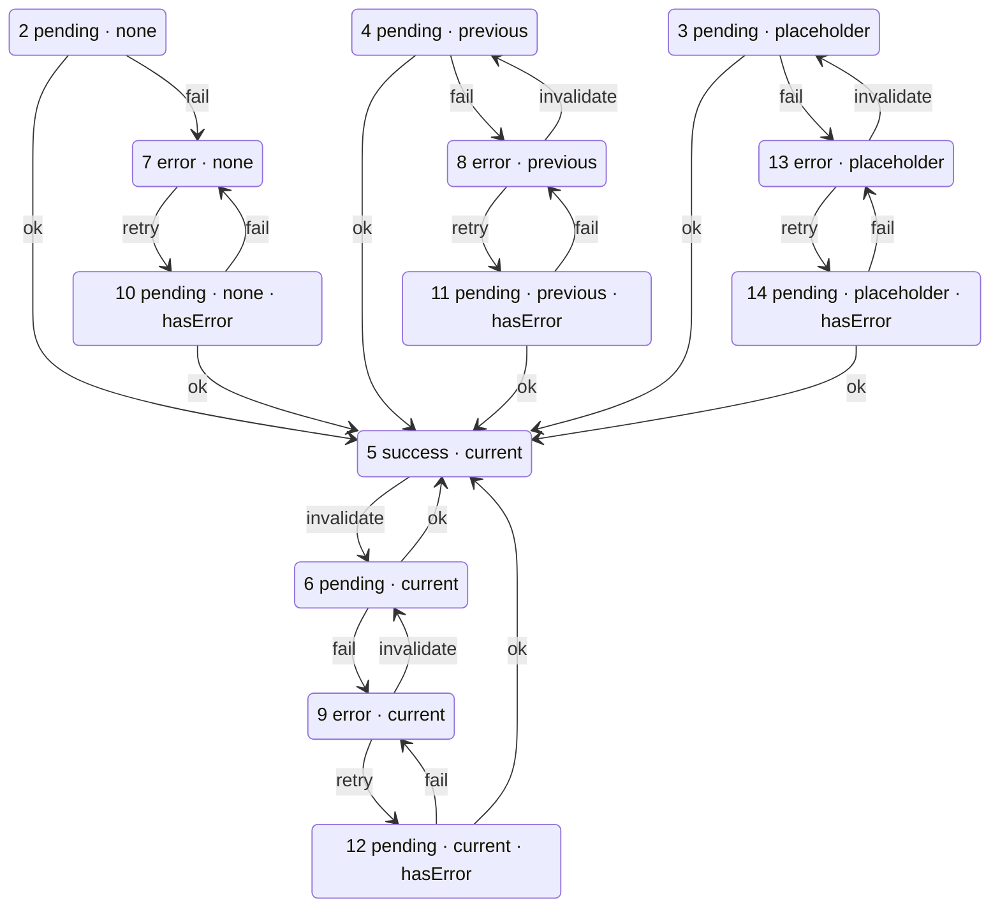

# Сцепление ресурса (ResourceClutch) — API

Сцепление — реактивный наблюдатель, транслирующий состояние [записи кэша][cache] в плоский сигнал с SWR-поведением. Концепция, жизненный цикл и SWR-fallback описаны в [concepts/clutch.md][clutch-concept].


## Создание

```typescript
const clutch = usersResource.createClutch();
```

Метод `createClutch()` доступен у каждого [ресурса][api-res]. Сцепление создаётся без аргументов: сначала их задают через `switch(args)`, затем `start()` запускает запрос.


## Методы

| Метод | Сигнатура | Описание                                                                                                               |
|-------|-----------|------------------------------------------------------------------------------------------------------------------------|
| `state$` | `ReadonlySignal<TResourceClutchState<TArgs, TData, TError>>` | Сигнал состояния сцепления. |
| `start` | `() => void` | Переводит сцепление в «запущенное» состояние и запускает запрос для уже установленных через `switch` аргументов. Аргументов не принимает; если их ещё нет — запрос стартует со следующего `switch`. |
| `switch` | `(args: TArgsOrVoidOrSkip<TArgs>, options?: TClutchSwitchOptions) => void` | Устанавливает наблюдаемые args. До `start()` запрос не инициирует; после — смена args сразу запускает запрос для новых аргументов. При передаче `SKIP` сцепление переходит в `idle`. Необязательный `options.markPending` (по умолчанию `false`) заставляет ещё не запущенное сцепление отдавать `pending` вместо `idle`. |
| `adoptPrevious` | `(source: IResourceClutch<TArgs, TData, TError>) => void` | Переносит SWR-fallback с другого сцепления: текущую запись `source`, если в ней есть данные (`success` / `invalidating` / `invalidate-error`), иначе его собственный предыдущий слот. Для случаев, когда сцепление не мутируют через `switch`, а заменяют новым — так работают React-хуки (одно сцепление на набор args). `source` читается один раз и не удерживается; memo [`placeholderData`](./resource.md#placeholderdata) не переносится. |
| `retry` | `() => void` | Повторяет упавший запрос, не убирая ошибку с экрана: [строки](#варианты-состояния) 7 → 10, 8 → 11, 9 → 12, 13 → 14. Вне состояний ошибки — `console.warn` и no-op. |
| `invalidate` | `(options?: { inFlight?: TInFlightPolicy }) => void` | Перезапрашивает текущие args и снимает ошибку: строки 5 → 6, 8 → 4, 9 → 6, 13 → 3. Показанные данные остаются на экране, при неудаче сохраняются. Во время запроса в полёте — по `options.inFlight`, иначе по опции ресурса [`invalidateInFlight`](./resource.md#опции): `cancel` перезапускает запрос — строка не меняется (открытый в `success` стрим: 5 → 6); `trail` помечает запись, перезапрос — после settle; `join` — no-op, строка не меняется. См. [инвалидация в полёте][cache-inflight]. В строке 7, где перепроверять нечего, — `console.warn` и no-op (там нужен `retry()`). |
| `refresh` | `() => void` | **Deprecated.** Псевдоним `invalidate()`, удаление в 0.14.0. |
| `whenSettled` | `() => Promise<void>` | Промис момента, когда есть что отрисовать. См. [ниже](#whensettled). |
| `args` | `TArgs \| null` | Геттер: аргументы текущего наблюдения. Заполняется в `switch` (до `start`), сбрасывается в `null` при `SKIP`. |


## Состояние (TResourceClutchState)

`TResourceClutchState` — **дискриминированное объединение** по трём осям: `status`, `dataSource` и `hasError`. Каждый вариант несёт литеральные значения всех трёх, поэтому сужение работает по любой из них.

```typescript
const state = clutch.state$();

if (state.hasData) {
  state.data;  // TData — без `| null`
}
if (state.hasError) {
  state.error; // TError — без `| null`
}
```

| Поле | Тип | Описание |
|------|-----|----------|
| `status` | `TClutchStatus` | `'idle'` · `'pending'` · `'success'` · `'error'`. |
| `dataSource` | `'none' \| 'placeholder' \| 'previous' \| 'current'` | Откуда взяты `data`. См. [ниже](#datasource). |
| `data` | `TData \| null` | Данные, которые сцепление показывает. Есть они или нет, говорит `dataSource`, а не сравнение с `null`. |
| `dataArgs` | `TArgs \| null` | Аргументы, для которых загружены `data`. `null` у `none` и `placeholder` — плейсхолдер не загружался. |
| `args` | `TArgs \| null` | Аргументы, за которыми следит сцепление. `null` только в `idle`. |
| `error` | `TError \| null` | Ошибка последнего settle текущих `args`; живёт до следующего settle, поэтому переживает повтор. По умолчанию `unknown`; типизируется опцией API [`mapError`](./README.md#типизация-ошибок-maperror). |
| `isPending` | `boolean` | Запрос в полёте. |
| `isInitialLoading` | `boolean` | Запрос в полёте: показать нечего либо только плейсхолдер. |
| `isSwitching` | `boolean` | Запрос в полёте, на экране данные предыдущих args. |
| `isInvalidating` | `boolean` | Запрос в полёте поверх данных текущих args. |
| `hasData` | `boolean` | Есть что показать. |
| `hasError` | `boolean` | `error !== null`. |
| `retry` | `() => void` | Повторить упавший запрос, оставив ошибку на экране. |
| `invalidate` | `(options?: { inFlight?: TInFlightPolicy }) => void` | Перезапросить показанное, сняв ошибку. См. [методы](#методы). |
| `refresh` | `() => void` | **Deprecated.** Псевдоним `invalidate`, удаление в 0.14.0. |

### dataSource

`dataSource` — единственный источник истины о наличии данных: сам `TData` может быть `null`, поэтому по `data !== null` судить о них нельзя.

- `none` — показать нечего.
- `placeholder` — результат опции [`placeholderData`](./resource.md#placeholderdata); в кэш не попадает.
- `previous` — данные предыдущих args, удержанные при их смене (SWR).
- `current` — данные текущих args.

Приоритет показа: `current` → `placeholder` → `previous` → `none`.

### Флаги

Все флаги производные:

| Флаг | Формула |
|------|---------|
| `isPending` | `status === 'pending'` |
| `isInitialLoading` | `isPending && dataSource ∈ {none, placeholder}` |
| `isSwitching` | `isPending && dataSource === 'previous'` |
| `isInvalidating` | `isPending && dataSource === 'current'` |
| `hasData` | `dataSource !== 'none'` |
| `hasError` | `error !== null` |

`isInitialLoading + isSwitching + isInvalidating = isPending`: при запросе в полёте истинен ровно один из трёх. Повтор упавшего запроса в полёте — это `isPending && hasError`, отдельного флага у него нет.

Словарь: `pending` — запрос в полёте, «инвалидация» — запрос поверх уже показанных данных текущих args. Слово «fetching» в библиотеке не используется.

«Запрос в полёте» в этих флагах — с одной оговоркой: у записи, которую никто не [удерживает][cache-holds], `pending` может означать запрос, который прерван и уйдёт при следующем удержании, см. [инварианты](#инварианты).


## Варианты состояния

Номера строк заморожены: новые строки добавляются в конец, номера не переиспользуются. На них ссылаются [диаграмма переходов](#переходы) и таблицы этого документа.

| #  | Случай                                  | status  | dataSource  | hasData | hasError | isInitialLoading | isSwitching | isInvalidating |
|----|-----------------------------------------|---------|-------------|:-------:|:--------:|:----------------:|:-----------:|:--------------:|
| 1  | `SKIP` / нет args                       | idle    | none        | ✗       | ✗        | ✗                | ✗           | ✗              |
| 2  | первичная загрузка                      | pending | none        | ✗       | ✗        | ✓                | ✗           | ✗              |
| 3  | загрузка с плейсхолдером                | pending | placeholder | ✓       | ✗        | ✓                | ✗           | ✗              |
| 4  | новые args, данные предыдущих на экране | pending | previous    | ✓       | ✗        | ✗                | ✓           | ✗              |
| 5  | успех                                   | success | current     | ✓       | ✗        | ✗                | ✗           | ✗              |
| 6  | инвалидация текущих args                | pending | current     | ✓       | ✗        | ✗                | ✗           | ✓              |
| 7  | ошибка, показать нечего                 | error   | none        | ✗       | ✓        | ✗                | ✗           | ✗              |
| 8  | ошибка новых args, данные предыдущих    | error   | previous    | ✓       | ✓        | ✗                | ✗           | ✗              |
| 9  | инвалидация упала                       | error   | current     | ✓       | ✓        | ✗                | ✗           | ✗              |
| 10 | повтор из 7                             | pending | none        | ✗       | ✓        | ✓                | ✗           | ✗              |
| 11 | повтор из 8                             | pending | previous    | ✓       | ✓        | ✗                | ✓           | ✗              |
| 12 | повтор из 9                             | pending | current     | ✓       | ✓        | ✗                | ✗           | ✓              |
| 13 | ошибка, показан плейсхолдер             | error   | placeholder | ✓       | ✓        | ✗                | ✗           | ✗              |
| 14 | повтор из 13                            | pending | placeholder | ✓       | ✓        | ✓                | ✗           | ✗              |

Типы вариантов экспортируются: `TResourceClutchIdleState` (1), `TResourceClutchPendingNoneState` (2, 10), `TResourceClutchPendingPlaceholderState` (3, 14), `TResourceClutchPendingPreviousState` (4, 11), `TResourceClutchPendingCurrentState` (6, 12), `TResourceClutchSuccessState` (5), `TResourceClutchErrorState` (7, 8, 9, 13), а также объединение `TResourceClutchPendingState` по четырём pending-вариантам.

```typescript
// Порядок проверок: сначала «есть что показать», потом ошибка.
if (state.hasData) {
  return <List items={state.data} stale={state.isPending} />;
}
if (state.hasError) {
  return <ErrorPanel error={state.error} retrying={state.isPending} onRetry={state.retry} />;
}
return <Spinner />;
```


## Переходы

Номера — [строки состояния](#варианты-состояния). `ok` / `fail` — settle запроса.



`retry()` повторяет упавший запрос и **показывает ошибку** дальше; `invalidate()` перепроверяет показанное и **снимает** её. Оба перезапрашивают **текущие** args — в строке 8 те, что упали, а не те, чьи данные на экране. `retry()` вне нарисованных рёбер и `invalidate()` из строки 7 — `console.warn` и no-op, как у [записи кэша][cache]. `invalidate()` из строк с запросом в полёте ребра не рисует, но и не игнорируется — режим `inFlight` описан в [инвалидации в полёте][cache-inflight].

Строки 7, 8 и 13 — одно и то же состояние записи (`error`): чем они отличаются, знает только сцепление, потому что previous- и placeholder-данные записи не видны. Поэтому `invalidate()` из `error` запись принимает (это и есть рёбра 8 → 4 и 13 → 3), а строку 7, где перепроверять нечего, отклоняет само сцепление.

### Смена args

Новые args, которых нет в кэше. Столбец выбирает результат [`placeholderData`](./resource.md#placeholderdata) для новых args:

| Из строк              | `{ data }` | `null` или опции нет                                  |
|-----------------------|:----------:|-------------------------------------------------------|
| 1, 2, 7, 10           | 3          | 2                                                     |
| 3, 13, 14             | 3          | 4, если под плейсхолдером удерживался previous, иначе 2 |
| 4, 5, 6, 8, 9, 11, 12 | 3          | 4                                                     |

Под плейсхолдером previous не сбрасывается, а только скрыт — отсюда вторая строка таблицы.

Новые args, которые **есть** в кэше, дают сразу строку 5 (или 6, если запись устарела и уходит на перезапрос); `placeholderData` при попадании в кэш не вызывается.

### Инварианты

- `status === 'pending'` ⇔ запрос в полёте либо причитается записи. Второе бывает только у записи без [удержаний][cache-holds]: `invalidate()` в режиме `cancel` прерывает её запрос и лишь помечает её (`entry.isInvalidated`), статус записи остаётся `pending` / `invalidating`, а новый запрос уходит при следующем удержании. Работающее сцепление запись удерживает, поэтому у него такое состояние сразу сменяется запросом в полёте; видно оно в `resource.getState(args)`, который удержаний не создаёт. Сюда же относится ожидание ответа другой вкладки при [кросс-табовой синхронизации][usage-sync] — запроса в полёте ещё нет, но `queryFn` запустится, если ответа не будет.
- Для сужения `data` / `error` в строках 6, 10–12 и 14 дискриминант не `status`, а `dataSource` × `hasError`.
- `status === 'success'` ⇒ `dataSource === 'current'`, `hasError === false`.
- `status === 'error'` ⇒ `hasError === true`. Обратное неверно: строки 10–12 и 14.
- `status === 'idle'` ⇒ `dataSource === 'none'`, `hasError === false`.
- В строке 6 на экране свежие данные текущих args, а `status` уже `pending`: рендер данных гейтится по `hasData`, иначе `switch (status)` даст спиннер на каждой инвалидации.


## whenSettled

Резолвится, когда сцеплению есть что отрисовать: появились любые данные (`hasData` — свои, previous или плейсхолдер) или запрос упал, не оставив ничего на экране (`status === 'error'`). То же условие, по которому [Suspense-хук][suspense-hook] перестаёт подвешивать рендер. Не резолвятся только строки 1, 2 и 10.

- **Никогда не реджектится.** Ошибка читается из состояния.
- **Инстанс кэшируется** на одну фазу загрузки и сбрасывается после settle.
- **Инвалидация не подвешивает.** В строках 6 и 12 `status` — `pending`, но данные на экране есть, поэтому промис резолвится сразу.
- **`idle` не считается settled.** На сцеплении без аргументов или после `SKIP` промис не резолвится никогда.

Используется [Suspense-хуком][suspense-hook]; в прикладном коде нужен редко.


## См. также

- [Концепция сцепления][clutch-concept] — `dataSource`, SWR-fallback, SKIP, жизненный цикл
- [Ресурс — API][api-res] — создание ресурса, опция `placeholderData`, метод `createClutch()`
- [Использование ресурса][usage-res] — хук `useResource`, примеры, паттерны
- [Состояние записи запроса][entry-state] — пять статусов и переходы между ними


[clutch-concept]: ../concepts/clutch.md
[api-res]: ./resource.md
[usage-res]: ../usage/resource.md
[suspense-hook]: ../../usage/react/README.md#usesuspenseresource
[entry-state]: ../concepts/query-entry-state.md
[cache]: ../concepts/cache.md
[cache-inflight]: ../concepts/cache.md#инвалидация-в-полёте
[cache-holds]: ../concepts/cache.md#кто-удерживает-запись
[usage-sync]: ../usage/broadcast.md
