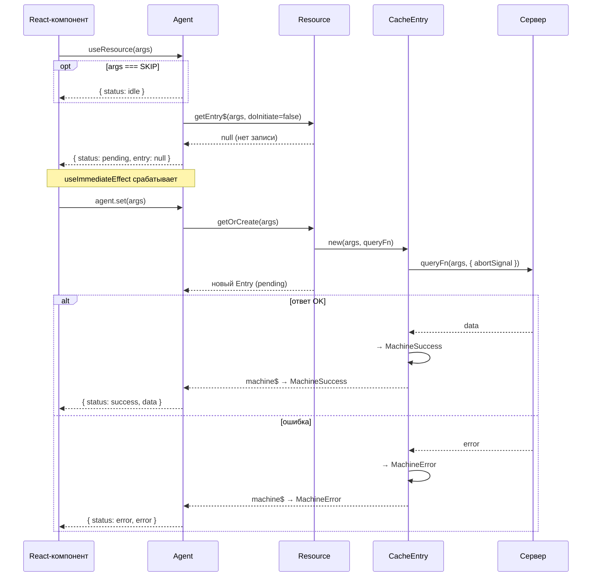
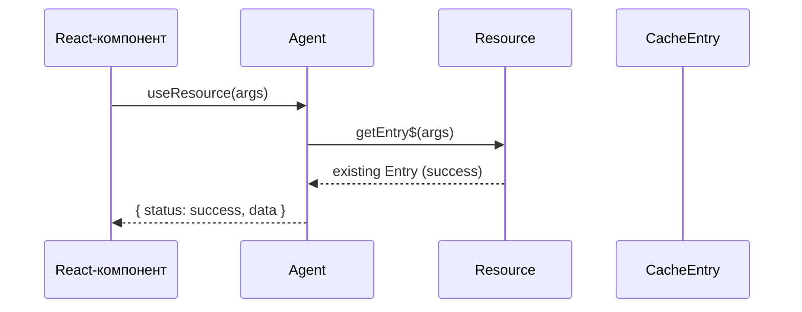

# Агент

Агент — SWR-наблюдатель, связывающий UI-компонент с [записью кеша][cache]. Он отслеживает текущую запись, транслирует её состояние в плоский реактивный сигнал и управляет переходами при смене аргументов. Агент используется как [ресурсами][usage-res], так и [командами][usage-cmd] — хуки `useResource` и `useCommand` создают его автоматически.

## SKIP и состояние idle

Специальный символ `SKIP` передаётся вместо аргументов, когда запрос выполнять не нужно — например, пока зависимые данные ещё не готовы. Агент переходит в состояние `idle`: запись кеша не создаётся, сетевой запрос не выполняется.

## SWR-fallback при смене аргументов

Агент хранит два слота: **текущая** и **предыдущая** запись. При смене аргументов:

1. Если предыдущая запись содержит данные (`success` / `refreshing`/`refreshing-error`), агент сохраняет их как устаревшие.
2. Пока новая запись в (`pending`/`error`), агент отдаёт устаревшие данные и выставляет статус `refreshing`.
3. Как только новая запись разрешается `success` — предыдущий слот очищается.

Благодаря этому UI показывает предыдущие данные вместо пустого состояния, пока новый запрос загружается.

## Статусы

Агент предоставляет шесть статусов:

- **idle** — передан `SKIP`, наблюдение не активно.
- **pending** — первичный запрос в процессе.
- **success** — данные получены.
- **error** — запрос завершился ошибкой.
- **refreshing** — фоновое обновление (SWR); устаревшие данные доступны.
- **refresh-error** — фоновое обновление завершилось ошибкой; устаревшие данные сохранены.

Статус `refresh-error` формируется на уровне агента: [машина][machine] возвращает `success` + `refreshError`, агент трансформирует это в единый статус.

Булевые флаги и полная таблица соответствий описаны в руководствах по [ресурсам][usage-res] и [командам][usage-cmd].

## Первый запрос (cache miss)

## Повторный запрос (cache hit)

## Связь с другими компонентами

- [Стейт-машина][machine] — состояние, которое агент транслирует из записи кеша.
- [Кеш][cache] — хранилище записей, за которыми наблюдает агент.
- [Использование ресурсов][usage-res] — хук `useResource` и полная таблица состояний.
- [Использование команд][usage-cmd] — хук `useCommand` и жизненный цикл мутаций.
- [API: createResource][api-res] — создание ресурса и его агента.
- [API: createCommand][api-cmd] — создание команды и её агента.

---

[machine]: machine.md
[cache]: cache.md
[usage-res]: ../usage/resource.md
[usage-cmd]: ../usage/command.md
[api-res]: ../api/resource.md
[api-cmd]: ../api/command.md
