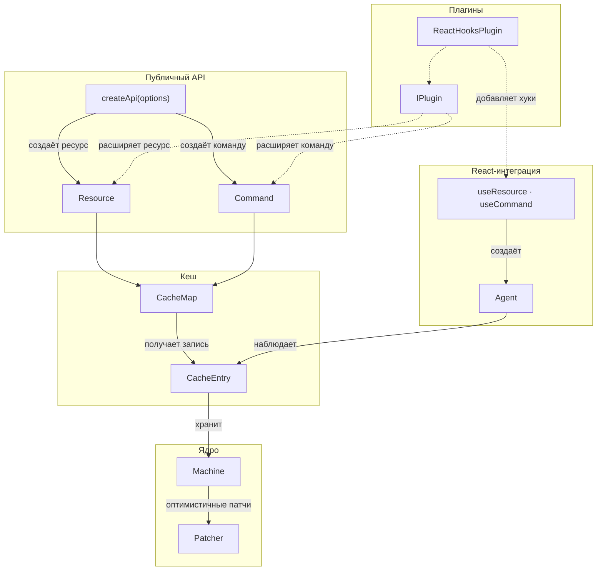

# Архитектура модуля Query

Документ описывает внутреннее устройство модуля Query: компоненты, их связи и поведение в runtime. Обзор возможностей и быстрый старт — в [README][readme].

## Диаграмма компонентов

Модуль состоит из пяти слоёв: публичный API, кеш, ядро, плагины и React-интеграция.

## Компоненты по слоям

Ниже — только то, что не очевидно из диаграммы.

### Публичный API

- **createApi** — принимает `plugins`, `initialSnapshot`, `resourceRetentionTime`, `commandRetentionTime` и другие опции уровня API. Помимо фабрик, предоставляет `.getSnapshot()` и `.resetAll()`.

### Кеш

- **CacheMap** — две стратегии индексации: `serialize` (аргументы → строка через `stableStringify`) и `compare` (ссылочное сравнение). Стратегия выбирается при создании ресурса. Сама карта — пассивный контейнер; вытеснение управляется событием `onClean$` записи.

- **CacheEntry** — публикует состояние через Signal + RxJS Observable. При отписке всех подписчиков запускается таймер (`retentionTime`, по умолчанию 60 с для ресурсов), после которого запись удаляется из `CacheMap`.

### Ядро

- **Machine** — иммутабельна: каждый переход возвращает новый экземпляр. Подробнее — [machine.md][machine].

### Плагины

- **IPlugin** — применяются при создании ресурса/команды, а не в рантайме. Методы `augment*` возвращают объект, который `Object.assign`-ится на экземпляр.

### React-интеграция

- **Agent** — при смене аргументов сохраняет предыдущие данные как fallback, пока новый запрос не завершится. Принимает специальное значение `SKIP` вместо аргументов — агент переходит в `idle`.

## Глоссарий

| Термин | Определение |
|--------|-------------|
| **Ресурс** (Resource) | Запрос на чтение данных с кешированием по аргументам. См. [usage/resource.md][usage-resource] |
| **Команда** (Command) | Побочное действие (мутация). По умолчанию не кешируется по аргументам. См. [usage/command.md][usage-command] |
| **Машина** (Machine) | Иммутабельная стейт-машина запроса: `pending → success / error → refreshing`. См. [machine.md][machine] |
| **Запись кеша** (CacheEntry) | Реактивный контейнер, хранящий одну машину. GC по refcount-таймеру. См. [cache.md][cache] |
| **Карта кеша** (CacheMap) | Коллекция записей, индексированных ключом (сериализация или ссылочное сравнение аргументов) |
| **Агент** (Agent) | SWR-наблюдатель, связывающий UI-компонент с записью кеша. См. [agent.md][agent] |
| **Патч** (Patch) | Оптимистичное обновление через Immer. Патчи накапливаются и ребейсятся при ответе сервера. См. [patching.md][patching] |
| **Снимок** (Snapshot) | Сериализуемый слепок успешных записей кеша для SSR/гидрации. См. [snapshot.md][usage-snapshot] |
| **Линк** (Link) | Декларативная связь между ресурсом/командой: обновление (refresh), оптимистичное обновление. См. [links.md][usage-links] |
| **Плагин** (Plugin) | Расширение, добавляющее методы на ресурс/команду при создании через API. См. [plugins.md][usage-plugins] |
| **`SKIP`** | Специальный символ, который передаётся вместо аргументов, чтобы отложить запрос. Агент переходит в `idle` |

[readme]: ../README.md
[machine]: machine.md
[cache]: cache.md
[agent]: agent.md
[patching]: patching.md
[usage-resource]: ../usage/resource.md
[usage-command]: ../usage/command.md
[usage-snapshot]: ../usage/snapshot.md
[usage-links]: ../usage/links.md
[usage-plugins]: ../usage/plugins.md
