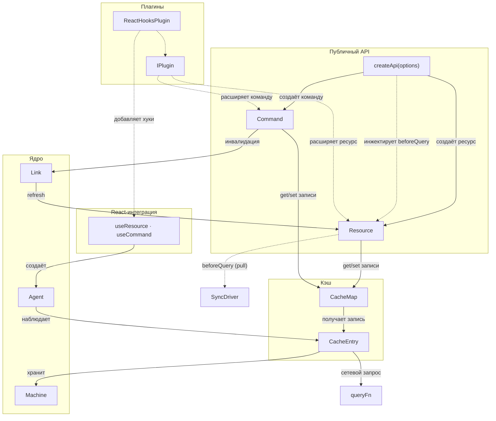

# Архитектура модуля Query

Документ описывает внутреннее устройство модуля Query: компоненты, их связи и поведение в runtime. Обзор возможностей и быстрый старт — в [README][readme].

## Диаграмма компонентов

Модуль состоит из пяти слоёв: публичный API, кэш, ядро, плагины и React-интеграция.

## Компоненты по слоям

Ниже — только то, что не очевидно из диаграммы.

### Публичный API

- **createApi** — принимает `plugins`, `initialSnapshot`, `resourceRetentionTime`, `commandRetentionTime` и другие опции уровня API. Помимо фабрик, предоставляет `.getSnapshot()` и `.resetAll()`.

### Кэш

- **CacheMap** — пассивный контейнер.

- **CacheEntry** — публикует состояние через Signal + RxJS Observable. При отписке всех подписчиков запускается таймер (`retentionTime`, по умолчанию 60 с для ресурсов), после которого запись удаляется из `CacheMap`.

### Ядро

- **Machine** — иммутабельна: каждый переход возвращает новый экземпляр. Патчинг (оптимистичные обновления через Immer) выполняется на уровне записи/машины. Подробнее — [machine.md][machine].
- **Agent** — SWR-наблюдатель, связывающий потребителя с записью кэша. Создаётся как хуками (`useResource`, `useCommand`), так и программно (`createAgent()`). При смене аргументов сохраняет предыдущие данные как fallback. Подробнее — [agent.md][agent].
- **Link** — декларативная связь между командой и ресурсом: инвалидация и оптимистичные обновления после мутации. Подробнее — [links.md][usage-links].

### Плагины

- **IPlugin** — применяются при создании ресурса/команды, а не в рантайме. Методы `augment*` возвращают объект, который `Object.assign`-ится на экземпляр.

### React-интеграция

- **useResource / useCommand** — React-хуки, создающие [агент][agent] и подписывающиеся на его состояние.

### Внешние границы

- **queryFn** — пользовательская функция запроса данных. Вызывается записью кэша для получения данных с сервера. Для ресурсов принимает `(args, abortSignal)`, для команд — `(args)`.

- **SyncDriver** — абстракция кросс-табовой синхронизации кэша. Работает по PULL-модели: перед выполнением `queryFn` ресурс вызывает внутренний хук `beforeQuery`, инжектированный `createApi` при создании ресурса. Через `beforeQuery` ресурс запрашивает данные у других табов (REQ). Если другой таб отвечает (RES), запись гидрируется в success-состояние и `queryFn` не вызывается. Если ответа нет — `queryFn` выполняется штатно. `SyncDriver` не связан с `CacheMap` или записями кэша напрямую. Встроенная реализация — `broadcastSyncDriver` на основе BroadcastChannel API. Подробнее — [broadcast.md][usage-broadcast].

## Глоссарий

| Термин | Определение |
|--------|-------------|
| **Ресурс** (Resource) | Запрос на чтение данных с кэшированием по аргументам. См. [usage/resource.md][usage-resource] |
| **Команда** (Command) | Побочное действие (мутация). По умолчанию не кэшируется по аргументам. См. [usage/command.md][usage-command] |
| **Машина** (Machine) | Иммутабельная машина состояний запроса. См. [machine.md][machine] |
| **Запись кэша** (CacheEntry) | Реактивный контейнер, хранящий одну машину. GC по retention-таймеру. См. [cache.md][cache] |
| **Карта кэша** (CacheMap) | Коллекция записей, индексированных ключом (сериализация или ссылочное сравнение аргументов) |
| **Агент** (Agent) | SWR-наблюдатель, связывающий UI-компонент с записью кэша. См. [agent.md][agent] |
| **Патч** (Patch) | Оптимистичное обновление через Immer. Патчи накапливаются и ребейсятся при ответе сервера. См. [patching.md][patching] |
| **Снимок** (Snapshot) | Сериализуемый слепок успешных записей кэша для SSR/гидрации. См. [snapshot.md][usage-snapshot] |
| **Связь** (Link) | Декларативная связь между ресурсом/командой: обновление (refresh), оптимистичное обновление. См. [links.md][usage-links] |
| **Плагин** (Plugin) | Расширение, добавляющее методы на ресурс/команду при создании через API. См. [plugins.md][usage-plugins] |
| **`SKIP`** | Специальный символ, который передаётся вместо аргументов, чтобы отложить запрос. Агент переходит в `idle` |
| **queryFn** | Пользовательская функция запроса/мутации. Для ресурсов: `(args, abortSignal) => Promise<TData>`, для команд: `(args) => Promise<TData>` |
| **Keyed-аргументы** (keyedArgs) | Аргументы, обёрнутые в `Keyed<TArgs>` — пара `{ value, key }` с предвычисленным ключом кэша. См. [keyed.md][keyed] |
| **Время удержания** (retentionTime) | Время (мс) удержания записи кэша после потери подписчиков. По умолчанию 60 с для ресурсов, 0 для команд |
| **SyncDriver** | Абстракция кросс-табовой синхронизации (PULL-модель через `beforeQuery`). Не связан с `CacheMap` или записями напрямую. Встроенная реализация — `broadcastSyncDriver`. См. [broadcast.md][usage-broadcast] |

## См. также

- [Потоки данных][dataflows] — подробные sequence-диаграммы всех сценариев (cache miss/hit, refresh, мутации, инвалидация)
- [Кэш][cache] — устройство CacheMap и CacheEntry, retention-таймер, GC
- [Машина состояний][machine] — иммутабельная машина состояний запроса, переходы и патчинг
- [Агент][agent] — SWR-наблюдатель, fallback-данные, подписки
- [Кросс-табовая синхронизация][usage-broadcast] — broadcastSyncDriver, настройка SyncDriver
- [Плагины][usage-plugins] — IPlugin, расширение ресурсов и команд

[readme]: ../README.md
[machine]: machine.md
[cache]: cache.md
[agent]: agent.md
[patching]: patching.md
[usage-resource]: ../usage/resource.md
[usage-command]: ../usage/command.md
[usage-snapshot]: ../usage/snapshot.md
[usage-links]: ../usage/links.md
[usage-plugins]: ../usage/plugins.md
[usage-broadcast]: ../usage/broadcast.md
[dataflows]: dataflows.md
[keyed]: keyed.md
