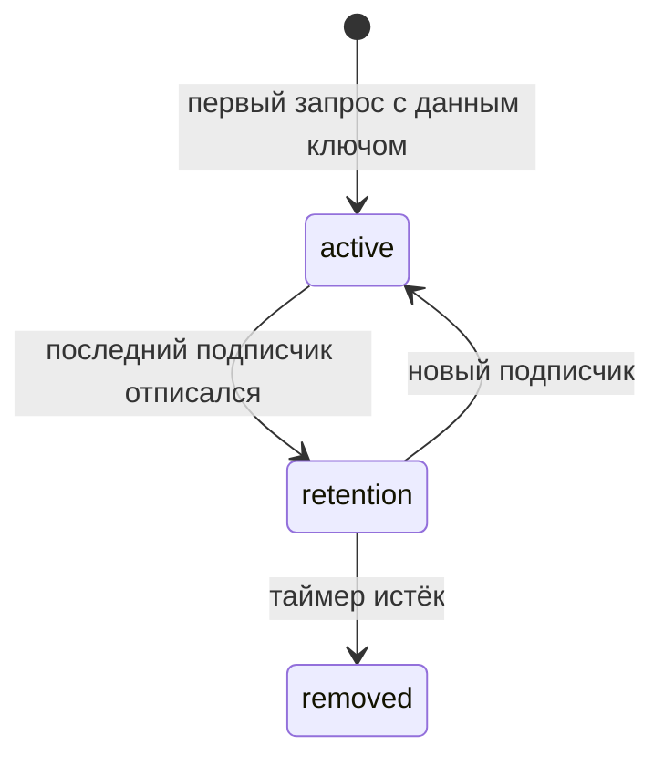

# Система кэширования

Кэш хранит результаты запросов и отдаёт их мгновенно при повторном обращении с тем же ключом. Каждый ресурс или команда владеет собственной картой кэша (CacheMap), где записи индексируются по строковому ключу.

## Запись кэша (CacheEntry)

Запись — реактивный контейнер, хранящий один экземпляр [машины][machine]. При каждом переходе машины запись публикует новое состояние подписчикам.

**Статусы записи:**
- **active** — у записи есть хотя бы один подписчик; запись живёт в карте кэша.
- **retention** — подписчиков нет; запущен таймер удержания ([`retentionTime`][api-res]).
- **removed** — таймер истёк; запись удалена из `CacheMap`.

## Ключ кэша

Ключ кэша - строка.

## Время удержания записи

Параметр `retentionTime` определяет, сколько запись остаётся в кэше после отписки последнего подписчика.

| Значение | Поведение |
|----------|-----------|
| произвольное `number` | Запись удаляется через указанное количество миллисекунд |
| `false` | Запись никогда не удаляется автоматически |

Задаётся на уровне [API][api] и может быть переопределён для конкретного [ресурса][api-res] или [команды][api-cmd].

## Записи, созданные через синхронизацию

Когда компонент подписывается на ключ, отсутствующий в локальном кэше,
    хук `beforeQuery` отправляет REQ-сообщение через BroadcastChannel. 
Если другая вкладка располагает данными для этого ключа, 
    она отвечает RES-сообщением.
Запись гидрируется в состоянии `success` с полученными данными,
    и `queryFn` не вызывается — это обеспечивает мгновенный кэш-хит при монтировании компонента.

**Поведение по умолчанию:**

| Тип       | `sync` | Создаётся запись? | Причина                                |
|-----------|--------|-------------------|----------------------------------------|
| Resource  | `false`| нет               | sync отключён по умолчанию (`defaultSync: 'none'`) |
| Command   | `false`| нет               | sync отключён по умолчанию (`defaultSync: 'none'`) |

Для включения синхронизации укажите `defaultSync` в `createApi` или `sync: true` для конкретной сущности.

Такая запись подчиняется обычным правилам удержания:
    когда последний подписчик отписывается, 
    запись переходит в `retention` и удаляется по истечении `retentionTime`.

**Особенности:**
- `onCacheEntryAdded` **вызывается** — запись попала в кэш.
- `onQueryStarted` **не вызывается** — `queryFn` не исполнялся.
- Сравнение `updatedAt` предотвращает перезапись более свежих локальных данных устаревшим RES-сообщением.

## См. также

- Запись хранит [машину][machine] — иммутабельную машину состояний запроса.
- [Агент][agent] наблюдает за записью и транслирует её состояние (например в UI).
- Оптимистичные обновления применяются через [патчи][patching] внутри записи.
- Хук `onCacheEntryAdded` вызывается при создании записи — подробнее в [lifecycle][lifecycle].
- Данные из другой вкладки могут быть получены через [кросс-табовую синхронизацию][broadcast] (pull-модель: `beforeQuery` отправляет REQ, другая вкладка отвечает RES; SyncDriver управляется отдельным слоем Plugin/Manager, а не CacheMap напрямую).

---

[machine]: machine.md
[broadcast]: ../usage/broadcast.md
[agent]: agent.md
[patching]: patching.md
[api]: ../api/README.md
[api-res]: ../api/resource.md
[api-cmd]: ../api/command.md
[lifecycle]: ../usage/lifecycle.md
