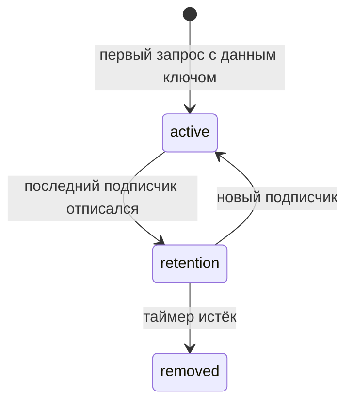

# Система кеширования

Кеш хранит результаты запросов и отдаёт их мгновенно при повторном обращении с тем же ключом. Каждый ресурс или команда владеет собственной картой кеша (CacheMap), где записи индексируются по строковому ключу.

## Запись кеша (CacheEntry)

Запись — реактивный контейнер, хранящий один экземпляр [машины][machine]. При каждом переходе машины запись публикует новое состояние подписчикам.

**Статусы записи:**
- **active** — у записи есть хотя бы один подписчик; запись живёт в карте кеша.
- **retention** — подписчиков нет; запущен таймер удержания ([`retentionTime`][api-res]).
- **removed** — таймер истёк; запись удалена из `CacheMap`.

## Ключ кеша

**Ресурсы** — аргументы запроса преобразуются в строковый ключ функцией `serializeArgs` (по умолчанию — `stableStringify`). Функцию сериализации можно переопределить на уровне [API][api] или отдельного [ресурса][api-res].

**Команды** — ключ передаётся явно при вызове. Сериализация не применяется.

## Время жизни записи

Параметр `retentionTime` определяет, сколько запись остаётся в кеше после отписки последнего подписчика.

| Значение | Поведение |
|----------|-----------|
| произвольное `number` | Запись удаляется через указанное количество миллисекунд |
| `false` | Запись никогда не удаляется автоматически |

Задаётся на уровне [API][api] и может быть переопределён для конкретного [ресурса][api-res] или [команды][api-cmd].

## Связь с другими компонентами

- Запись хранит [машину][machine] — иммутабельную стейт-машину запроса.
- [Агент][agent] наблюдает за записью и транслирует её состояние (например в UI).
- Оптимистичные обновления применяются через [патчи][patching] внутри записи.
- Хук `onCacheEntryAdded` вызывается при создании записи — подробнее в [lifecycle][lifecycle].

---

[machine]: machine.md
[agent]: agent.md
[patching]: patching.md
[api]: ../api/README.md
[api-res]: ../api/resource.md
[api-cmd]: ../api/command.md
[lifecycle]: ../usage/lifecycle.md
[snapshot]: ../usage/snapshot.md
