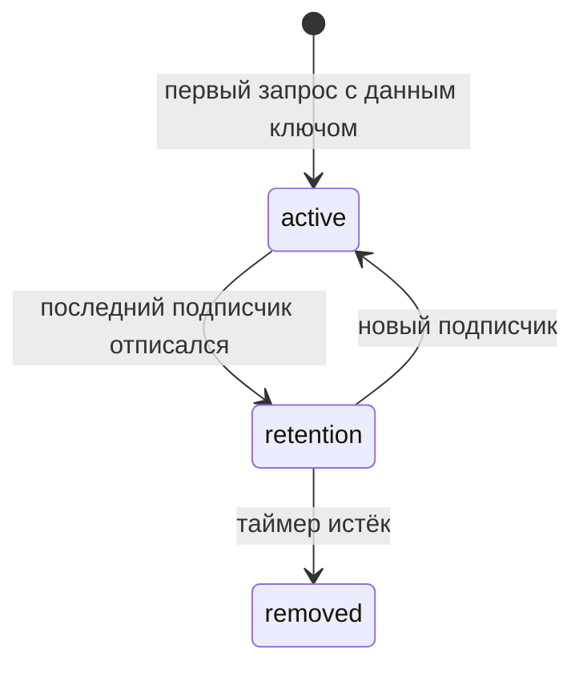

# Система кэширования

Кэш хранит результаты запросов и отдаёт их мгновенно при повторном обращении с тем же ключом. Каждый ресурс или команда владеет собственной картой кэша, где записи индексируются по строковому ключу.

## Запись кэша (CacheEntry)

Запись — реактивный контейнер, хранящий одно [состояние запроса][entry-state]. При каждом переходе запись публикует новое состояние подписчикам.


```mermaid
stateDiagram-v2
    [*] --> active : первый запрос с данным ключом
    active --> retention : последний подписчик отписался
    retention --> active : новый подписчик
    retention --> removed : таймер истёк
```
**Статусы записи:**
- **active** — у записи есть хотя бы один подписчик; запись живёт в карте кэша.
- **retention** — подписчиков нет; запущен таймер удержания ([`retentionTime`](#время-удержания-записи)).
- **removed** — таймер истёк; запись удалена из карты кэша.

## Ключ кэша

Ключ кэша - строка.


## Время удержания записи

Параметр `retentionTime` определяет, сколько запись остаётся в кэше после отписки последнего подписчика. Значение — число миллисекунд, `false` или функция `(args, state) => number | false`, решающая это для конкретной записи.

Задаётся на уровне [API][api] и может быть переопределён для конкретного [ресурса][api-res] или [команды][api-cmd]: опция ресурса или команды заменяет опцию API целиком, функция уровня API тогда не вызывается.

### Момент вычисления

Функцию вызывает переход `active → retention` с диаграммы выше — синхронно внутри отписки последнего подписчика. Результат действует на один цикл удержания: новый подписчик отменяет таймер, а следующая потеря подписчиков вызывает функцию заново, с актуальным на тот момент `state`. Функция должна быть чистой и дешёвой: она исполняется в teardown подписки.

`state` — снимок состояния записи на момент вызова. Вариант `idle` в него не входит: запись, у которой вычисляется удержание, уже существует.

| Сущность           | `args`                            | `state`                                                                                             |
|--------------------|-----------------------------------|-----------------------------------------------------------------------------------------------------|
| [Ресурс][api-res]  | аргументы записи                  | `TResourceEntryState` — то же состояние, что возвращает [`resource.getState(args)`][res-get-state]   |
| [Команда][api-cmd] | аргументы записи                  | `TCommandEntryState` — [состояние сцепления команды][cmd-clutch-state] без метода `retry()`          |

Для ресурса `state` может быть `pending`: запрос в полёте, но потребителей у него не осталось. Истёкший таймер в этом случае прерывает `queryFn` через его `AbortSignal` — как и при статическом значении. Для команды **первое** вычисление всегда видит `success` или `error`: `Command.execute` удерживает запись живой до завершения мутации. Повтор через `retry()` так не удерживается — если последний подписчик уходит, пока повтор в полёте, функция получит `pending` с `hasError: true`.

Синхронное чтение подписчиком не является: [`resource.getState(args)`][res-get-state] и прочие read-only обращения к записи не вызывают функцию и не перезапускают уже идущий отсчёт. Цикл удержания начинает только реальная потеря подписчиков.

Точки срабатывания не меняются: гидрация из [снимка][snapshot], `ensure` / `fetch` / `prefetch` и кросс-табовая синхронизация ведут себя так же, как со статическим значением. В частности, `ensure` / `fetch` / `prefetch` **касаются** записи: каждый вызов подписывается на неё до резолва и, отпуская подписку, начинает новый цикл удержания — то есть заново вычисляет функцию и перезапускает отсчёт. На уже готовой записи это происходит в том же тике.

### Нормализация результата

Нормализация применяется и к статическому значению.

| Результат функции или статическое значение | Поведение                                                   |
|--------------------------------------------|---------------------------------------------------------------|
| `false`, `Infinity`, `> 2_147_483_647`     | Таймер не ставится: запись живёт до `reset` / `complete`      |
| `0 ≤ v ≤ 2_147_483_647`                    | Запись удаляется через `v` мс                                 |
| `< 0`, `NaN`                               | Трактуется как `0`                                            |
| Функция бросила                            | `console.error` с ключом записи, дальше — как `0`             |

`Infinity` и значения выше предела `setTimeout` означают «не ставить таймер» начиная с 0.13.0; до неё такой таймер переполнял 32-битный счётчик, срабатывал немедленно и удалял запись вместо того, чтобы удерживать её.

Исключение из функции наружу не выпускается: оно всплыло бы у отписывающегося потребителя как `UnsubscriptionError`.

### Примеры

```typescript
// Политика уровня API: упавшие записи выбрасываем сразу, успешные удерживаем
const api = createApi({
    resourceRetentionTime: (_args, state) => (state.hasError ? 0 : 60_000),
});

// Один ресурс, два класса аргументов: список удерживаем, отдельный элемент — нет
const users = api.createResource<{ id?: number }, User[]>({
    queryFn: ({ id }) => (id == null ? fetchUsers() : fetchUsersByIds([id])),
    retentionTime: (args) => (args.id == null ? 60_000 : 0),
});
```

## Записи, созданные через синхронизацию

Когда компонент подписывается на ключ, отсутствующий в локальном кэше,
    хук `beforeQuery` отправляет REQ-сообщение через BroadcastChannel. 
Если другая вкладка располагает данными для этого ключа, 
    она отвечает RES-сообщением.
Запись гидрируется в состоянии `success` с полученными данными,
    и `queryFn` не вызывается — это обеспечивает мгновенный кэш-хит при монтировании компонента.

**Поведение по умолчанию:**

| Тип       | `sync` | Создаётся запись? | Причина                                |
|-----------|--------|-------------------|----------------------------------------|
| Resource  | `false`| нет               | sync отключён по умолчанию (`defaultSync: 'none'`) |
| Command   | `false`| нет               | sync отключён по умолчанию (`defaultSync: 'none'`) |

Для включения синхронизации укажите `defaultSync` в `createApi` или `sync: true` для конкретной сущности.

Такая запись подчиняется обычным правилам удержания:
    когда последний подписчик отписывается, 
    запись переходит в `retention` и удаляется по истечении `retentionTime`.

**Особенности:**
- `onCacheEntryAdded` **вызывается** — запись попала в кэш.
- `onQueryStarted` **не вызывается** — `queryFn` не исполнялся.
- Сравнение `updatedAt` предотвращает перезапись более свежих локальных данных устаревшим RES-сообщением.

## См. также

- Запись хранит [состояние запроса][entry-state] — иммутабельную запись со статусом, данными и ошибкой.
- [Сцепление][clutch] наблюдает за записью и транслирует её состояние (например в UI).
- Оптимистичные обновления применяются через [патчи][patching] внутри записи.
- Хук `onCacheEntryAdded` вызывается при создании записи — подробнее в [lifecycle][lifecycle].
- Данные из другой вкладки могут быть получены через [кросс-табовую синхронизацию][broadcast] (pull-модель: `beforeQuery` отправляет REQ, другая вкладка отвечает RES; SyncDriver управляется отдельным слоем Plugin/Manager, а не картой кэша напрямую).

---

[entry-state]: query-entry-state.md
[broadcast]: ../usage/broadcast.md
[clutch]: clutch.md
[patching]: patching.md
[api]: ../api/README.md
[api-res]: ../api/resource.md
[api-cmd]: ../api/command.md
[res-get-state]: ../api/resource.md#getstate
[cmd-clutch-state]: ../api/command-clutch.md#состояние-tcommandclutchstate
[snapshot]: ../usage/snapshot.md
[lifecycle]: ../usage/lifecycle.md
