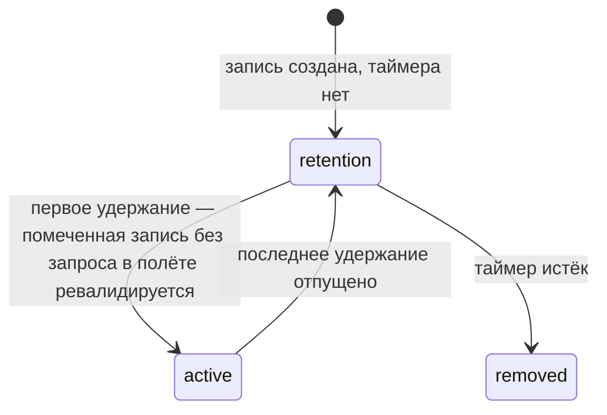

# Система кэширования

Кэш хранит результаты запросов и отдаёт их мгновенно при повторном обращении с тем же ключом. Каждый ресурс или команда владеет собственной картой кэша, где записи индексируются по строковому ключу.

## Запись кэша (CacheEntry)

Запись — реактивный контейнер, хранящий одно [состояние запроса][entry-state]. При каждом переходе запись публикует новое состояние подписчикам.

Жизненным циклом записи управляет **удержание** (`hold`). Подписка на запись — тоже удержание: подписчик `entry.obs` или `entry.state$` в подписанном реактивном контексте удерживает запись ровно как явный [`entry.hold()`][api-entry-hold].


```mermaid
stateDiagram-v2
    [*] --> retention : запись создана, таймера нет
    retention --> active : первое удержание — помеченная запись без запроса в полёте ревалидируется
    active --> retention : последнее удержание отпущено
    retention --> removed : таймер истёк
```
**Статусы записи:**
- **active** — запись удерживается хотя бы одним потребителем; `entry.isMelting === false`.
- **retention** — «тающая» запись: удержаний нет; `entry.isMelting === true`. Запись рождается тающей — без таймера: таймер удержания ([`retentionTime`](#время-удержания-записи)) взводит только переход `active → retention`, так что запись, которую никто ни разу не удерживал, не удаляется.
- **removed** — таймер истёк; запись удалена из карты кэша.

### Кто удерживает запись

| Потребитель                                                                                        | Удерживает    |
|----------------------------------------------------------------------------------------------------|---------------|
| `useResource`, `useSuspenseResource`, `useInfiniteResource` — [сцепление][clutch] под `useSignal`  | да            |
| `Signal.effect` / подписанный `Signal.compute`, читающие `entry.state$()` или `clutch.state$()`    | да            |
| `entry.obs.subscribe(…)`, `entry.hold()`                                                           | да            |
| `ensure` / `prefetch` / `fetch` (`whenLoaded` / `whenFetched`)                                     | да, пока ждут |
| `Command.execute`                                                                                  | да, до завершения мутации |
| подписанное сцепление — предыдущую запись, пока показывает её как SWR-фолбэк (`dataSource: "previous"`) | да            |
| `entry.peek()`, `entry.state$.peek()`, `resource.getState(args)`, `clutch.state$.peek()`           | нет           |
| `entry.state$()` внутри `Signal.compute`, на который никто не подписан                             | нет           |
| `getEntry(args, true)`, `clutch.start()` без подписки, `getEntry$` без чтения в подписке           | нет           |
| связи, [синхронизация][broadcast], [снимки][snapshot], devtools                                    | нет           |

Строки с «нет» удержания не создают: таймер не трогают, помеченную запись не ревалидируют. `peek()` и `getState()` — снимки без побочных эффектов.

### Инвалидация тающей записи

`invalidate()` — на ресурсе, записи, сцеплении или через [связь][links] — никогда не проваливается: он либо запускает перезапрос, либо ставит метку.

| Запись                                                | `invalidate()`                                                                                                                                                                                  |
|-------------------------------------------------------|-------------------------------------------------------------------------------------------------------------------------------------------------------------------------------------------------|
| active                                                | перезапрос сразу: `success` / `invalidate-error` → `invalidating`, `error` → `pending` — переходы в [состоянии записи][entry-state]                                                              |
| retention                                             | метка `entry.isInvalidated === true`, запроса нет; перезапрос — на переходе `retention → active`, до подключения подписчика: первый снимок, который тот получает, — уже состояние в полёте (`invalidating`, для `error` — `pending`) |
| запрос в полёте                                       | по режиму `inFlight` — [инвалидация в полёте](#инвалидация-в-полёте)                                                                                                                       |
| запись команды                                        | `console.warn` и no-op                                                                                                                                                                    |

Повторный `invalidate()` на помеченной записи без запроса в полёте — no-op; если метка стоит из-за запроса, который дорабатывает (`trail`), режим повторного вызова к нему применяется: `{ inFlight: 'cancel' }` прервёт его. `retry()` метку снимает: новый запуск даст свежий результат. `isInvalidated` — свойство записи, в [`getState()`][res-get-state] и состояние сцепления оно не попадает: наблюдаемая запись ревалидируется в момент подписки, и наблюдатель видит `invalidating`.

Так же рождается запись из устаревшего [снимка][snapshot]: `success` с меткой, тающая; запрос уходит при первом удержании, а не в момент `createApi`.

#### Инвалидация в полёте

Запрос, ушедший до мутации, может привезти данные «до мутации», и после settle запись считалась бы свежей. Поэтому `invalidate()` на записи с запросом в полёте не игнорируется, а работает в одном из трёх режимов:

| `inFlight` | active                                                                                   | retention                                                                                                      |
|------------|------------------------------------------------------------------------------------------|----------------------------------------------------------------------------------------------------------------|
| `cancel`   | текущий запрос прерывается (`AbortSignal`), сразу уходит новый; `pending` / `invalidating` сохраняются, открытый в `success` [стрим][stream-query-invalidate] → `invalidating` | текущий запрос прерывается, метка; статус остаётся `pending` / `invalidating` (для стрима — и `success`), новый запрос — на первом удержании |
| `trail`    | метка; текущий запрос дорабатывает, перезапрос — после его settle                        | метка; текущий запрос дорабатывает; перезапрос — на удержании после его settle                                  |
| `join`     | no-op: запрос дорабатывает, метки нет, после settle перезапроса нет — если он [приземлил данные](#запрос-вышел-из-полёта-без-данных) | no-op: метки нет, удержание после settle ничего не запускает                                                    |

`cancel` гарантирует, что результат получен после инвалидации; `trail` не прерывает запрос; `join` принимает результат текущего запроса как ответ на инвалидацию — вместе с риском: запрос, ушедший до мутации, привезёт данные «до мутации», и они осядут как свежие. `join` годится, только когда запрос в полёте заведомо достаточно свежий; `console.warn` он не пишет — это осознанный выбор. Записи без запроса в полёте режим не касается: она ведёт себя по таблице выше.

`cancel` и `trail` — одно правило: **перезапрос происходит, когда запись удерживается, запроса в полёте нет и стоит метка.** Оно проверяется в трёх точках: при первом удержании, при settle любого запроса и в самом `invalidate()`. Для [стрима][stream-query] «в полёте» — открытая подписка, а не только ожидание первой эмиссии; таблица — в [стриминговых запросах][stream-query-invalidate]. Опрос других вкладок холодной записью ([синхронизация][broadcast]) — тоже запрос в полёте: ответ или `queryFn`, в который опрос переходит без ответа, — один запуск.

#### Запрос вышел из полёта без данных

Запрос может покинуть полёт сам — промис завершился, стрим закончился, — не приземлив загрузку, которой ждёт запись: например, [отброшенный ребейз][patching] под `join`, после которого стрим завершился без новой эмиссии. Запись, оставшаяся в `pending` / `invalidating` без запроса в полёте, помечается (`isInvalidated`) и дальше идёт по правилу выше: удерживаемая перезапрашивается сразу, тающая — при первом удержании. Перезапрос отвечает на ту же инвалидацию, по её режиму. Поэтому запись не остаётся в `pending` / `invalidating` без запроса в полёте и без метки, и `fetch` / `prefetch(args, { force: true })` / сцепление не ждут вечно.

Откуда берётся режим:

| Источник инвалидации                                                | `inFlight`                                                              |
|---------------------------------------------------------------------|-------------------------------------------------------------------------|
| `resource.invalidate(args, { inFlight })`, `clutch.invalidate({ inFlight })` | параметр вызова, иначе опция ресурса [`invalidateInFlight`][api-res-inflight] (по умолчанию `cancel`) |
| [связь][links] `invalidate: true \| { inFlight }`                   | конфиг связи, иначе опция ресурса; `true` ≡ `{}`                        |
| нарушение консистентности [патчей][patching]                        | опция ресурса, как есть — `join` включительно: открытый стрим или запрос в полёте считается ответом |
| `fetch(args, { inFlight })`, `prefetch(args, { force: true, inFlight })` | параметр вызова, по умолчанию `cancel` — **не** опция ресурса: `fetch` просит свежий результат. `cancel` — запрос прерывается, ожидается новый; `trail` — дорабатывает, ожидается следующий (его исход пропускается); `join` — ожидается его результат. [Стрим][stream-query-invalidate], открытый в `success`, — тоже запрос в полёте |

У [проекционного ресурса][projection-invalidation] запуск набора — живая проекция кэша элементов — при инвалидации не перезапускается: режим применяется к запросам обёрнутого ресурса за id набора, а метка остаётся только у набора без удержаний.

## Ключ кэша

Ключ кэша - строка.


## Время удержания записи

Параметр `retentionTime` определяет, сколько запись остаётся в кэше без удержаний. Значение — число миллисекунд, `false` или функция `(args, state) => number | false`, решающая это для конкретной записи.

Задаётся на уровне [API][api] и может быть переопределён для конкретного [ресурса][api-res] или [команды][api-cmd]: опция ресурса или команды заменяет опцию API целиком, функция уровня API тогда не вызывается.

### Момент вычисления

Функцию вызывает переход `active → retention` с [диаграммы записи](#запись-кэша-cacheentry) — синхронно внутри отпускания последнего удержания. При создании записи функция не вызывается и таймер не взводится: запись, которую никто ни разу не удерживал, не вычисляется и не удаляется. Результат действует на один цикл удержания: новое удержание отменяет таймер, а следующая потеря удержаний вызывает функцию заново, с актуальным на тот момент `state`. Функция должна быть чистой и дешёвой: она исполняется в teardown подписки.

`state` — снимок состояния записи на момент вызова. Вариант `idle` в него не входит: запись, у которой вычисляется удержание, уже существует.

| Сущность           | `args`                            | `state`                                                                                             |
|--------------------|-----------------------------------|-----------------------------------------------------------------------------------------------------|
| [Ресурс][api-res]  | аргументы записи                  | `TResourceEntryState` — то же состояние, что возвращает [`resource.getState(args)`][res-get-state]   |
| [Команда][api-cmd] | аргументы записи                  | `TCommandEntryState` — [состояние сцепления команды][cmd-clutch-state] без метода `retry()`          |

Для ресурса `state` может быть `pending`: запрос в полёте, но потребителей у него не осталось. Истёкший таймер в этом случае прерывает `queryFn` через его `AbortSignal` — как и при статическом значении. Для команды **первое** вычисление всегда видит `success` или `error`: `Command.execute` удерживает запись до завершения мутации. Повтор через `retry()` так не удерживается — если последнее удержание уходит, пока повтор в полёте, функция получит `pending` с `hasError: true`.

Обращения, не создающие удержания (строки «нет» в [таблице](#кто-удерживает-запись)), функцию не вызывают и идущий отсчёт не перезапускают.

Точки срабатывания не меняются: гидрация из [снимка][snapshot], `ensure` / `fetch` / `prefetch` и кросс-табовая синхронизация ведут себя так же, как со статическим значением. В частности, `ensure` / `fetch` / `prefetch` **касаются** записи: каждый вызов удерживает её до резолва и, отпуская удержание, начинает новый цикл — то есть заново вычисляет функцию и перезапускает отсчёт. На уже готовой записи это происходит в том же тике.

### Нормализация результата

Нормализация применяется и к статическому значению.

| Результат функции или статическое значение | Поведение                                                   |
|--------------------------------------------|---------------------------------------------------------------|
| `false`, `Infinity`, `> 2_147_483_647`     | Таймер не ставится: запись живёт до `reset` / `complete`      |
| `0 ≤ v ≤ 2_147_483_647`                    | Запись удаляется через `v` мс                                 |
| `< 0`, `NaN`                               | Трактуется как `0`                                            |
| Функция бросила                            | `console.error` с ключом записи, дальше — как `0`             |

`Infinity` и значения выше предела `setTimeout` означают «не ставить таймер» начиная с 0.13.0; до неё такой таймер переполнял 32-битный счётчик, срабатывал немедленно и удалял запись вместо того, чтобы удерживать её.

Исключение из функции наружу не выпускается: оно всплыло бы у отписывающегося потребителя как `UnsubscriptionError`.

### Примеры

```typescript
// Политика уровня API: упавшие записи выбрасываем сразу, успешные удерживаем
const api = createApi({
    resourceRetentionTime: (_args, state) => (state.hasError ? 0 : 60_000),
});

// Один ресурс, два класса аргументов: список удерживаем, отдельный элемент — нет
const users = api.createResource<{ id?: number }, User[]>({
    queryFn: ({ id }) => (id == null ? fetchUsers() : fetchUsersByIds([id])),
    retentionTime: (args) => (args.id == null ? 60_000 : 0),
});
```

## Записи, созданные через синхронизацию

Когда компонент подписывается на ключ, отсутствующий в локальном кэше,
    хук `beforeQuery` отправляет REQ-сообщение через BroadcastChannel. 
Если другая вкладка располагает данными для этого ключа, 
    она отвечает RES-сообщением.
Запись гидрируется в состоянии `success` с полученными данными,
    и `queryFn` не вызывается — это обеспечивает мгновенный кэш-хит при монтировании компонента.

**Поведение по умолчанию:**

| Тип       | `sync` | Создаётся запись? | Причина                                |
|-----------|--------|-------------------|----------------------------------------|
| Resource  | `false`| нет               | sync отключён по умолчанию (`defaultSync: 'none'`) |
| Command   | `false`| нет               | sync отключён по умолчанию (`defaultSync: 'none'`) |

Для включения синхронизации укажите `defaultSync` в `createApi` или `sync: true` для конкретной сущности.

Такая запись подчиняется обычным правилам удержания:
    когда отпущено последнее удержание,
    запись переходит в `retention` и удаляется по истечении `retentionTime`.

**Особенности:**
- `onCacheEntryAdded` **вызывается** — запись попала в кэш.
- `onQueryStarted` **не вызывается** — `queryFn` не исполнялся.
- Сравнение `updatedAt` предотвращает перезапись более свежих локальных данных устаревшим RES-сообщением.

## См. также

- Запись хранит [состояние запроса][entry-state] — иммутабельную запись со статусом, данными и ошибкой.
- [Сцепление][clutch] наблюдает за записью и транслирует её состояние (например в UI).
- Оптимистичные обновления применяются через [патчи][patching] внутри записи.
- Хук `onCacheEntryAdded` вызывается при создании записи — подробнее в [lifecycle][lifecycle].
- Данные из другой вкладки могут быть получены через [кросс-табовую синхронизацию][broadcast] (pull-модель: `beforeQuery` отправляет REQ, другая вкладка отвечает RES; SyncDriver управляется отдельным слоем Plugin/Manager, а не картой кэша напрямую).

---

[entry-state]: query-entry-state.md
[api-entry-hold]: ../api/_CacheEntry.md#методы
[links]: ../usage/links.md
[stream-query]: ../usage/stream-query.md
[stream-query-invalidate]: ../usage/stream-query.md#инвалидация-при-открытом-стриме
[api-res-inflight]: ../api/resource.md#опции
[broadcast]: ../usage/broadcast.md
[clutch]: clutch.md
[patching]: patching.md
[api]: ../api/README.md
[api-res]: ../api/resource.md
[api-cmd]: ../api/command.md
[res-get-state]: ../api/resource.md#getstate
[cmd-clutch-state]: ../api/command-clutch.md#состояние-tcommandclutchstate
[snapshot]: ../usage/snapshot.md
[lifecycle]: ../usage/lifecycle.md
[projection-invalidation]: ../usage/projection-resource.md#инвалидация
