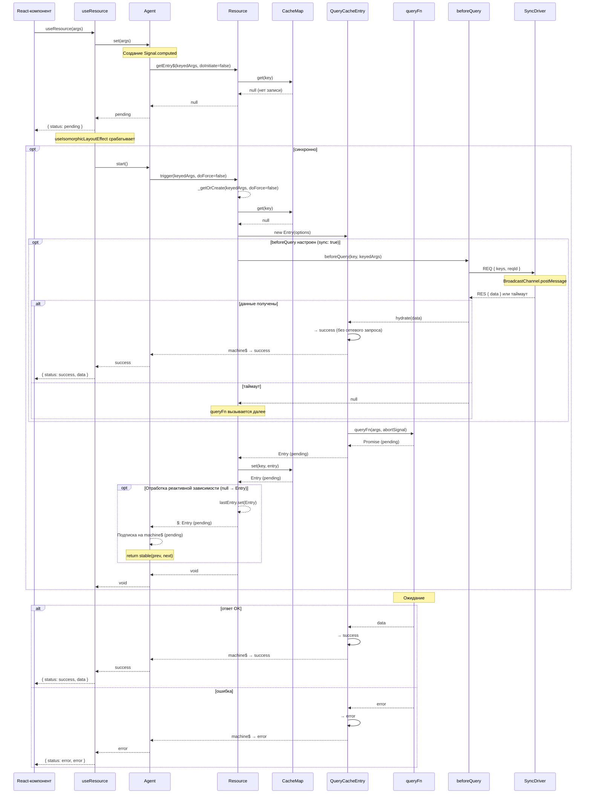
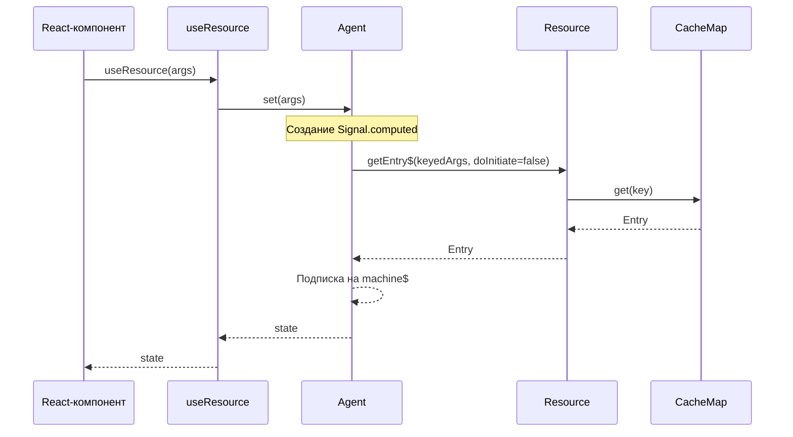
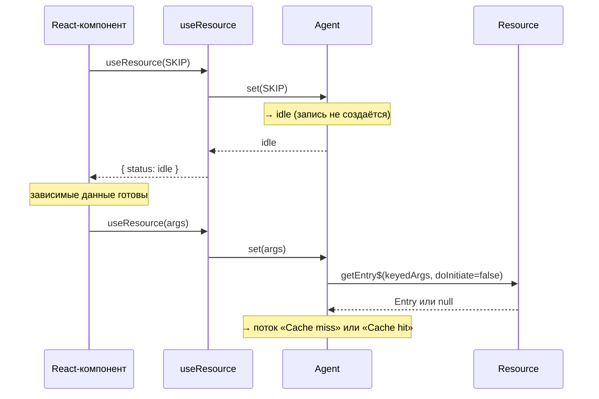
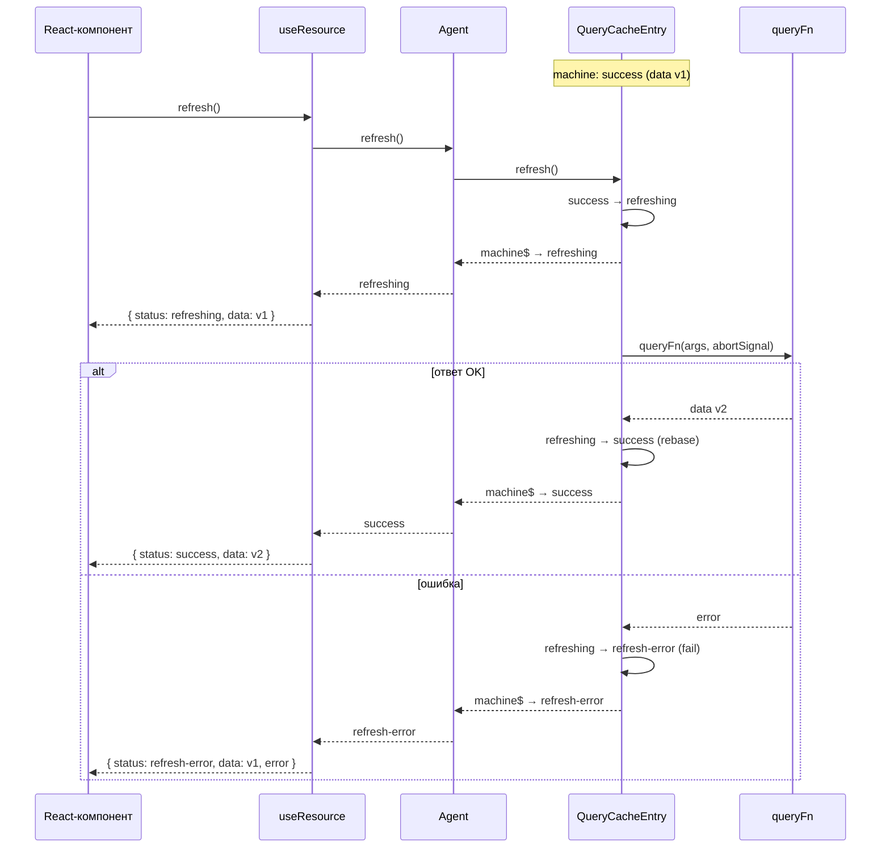
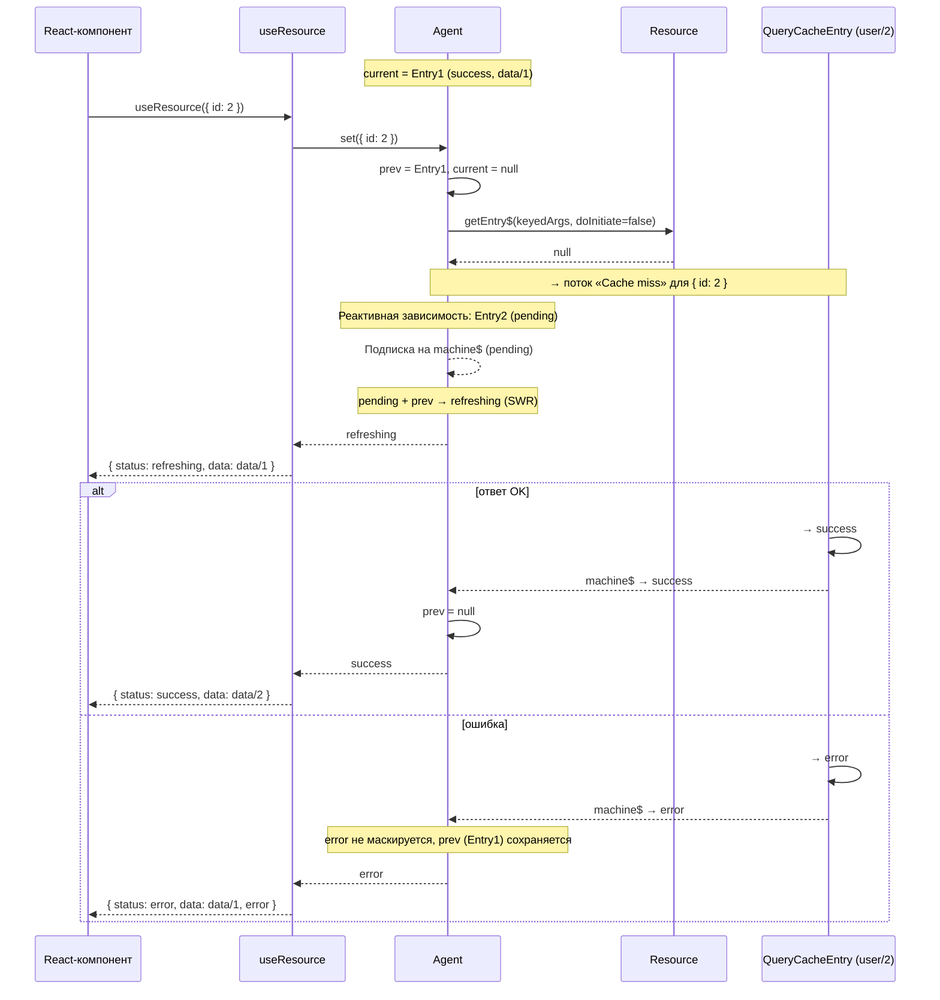
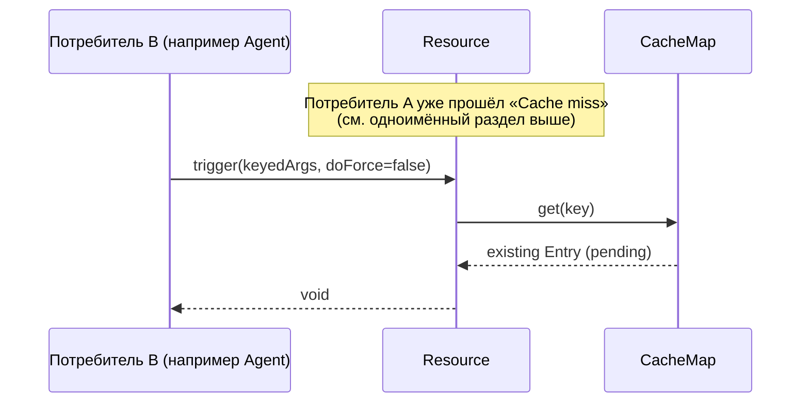
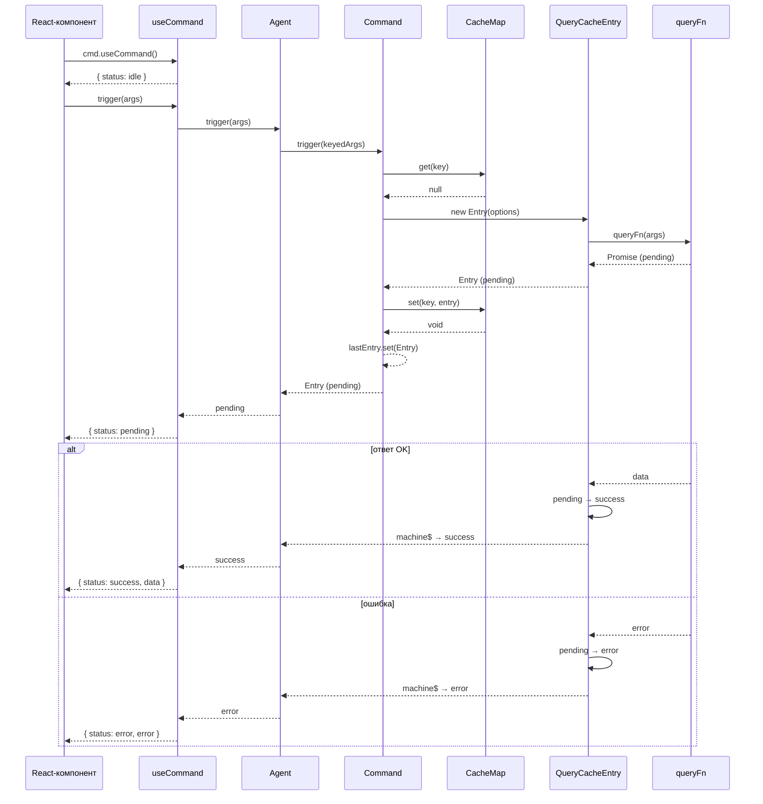
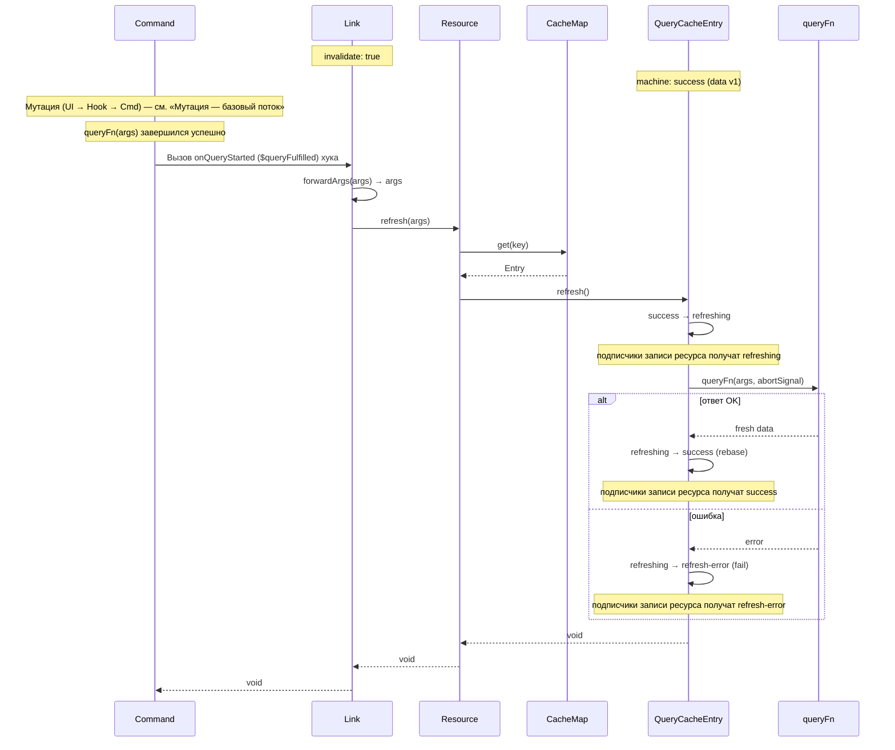
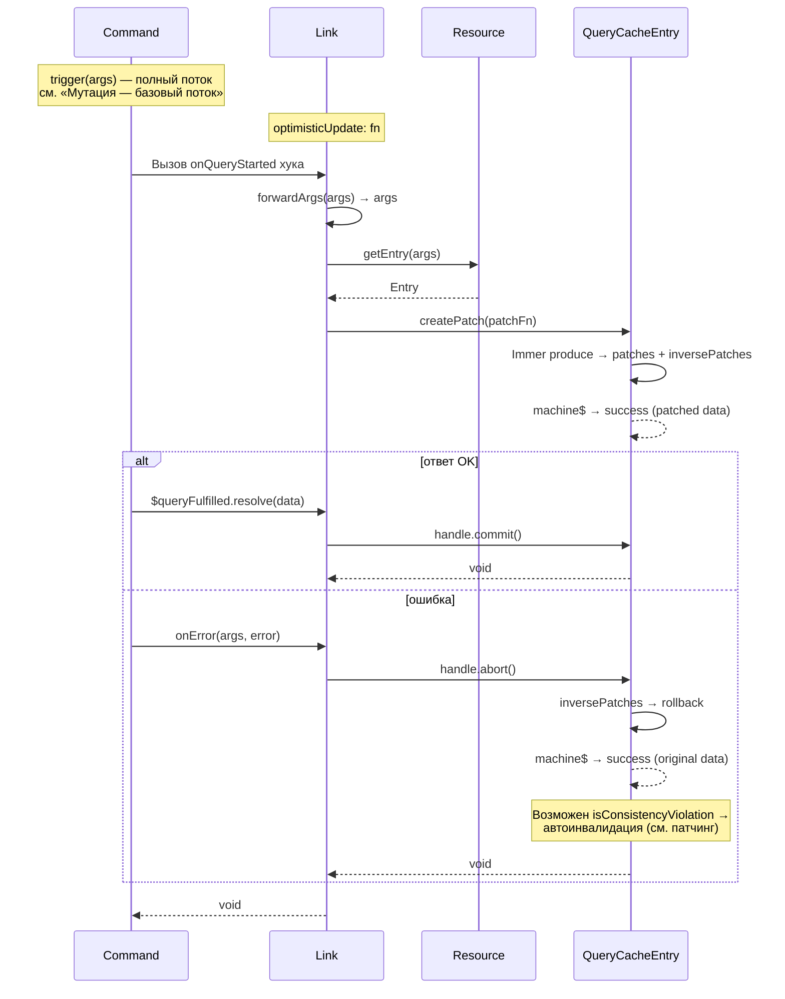
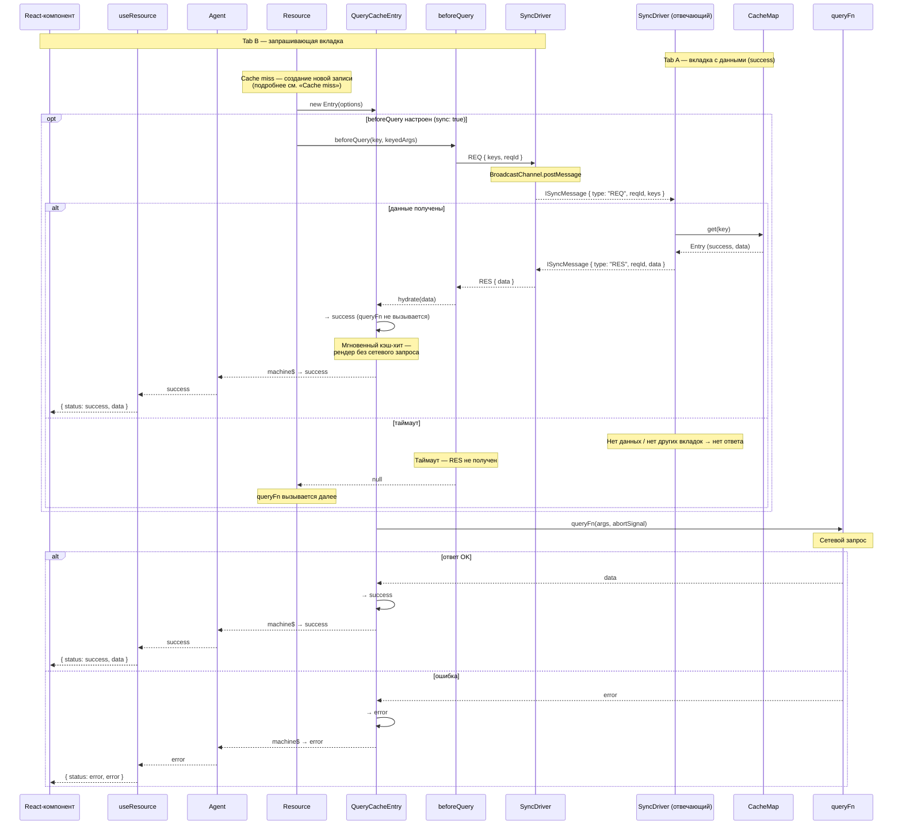

# Потоки данных

Диаграммы описывают основные сценарии взаимодействия компонентов модуля Query.

---

## Потоки ресурса (Resource)

> Разделы ниже описывают потоки, специфичные для ресурсов. Команды используют упрощённый поток — см. «Мутация».

### Cache miss

### Cache hit

### Условный запрос (SKIP → реальные args)

### Refresh / фоновое обновление

### SWR-fallback при смене аргументов

### Дедупликация параллельных запросов

## Потоки команды (Command)

### Мутация — базовый поток

## Связи (Links)

### Инвалидация через link после мутации

### Оптимистичное обновление через link

---

## Кросс-табовая синхронизация

> Синхронизация построена на PULL-модели: вкладка, которой нужны данные, запрашивает их у других вкладок через `beforeQuery` хук и `BroadcastChannel`. Вкладки **не** рассылают данные проактивно после успешного запроса.

## См. также

- [Машина состояний запроса][machine] — статусы и переходы, на которых построены все потоки
- [Система кэширования][cache] — жизненный цикл записей и `retentionTime`
- [Оптимистичные обновления (links)][usage-links] — `optimisticUpdate` и `invalidate` в действии
- [Агент][agent] — SWR-наблюдатель, транслирующий состояние машины в UI
- [Кросс-табовая синхронизация][usage-broadcast] — настройка `syncDriver` и `broadcastSyncDriver`

[agent]: agent.md
[machine]: machine.md
[cache]: cache.md
[usage-links]: ../usage/links.md
[usage-broadcast]: ../usage/broadcast.md
