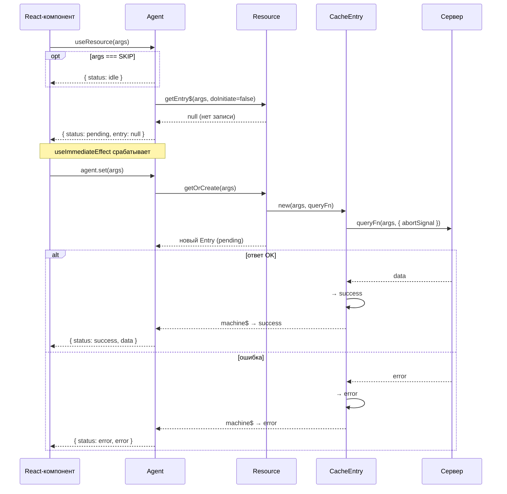
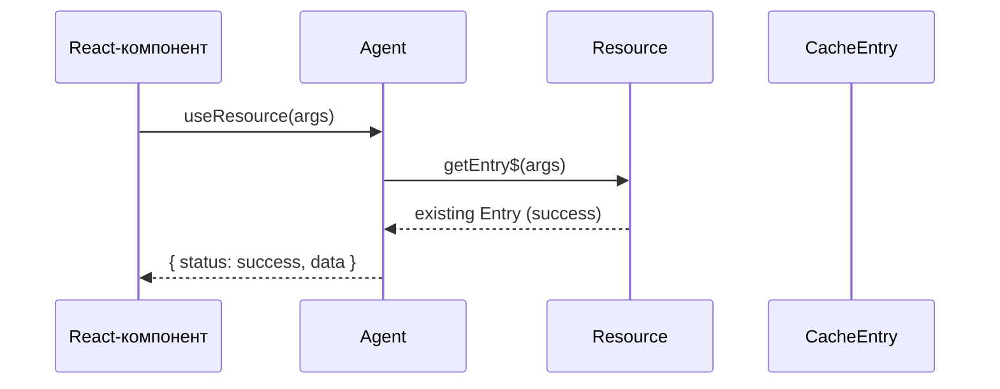
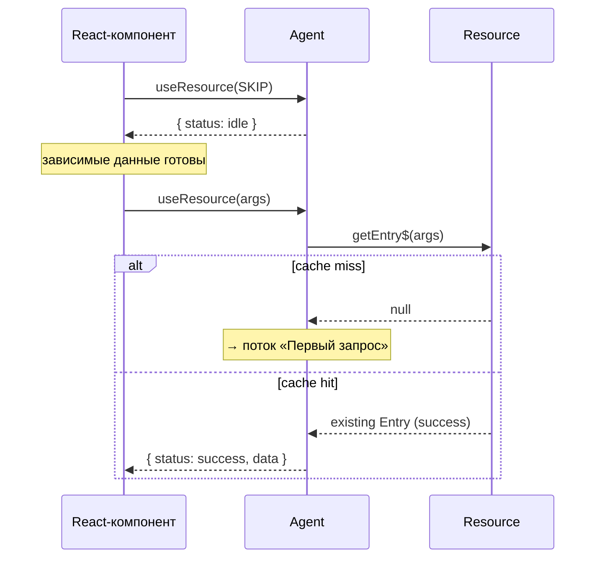
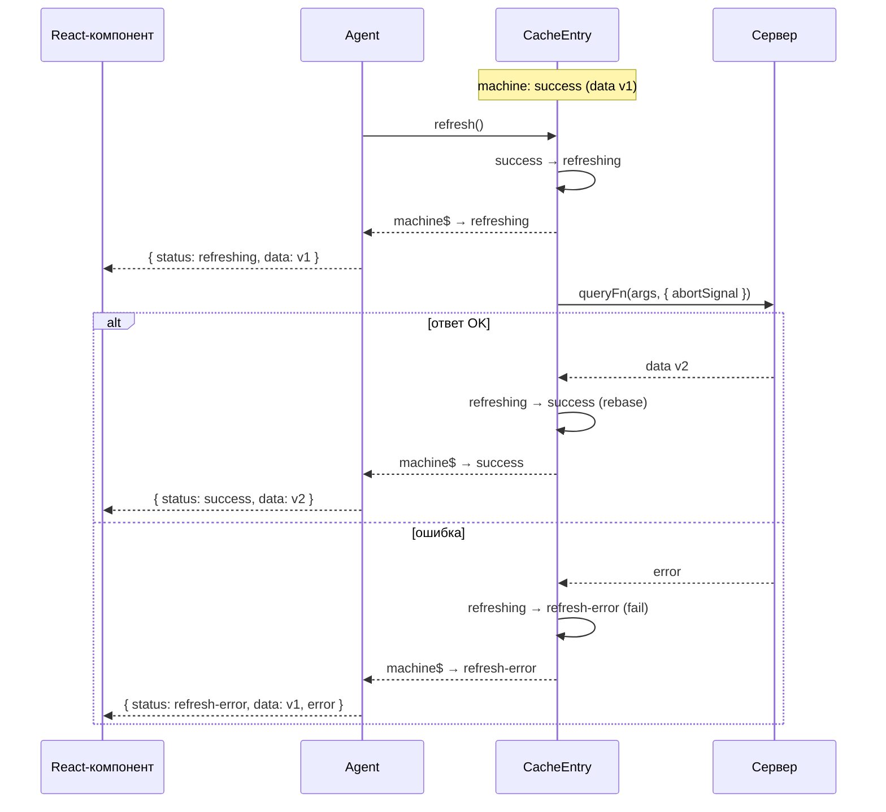
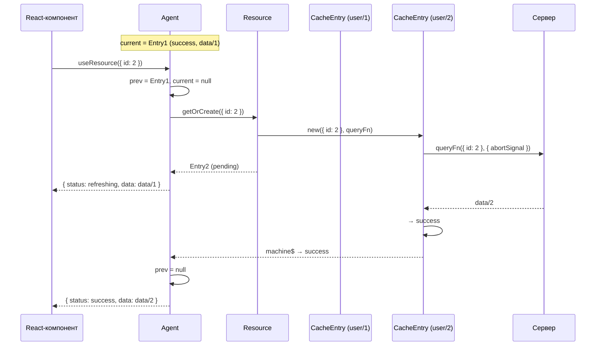
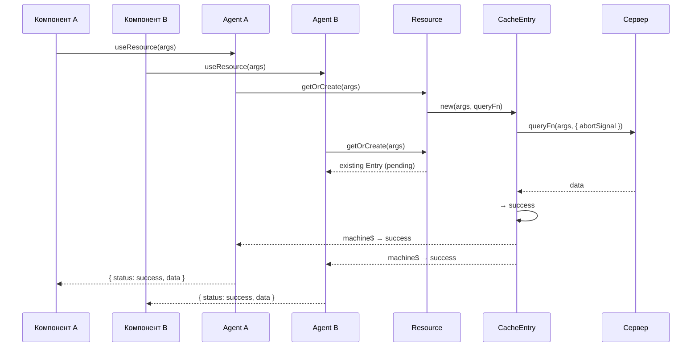
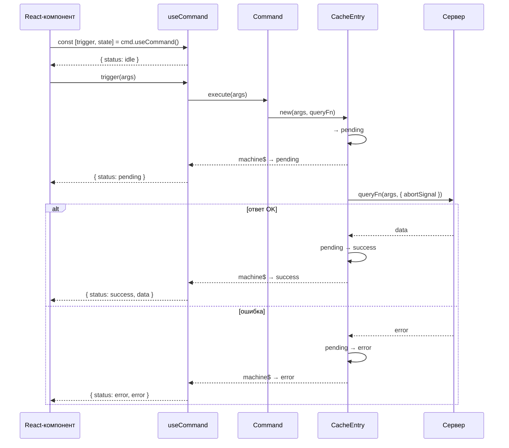
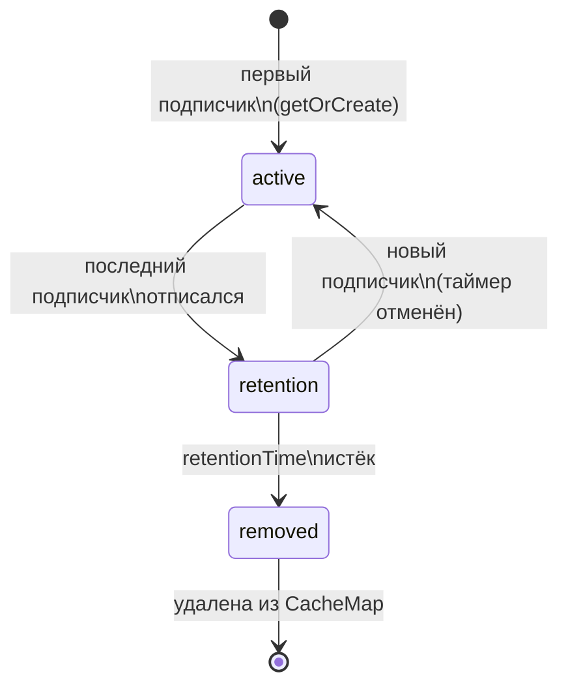
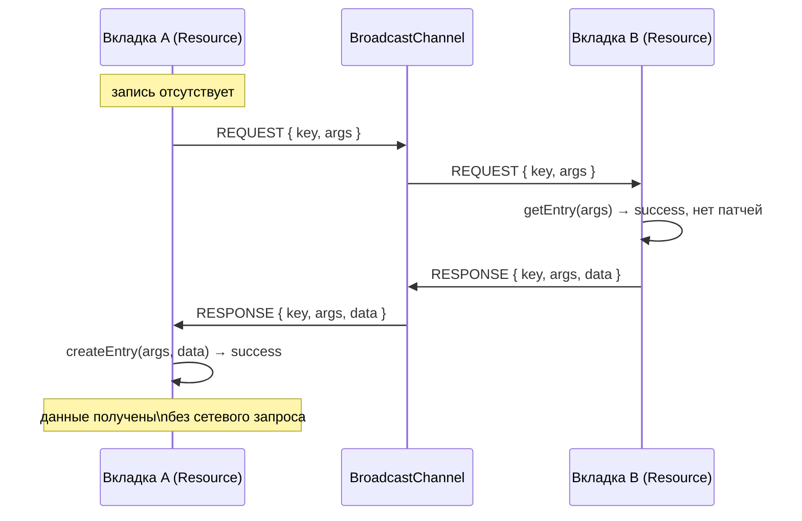

# Потоки данных

Диаграммы описывают основные сценарии взаимодействия компонентов модуля Query.
Каждая диаграмма — один изолированный поток; переходы [стейт-машины][machine] указаны в скобках.

---

## Первый запрос (cache miss)

UI монтируется с новыми аргументами — агент не находит запись в кеше и инициирует сетевой запрос.



## Повторный запрос (cache hit)

Компонент монтируется с аргументами, для которых в кеше уже есть успешная запись — данные возвращаются мгновенно.



## Условный запрос (SKIP → реальные args)

Пока зависимые данные не готовы, передаётся `SKIP` — агент находится в `idle`, запись не создаётся. Как только появляются реальные аргументы, запускается стандартный поток cache miss / cache hit.



## Refresh / фоновое обновление

Запись уже в `success` — вызов `refresh()` переводит машину в `refreshing`. UI продолжает показывать устаревшие данные, пока не придёт ответ.



## SWR-fallback при смене аргументов

Агент хранит два слота — текущую и предыдущую запись. При смене аргументов предыдущие данные показываются как устаревшие, пока новый запрос не завершится.



## Дедупликация параллельных запросов

Два компонента запрашивают одни и те же аргументы одновременно — ресурс создаёт единственную запись и выполняет один сетевой запрос.



---

## Мутация — базовый поток

Вызов `trigger(args)` создаёт запись кеша команды, выполняет `queryFn` и переводит машину в `success` или `error`. По умолчанию `retentionTime: 0` — запись удаляется сразу после завершения.



## Инвалидация через link после мутации

Команда объявляет связь с ресурсом (`invalidate: true`). После успешного выполнения `queryFn` link срабатывает: `forwardArgs` вычисляет ключ целевой записи, и ресурс запускает рефетч.

```mermaid
sequenceDiagram
    participant UI as React-компонент
    participant Cmd as Command
    participant Server as Сервер
    participant Link as Link
    participant Res as Resource
    participant Entry as CacheEntry (ресурса)

    UI->>Cmd: trigger(args)
    Cmd->>Server: queryFn(args, { abortSignal })
    Server-->>Cmd: result (success)

    Note over Cmd,Link: invalidate: true → link срабатывает

    Cmd->>Link: onSuccess(args, result)
    Link->>Link: forwardArgs(args) → targetArgs
    Link->>Res: invalidate(targetArgs)
    Res->>Entry: refresh()
    Entry->>Entry: success → refreshing

    Entry->>Server: queryFn(targetArgs, { abortSignal })
    Server-->>Entry: fresh data
    Entry->>Entry: refreshing → success (rebase)
    Entry-->>UI: machine$ → success (fresh data)
```

## Оптимистичное обновление через link

Link с `optimisticUpdate` мгновенно применяет Immer-рецепт к данным ресурса через систему [патчинга][patching]. UI обновляется до ответа сервера. При успехе патч коммитится; при ошибке — откатывается через `inversePatches`.

```mermaid
sequenceDiagram
    participant UI as React-компонент
    participant Cmd as Command
    participant Link as Link
    participant Res as Resource
    participant Entry as CacheEntry (ресурса)
    participant Patcher as Patcher
    participant Server as Сервер

    UI->>Cmd: trigger(args)

    Note over Cmd,Link: optimisticUpdate → немедленно

    Cmd->>Link: onTrigger(args)
    Link->>Link: forwardArgs(args) → targetArgs
    Link->>Res: getEntry(targetArgs)
    Res-->>Link: Entry
    Link->>Patcher: createPatch(entry, recipe)
    Patcher->>Patcher: Immer produce → changes + inversePatches
    Patcher->>Entry: apply changes → data обновлена
    Entry-->>UI: machine$ → data (оптимистичная)

    Cmd->>Server: queryFn(args, { abortSignal })

    alt ответ OK
        Server-->>Cmd: result
        Cmd->>Link: onSuccess
        Link->>Patcher: patch.commit()
        Patcher->>Entry: patchState очищается
    else ошибка
        Server-->>Cmd: error
        Cmd->>Link: onError
        Link->>Patcher: patch.abort()
        Patcher->>Entry: inversePatches → rollback
        Entry-->>UI: machine$ → data (исходная)
    end
```

---

## Жизненный цикл кеш-записи (GC)

Запись существует в одном из трёх состояний: `active` → `retention` → `removed`. Таймер [`retentionTime`][api-res] запускается при отписке последнего подписчика и отменяется, если появляется новый.



## Кросс-табовая синхронизация (broadcast)

Вкладка без данных рассылает broadcast-запрос. Вкладка с чистым `success` (без патчей) отвечает данными через `BroadcastChannel` — сетевой запрос не выполняется.



## См. также

- [Стейт-машина запроса][machine] — статусы и переходы, на которых построены все потоки
- [Система кеширования][cache] — жизненный цикл записей и `retentionTime`
- [Оптимистичные обновления (links)][usage-links] — `optimisticUpdate` и `invalidate` в действии
- [Кросс-табовая синхронизация][usage-broadcast] — настройка `syncDriver` и `broadcastSyncDriver`

---

[machine]: machine.md
[cache]: cache.md
[patching]: patching.md
[agent]: agent.md
[usage-res]: ../usage/resource.md
[usage-cmd]: ../usage/command.md
[usage-links]: ../usage/links.md
[usage-lifecycle]: ../usage/lifecycle.md
[usage-broadcast]: ../usage/broadcast.md
[api-res]: ../api/resource.md
[api-cmd]: ../api/command.md
