# Потоки данных

Диаграммы описывают основные сценарии взаимодействия компонентов модуля Query.

---

## Cache miss

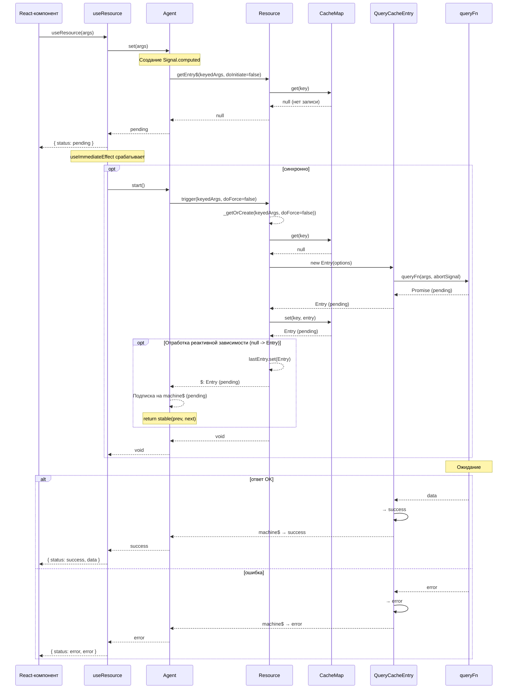

## Cache hit

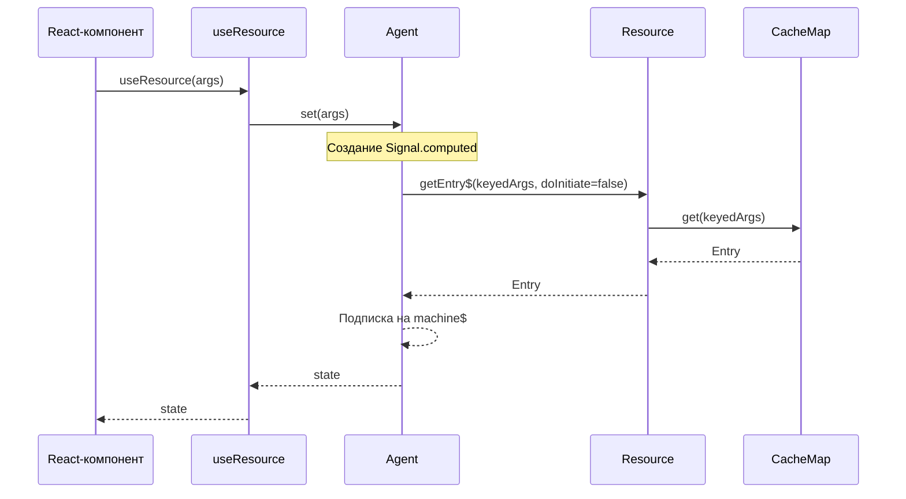

## Условный запрос (SKIP → реальные args)

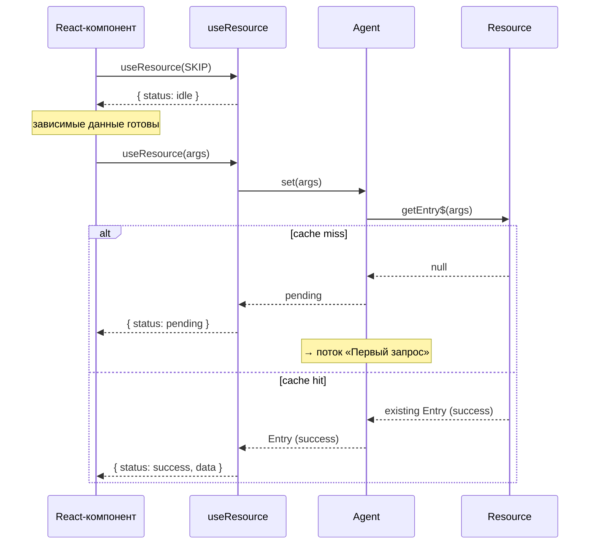

## Refresh / фоновое обновление

Запись уже в `success` — вызов `refresh()` переводит машину в `refreshing`. UI продолжает показывать устаревшие данные, пока не придёт ответ.

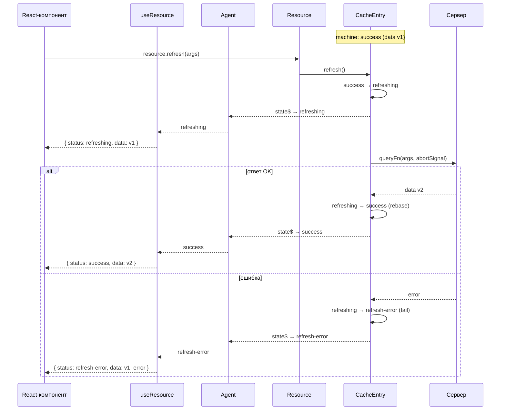

## SWR-fallback при смене аргументов

Агент хранит два слота — текущую и предыдущую запись. При смене аргументов предыдущие данные показываются как устаревшие, пока новый запрос не завершится.

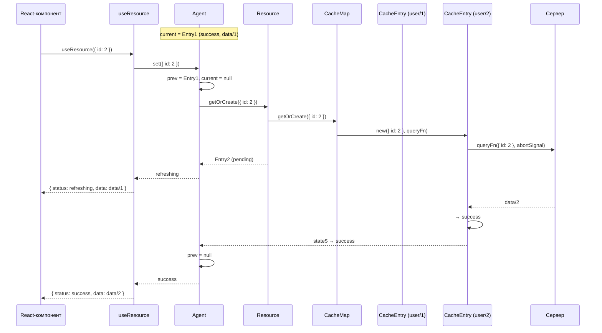

## Дедупликация параллельных запросов

Два компонента запрашивают одни и те же аргументы одновременно — ресурс создаёт единственную запись и выполняет один сетевой запрос.

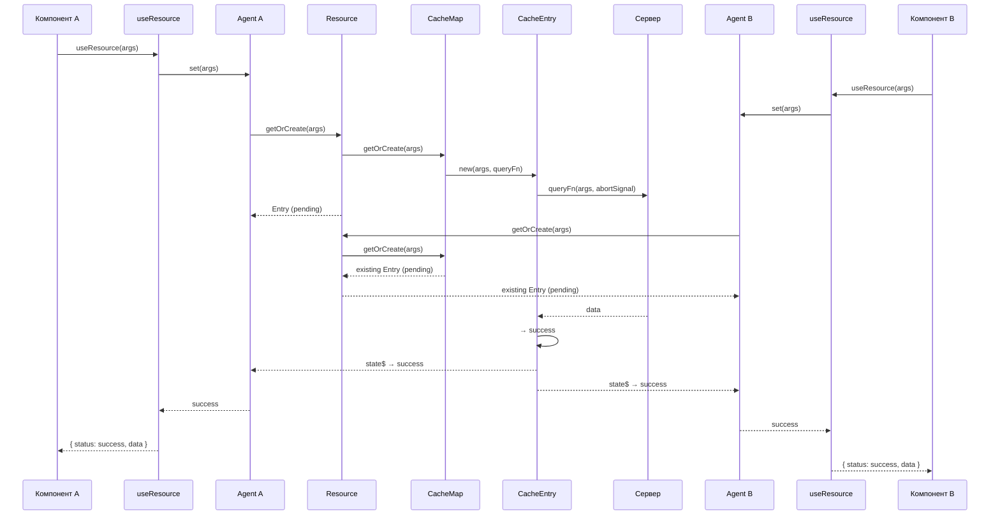

---

## Мутация — базовый поток

Вызов `trigger(args)` создаёт запись кеша команды, выполняет `queryFn` и переводит машину в `success` или `error`. По умолчанию `retentionTime: 0` — запись удаляется сразу после завершения.

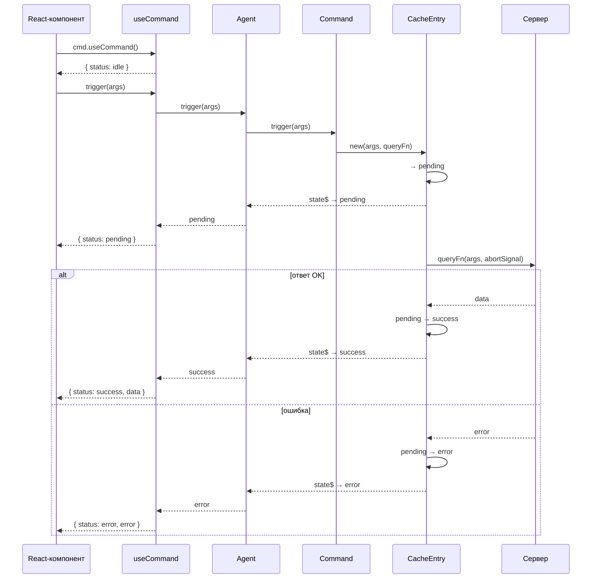

## Инвалидация через link после мутации

Команда объявляет связь с ресурсом (`invalidate: true`). После успешного выполнения `queryFn` link срабатывает: `forwardArgs` вычисляет ключ целевой записи, и ресурс запускает рефетч.

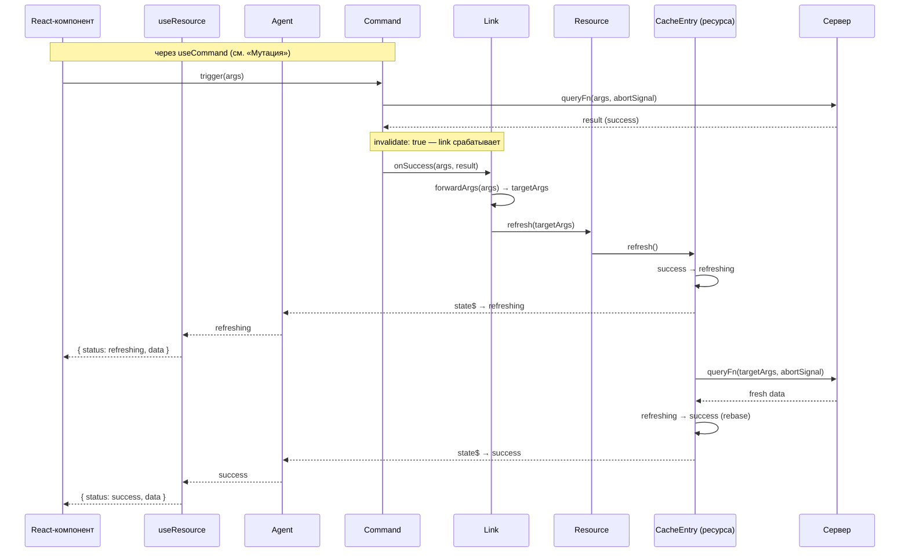

## Оптимистичное обновление через link

Link с `optimisticUpdate` мгновенно применяет Immer-рецепт к данным ресурса через систему [патчинга][patching]. UI обновляется до ответа сервера. При успехе патч коммитится; при ошибке — откатывается через `inversePatches`.

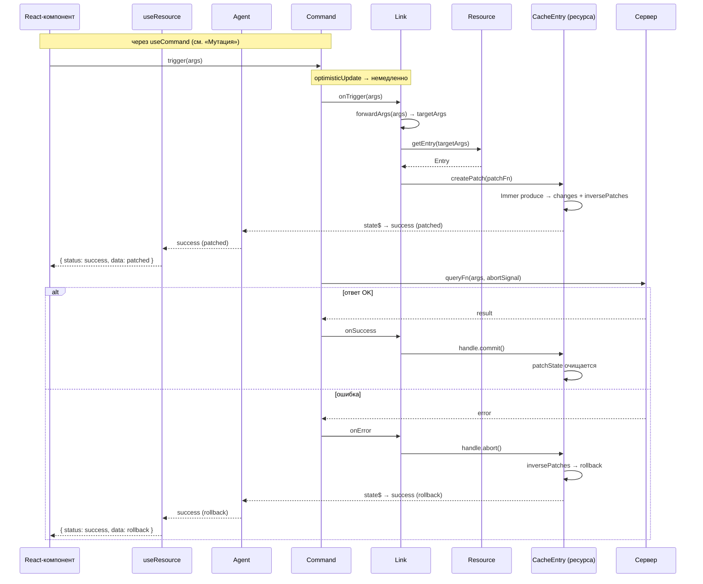

---

## Жизненный цикл кеш-записи (GC)

Запись существует в одном из трёх состояний: `active` → `retention` → `removed`. Таймер [`retentionTime`][api-res] запускается при отписке последнего подписчика и отменяется, если появляется новый.

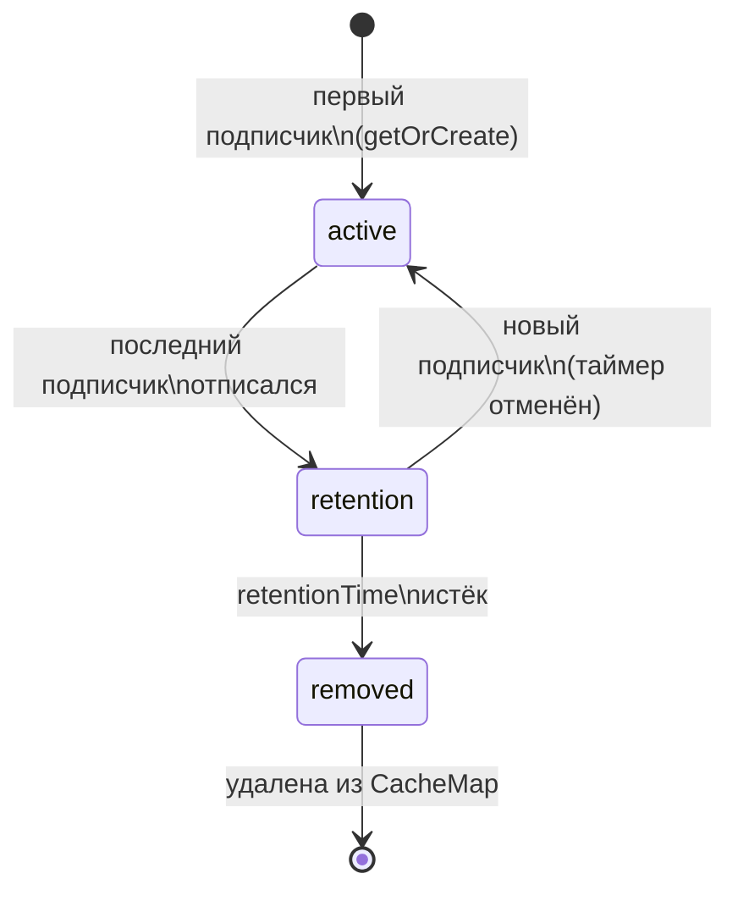

## Кросс-табовая синхронизация (broadcast)

Вкладка без данных рассылает broadcast-запрос. Вкладка с чистым `success` (без патчей) отвечает данными через `BroadcastChannel` — сетевой запрос не выполняется.

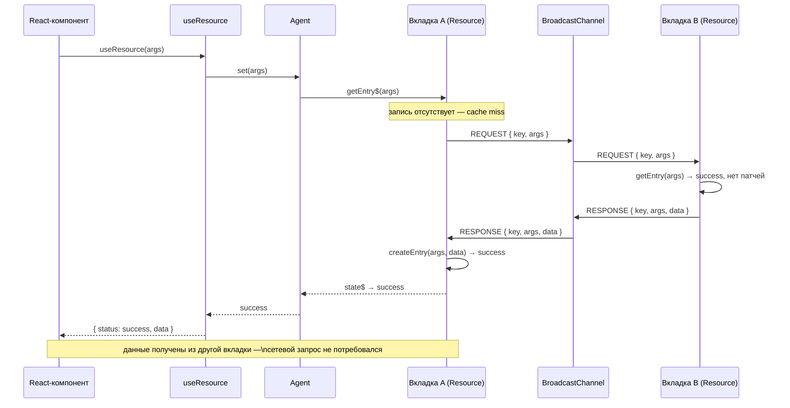

## См. также

- [Стейт-машина запроса][machine] — статусы и переходы, на которых построены все потоки
- [Система кеширования][cache] — жизненный цикл записей и `retentionTime`
- [Оптимистичные обновления (links)][usage-links] — `optimisticUpdate` и `invalidate` в действии
- [Кросс-табовая синхронизация][usage-broadcast] — настройка `syncDriver` и `broadcastSyncDriver`

---

[machine]: machine.md
[cache]: cache.md
[patching]: patching.md
[agent]: agent.md
[usage-res]: ../usage/resource.md
[usage-cmd]: ../usage/command.md
[usage-links]: ../usage/links.md
[usage-lifecycle]: ../usage/lifecycle.md
[usage-broadcast]: ../usage/broadcast.md
[api-res]: ../api/resource.md
[api-cmd]: ../api/command.md
