# Потоки данных

Диаграммы описывают основные сценарии взаимодействия компонентов модуля Query.

---

## Потоки ресурса (Resource)

> Разделы ниже описывают потоки, специфичные для ресурсов. Команды используют упрощённый поток — см. «Мутация».

### Cache miss

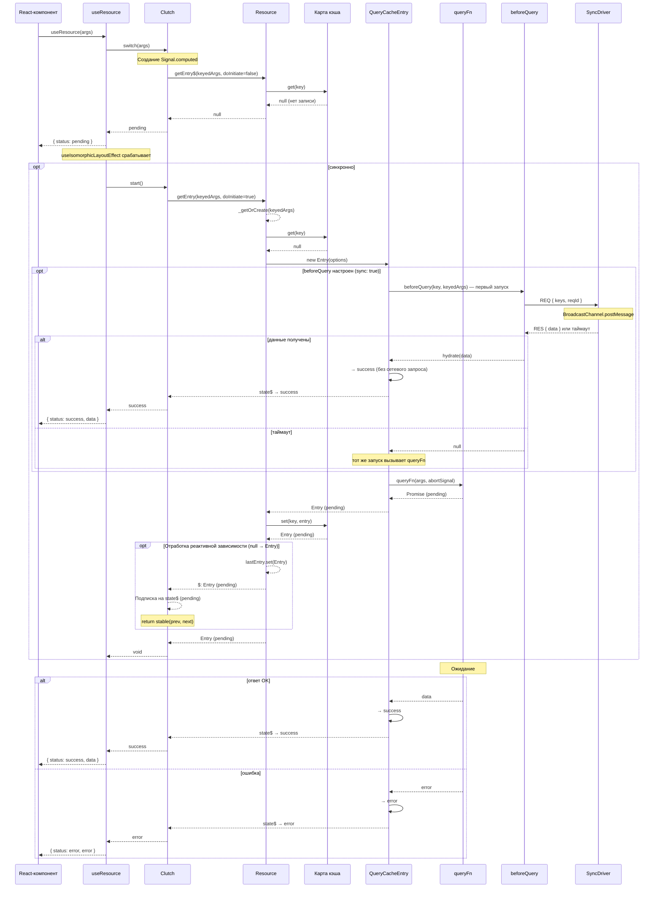
```mermaid
sequenceDiagram
    participant UI as React-компонент
    participant Hook as useResource
    participant Clutch as Clutch
    participant Res as Resource
    participant Cache as Карта кэша
    participant Entry as QueryCacheEntry
    participant Query as queryFn
    participant BQ as beforeQuery
    participant Sync as SyncDriver

    UI->>Hook: useResource(args)
    Hook->>Clutch: switch(args)

    Note over Clutch: Создание Signal.computed

    Clutch->>Res: getEntry$(keyedArgs, doInitiate=false)

    Res->>Cache: get(key)
    Cache-->>Res: null (нет записи)
    Res-->>Clutch: null
    Clutch-->>Hook: pending
    Hook-->>UI: { status: pending }

    Note over Hook: useIsomorphicLayoutEffect срабатывает

    opt синхронно
        Hook->>Clutch: start()
        Clutch->>Res: getEntry(keyedArgs, doInitiate=true)
        Res-->>Res: _getOrCreate(keyedArgs)
        Res->>Cache: get(key)
        Cache-->>Res: null
        Res->>Entry: new Entry(options)

        opt beforeQuery настроен (sync: true)
            Entry->>BQ: beforeQuery(key, keyedArgs) — первый запуск
            BQ->>Sync: REQ { keys, reqId }
            Note over Sync: BroadcastChannel.postMessage
            Sync-->>BQ: RES { data } или таймаут

            alt данные получены
                BQ-->>Entry: hydrate(data)
                Entry->>Entry: → success (без сетевого запроса)
                Entry-->>Clutch: state$ → success
                Clutch-->>Hook: success
                Hook-->>UI: { status: success, data }
            else таймаут
                BQ-->>Entry: null
                Note over Entry: тот же запуск вызывает queryFn
            end
        end

        Entry->>Query: queryFn(args, abortSignal)
        Query-->>Entry: Promise (pending)
        Entry-->>Res: Entry (pending)

        Res->>Cache: set(key, entry)
    
        Cache-->>Res: Entry (pending)

        opt Отработка реактивной зависимости (null → Entry)
            Res -->> Res: lastEntry.set(Entry)
            Res-->>Clutch: $: Entry (pending)
            Clutch-->>Clutch: Подписка на state$ (pending)
            Note over Clutch: return stable(prev, next)
        end

        Res -->> Clutch: Entry (pending)
        Clutch-->>Hook: void
    end

    Note over Query: Ожидание

    alt ответ OK
        Query-->>Entry: data
        Entry->>Entry: → success
        Entry-->>Clutch: state$ → success
        Clutch-->>Hook: success
        Hook-->>UI: { status: success, data }
    else ошибка
        Query-->>Entry: error
        Entry->>Entry: → error
        Entry-->>Clutch: state$ → error
        Clutch-->>Hook: error
        Hook-->>UI: { status: error, error }
    end
```

### Cache hit

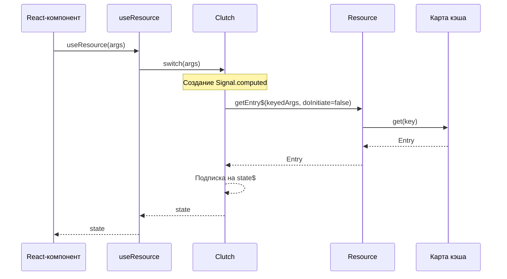
```mermaid
sequenceDiagram
    participant UI as React-компонент
    participant Hook as useResource
    participant Clutch as Clutch
    participant Res as Resource
    participant Cache as Карта кэша

    UI->>Hook: useResource(args)
    Hook->>Clutch: switch(args)
    Note over Clutch: Создание Signal.computed
    Clutch->>Res: getEntry$(keyedArgs, doInitiate=false)
    Res->>Cache: get(key)
    Cache-->>Res: Entry
    Res-->>Clutch: Entry
    Clutch-->>Clutch: Подписка на state$
    Clutch-->>Hook: state
    Hook-->>UI: state
```

### Условный запрос (SKIP → реальные args)

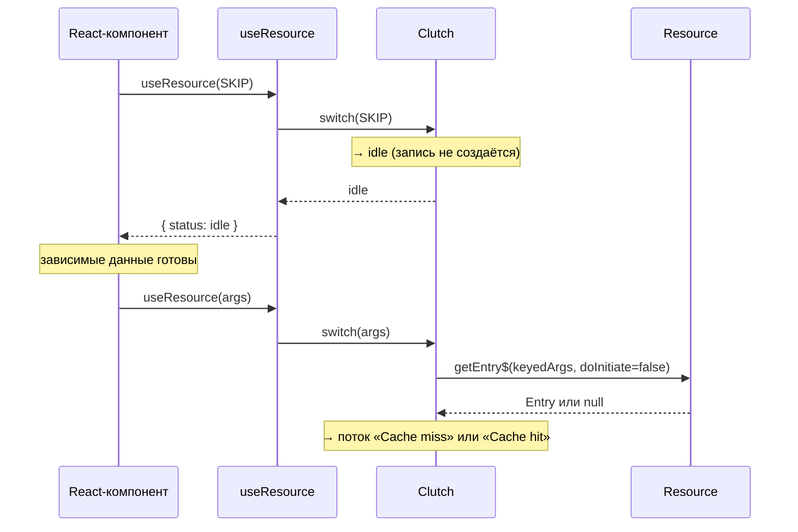
```mermaid
sequenceDiagram
    participant UI as React-компонент
    participant Hook as useResource
    participant Clutch as Clutch
    participant Res as Resource

    UI->>Hook: useResource(SKIP)
    Hook->>Clutch: switch(SKIP)
    Note over Clutch: → idle (запись не создаётся)
    Clutch-->>Hook: idle
    Hook-->>UI: { status: idle }

    Note over UI: зависимые данные готовы

    UI->>Hook: useResource(args)
    Hook->>Clutch: switch(args)
    Clutch->>Res: getEntry$(keyedArgs, doInitiate=false)

    Res-->>Clutch: Entry или null

    Note over Clutch: → поток «Cache miss» или «Cache hit»
```

### Инвалидация / фоновый перезапрос

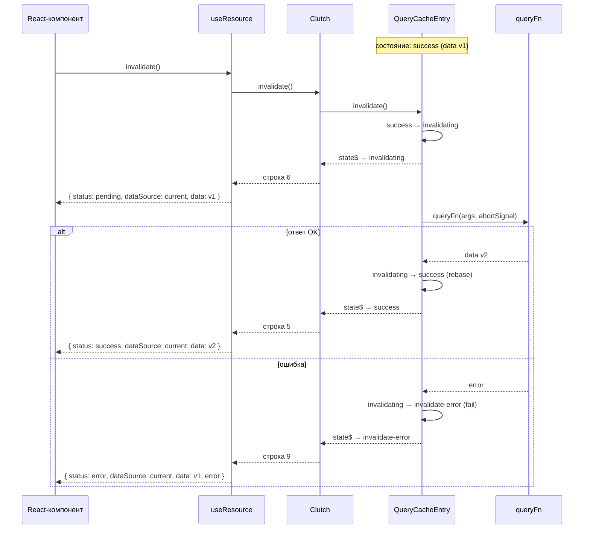
```mermaid
sequenceDiagram
    participant UI as React-компонент
    participant Hook as useResource
    participant Clutch as Clutch
    participant Entry as QueryCacheEntry
    participant Query as queryFn

    Note over Entry: состояние: success (data v1)

    UI->>Hook: invalidate()
    Hook->>Clutch: invalidate()
    Clutch->>Entry: invalidate()
    Entry->>Entry: success → invalidating
    Entry-->>Clutch: state$ → invalidating
    Clutch-->>Hook: строка 6
    Hook-->>UI: { status: pending, dataSource: current, data: v1 }

    Entry->>Query: queryFn(args, abortSignal)

    alt ответ OK
        Query-->>Entry: data v2
        Entry->>Entry: invalidating → success (rebase)
        Entry-->>Clutch: state$ → success
        Clutch-->>Hook: строка 5
        Hook-->>UI: { status: success, dataSource: current, data: v2 }
    else ошибка
        Query-->>Entry: error
        Entry->>Entry: invalidating → invalidate-error (fail)
        Entry-->>Clutch: state$ → invalidate-error
        Clutch-->>Hook: строка 9
        Hook-->>UI: { status: error, dataSource: current, data: v1, error }
    end
```

### Инвалидация тающей записи → подписка

Запись без удержаний `invalidate()` только помечает; перезапрос уходит на первом удержании — до того, как подписчик получит первый снимок. Правило — в [кэше][cache-invalidation].

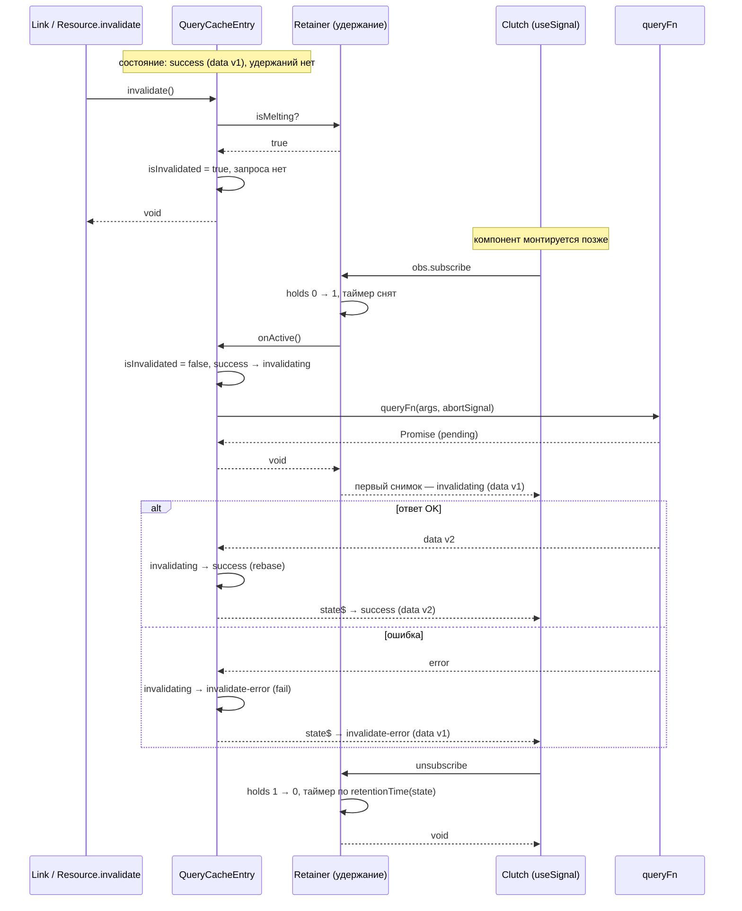
```mermaid
sequenceDiagram
    participant Lnk as Link / Resource.invalidate
    participant Entry as QueryCacheEntry
    participant Ret as Retainer (удержание)
    participant Clutch as Clutch (useSignal)
    participant Query as queryFn

    Note over Entry: состояние: success (data v1), удержаний нет

    Lnk->>Entry: invalidate()
    Entry->>Ret: isMelting?
    Ret-->>Entry: true
    Entry->>Entry: isInvalidated = true, запроса нет
    Entry-->>Lnk: void

    Note over Clutch: компонент монтируется позже

    Clutch->>Ret: obs.subscribe
    Ret->>Ret: holds 0 → 1, таймер снят
    Ret->>Entry: onActive()
    Entry->>Entry: isInvalidated = false, success → invalidating
    Entry->>Query: queryFn(args, abortSignal)
    Query-->>Entry: Promise (pending)
    Entry-->>Ret: void
    Ret-->>Clutch: первый снимок — invalidating (data v1)

    alt ответ OK
        Query-->>Entry: data v2
        Entry->>Entry: invalidating → success (rebase)
        Entry-->>Clutch: state$ → success (data v2)
    else ошибка
        Query-->>Entry: error
        Entry->>Entry: invalidating → invalidate-error (fail)
        Entry-->>Clutch: state$ → invalidate-error (data v1)
    end

    Clutch->>Ret: unsubscribe
    Ret->>Ret: holds 1 → 0, таймер по retentionTime(state)
    Ret-->>Clutch: void
```

### SWR-fallback при смене аргументов

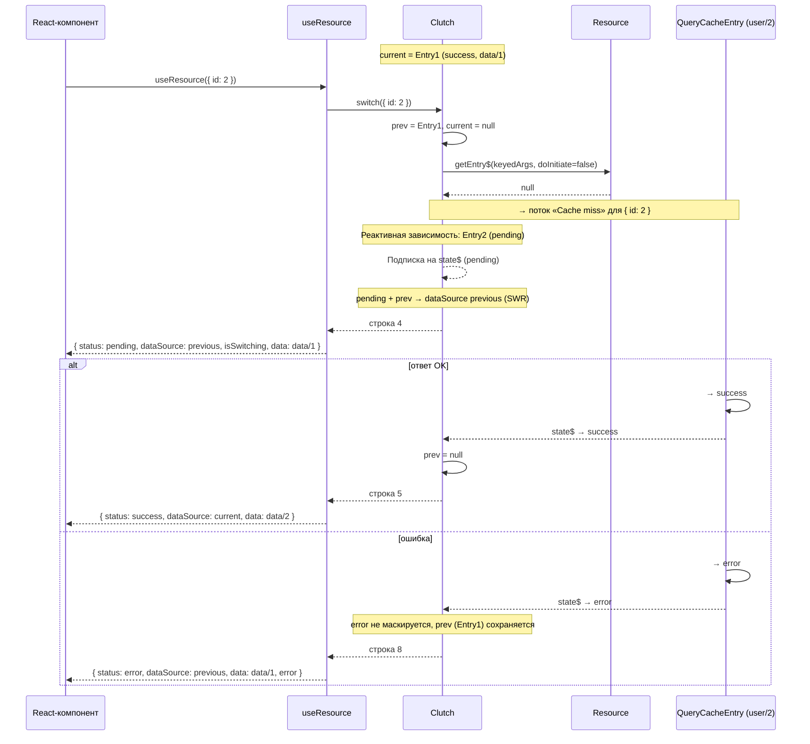
```mermaid
sequenceDiagram
    participant UI as React-компонент
    participant Hook as useResource
    participant Clutch as Clutch
    participant Res as Resource
    participant Entry2 as QueryCacheEntry (user/2)

    Note over Clutch: current = Entry1 (success, data/1)

    UI->>Hook: useResource({ id: 2 })
    Hook->>Clutch: switch({ id: 2 })
    Clutch->>Clutch: prev = Entry1, current = null

    Clutch->>Res: getEntry$(keyedArgs, doInitiate=false)
    Res-->>Clutch: null

    Note over Clutch,Entry2: → поток «Cache miss» для { id: 2 }

    Note over Clutch: Реактивная зависимость: Entry2 (pending)
    Clutch-->>Clutch: Подписка на state$ (pending)

    Note over Clutch: pending + prev → dataSource previous (SWR)
    Clutch-->>Hook: строка 4
    Hook-->>UI: { status: pending, dataSource: previous, isSwitching, data: data/1 }

    alt ответ OK
        Entry2->>Entry2: → success
        Entry2-->>Clutch: state$ → success
        Clutch->>Clutch: prev = null
        Clutch-->>Hook: строка 5
        Hook-->>UI: { status: success, dataSource: current, data: data/2 }
    else ошибка
        Entry2->>Entry2: → error
        Entry2-->>Clutch: state$ → error
        Note over Clutch: error не маскируется, prev (Entry1) сохраняется
        Clutch-->>Hook: строка 8
        Hook-->>UI: { status: error, dataSource: previous, data: data/1, error }
    end
```

### Дедупликация параллельных запросов

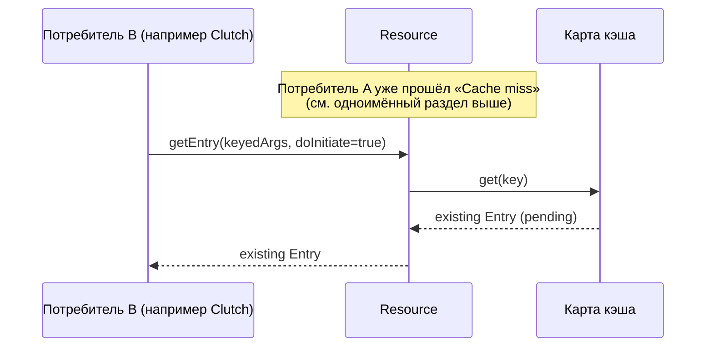
```mermaid
sequenceDiagram
    participant Clutch as Потребитель B (например Clutch)
    participant Res as Resource
    participant Cache as Карта кэша

    Note over Res: Потребитель A уже прошёл «Cache miss»<br/>(см. одноимённый раздел выше)

    Clutch->>Res: getEntry(keyedArgs, doInitiate=true)
    Res->>Cache: get(key)
    Cache-->>Res: existing Entry (pending)
    Res-->>Clutch: existing Entry
```

## Потоки команды (Command)

### Мутация — базовый поток

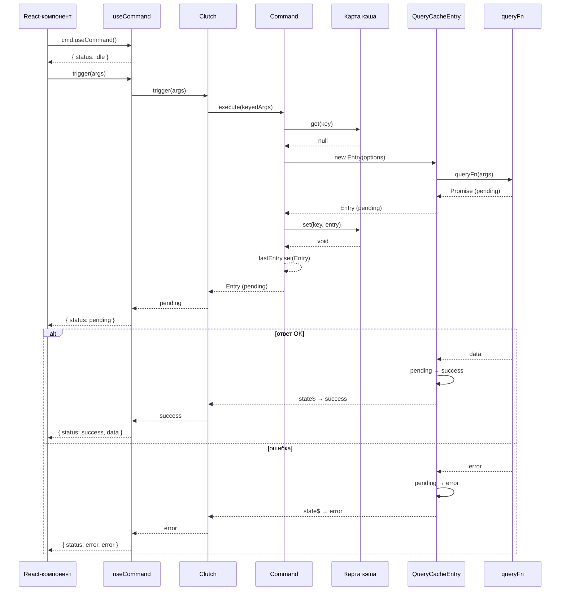
```mermaid
sequenceDiagram
    participant UI as React-компонент
    participant Hook as useCommand
    participant Clutch as Clutch
    participant Cmd as Command
    participant Cache as Карта кэша
    participant Entry as QueryCacheEntry
    participant Query as queryFn

    UI->>Hook: cmd.useCommand()
    
    Hook-->>UI: { status: idle }

    UI->>Hook: trigger(args)
    Hook->>Clutch: trigger(args)
    Clutch->>Cmd: execute(keyedArgs)
    Cmd->>Cache: get(key)
    Cache-->>Cmd: null
    Cmd->>Entry: new Entry(options)
    Entry->>Query: queryFn(args)
    Query-->>Entry: Promise (pending)
    Entry-->>Cmd: Entry (pending)
    Cmd->>Cache: set(key, entry)
    Cache-->>Cmd: void
    Cmd-->>Cmd: lastEntry.set(Entry)
    Cmd-->>Clutch: Entry (pending)
    Clutch-->>Hook: pending
    Hook-->>UI: { status: pending }

    alt ответ OK
        Query-->>Entry: data
        Entry->>Entry: pending → success
        Entry-->>Clutch: state$ → success
        Clutch-->>Hook: success
        Hook-->>UI: { status: success, data }
    else ошибка
        Query-->>Entry: error
        Entry->>Entry: pending → error
        Entry-->>Clutch: state$ → error
        Clutch-->>Hook: error
        Hook-->>UI: { status: error, error }
    end
```

## Связи (Links)

### Инвалидация через link после мутации

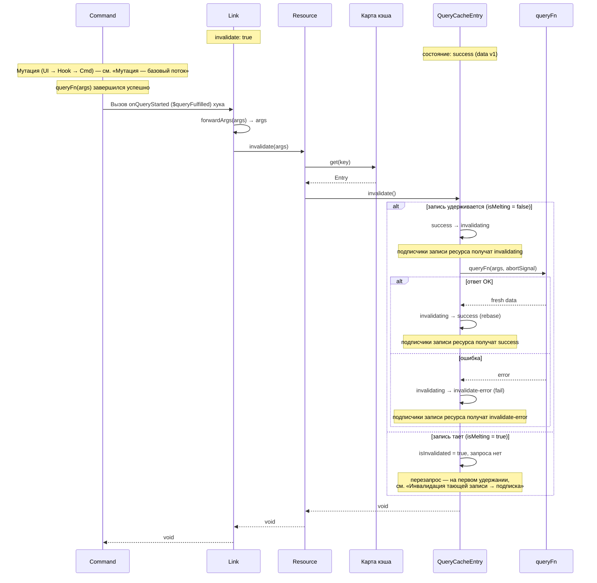
```mermaid
sequenceDiagram
    participant Cmd as Command
    participant Lnk as Link
    participant Res as Resource
    participant Cache as Карта кэша
    participant Entry as QueryCacheEntry
    participant Query as queryFn
    
    Note over Lnk: invalidate: true

    Note over Entry: состояние: success (data v1)

    Note over Cmd: Мутация (UI → Hook → Cmd) — см. «Мутация — базовый поток»
    Note over Cmd: queryFn(args) завершился успешно


    Cmd->>Lnk: Вызов onQueryStarted ($queryFulfilled) хука
    Lnk->>Lnk: forwardArgs(args) → args
    Lnk->>Res: invalidate(args)
    Res->>Cache: get(key)
    Cache-->>Res: Entry
    Res->>Entry: invalidate()

    alt запись удерживается (isMelting = false)
        Entry->>Entry: success → invalidating

        Note over Entry: подписчики записи ресурса получат invalidating

        Entry->>Query: queryFn(args, abortSignal)

        alt ответ OK
            Query-->>Entry: fresh data
            Entry->>Entry: invalidating → success (rebase)
            Note over Entry: подписчики записи ресурса получат success
        else ошибка
            Query-->>Entry: error
            Entry->>Entry: invalidating → invalidate-error (fail)
            Note over Entry: подписчики записи ресурса получат invalidate-error
        end
    else запись тает (isMelting = true)
        Entry->>Entry: isInvalidated = true, запроса нет
        Note over Entry: перезапрос — на первом удержании,<br/>см. «Инвалидация тающей записи → подписка»
    end

    Entry-->>Res: void
    Res-->>Lnk: void
    Lnk-->>Cmd: void
```

### Оптимистичное обновление через link

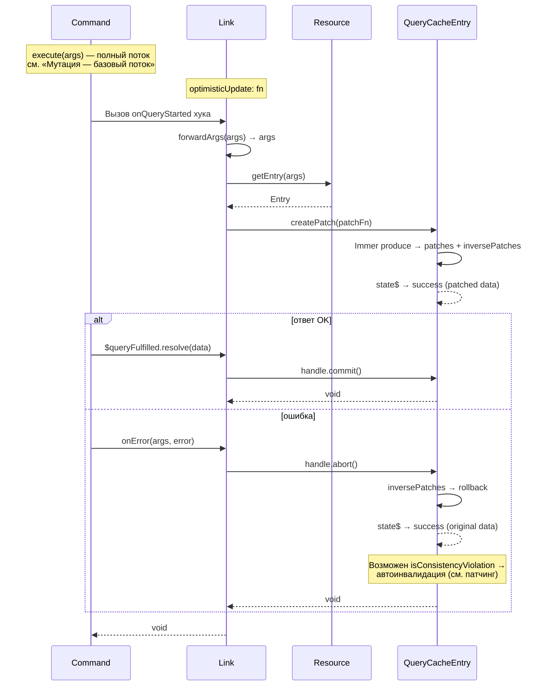
```mermaid
sequenceDiagram
    participant Cmd as Command
    participant Lnk as Link
    participant Res as Resource
    participant Entry as QueryCacheEntry

    Note over Cmd: execute(args) — полный поток<br/>см. «Мутация — базовый поток»

    Note over Lnk: optimisticUpdate: fn

    Cmd->>Lnk: Вызов onQueryStarted хука
    Lnk->>Lnk: forwardArgs(args) → args
    Lnk->>Res: getEntry(args)
    Res-->>Lnk: Entry
    Lnk->>Entry: createPatch(patchFn)
    Entry->>Entry: Immer produce → patches + inversePatches
    Entry-->>Entry: state$ → success (patched data)

    alt ответ OK
        Cmd->>Lnk: $queryFulfilled.resolve(data)
        Lnk->>Entry: handle.commit()
        Entry-->>Lnk: void

    else ошибка
        Cmd->>Lnk: onError(args, error)
        Lnk->>Entry: handle.abort()
        Entry->>Entry: inversePatches → rollback
        Entry-->>Entry: state$ → success (original data)
        Note over Entry: Возможен isConsistencyViolation →<br/>автоинвалидация (см. патчинг)
        Entry-->>Lnk: void
    end
    
    Lnk-->>Cmd: void
```

---

## Кросс-табовая синхронизация

> Синхронизация построена на PULL-модели: вкладка, которой нужны данные, запрашивает их у других вкладок через `beforeQuery` хук и `BroadcastChannel`. Вкладки **не** рассылают данные проактивно после успешного запроса.

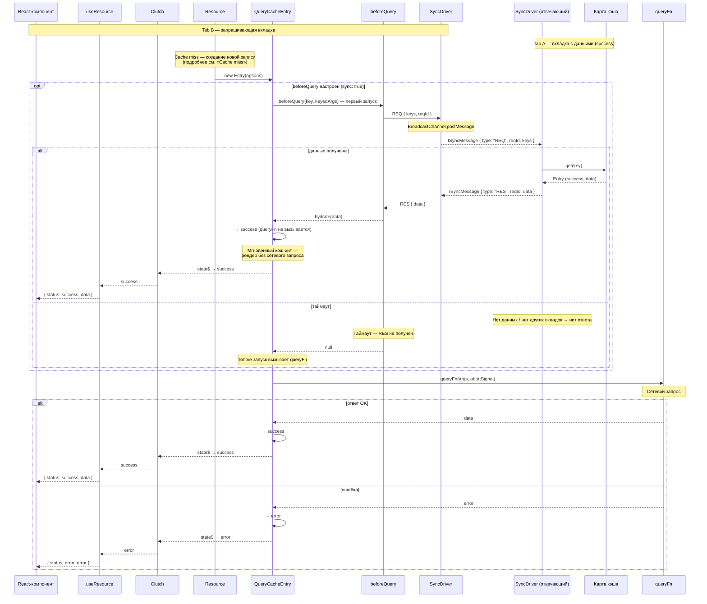
```mermaid
sequenceDiagram
    participant UI as React-компонент
    participant Hook as useResource
    participant Clutch as Clutch
    participant Res as Resource
    participant Entry as QueryCacheEntry
    participant BQ as beforeQuery
    participant Sync as SyncDriver
    participant Sync2 as SyncDriver (отвечающий)
    participant Cache2 as Карта кэша
    participant Query as queryFn

    Note over UI, Sync: Tab B — запрашивающая вкладка
    Note over Sync2, Cache2: Tab A — вкладка с данными (success)

    Note over Res: Cache miss — создание новой записи<br/>(подробнее см. «Cache miss»)
    Res->>Entry: new Entry(options)

    opt beforeQuery настроен (sync: true)
        Entry->>BQ: beforeQuery(key, keyedArgs) — первый запуск
        BQ->>Sync: REQ { keys, reqId }
        Note over Sync: BroadcastChannel.postMessage
        Sync-->>Sync2: ISyncMessage { type: "REQ", reqId, keys }

        alt данные получены
            Sync2->>Cache2: get(key)
            Cache2-->>Sync2: Entry (success, data)
            Sync2-->>Sync: ISyncMessage { type: "RES", reqId, data }
            Sync-->>BQ: RES { data }
            BQ-->>Entry: hydrate(data)
            Entry->>Entry: → success (queryFn не вызывается)
            Note over Entry: Мгновенный кэш-хит —<br/>рендер без сетевого запроса
            Entry-->>Clutch: state$ → success
            Clutch-->>Hook: success
            Hook-->>UI: { status: success, data }
        else таймаут
            Note over Sync2: Нет данных / нет других вкладок → нет ответа
            Note over BQ: Таймаут — RES не получен
            BQ-->>Entry: null
            Note over Entry: тот же запуск вызывает queryFn
        end
    end

    Entry->>Query: queryFn(args, abortSignal)
    Note over Query: Сетевой запрос

    alt ответ OK
        Query-->>Entry: data
        Entry->>Entry: → success
        Entry-->>Clutch: state$ → success
        Clutch-->>Hook: success
        Hook-->>UI: { status: success, data }
    else ошибка
        Query-->>Entry: error
        Entry->>Entry: → error
        Entry-->>Clutch: state$ → error
        Clutch-->>Hook: error
        Hook-->>UI: { status: error, error }
    end
```

## См. также

- [Состояние записи запроса][entry-state] — статусы и переходы, на которых построены все потоки
- [Система кэширования][cache] — жизненный цикл записей и `retentionTime`
- [Оптимистичные обновления (links)][usage-links] — `optimisticUpdate` и `invalidate` в действии
- [Сцепление][clutch] — SWR-наблюдатель, транслирующий состояние записи в UI
- [Кросс-табовая синхронизация][usage-broadcast] — настройка `syncDriver` и `broadcastSyncDriver`

[clutch]: clutch.md
[entry-state]: query-entry-state.md
[cache]: cache.md
[cache-invalidation]: cache.md#инвалидация-тающей-записи
[usage-links]: ../usage/links.md
[usage-broadcast]: ../usage/broadcast.md
