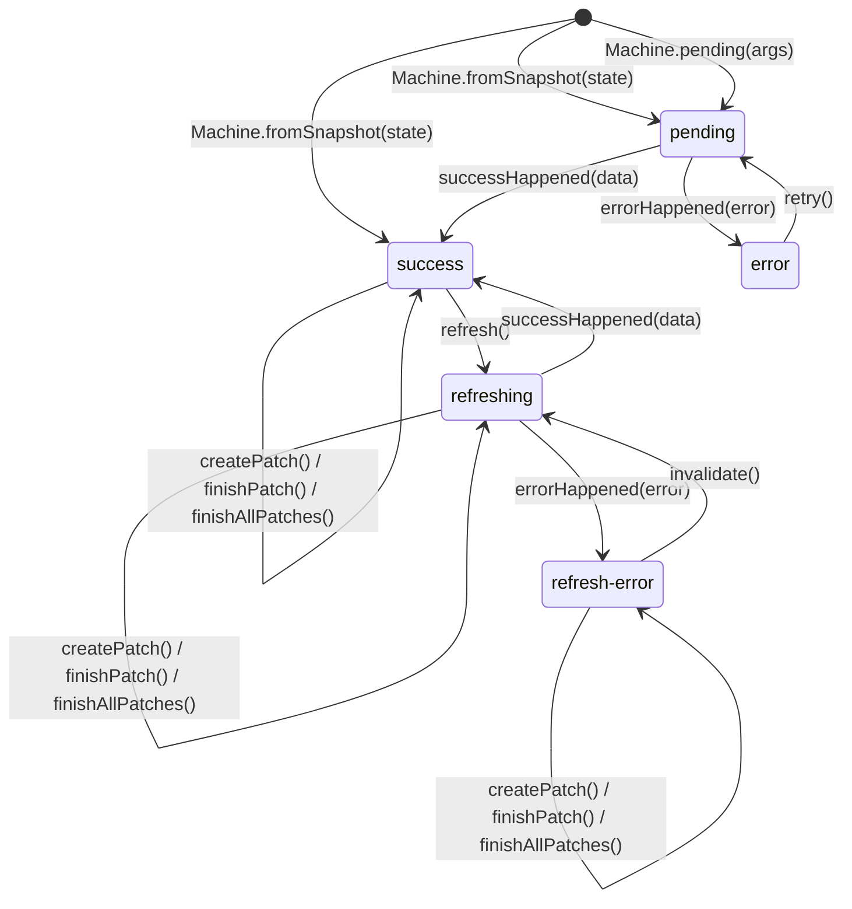

# Стейт-машина запроса

Каждый запрос представлен **иммутабельной стейт-машиной**. Машина хранит статус, данные, ошибку и метаданные. Любой переход создаёт **новый** экземпляр — старый не мутируется.

## Пять состояний

| Статус | Данные | Ошибка | `updatedAt` |
|---|---|---|---|
| `pending` | `null` | `null` | `null` |
| `success` | `TData` | `null` | `number` |
| `error` | `null` | `unknown` | `null` |
| `refreshing` | `TData` (устаревшие) | `null` | `number` |
| `refresh-error` | `TData` (устаревшие) | `unknown` | `number` |


## Диаграмма переходов



## Модель данных

```ts
interface TPendingState<TArgs> {
  status: 'pending';
  args: TArgs;
  data: null;
  error: null;
  updatedAt: null;
}

interface TSuccessState<TArgs, TData> {
  status: 'success';
  args: TArgs;
  data: TData;
  error: null;
  updatedAt: number;
  patchState: TPatchState<TData> | null;
}

interface TErrorState<TArgs> {
  status: 'error';
  args: TArgs;
  data: null;
  error: unknown;
  updatedAt: null;
}

interface TRefreshingState<TArgs, TData> {
  status: 'refreshing';
  args: TArgs;
  data: TData;
  error: null;
  updatedAt: number;
  patchState: TPatchState<TData> | null;
}

interface TRefreshErrorState<TArgs, TData> {
  status: 'refresh-error';
  args: TArgs;
  data: TData;
  error: unknown;
  updatedAt: number;
  patchState: TPatchState<TData> | null;
}
```

