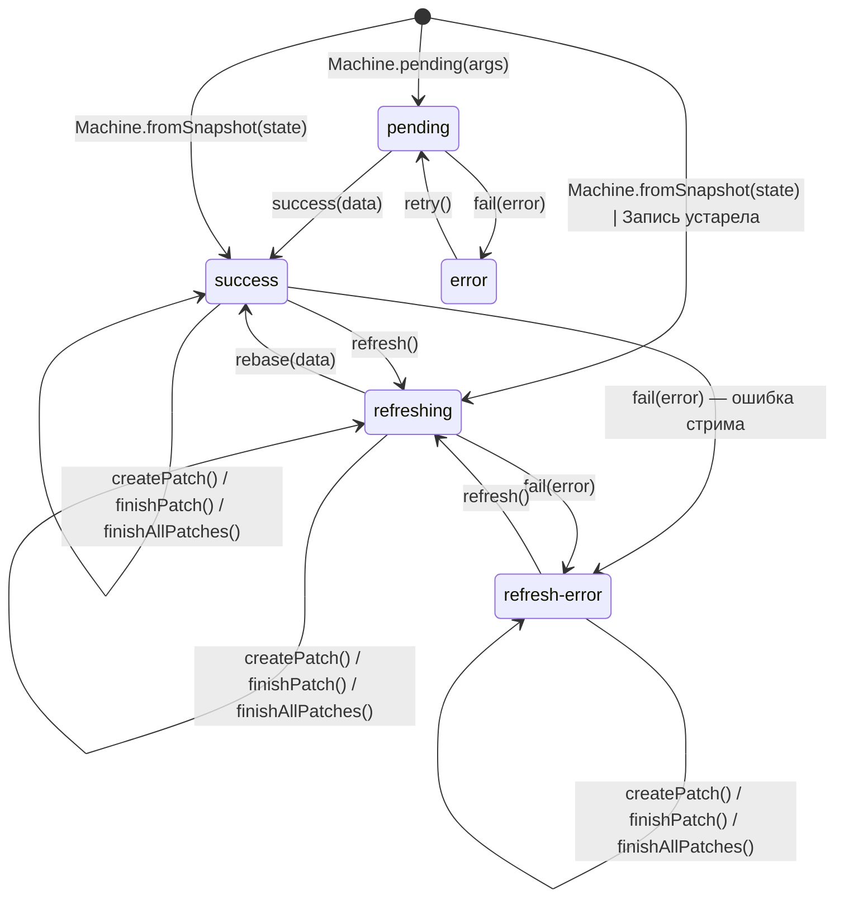

# Машина состояний запроса

Каждый запрос представлен **иммутабельной машиной состояний**. Машина хранит статус, данные, ошибку и метаданные. Любой переход создаёт **новый** экземпляр — старый не мутируется.

## Пять состояний

| Статус | Данные | Ошибка | `updatedAt` |
|---|---|---|---|
| `pending` | `null` | `null` | `null` |
| `success` | `TData` | `null` | `number` |
| `error` | `null` | `unknown` | `null` |
| `refreshing` | `TData` (устаревшие) | `null` | `number` |
| `refresh-error` | `TData` (устаревшие) | `unknown` | `number` |


## Диаграмма переходов


```mermaid
stateDiagram-v2
    pending --> success : success(data)
    
    [*] --> pending : Machine.pending(args)
    [*] --> success : Machine.fromSnapshot(state)
    [*] --> refreshing : Machine.fromSnapshot(state) | Запись устарела

    state "refresh-error" as refresh_error

    pending --> error : fail(error)

    success --> refreshing : refresh()
    success --> success : next(data) — эмиссия стрима
    success --> refresh_error : fail(error) — ошибка стрима
    success --> success : createPatch() / finishPatch() / finishAllPatches()

    error --> pending : retry()

    refreshing --> success : rebase(data)
    refreshing --> refresh_error : fail(error)
    refreshing --> refreshing : createPatch() / finishPatch() / finishAllPatches()

    refresh_error --> refreshing : refresh()
    refresh_error --> refresh_error : createPatch() / finishPatch() / finishAllPatches()
```

Два перехода из `success` появились в 0.12.0 для [стриминговых запросов][stream-query]:

- `next(data)` — `success → success`: очередная эмиссия стрима обновляет данные на месте (активные оптимистичные патчи переигрываются поверх новых данных). Доступен только из `success`.
- `fail(error)` — `success → refresh-error`: стрим упал уже после доставки данных; данные сохраняются, как при проваленном фоновом рефреше. До 0.12.0 `fail()` из `success` бросал `MachineTransitionError`.

## Модель данных

```ts
interface TPendingState<TArgs> {
  status: 'pending';
  args: TArgs;
  data: null;
  error: null;
  updatedAt: null;
}

interface TSuccessState<TArgs, TData> {
  status: 'success';
  args: TArgs;
  data: TData;
  error: null;
  updatedAt: number;
  patchState: TPatchState<TData> | null;
}

interface TErrorState<TArgs> {
  status: 'error';
  args: TArgs;
  data: null;
  error: unknown;
  updatedAt: null;
}

interface TRefreshingState<TArgs, TData> {
  status: 'refreshing';
  args: TArgs;
  data: TData;
  error: null;
  updatedAt: number;
  patchState: TPatchState<TData> | null;
}

interface TRefreshErrorState<TArgs, TData> {
  status: 'refresh-error';
  args: TArgs;
  data: TData;
  error: unknown;
  updatedAt: number;
  patchState: TPatchState<TData> | null;
}
```

## См. также

- [Кэш][cache] — хранит записи, каждая из которых содержит экземпляр машины.
- [Агент][agent] — наблюдает за записью кэша и транслирует состояние машины в UI.
- [Ресурс][usage-res] — использует машину для отслеживания состояния чтения данных.
- [Команда][usage-cmd] — использует машину для отслеживания состояния мутации.
- [Потоки данных][dataflows] — как машина участвует в потоках данных.
- [Патчинг][patching] — оптимистичные обновления через `createPatch` / `finishPatch`.

---

[cache]: cache.md
[agent]: agent.md
[stream-query]: ../usage/stream-query.md
[usage-res]: ../usage/resource.md
[usage-cmd]: ../usage/command.md
[dataflows]: dataflows.md
[patching]: patching.md
