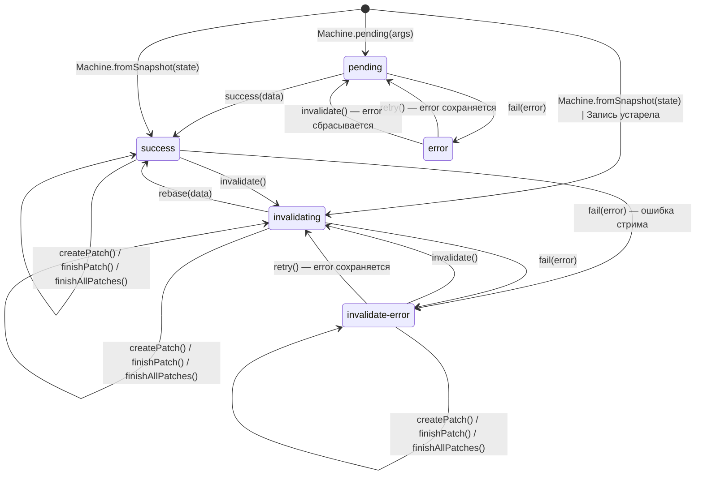

# Машина состояний запроса

Каждый запрос представлен **иммутабельной машиной состояний**. Машина хранит статус, данные, ошибку и метаданные. Любой переход создаёт **новый** экземпляр — старый не мутируется.

## Пять состояний

| Статус | Данные | Ошибка | `updatedAt` |
|---|---|---|---|
| `pending` | `null` | `null` / повторяемая¹ | `null` |
| `success` | `TData` | `null` | `number` |
| `error` | `null` | `unknown` | `null` |
| `invalidating` | `TData` (устаревшие) | `null` / повторяемая¹ | `number` |
| `invalidate-error` | `TData` (устаревшие) | `unknown` | `number` |

¹ Загрузка, запущенная через `retry()`, сохраняет в `error` ошибку, которую повторяет; загрузка после `invalidate()` эту ошибку снимает. Отдельного флага у повтора нет: в `pending` и `invalidating` повтор — это `error !== null`.

`invalidate-error` — провал перезапроса после инвалидации; сама инвалидация не проваливается: `invalidate()` переводит запись в `invalidating` всегда, ошибку приносит запущенный ею запрос.

Записи команд не инвалидируются: `invalidate()` на такой записи выводит `console.warn` и ничего не делает, поэтому `invalidating` и `invalidate-error` для команды недостижимы.


## Диаграмма переходов


```mermaid
stateDiagram-v2
    pending --> success : success(data)
    
    [*] --> pending : Machine.pending(args)
    [*] --> success : Machine.fromSnapshot(state)
    [*] --> invalidating : Machine.fromSnapshot(state) | Запись устарела

    state "invalidate-error" as invalidate_error

    pending --> error : fail(error)

    success --> invalidating : invalidate()
    success --> success : next(data) — эмиссия стрима
    success --> invalidate_error : fail(error) — ошибка стрима
    success --> success : createPatch() / finishPatch() / finishAllPatches()

    error --> pending : retry() — error сохраняется
    error --> pending : invalidate() — error сбрасывается

    invalidating --> success : rebase(data)
    invalidating --> invalidate_error : fail(error)
    invalidating --> invalidating : createPatch() / finishPatch() / finishAllPatches()

    invalidate_error --> invalidating : invalidate()
    invalidate_error --> invalidating : retry() — error сохраняется
    invalidate_error --> invalidate_error : createPatch() / finishPatch() / finishAllPatches()
```

`retry()` и `invalidate()` из одной и той же ошибки ведут в одно и то же состояние, но по-разному: `invalidate()` — перепроверка с очисткой `error`, `retry()` — повтор после неудачи с сохранённой ошибкой. Патч-операции ошибку не сбрасывают; она очищается, когда загрузка завершается (`rebase` / `success` / `fail`).

Переход `error → pending` по `invalidate()` появился в 0.13.0. Он нужен [сцеплению][clutch]: когда на экране данные предыдущих args или плейсхолдер, машина текущей записи сидит в `error`, а показывать при этом есть что — и `invalidate()` должен перезапросить, сняв ошибку, не убирая показанное. Ни previous, ни плейсхолдер машине не видны, поэтому решение принимается на её стороне одинаково для всех записей в `error`.

Два перехода из `success` появились в 0.12.0 для [стриминговых запросов][stream-query]:

- `next(data)` — `success → success`: очередная эмиссия стрима обновляет данные на месте (активные оптимистичные патчи переигрываются поверх новых данных). Доступен только из `success`.
- `fail(error)` — `success → invalidate-error`: стрим упал уже после доставки данных; данные сохраняются, как при проваленном фоновом перезапросе. До 0.12.0 `fail()` из `success` бросал `MachineTransitionError`.

## Модель данных

```ts
interface TPendingState<TArgs> {
  status: 'pending';
  args: TArgs;
  data: null;
  error: unknown;      // null, кроме retry()
  updatedAt: null;
}

interface TSuccessState<TArgs, TData> {
  status: 'success';
  args: TArgs;
  data: TData;
  error: null;
  updatedAt: number;
  patchState: TPatchState<TData> | null;
}

interface TErrorState<TArgs> {
  status: 'error';
  args: TArgs;
  data: null;
  error: unknown;
  updatedAt: null;
}

interface TInvalidatingState<TArgs, TData> {
  status: 'invalidating';
  args: TArgs;
  data: TData;
  error: unknown;      // null, кроме retry()
  updatedAt: number;
  patchState: TPatchState<TData> | null;
}

interface TInvalidateErrorState<TArgs, TData> {
  status: 'invalidate-error';
  args: TArgs;
  data: TData;
  error: unknown;
  updatedAt: number;
  patchState: TPatchState<TData> | null;
}
```

## См. также

- [Кэш][cache] — хранит записи, каждая из которых содержит экземпляр машины.
- [Сцепление][clutch] — наблюдает за записью кэша и транслирует состояние машины в UI.
- [Ресурс][usage-res] — использует машину для отслеживания состояния чтения данных.
- [Команда][usage-cmd] — использует машину для отслеживания состояния мутации.
- [Потоки данных][dataflows] — как машина участвует в потоках данных.
- [Патчинг][patching] — оптимистичные обновления через `createPatch` / `finishPatch`.

---

[cache]: cache.md
[clutch]: clutch.md
[stream-query]: ../usage/stream-query.md
[usage-res]: ../usage/resource.md
[usage-cmd]: ../usage/command.md
[dataflows]: dataflows.md
[patching]: patching.md
