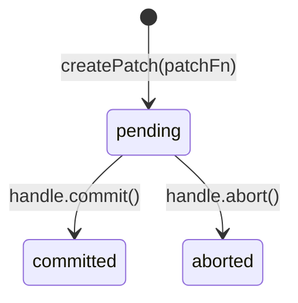

# Оптимистичные обновления (Patching)

Патч мгновенно применяет изменения к данным в [кеше][cache], не дожидаясь ответа сервера.
Пользователь видит результат мутации сразу; при ошибке — данные откатываются.
Механизм основан на Immer, используется [ресурсам][usage-res] и [командам][usage-cmd].

## Жизненный цикл патча

- **pending** — патч создан, изменения отражены в `data`, но сервер ещё не подтвердил операцию.
- **committed** — сервер подтвердил; патч вливается в базовые данные при следующем ребейсе.
- **aborted** — операция отменена; `inversePatches` откатывают изменения.

## patchState

Когда хотя бы один патч активен, в состоянии [машины][machine] появляется поле `patchState`:

| Поле | Описание |
|------|----------|
| `originalData` | Снимок серверных данных до применения первого патча |
| `patches[]` | Стек патчей с их статусами (`pending` / `committed` / `aborted`) |
| `isConsistencyViolation` | Флаг нарушения консистентности (см. ниже) |

Пока `patchState` присутствует: `data` = результат применения всех патчей, `originalData` = нетронутые серверные данные. Когда все патчи завершены — `patchState` сбрасывается в `null`.

## Стек патчей

Каждый вызов `createPatch` добавляет новый патч в стек. `originalData` фиксируется при создании первого патча и сохраняется до полного завершения стека. Immer-рецепт выполняется поверх текущего `data` (уже содержащего предыдущие патчи), а не поверх `originalData`.

## Ребейс при обновлении

Когда сервер возвращает свежие данные (переход `refreshing → success`), патчи переигрываются на новой базе.
Если после ребейса pending-патчей не осталось — `patchState` очищается.

## Нарушение консистентности

Если переприменение патчей при ребейсе выбрасывает ошибку (например, структура данных изменилась), 
    или abort нарушает порядок зависимых патчей — выставляется `isConsistencyViolation = true`.
В этом случае стек патчей очищается и запускается автоматическая инвалидация.

## Декларативный API

Для типичного сценария «мутация + оптимистичное обновление» используется `link({ optimisticUpdate })` — подробнее в руководстве по [связям][links].

## Связь с другими компонентами

- [Стейт-машина][machine] — патчи применяются к состояниям `success`, `refreshing`, `refresh-error`.
- [Кеш][cache] — запись кеша хранит `patchState` и предоставляет `createPatch`.
- [Использование ресурсов][usage-res] — оптимистичные обновления в контексте ресурса.
- [Использование команд][usage-cmd] — оптимистичные обновления в контексте команды.
- [Связи (links)][links] — декларативный `optimisticUpdate` через `link()`.

[machine]: machine.md
[cache]: cache.md
[usage-res]: ../usage/resource.md
[usage-cmd]: ../usage/command.md
[links]: ../usage/links.md
