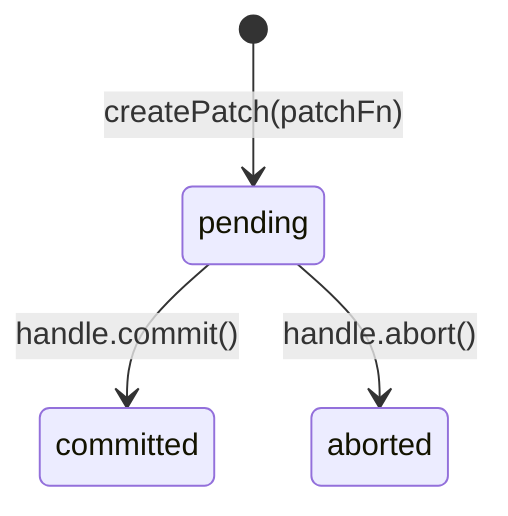

# Оптимистичные обновления (Patching)

Патч мгновенно применяет изменения к данным в [кеше][cache], не дожидаясь ответа сервера.
Пользователь видит результат сразу; при ошибке — данные откатываются.
Механизм основан на Immer.

## Жизненный цикл патча

- **pending** — патч создан, изменения отражены в `data`, но сервер ещё не подтвердил операцию.
- **committed** — сервер подтвердил; патч вливается в базовые данные при следующем ребейсе.
- **aborted** — операция отменена; `inversePatches` откатывают изменения.

## patchState

Когда хотя бы один патч активен, в состоянии [машины][machine] появляется поле `patchState`:

| Поле | Описание                                                        |
|------|-----------------------------------------------------------------|
| `originalData` | Данные до применения первого патча                              |
| `patches[]` | Стек патчей |
| `isConsistencyViolation` | Флаг нарушения консистентности (см. ниже)                       |

Пока `patchState` присутствует: `data` = результат применения всех патчей, `originalData` = нетронутые серверные данные. Когда все патчи завершены — `patchState` сбрасывается в `null`.

## Стек патчей

Каждый вызов `createPatch` добавляет новый патч в стек. `originalData` фиксируется при создании первого патча, но может изменяется, см Восстановление при аборта.
Immer-рецепты накладываются поверх текущего `data` (уже содержащего предыдущие патчи), а не поверх `originalData`.

## Ребейс при обновлении

Когда сервер возвращает свежие данные (переход `refreshing → success`), патчи переигрываются на новой базе.
Если после ребейса pending-патчей не осталось — `patchState` очищается.

## Поведение при аборте

Аборт требует применения обратного immer-патча к `origialData`.
Но при наличии множественных патчей, происходит переигрывание всех патчей поверх `originalData`.

**Для упрощения расчетов (при переигрывании)**:
- все независимые завершенные патчи (те все `committed` и `aborted`, которые были созданы до первого `pending`) - вливаются в `originalData` и удаляются из стека;
- все `pending` патчи и зависимые от них `committed` и `aborted` - переигрываются поверх обновленного `originalData`, результат сохраняется в `data`, эти патчи остаются в стеке;
- если не было `pending` патчей, то `patchState` очищается.

В результате переигрывания, может вознизникнуть наршуение консистентности (см. ниже).

## Нарушение консистентности

Если при ребейсе или аборте нарушится порядок зависимых патчей (immer не может разрешить изменения) — выставляется `isConsistencyViolation = true`.
В этом случае стек патчей очищается (`data` остается пропатченой) и запускается автоматическая инвалидация.

## Декларативный API

С типичным сценарем «мутация + оптимистичное обновление» описано в руководстве по [связям][links].

## Связь с другими компонентами

- [Стейт-машина][machine] — патчи применяются к состояниям `success`, `refreshing`, `refresh-error`.
- [Кеш][cache] — запись кеша хранит `patchState` и предоставляет `createPatch`.
- [Использование ресурсов][usage-res] — оптимистичные обновления в контексте ресурса.
- [Использование команд][usage-cmd] — оптимистичные обновления в контексте команды.
- [Связи (links)][links] — декларативный `optimisticUpdate` через `link()`.

[machine]: machine.md
[cache]: cache.md
[usage-res]: ../usage/resource.md
[usage-cmd]: ../usage/command.md
[links]: ../usage/links.md
