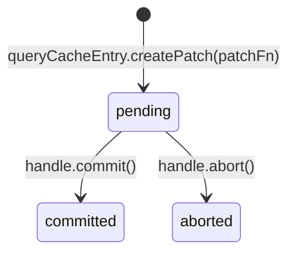

# Оптимистичные обновления (Patching)

Патч мгновенно применяет изменения к данным в [кэше][cache], не дожидаясь ответа сервера.
Пользователь видит результат сразу; при ошибке — данные откатываются.
Механизм основан на Immer.

## Жизненный цикл патча

```mermaid
stateDiagram-v2
    [*] --> pending : queryCacheEntry.createPatch(patchFn)
    pending --> committed : handle.commit()
    pending --> aborted : handle.abort()
```

- **pending** — патч создан, изменения отражены в `data`, но сервер ещё не подтвердил операцию.
- **committed** — сервер подтвердил; изменение остаётся в `data`, пока его не сменят свежие данные сервера: в них оно уже есть (см. [ребейс](#ребейс-при-обновлении)).
- **aborted** — операция отменена; `inversePatches` откатывают изменения.

## patchState

Когда хотя бы один патч активен, в [состоянии записи][entry-state] появляется поле `patchState`:

| Поле | Описание                                                        |
|------|-----------------------------------------------------------------|
| `originalData` | Данные до применения первого патча; после нарушения консистентности — `data` на момент сбоя |
| `patches[]` | Стек патчей |
| `isConsistencyViolation` | Флаг нарушения консистентности: держится до ответа сервера (см. ниже) |

Пока `patchState` присутствует: `data` = результат применения всех патчей к `originalData`, а `originalData` = нетронутые серверные данные — кроме [нарушения консистентности](#нарушение-консистентности). Когда все патчи завершены — `patchState` сбрасывается в `null`; после нарушения — только с ответом сервера.

## Стек патчей

Каждый вызов `createPatch` добавляет новый патч в стек. `originalData` фиксируется при создании первого патча, но может изменяться, см "Поведение при аборте".
Immer-рецепты накладываются поверх текущего `data` (уже содержащего предыдущие патчи), а не поверх `originalData`.

## Ребейс при обновлении

Когда сервер возвращает свежие данные (переход `invalidating → success` или очередная эмиссия стрима), на новой базе переигрываются только `pending`-патчи.
Завершённые в ней растворяются: сервер — источник истины, подтверждённое изменение в его данных уже есть, а отменённого не было. Поэтому `committed`-патч, стоящий в стеке за `pending`, второй раз не применяется.
Если после ребейса pending-патчей не осталось — `patchState` очищается.

## Поведение при аборте

Аборт требует применения обратного immer-патча к `originalData`.
Но при наличии множественных патчей, происходит переигрывание всех патчей поверх `originalData`.

**Для упрощения расчетов (при переигрывании)**:
- все независимые завершенные патчи (те все `committed` и `aborted`, которые были созданы до первого `pending`) - вливаются в `originalData` и удаляются из стека;
- все `pending` патчи и зависимые от них `committed` и `aborted` - переигрываются поверх обновленного `originalData`, результат сохраняется в `data`, эти патчи остаются в стеке;
- если не было `pending` патчей, то `patchState` очищается.

В результате переигрывания, может возникнуть нарушение консистентности (см. ниже).

## Нарушение консистентности

Если при ребейсе или аборте нарушится порядок зависимых патчей (immer не может разрешить изменения) — выставляется `isConsistencyViolation = true`. Флаг держится до ответа сервера, через новые патчи и их завершение: до него данные записи — не ответ сервера, и [снимок][snapshot] её не сохраняет.
В этом случае стек патчей очищается, а `data` остаётся пропатченной и становится новой базой (`originalData`): поздний `commit()` / `abort()` сброшенного патча и откат патча, созданного после сбоя, её не откатывают. Запись перезапрашивается — через `invalidate()`, откуда бы нарушение ни пришло (аборт или завершение патча, ребейс, очередная эмиссия стрима). Значит, действуют обычные правила: удерживаемая запись перезапрашивается сразу, тающая — при первом удержании ([инвалидация тающей записи][cache-invalidation]); запрос в полёте — по опции ресурса `invalidateInFlight` ([инвалидация в полёте][cache-inflight]), `join` включительно.

Пришедшие с сервера данные при этом **отбрасываются**: показать их было бы можно только либо с патчами, которые к ним не подходят, либо без патчей, которые вызывающий код считает применёнными. Поэтому такой ран ничего не завершает — запись переходит в `invalidating` (при провале ребейса остаётся в нём) с прежним `updatedAt` и инвалидируется: её данные — уже не ответ сервера, а ожидание исправления. Промис-запрос к этому моменту уже не в полёте: удерживаемая запись сразу отправляет следующий, тающая помечается. Стрим открыт и остаётся запросом в полёте: под `cancel` он переподписывается, под `trail` помечается и живёт дальше, под `join` живёт без метки. Первый результат следующего запроса — или следующая эмиссия стрима — переигрывает уже пустой список патчей и садится в чистый `success` с серверными данными. Стрим, завершившийся без такой эмиссии, оставляет запись [должной перезапрос][cache-left-flight]: в `invalidating` без запроса в полёте она не зависает.

Практическое следствие: ни `resource.fetch()`, ни сцепление, ни `useSuspenseResource`, ни кросс-табовая синхронизация не увидят промежуточный `success` с отброшенными оптимистичными данными. `ensure()` — отдельный случай: он по контракту резолвится любыми имеющимися данными, включая устаревшие.

## Декларативный API

С типичным сценарием «мутация + оптимистичное обновление» описано в руководстве по [связям][links].

## См. также

- [Состояние записи запроса][entry-state] — патчи применяются к состояниям `success`, `invalidating`, `invalidate-error`.
- [Кэш][cache] — запись кэша хранит `patchState` и предоставляет `createPatch`.
- [Broadcast][broadcast] — кросс-табовая синхронизация, включая передачу патчей.
- [Использование ресурсов][usage-res] — оптимистичные обновления в контексте ресурса.
- [Использование команд][usage-cmd] — оптимистичные обновления в контексте команды.
- [Связи (links)][links] — декларативный `optimisticUpdate` через `link()`.

[entry-state]: query-entry-state.md
[cache]: cache.md
[cache-invalidation]: cache.md#инвалидация-тающей-записи
[cache-inflight]: cache.md#инвалидация-в-полёте
[cache-left-flight]: cache.md#запрос-вышел-из-полёта-без-данных
[broadcast]: ../usage/broadcast.md
[snapshot]: ../usage/snapshot.md
[usage-res]: ../usage/resource.md
[usage-cmd]: ../usage/command.md
[links]: ../usage/links.md
