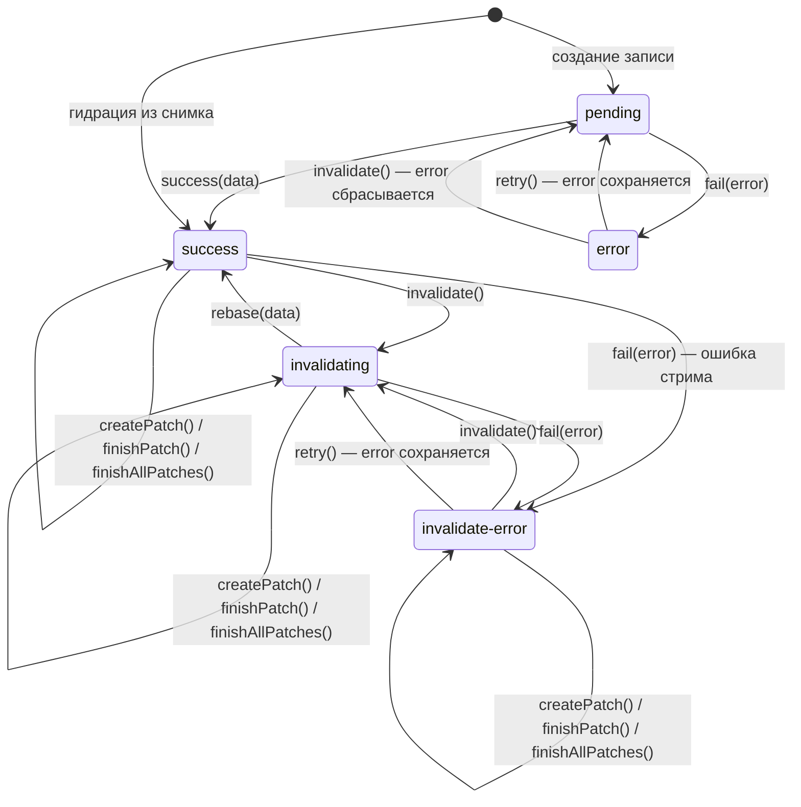

# Состояние записи запроса

Каждая [запись кэша][cache] хранит одно **иммутабельное состояние** — плоскую запись со статусом, данными, ошибкой и метаданными. Любой переход создаёт **новую** запись состояния; старая не мутируется. Запись кэша публикует её через `entry.state$` (и `entry.peek()`), тип — `TQueryEntryState<TArgs, TData>`.

```typescript
const entry = usersResource.getEntry({ page: 1 });
const state = entry?.state$(); // TQueryEntryState<{ page: number }, User[]>

if (state?.status === 'invalidate-error') {
    // данные устарели, но они есть; ошибка — от упавшего перезапроса
    console.log(state.data, state.error);
}
```

> Это **сырое** состояние одной записи. Для UI обычно нужно производное: состояние [сцепления][clutch] (`TResourceClutchState`) или состояние записи `TResourceEntryState` из `resource.getState(args)` — там пять статусов уже разложены по осям `status` × `dataSource` и посчитаны флаги. Два семейства легко спутать: `TQueryEntryState` — то, что запись хранит, `TResourceEntryState` — то, что ресурс показывает наружу.

## Пять состояний

| Статус | Данные | Ошибка | `updatedAt` |
|---|---|---|---|
| `pending` | `null` | `null` / повторяемая¹ | `null` |
| `success` | `TData` | `null` | `number` |
| `error` | `null` | `unknown` | `null` |
| `invalidating` | `TData` (устаревшие) | `null` / повторяемая¹ | `number` |
| `invalidate-error` | `TData` (устаревшие) | `unknown` | `number` |

¹ Загрузка, запущенная через `retry()`, сохраняет в `error` ошибку, которую повторяет; загрузка после `invalidate()` эту ошибку снимает. Отдельного флага у повтора нет: в `pending` и `invalidating` повтор — это `error !== null`.

`invalidate-error` — провал перезапроса после инвалидации; сама инвалидация не проваливается, ошибку приносит запущенный ею запрос. Из `success` / `invalidate-error` `invalidate()` ведёт в `invalidating`, из `error` — в `pending`; из `pending` / `invalidating` статус не меняется — по [правилу для запроса в полёте][cache-inflight] перезапускается или дорабатывает сам запрос.

Записи команд не инвалидируются: `invalidate()` на такой записи выводит `console.warn` и ничего не делает, поэтому `invalidating` и `invalidate-error` для команды недостижимы.


## Диаграмма переходов



Устаревший снимок гидрируется тем же ребром в `success`, но с меткой `entry.isInvalidated`: машина о метке не знает, перезапрос уходит на первом удержании записи — см. [инвалидацию тающей записи][cache-invalidation].

Подписи на рёбрах — имена **внутренних** переходов: `success`, `fail`, `rebase`, `next`, `finishPatch` и `finishAllPatches` запись выполняет сама, когда запрос завершается, падает или приносит очередную эмиссию стрима. Снаружи доступны три входа — [`entry.invalidate()`, `entry.retry()` и `entry.createPatch()`][api-entry]. `retry()` и `createPatch()` из статуса, откуда диаграмма ребра не рисует, — `console.warn` и no-op. `invalidate()` допустим из любого статуса: из `pending` / `invalidating` ребра нет, потому что статус не меняется — запрос в полёте прерывается или дорабатывает по [правилу в полёте][cache-inflight].

Петля `invalidating → invalidating` — [нарушение консистентности патчей][patching]: переигрывание не удалось, серверные данные отброшены, и запись инвалидирует себя, не публикуя `success` за отброшенный ран: удерживаемая запускает следующий запрос сразу, тающая — при следующем удержании; открытый стрим — по режиму [`inFlight`][cache-inflight] ресурса.

`retry()` и `invalidate()` из одной и той же ошибки ведут в одно и то же состояние, но по-разному: `invalidate()` — перепроверка с очисткой `error`, `retry()` — повтор после неудачи с сохранённой ошибкой. Патч-операции ошибку не сбрасывают; она очищается, когда загрузка завершается (`rebase` / `success` / `fail`).

Переход `error → pending` по `invalidate()` появился в 0.13.0. Он нужен [сцеплению][clutch]: когда на экране данные предыдущих args или плейсхолдер, текущая запись сидит в `error`, а показывать при этом есть что — и `invalidate()` должен перезапросить, сняв ошибку, не убирая показанное. Ни previous, ни плейсхолдер записи не видны, поэтому решение принимается на её стороне одинаково для всех записей в `error`.

Два перехода из `success` появились в 0.12.0 для [стриминговых запросов][stream-query]:

- `next(data)` — `success → success`: очередная эмиссия стрима обновляет данные на месте (активные оптимистичные патчи переигрываются поверх новых данных). Доступен только из `success`.
- `fail(error)` — `success → invalidate-error`: стрим упал уже после доставки данных; данные сохраняются, как при проваленном фоновом перезапросе. До 0.12.0 `fail()` из `success` считался недопустимым переходом и бросал ошибку.

## Модель данных

```ts
interface TQueryEntryPendingState<TArgs> {
  status: 'pending';
  args: TArgs;
  data: null;
  error: unknown;      // null, кроме retry()
  updatedAt: null;
}

interface TQueryEntrySuccessState<TArgs, TData> {
  status: 'success';
  args: TArgs;
  data: TData;
  error: null;
  updatedAt: number;
  patchState: TPatchState<TData> | null;
}

interface TQueryEntryErrorState<TArgs> {
  status: 'error';
  args: TArgs;
  data: null;
  error: unknown;
  updatedAt: null;
}

interface TQueryEntryInvalidatingState<TArgs, TData> {
  status: 'invalidating';
  args: TArgs;
  data: TData;
  error: unknown;      // null, кроме retry()
  updatedAt: number;
  patchState: TPatchState<TData> | null;
}

interface TQueryEntryInvalidateErrorState<TArgs, TData> {
  status: 'invalidate-error';
  args: TArgs;
  data: TData;
  error: unknown;
  updatedAt: number;
  patchState: TPatchState<TData> | null;
}

type TQueryEntryState<TArgs, TData> =
  | TQueryEntryPendingState<TArgs>
  | TQueryEntrySuccessState<TArgs, TData>
  | TQueryEntryErrorState<TArgs>
  | TQueryEntryInvalidatingState<TArgs, TData>
  | TQueryEntryInvalidateErrorState<TArgs, TData>;
```

Набор статусов отдельным типом — `TQueryEntryStatus`.

## Внутри: иммутабельная машина состояний

Переходы с диаграммы реализованы алгеброй иммутабельных классов внутри ядра (`src/query/core/machine/`): метод перехода возвращает новое состояние, типы сужают данные по статусу (`data` не `null` в `success`), недопустимый переход отбивается на месте. Это **деталь реализации**: классы не экспортируются из пакета и не достижимы ни через один публичный экспорт — импортировать или вызывать их нельзя. До 0.13.0 они были публичными, а `state$` отдавал экземпляр класса; что с этим делать — в [гайде по миграции][migration-0130].

## См. также

- [Кэш][cache] — хранит записи, каждая из которых держит одно такое состояние.
- [Запись кэша запроса — API][api-entry] — `state$`, `invalidate()`, `retry()`, `createPatch()`.
- [Сцепление][clutch] — наблюдает за записью кэша и транслирует её состояние в UI.
- [Ресурс][usage-res] — чтение данных поверх этих состояний.
- [Команда][usage-cmd] — мутации поверх этих состояний.
- [Потоки данных][dataflows] — как состояние записи участвует в потоках данных.
- [Патчинг][patching] — оптимистичные обновления через `createPatch` / `finishPatch`.

---

[cache]: cache.md
[cache-invalidation]: cache.md#инвалидация-тающей-записи
[cache-inflight]: cache.md#инвалидация-в-полёте
[clutch]: clutch.md
[stream-query]: ../usage/stream-query.md
[usage-res]: ../usage/resource.md
[usage-cmd]: ../usage/command.md
[dataflows]: dataflows.md
[patching]: patching.md
[api-entry]: ../api/_QueryCacheEntry.md
[migration-0130]: ../../migrations/0.13.0.md#состояние-записи-кэша
