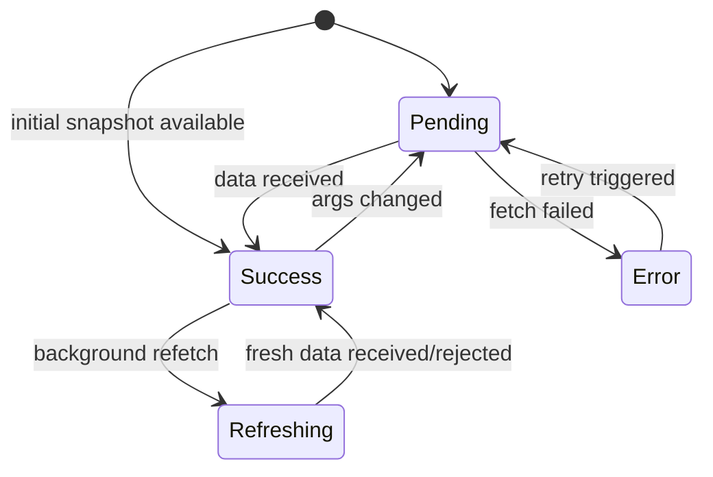
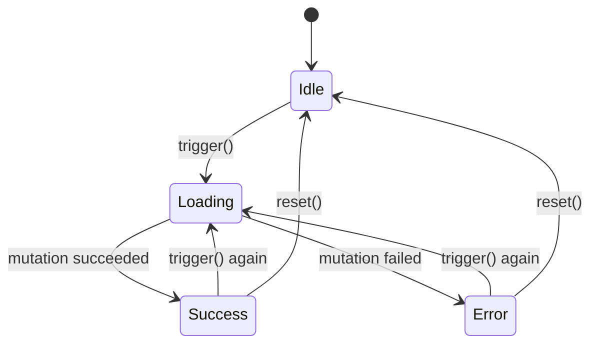

# State Machines

Every cache entry in RxQuery is backed by an immutable state machine. Instead of mutable flags (`isLoading = true`), the machine transitions between typed states that guarantee data consistency at the type level. There are two separate machine families: **Resource machines** for queries and **Command machines** for mutations.

## Resource Machine States

A resource cache entry is always in exactly one of four states:



### Machine Classes

| Class | Status | `data` | `error` | Description |
|-------|--------|--------|---------|-------------|
| `MachinePending` | `'pending'` | `null` | `null` | Initial state — first fetch in progress |
| `MachineSuccess` | `'success'` | `TData` | `null` | Data available. Carries optional `lastError` and `patchState` |
| `MachineError` | `'error'` | `null` | `unknown` | Fetch failed with no prior data |
| `MachineRefreshing` | `'refreshing'` | `TData` | `null` | Background refetch with stale data (SWR) |

`MachineSuccess` and `MachineRefreshing` both extend the abstract `MachineWithData` — they are the only states that carry `data` and support optimistic patches.

### Type Definitions

Each class corresponds to a state interface:

```typescript
interface TPendingState<TArgs> {
  readonly status: 'pending';
  readonly args: TArgs;
  readonly data: null;
  readonly error: null;
  readonly updatedAt: null;
}

interface TSuccessState<TArgs, TData> {
  readonly status: 'success';
  readonly args: TArgs;
  readonly data: TData;
  readonly error: null;
  readonly updatedAt: number;
  readonly patchState: TPatchState<TData> | null;
  readonly lastError?: unknown;
}

interface TErrorState<TArgs> {
  readonly status: 'error';
  readonly args: TArgs;
  readonly data: null;
  readonly error: unknown;
  readonly updatedAt: null;
}

interface TRefreshingState<TArgs, TData> {
  readonly status: 'refreshing';
  readonly args: TArgs;
  readonly data: TData;
  readonly error: null;
  readonly updatedAt: number;
  readonly patchState: TPatchState<TData> | null;
}
```

The discriminated union of all four is `TMachineState<TArgs, TData>`.

## Command Machine States

Commands use a separate 4-state machine:



### Command Machine Classes

| Class | Status | `data` | `error` | Description |
|-------|--------|--------|---------|-------------|
| `CommandIdle` | `'idle'` | `null` | `null` | No mutation has been triggered yet |
| `CommandLoading` | `'loading'` | `null` | `null` | Mutation in flight |
| `CommandSuccess` | `'success'` | `TResult` | `null` | Mutation completed successfully |
| `CommandError` | `'error'` | `null` | `unknown` | Mutation failed |

### Type Definitions

```typescript
interface TCommandIdleState {
  readonly status: 'idle';
  readonly args: null;
  readonly data: null;
  readonly error: null;
}

interface TCommandLoadingState<TArgs> {
  readonly status: 'loading';
  readonly args: TArgs;
  readonly data: null;
  readonly error: null;
}

interface TCommandSuccessState<TArgs, TData> {
  readonly status: 'success';
  readonly args: TArgs;
  readonly data: TData;
  readonly error: null;
  readonly patchState: TPatchState<TData> | null;
}

interface TCommandErrorState<TArgs> {
  readonly status: 'error';
  readonly args: TArgs;
  readonly data: null;
  readonly error: unknown;
}
```

## Checking State

### Using status property

```typescript
const entry = userResource.getEntry({ id: '1' }, true);
const machine = entry.peek();

switch (machine.status) {
  case 'pending':
    // machine.data is null (type-narrowed)
    break;
  case 'success':
    // machine.data is TData (type-narrowed)
    console.log(machine.data);
    break;
  case 'error':
    console.error(machine.error);
    break;
  case 'refreshing':
    // machine.data is TData (stale)
    console.log('Stale:', machine.data);
    break;
}
```

### Using instanceof

The exported machine classes can be used for `instanceof` checks:

```typescript
import { MachineSuccess, MachineRefreshing, MachineWithData } from '@fozy-labs/rx-toolkit';

const machine = entry.peek();

if (machine instanceof MachineSuccess) {
  console.log('Fresh data:', machine.data);
}

if (machine instanceof MachineWithData) {
  // True for both Success and Refreshing
  console.log('Has data:', machine.data);
}
```

### Using agent boolean flags

In most application code you don't interact with machines directly. The agent layer flattens them into boolean flags:

```typescript
const state = userResource.useResourceAgent({ id: '1' });

// These flags are computed from the underlying machine transitions
state.isLoading;         // pending or refreshing
state.isInitialLoading;  // pending (no prior data)
state.isRefreshing;      // refreshing (has stale data)
state.isSuccess;         // success or refreshing (data available)
state.isError;           // error state
state.isRefreshError;    // error after a successful fetch (SWR error)
```

## Patch State

`MachineSuccess` and `MachineRefreshing` support optimistic patches via `patchState`:

```typescript
interface TPatchState<TData> {
  readonly originalData: TData;         // unpatched server data
  readonly patches: TPatch[];           // active Immer patches
  readonly isConsistencyViolation: boolean;
}
```

When `patchState` is `null`, `data` is raw server data. When present, `data` is the patched version and `originalData` holds the original. Patches are managed through `IResourceCacheEntry.createPatch()` which returns an `IPatchHandle` with `commit()` and `abort()` methods.

## Immutability

All machine states are `readonly`. Transitions produce a **new** machine instance — the previous one is never modified. This enables efficient change detection (reference equality) and safe rendering in React without deep comparison.
