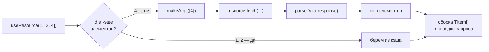

# Batch-ресурс

`api.createBatchResource` — обёртка над существующим [ресурсом][ресурс] для загрузки коллекций элементов по списку id с **гранулярностью кэша до отдельного элемента**. Обычный ресурс кэширует ответ целиком по аргументам: запросы `[1, 2, 3]` и `[1, 2, 4]` для него — два независимых полных запроса. Batch-ресурс ведёт общий кэш элементов по id и догружает через обёрнутый ресурс только недостающие.

```typescript
const api = createApi({ plugins: [reactHooksPlugin()] });

// Обычный ресурс, умеющий отдавать пользователей списком
const usersResource = api.createResource({
    queryFn: async (args: { userIds: number[] }) => {
        const res = await fetch(`/api/users?ids=${args.userIds.join(',')}`);
        return res.json() as Promise<User[]>;
    },
});

const usersBatch = api.createBatchResource({
    resource: usersResource,
    key: 'users-batch',
    parseData: (data) => data.map((item) => ({ id: item.id, item })),
    makeArgs: (ids) => ({ userIds: ids }),
});

// Первый запрос: queryFn получает { userIds: [1, 2, 3] }
usersBatch.useResource([1, 2, 3]);

// Элементы 1 и 2 уже в кэше — queryFn получает { userIds: [4] }
usersBatch.useResource([1, 2, 4]);

// Все элементы в кэше — запроса нет вовсе
usersBatch.useResource([2, 3]);
```

Batch-ресурс — это полноценный `IResource<TArgs, TItem[]>`: у него работают агенты, `useResource` / `useSuspenseResource`, SWR, `ensure` / `fetch` / `prefetch`, devtools и расширения плагинов — ровно так же, как у обычного ресурса. Вся «магия» спрятана в его `queryFn`.


## Как это устроено

Снаружи — обычный ресурс с кэш-записью на каждый набор id. Внутри — общий кэш элементов, через который проходит каждый запуск запроса:



1. `parseArgs` извлекает id из аргументов (по умолчанию аргументы — сам массив id).
2. Id, которых нет в кэше элементов, собираются в один запрос `makeArgs(missingIds)` к обёрнутому ресурсу; id, уже загружаемые параллельным набором, не запрашиваются повторно — их результат ожидается.
3. `parseData` разбирает ответ на пары `{ id, item }`, элементы раскладываются в кэш.
4. Результат собирается по каждому запрошенному id (с сохранением порядка и дубликатов) и попадает в кэш-запись набора.


## Опции

| Опция           | Тип                                                    | Описание |
|-----------------|--------------------------------------------------------|----------|
| `resource`      | `IResource<TResArgs, TResData>`                        | Обёрнутый ресурс, выполняющий фактические запросы. **Обязательна.** |
| `parseData`     | `(data: TResData) => { id: TId; item: TItem }[]`       | Разбирает ответ обёрнутого ресурса на пары `{ id, item }`. **Обязательна.** |
| `makeArgs`      | `(ids: TId[]) => TResArgs`                             | Собирает аргументы обёрнутого ресурса из списка id, которые нужно догрузить. **Обязательна.** |
| `parseArgs`     | `(args: TArgs) => TId[]`                               | Извлекает id из аргументов batch-ресурса. Опциональна: без неё аргументы — сам массив id (`TArgs = TId[]`). Должна быть чистой и детерминированной. |
| `key`           | `string`                                               | Ключ для devtools; получает префикс `keyPrefix`, как у любого ресурса. |
| `serializeId`   | `(id: TId) => string`                                  | Сериализация id в ключ кэша элементов. По умолчанию — `stableStringify` (объектные id сравниваются структурно). |
| `onCacheEntryAdded` | `(args, ctx) => void`                              | [Lifecycle-хук](./lifecycle.md) над записями наборов (`args` — аргументы batch-ресурса, `data` — собранный `TItem[]`). Компонуется с внутренним хуком рантайма. |
| `onQueryStarted` | `(args, ctx) => void \| Promise<void>`                | [Lifecycle-хук](./lifecycle.md) на каждый запуск запроса набора — включая запуски, целиком обслуженные кэшем элементов без сети. Реальные сетевые запросы наблюдайте хуками на обёрнутом ресурсе. |
| `retentionTime` | `number` \| `false`                                    | Время удержания кэш-записей наборов; по умолчанию — значение API. |
| `serializeArgs` | `(args: TArgs) => string`                              | Сериализация аргументов batch-ресурса в ключ кэш-записи набора. |


## Семантика

- **Дедупликация.** Повторяющиеся id внутри одного запроса запрашиваются один раз, но в результате занимают все свои позиции. Пустой список id разрешается в `[]` без запроса.
- **Параллельные запросы.** Набор, пересекающийся с уже летящим запросом, не дублирует общие id — он дозапрашивает только свои недостающие и ждёт чужой ответ для остальных.
- **`refresh` / `prefetch({ force: true })` / `fetch`** на существующей записи обновляют **все** id набора, минуя кэш элементов (присоединяясь к уже летящим запросам по этим id).
- **Консистентность между наборами.** Обновлённые элементы записываются и в другие пересекающиеся success-записи: после рефреша `[1, 2, 3]` запись `[1, 2, 4]` увидит новые элементы 1 и 2 (в devtools — действие `batch-sync`). Все наборы разделяют один и тот же экземпляр элемента. Записи с незавершёнными оптимистичными патчами не трогаются.
- **`retry` / `ensure`** после ошибки повторяют только всё ещё недостающие id — успевшие попасть в кэш элементы не перезапрашиваются.
- **Вытеснение.** Элемент живёт, пока жива хотя бы одна кэш-запись набора, упоминающая его id; с удалением последней (retention GC, `resetAll`) элемент вытесняется из кэша элементов.
- **Ошибки.** Отказ обёрнутого ресурса становится ошибкой записи набора (проходит через `mapError` API batch-ресурса). Если запрос успешен, но ответ не покрыл какие-то запрошенные id, запись падает с `BatchItemMissingError` (экспортируется публично; поле `ids` — непокрытые id).


## Ограничения

- **Кросс-табовая синхронизация отключена** — она заполняла бы записи наборов в обход кэша элементов.
- **Снапшоты (SSR)** гидрируют записи наборов как обычно, но кэш элементов из снапшота не восстанавливается: первый новый набор догрузит пересекающиеся id заново.
- **Отмена не пробрасывается** в обёрнутый ресурс: один batch-запрос могут ждать несколько наборов, поэтому сворачивание одного из них не отменяет общий запрос (результат отменённой записи просто игнорируется — стандартное поведение ресурса).
- Ошибка записи набора — на весь набор: частичный результат не отдаётся.


## См. также

- [Ресурс][ресурс] — все методы и состояния batch-ресурса идентичны обычному.
- [API-справочник ресурса](../api/resource.md)
- [Кэш и время жизни записей](../concepts/cache.md)


[ресурс]: ./resource.md
