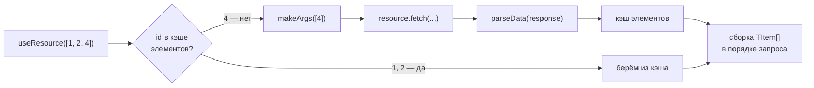

# Проекционный ресурс

`api.unstable_createProjectionResource` — обёртка над существующим [ресурсом][ресурс] для загрузки коллекций элементов по списку id с **гранулярностью кэша до отдельного элемента**. Обычный ресурс кэширует ответ целиком по аргументам: запросы `[1, 2, 3]` и `[1, 2, 4]` для него — два независимых полных запроса. Проекционный ресурс ведёт общий кэш элементов по id и догружает через обёрнутый ресурс только недостающие.

```typescript
const api = createApi({ plugins: [reactHooksPlugin()] });

// Обычный ресурс, умеющий отдавать пользователей списком
const usersResource = api.createResource({
    queryFn: async (args: { userIds: number[] }) => {
        const res = await fetch(`/api/users?ids=${args.userIds.join(',')}`);
        return res.json() as Promise<User[]>;
    },
});

const usersProjection = api.unstable_createProjectionResource({
    resource: usersResource,
    key: 'users-projection',
    parseData: (data) => data.map((item) => ({ id: item.id, item })),
    makeArgs: (ids) => ({ userIds: ids }),
});

// Первый запрос: queryFn получает { userIds: [1, 2, 3] }
usersProjection.useResource([1, 2, 3]);

// Элементы 1 и 2 уже в кэше — queryFn получает { userIds: [4] }
usersProjection.useResource([1, 2, 4]);

// Все элементы в кэше — запроса нет вовсе
usersProjection.useResource([2, 3]);
```

Проекционный ресурс — это полноценный `IResource<TArgs, TItem[]>`: у него работают сцепления, `useResource` / `useSuspenseResource`, SWR, `ensure` / `fetch` / `prefetch`, devtools и расширения плагинов — ровно так же, как у обычного ресурса. Вся «магия» спрятана в его `queryFn`.


## Как это устроено

Снаружи — обычный ресурс с кэш-записью на каждый набор id. Внутри — общий **реактивный** кэш элементов, поверх которого каждый запуск запроса открывает [стрим][stream-query]: догрузив недостающие id, запись подписывается на «свои» элементы и переизлучает собранный `TItem[]` при каждом их обновлении — пока запись жива:



1. `parseArgs` извлекает id из аргументов (по умолчанию аргументы — сам массив id).
2. Id, которых нет в кэше элементов, собираются в один запрос `makeArgs(missingIds)` к обёрнутому ресурсу; id, уже загружаемые параллельным набором, не запрашиваются повторно — их результат ожидается.
3. `parseData` разбирает ответ на пары `{ id, item }`, элементы раскладываются в кэш.
4. Результат собирается по каждому запрошенному id (с сохранением порядка и дубликатов) и попадает в кэш-запись набора — **первой эмиссией стрима**. Дальше стрим остаётся открытым: обновление любого из наблюдаемых элементов (например, инвалидацией пересекающегося набора) переизлучает собранный результат.
5. Инвалидация набора стрим не перезапускает: id набора перезагружаются через обёрнутый ресурс, и стрим переизлучает результат, когда свежие элементы легли в кэш — см. [инвалидацию](#инвалидация).


## Опции

| Опция           | Тип                                                    | Описание |
|-----------------|--------------------------------------------------------|----------|
| `resource`      | `IResource<TResArgs, TResData>`                        | Обёрнутый ресурс, выполняющий фактические запросы. **Обязательна.** |
| `parseData`     | `(data: TResData) => { id: TId; item: TItem }[]`       | Разбирает ответ обёрнутого ресурса на пары `{ id, item }`. **Обязательна.** |
| `makeArgs`      | `(ids: TId[]) => TResArgs`                             | Собирает аргументы обёрнутого ресурса из списка id, которые нужно догрузить. **Обязательна.** |
| `parseArgs`     | `(args: TArgs) => TId[]`                               | Извлекает id из аргументов проекционного ресурса. Опциональна: без неё аргументы — сам массив id (`TArgs = TId[]`). Должна быть чистой и детерминированной. |
| `key`           | `string`                                               | Ключ для devtools; получает префикс `keyPrefix`, как у любого ресурса. |
| `serializeId`   | `(id: TId) => string`                                  | Сериализация id в ключ кэша элементов. По умолчанию — `stableStringify` (объектные id сравниваются структурно). |
| `onCacheEntryAdded` | `TLifecycleHookOption<(args, ctx) => void>`        | [Lifecycle-хук](./lifecycle.md) над записями наборов (`args` — аргументы проекционного ресурса, `data` — собранный `TItem[]`). Компонуется с внутренним хуком рантайма. |
| `onQueryStarted` | `TLifecycleHookOption<(args, ctx) => void \| Promise<void>>` | [Lifecycle-хук](./lifecycle.md) на каждый запуск запроса набора — включая запуски, целиком обслуженные кэшем элементов без сети. Реальные сетевые запросы наблюдайте хуками на обёрнутом ресурсе. |
| `retentionTime` | `number` \| `false` \| `((args, state) => number \| false)` | [Время удержания](../concepts/cache.md#время-удержания-записи) кэш-записей наборов; по умолчанию — значение API. Функция вычисляется на каждом переходе записи набора в удержание и получает аргументы самого проекционного ресурса (набор id) и состояние записи набора (`TResourceEntryState` над `TItem[]`) без варианта `idle`. |
| `serializeArgs` | `(args: TArgs) => string`                              | Сериализация аргументов проекционного ресурса в ключ кэш-записи набора. |
| `invalidateInFlight` | `'cancel' \| 'trail' \| 'join'`                   | Режим [инвалидации](#инвалидация) набора по умолчанию: что делать с запросами обёрнутого ресурса, которые летят за id набора. По умолчанию `'cancel'`. Не зависит от `invalidateInFlight` обёрнутого ресурса — тот действует на инвалидации самого обёрнутого ресурса. |


## Семантика

- **Дедупликация.** Повторяющиеся id внутри одного запроса запрашиваются один раз, но в результате занимают все свои позиции. Пустой список id разрешается в `[]` без запроса.
- **Параллельные запросы.** Набор, пересекающийся с уже летящим запросом, не дублирует общие id — он дозапрашивает только свои недостающие и ждёт чужой ответ для остальных.
- **Инвалидация** — см. [отдельный раздел](#инвалидация).
- **Консистентность между наборами.** Каждая живая запись — открытая [стрим][stream-query]-проекция кэша элементов: после инвалидации `[1, 2, 3]` запись `[1, 2, 4]` сама переизлучит результат с новыми элементами 1 и 2 (в devtools — действие `stream-next`). Все наборы разделяют один и тот же экземпляр элемента. Записи с незавершёнными оптимистичными патчами тоже получают обновление — активные патчи переигрываются поверх новых элементов (штатный ребейз). Помеченный, но не удерживаемый набор свежих элементов не приносит: пересекающиеся наборы получат их, когда его начнут удерживать и перезапрос уйдёт.
- **Порядок ответов.** Ответы на запросы могут прийти в любом порядке, но элемент в кэше не перезаписывается ответом на запрос, выпущенный раньше того, чей ответ его записал: поздний ответ на запрос, ушедший до инвалидации, не затрёт свежие элементы.
- **`retry` / `ensure`** после ошибки первой загрузки повторяют только всё ещё недостающие id — успевшие попасть в кэш элементы не перезапрашиваются. После проваленной [перезагрузки](#инвалидация) `retry` перезагружает id набора по тому же режиму, что и она.
- **Вытеснение.** Элемент живёт, пока жива хотя бы одна кэш-запись набора, упоминающая его id; с удалением последней (retention GC, `resetAll`) элемент вытесняется из кэша элементов.
- **Ошибки.** Отказ обёрнутого ресурса становится ошибкой записи набора; `mapError` API применяется ровно один раз — запись набора отдаёт тот же нормализованный экземпляр ошибки, что и запись обёрнутого ресурса. Если запрос успешен, но ответ не покрыл какие-то запрошенные id, запись падает с `ProjectionItemMissingError` (экспортируется публично; поле `ids` — непокрытые id); при инвалидации это `invalidate-error` с сохранением устаревших данных — как у обычного проваленного перезапроса.


## Инвалидация

Инвалидация набора — `invalidate`, `clutch.invalidate`, [связь][links] с `invalidate`, `fetch` / `prefetch({ force: true })` на существующей записи, нарушение консистентности [патчей][patching] — **не перезапускает запуск набора**. Его стрим остаётся подписанным, а id набора перезагружаются через обёрнутый ресурс; когда свежие элементы легли в кэш элементов, стрим переизлучает собранный результат. Режим [`inFlight`][cache-inflight] (параметр вызова, иначе опция `invalidateInFlight` проекции, по умолчанию `cancel`) применяется к запросам обёрнутого ресурса, которые сейчас летят за id набора:

| `inFlight` | Что уходит в обёрнутый ресурс |
|------------|-------------------------------|
| `cancel`   | Сразу один свежий запрос `makeArgs(все id набора)`; ни кэш элементов, ни летящие запросы не используются. Запрос обёрнутого ресурса ровно по тем же id, если летит, прерывается и уходит заново (все, кто его ждал, получают свежий ответ). Летящие запросы по другим наборам id не прерываются — они могут быть общими с другими наборами, — а их поздние ответы не затирают свежие элементы (см. «Порядок ответов» [выше](#семантика)). |
| `trail`    | Сначала дорабатывают летящие запросы за id набора (их ошибки неважны), затем уходит один свежий запрос по всем id. |
| `join`     | Летящий запрос за id — ответ для этого id; остальные id набора (закэшированные тоже) уходят одним запросом, а если летят все — запроса нет. Как и у обычного ресурса, летящий запрос мог уйти до мутации, и его данные примутся как свежие. |

«Летящие запросы за id» — те, что проекция сама отправила в обёрнутый ресурс (загрузки и перезагрузки любых наборов), по последнему на каждый id.

Что видит запись набора:

- **Удерживаемый набор** уходит в `invalidating` (`isInvalidating`) с прежними данными — перезагрузка начинается сразу. Пока она идёт, обновления элементов от пересекающихся наборов запись не показывает; когда перезагрузка приземлилась, запись переизлучает результат и переходит в `success` — даже если ни один элемент не изменился. Набор в `pending` (первая загрузка в полёте) остаётся в `pending` до приземления перезагрузки. Метка `isInvalidated` не ставится ни в каком режиме.
- **Набор без удержаний** только помечается (`isInvalidated`) — как любая [тающая запись][cache-invalidation], при любом режиме: запросов нет, стрим живёт и продолжает принимать элементы от пересекающихся наборов. Перезагрузка уходит при первом удержании — подписке, `ensure` / `fetch` / `prefetch` — по самому сильному режиму из вызовов с момента пометки (`cancel` > `trail` > `join`). `ensure` отдаёт помеченные данные сразу, перезагрузка идёт следом.
- **Новая инвалидация** во время перезагрузки заменяет её: запись ждёт последнюю, исход прежней не учитывается.
- **Провал** — ошибка обёрнутого ресурса (в том числе у присоединённого под `join` запроса) или `ProjectionItemMissingError` — это `invalidate-error` с прежними данными и закрытый стрим; `retry()` открывает новый запуск и перезагружает id по тому же режиму.
- **`fetch` / `prefetch({ force: true })`** применяют свой `inFlight` (по умолчанию `cancel`, не опция проекции). Набор в `success` — загрузка приземлилась — они перезагружают по этому режиму и резолвятся её результатом. На наборе в `pending` / `invalidating` (загрузка идёт) `cancel` запускает новую перезагрузку, `trail` — перезагрузку, которая дожидается летящих запросов, `join` дожидается идущей загрузки.
- **`onQueryStarted` проекции** перезагрузку не видит — это не новый запуск; сетевые запросы видны хукам обёрнутого ресурса. В devtools запись показывает `invalidate` (или `revalidate` — для метки, исполненной при удержании), затем `rebase`.


## Бесконечная лента: useInfiniteResource

С подключённым `reactHooksPlugin()` проекционный ресурс получает — **в дополнение** к `useResource` / `useSuspenseResource` — хук `useInfiniteResource` для бесконечной подгрузки. Лента — упорядоченный список **страниц**, каждая страница — обычная кэш-запись проекции со своим фиксированным набором id:

```tsx
function Feed() {
  const feed = postsProjection.useInfiniteResource(firstPageIds);

  return (
    <>
      {feed.data?.map((post) => <PostCard key={post.id} post={post} />)}
      {feed.isLoadingNext && <Spinner />}
      <button onClick={async () => {
        const nextIds = await pager.fetch({ after: lastLoadedId });
        feed.fetchNext(nextIds);
      }}>
        Загрузить ещё
      </button>
    </>
  );
}
```

Откуда берутся id следующей страницы, хук не знает — их передаёт вызывающий код через `fetchNext(nextArgs)` (обычно из отдельного ресурса-пагинатора). Есть ли ещё страницы — тоже знание вызывающего (`hasNext` у хука нет).

Свойства модели «страница = запись»:

- **Загруженные страницы не мигают** при догрузке хвоста: их записи не пересоздаются, меняется только хвост.
- **Дедупликация элементов между страницами бесплатна** — общий кэш элементов проекции: id, уже загруженный любой страницей (или любым другим набором), в сеть не уходит, а `data` разных страниц разделяют один экземпляр.
- **Живые обновления**: инвалидация любого пересекающегося набора переизлучает затронутые страницы через стрим-проекции — лента остаётся консистентной без перезапросов.

Состояние `TInfiniteResourceState`:

| Поле | Формула по страницам | Описание |
|---|---|---|
| `data` | — | `TItem[] \| null` — элементы страниц с `dataSource: "current"`, склеенные в порядке страниц. Идентичность стабильна: новый массив создаётся, только когда изменились данные какой-либо страницы; чистые смены статусов (начало и конец инвалидации) сохраняют прежний экземпляр — `React.memo` / `useMemo` / виртуализация по `data` не перезапускаются впустую. Трактуйте массив как иммутабельный и не используйте идентичность `data` как сигнал «что-то произошло» — для этого есть `pages` и флаги. |
| `pages` | — | Состояния страниц (`TResourceClutchState[]`) — для гранулярного рендера. |
| `isIdle` | `pages.length === 0` | Лента пуста — `initialArgs` = `SKIP`. |
| `isInitialLoading` | `pages[0].isInitialLoading` | Первая страница грузится, показать нечего. |
| `isPending` | любая страница `isPending` | Где-то в ленте запрос в полёте. |
| `isLoadingNext` | страница после первой в `isInitialLoading` | Грузится страница за первой. |
| `isInvalidating` | любая страница `isInvalidating` | Страница перезапрашивается поверх своих данных. |
| `hasData` | `data !== null` | Есть что показать. |
| `hasError` | `error !== null` | Хотя бы одна страница с ошибкой. |
| `error` | первая ошибка в порядке страниц | Переживает повтор — как и на отдельной странице. |
| `fetchNext(args)` | — | Добавить страницу. Повторные args существующей страницы — no-op; страница в статусе `error` — ретрай, и упавшая первая загрузка, и упавшая инвалидация с данными. |
| `invalidate(options?)` | — | Перевалидировать всю ленту: каждой странице — `invalidate(options)`, в том числе странице с запросом в полёте (что с ним делать, решает `options.inFlight`, иначе опция `invalidateInFlight` — см. [инвалидацию](#инвалидация)); упавшей без данных (строка 7) — `retry()`, ошибка остаётся на экране. |
| `reset()` | — | Отбросить все страницы после первой. |

Агрегатного `status` у ленты нет, а три флага загрузки — **не разбиение** `isPending`: каждый значит «есть хоть одна такая страница». После `invalidate()` ленты, у которой последняя страница упала, одновременно истинны `isInvalidating` и `isLoadingNext`.

У страницы фиксированные args, поэтому её `dataSource` — только `none` или `current`, а `isSwitching` всегда `false`; опции [`placeholderData`](../api/resource.md#placeholderdata) у проекционного ресурса нет.

Смена `initialArgs` (по ключу кэша) сбрасывает ленту к новой первой странице.


## Ограничения

- **Кросс-табовая синхронизация отключена** — она заполняла бы записи наборов в обход кэша элементов.
- **Снапшоты (SSR): проекционный ресурс в них не участвует** (`snapshotable: false` выставлен автоматически). Записи наборов — производные проекции; владелец данных для снимка — обёрнутый ресурс, его записи сериализуются и гидрируются как обычно.
- **Сворачивание записи набора не отменяет запросы обёрнутого ресурса** — удаление по `retentionTime`, `reset()`, прерывание её запуска: один batch-запрос могут ждать несколько наборов, поэтому уход одного из них общий запрос не трогает (результат для свёрнутой записи просто игнорируется — стандартное поведение ресурса). Инвалидация — другое дело: под `cancel` проекция прерывает летящие за id набора запросы обёрнутого ресурса, см. [инвалидацию](#инвалидация).
- Ошибка записи набора — на весь набор: частичный результат не отдаётся.
- **Оптимистичные патчи — set-local.** `createPatch` (напрямую или через `links` команд) применяется к проекции конкретного набора: оптимистика и ребейс внутри него работают штатно, но кэш элементов и пересекающиеся наборы сам патч не видят. При этом пропатченная запись продолжает получать обновления элементов — они ребейзятся под патч до его завершения. При первом патче на проекционном ресурсе выводится однократное предупреждение в консоль (общий варнинг [стрим-патчей][stream-query] подавлен через `allowStreamPatches` — у проекции своё, более точное сообщение).
- **`$queryStream.allReceived`** в `onQueryStarted` для записи проекции никогда не разрешается штатно: стрим набора не завершается, а сворачивается вместе с запуском (реджект причиной отмены). Используйте `$queryFulfilled` / `firstReceived`.


## См. также

- [Ресурс][ресурс] — все методы и состояния проекционного ресурса идентичны обычному.
- [Стриминговые запросы][stream-query] — механика «живых» записей, на которой построена проекция.
- [API-справочник ресурса](../api/resource.md)
- [Кэш и время жизни записей](../concepts/cache.md)


[ресурс]: ./resource.md
[stream-query]: ./stream-query.md
[cache-invalidation]: ../concepts/cache.md#инвалидация-тающей-записи
[cache-inflight]: ../concepts/cache.md#инвалидация-в-полёте
[links]: ./links.md
[patching]: ../concepts/patching.md
