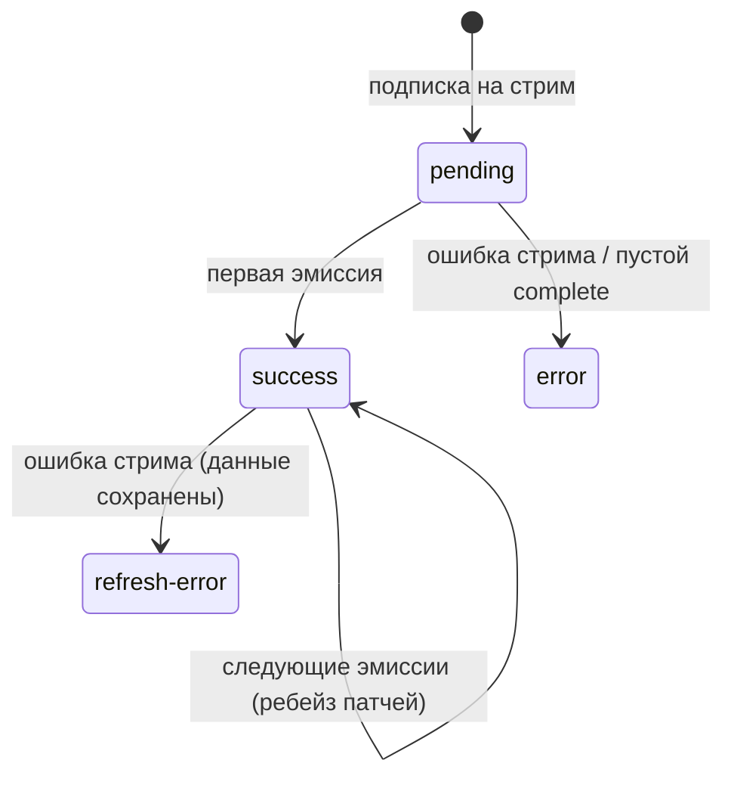

# Стриминговые запросы (Observable в queryFn)

`queryFn` [ресурса][resource] может вернуть не только `Promise<TData>`, но и **`Observable<TData>`** — RxJS-стрим. Запись кэша тогда становится «живой»: первая эмиссия завершает загрузку, а каждая последующая обновляет данные на месте. Это естественный способ подключить WebSocket, SSE, polling-стрим или любой другой источник, который отдаёт данные многократно.

```typescript
import { webSocket } from 'rxjs/webSocket';

const ordersFeed = api.createResource({
  queryFn: (args: { deskId: string }) =>
    webSocket<Order[]>(`wss://api.example.com/desks/${args.deskId}/orders`),
});

// Компонент подписывается как обычно — данные обновляются с каждой эмиссией
const { data, isLoading } = ordersFeed.useResource({ deskId: 'main' });
```

Тип возврата описан как `TQueryFnResult<TData> = Promise<TData> | Observable<TData>`; ветка выбирается в рантайме через `isObservable`. Всё остальное — агенты, `useResource` / `useSuspenseResource`, SWR, `ensure` / `fetch` / `prefetch`, devtools — работает без изменений.

> Стримы поддерживаются только у **ресурсов**. `queryFn` команды остаётся промисом: мутация — одноразовая операция с результатом.


## Жизненный цикл стрима



- **Первая эмиссия** переводит запись из `pending` в `success` — с этого момента `whenFetched`, `fetch()`, Suspense и `$queryFulfilled` считают запрос выполненным.
- **Каждая следующая эмиссия** обновляет `data` записи на месте (`success → success`, в devtools — действие `stream-next`). Активные [оптимистичные патчи][patching] при этом переигрываются на новой базе — тот же механизм ребейза, что и при фоновом refresh.
- **Ошибка стрима** до первой эмиссии — обычный `error`; после данных — `refresh-error`: последние данные сохраняются, как при упавшем фоновом обновлении. Ошибка проходит через [`mapError`](../api/README.md#типизация-ошибок-maperror).
- **Завершение стрима** (`complete`) после данных просто заканчивает «живую» фазу — запись остаётся в `success` с последней эмиссией и живёт по обычным правилам кэша. Завершение **без единой эмиссии** — ошибка `EmptyStreamError` (экспортируется публично): запись не должна навсегда зависнуть в `pending`.

Подписка на стрим привязана к запуску запроса:

- **`refresh()` / `retry()` / `fetch()`** отписываются от текущего стрима и подписываются заново (`refresh` для стрима = переподписка). Первая эмиссия нового запуска проходит через ребейз (`refreshing → success`).
- **Вытеснение записи** (retention GC после ухода подписчиков, `resetAll`) отписывается от стрима — teardown продюсера (закрытие сокета и т. п.) срабатывает штатно. `AbortSignal`, переданный в `queryFn`, срабатывает одновременно с отпиской.


## Оптимистичные патчи при открытом стриме

`createPatch` на «живой» записи работает: эмиссии переигрывают активные патчи поверх новых данных. Но у сочетания есть подводный камень — **закоммиченный** патч растворяется в следующей эмиссии (сервер считается источником истины), и если стрим шлёт данные, не знающие о вашей мутации, оптимистичное значение откатится. Поэтому при первом патче на открытом стриме библиотека выводит однократное предупреждение.

Если сочетание патчей и стрима у вас осознанное (например, сервер вещает эхо мутаций обратно в стрим), подавите предупреждение опцией ресурса:

```typescript
const feed = api.createResource({
  queryFn: () => liveFeed$,
  allowStreamPatches: true,
});
```

Ещё один нюанс: Immer-патчи — абсолютные операции replace. Переигрывание патча «`likes = 6`» на новой базе даст `likes: 6`, а не «+1 к новому значению».


## Лайфцикл-хук: $queryStream

Контекст [`onQueryStarted`][lifecycle] дополнен объектом `$queryStream` с двумя промисами:

| Промис | Стрим | Промис-запрос |
|---|---|---|
| `$queryStream.firstReceived` | Первая эмиссия (≙ `$queryFulfilled`) | Результат запроса |
| `$queryStream.allReceived` | Последняя эмиссия — после завершения стрима | Результат запроса |

Оба отклоняются **сырой** ошибкой продюсера (до `mapError`, как `$queryFulfilled`); если запуск свернули до вехи (переподписка, вытеснение записи) — причиной отмены.

```typescript
const feed = api.createResource({
  queryFn: () => liveFeed$,
  onQueryStarted: async (args, { $queryStream }) => {
    const first = await $queryStream.firstReceived;
    console.log('стрим открыт, первый кадр:', first);

    const last = await $queryStream.allReceived;
    console.log('стрим закрыт, финальный кадр:', last);
  },
});
```

Для промис-`queryFn` оба промиса эквивалентны `$queryFulfilled` — хук можно писать единообразно, не зная, стрим под ним или промис.


## Ограничения и взаимодействие с другими механиками

- **Снимки (SSR).** Сериализуется последняя эмиссия success-записи, как у обычного ресурса. Гидрированная запись **не** переподключает стрим сама — данные статичны до первого `refresh()` или перезапуска записи. Для чисто «живых» ресурсов рассмотрите `snapshotable: false`.
- **Кросс-табовая синхронизация** (`sync: true`) отдаёт соседней вкладке разовый снимок последних данных, а не стрим: холодная запись другой вкладки получит данные через `beforeQuery` и не подпишется на продюсера. Для стрим-ресурсов обычно уместен `sync: false` (по умолчанию так и есть).
- **Дедупликация подписок.** Один стрим на кэш-запись: сколько бы компонентов ни читало одни и те же аргументы, продюсер запускается один раз. Разные аргументы — разные записи и разные подписки.
- **`updatedAt`** обновляется на каждой эмиссии.


## См. также

- [Ресурс][resource] — базовые механики кэширования и SWR
- [Проекционный ресурс][projection-resource] — построен на стримах: записи наборов — живые проекции кэша элементов
- [queryFn][query-fn] — как писать функцию запроса
- [Хуки жизненного цикла][lifecycle] — `onQueryStarted`, `$queryFulfilled`
- [Оптимистичные обновления][patching] — механика патчей и ребейза
- [Машина состояний][machine] — все переходы статусов

[resource]: ./resource.md
[projection-resource]: ./projection-resource.md
[query-fn]: ./query-fn.md
[lifecycle]: ./lifecycle.md
[patching]: ../concepts/patching.md
[machine]: ../concepts/machine.md
