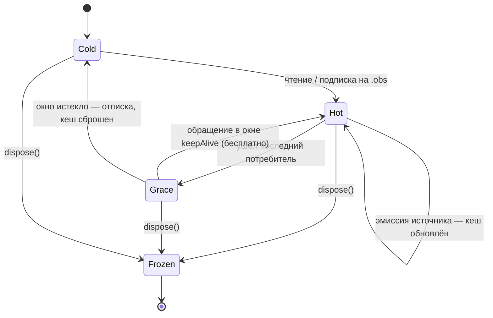

# RxSignals

RxSignals — это реактивная система управления состоянием, вдохновленная современными фреймворками типа SolidJS и Angular Signals. Она предоставляет эффективные инструменты для создания реактивных приложений.

## Основные концепции

### Реактивность на основе значений

Сигналы (`State`) хранят текущее состояние, а производные сущности (`Computed`, `Effect`) автоматически отслеживают зависимости,
применяя кеширование на основе *значений*. Это приводит к тому, что в отличие от классического RxJS-подхода,  
где каждое `next()` — это событие, в RxSignals важен именно факт *изменения значения*.

### State

База для создания реактивных сигналов с изменяемым состоянием.

**Пример использования:**

```typescript
import { Signal } from '@fozy-labs/rx-toolkit';

const name = Signal.state('John');
const age = Signal.state(25);

// Чтение значения (с отслеживанием зависимостей)
console.log(name()); // "John"

// Чтение значения без отслеживания
console.log(name.peek()); // "John"

// Запись нового значения
name.set('Jane');

// Обновление значения
age.update((value) => value + 1);

// Подписка на изменения через RxJS Observable
const subscription = name.obs.subscribe(newName => {
  console.log(`Name changed to: ${newName}`);
});

// Отписка
subscription.unsubscribe();
```

**API Signal:**
- `()`|`get()` — получить значение и зарегистрировать зависимость (для использования внутри Computed/Effect)
- `peek()` — получить значение без регистрации зависимости
- `set(value, actionName?)` — установить новое значение (опционально с именем действия для devtools)
- `update(updater, actionName?)` — вычислить и установить новое значение из текущего (опционально с именем действия для devtools)
- `obs` — RxJS Observable для подписки на изменения

### Computed

Создает вычисляемое значение, которое автоматически обновляется при изменении зависимостей.

```typescript
import { Signal } from '@fozy-labs/rx-toolkit';

const firstName = Signal.state('John');
const lastName = Signal.state('Doe');

const fullName = Signal.compute(() => `${firstName()} ${lastName()}`);

console.log(fullName()); // "John Doe"

firstName.set('Jane');
console.log(fullName()); // "Jane Doe"

// Подписка на изменения
fullName.obs.subscribe(name => console.log(name));
```

**API Computed:**
- `()`|`get()` — получить вычисленное значение с регистрацией зависимости
- `peek()` — получить значение без регистрации зависимости
- `obs` — RxJS Observable для подписки на изменения
- `dispose()` — остановить вычисление и освободить ресурсы (см. раздел «Жизненный цикл сигналов»)

Computed **ленивый**: значение вычисляется только при наличии подписчиков — через `()`/`get()` внутри `Computed`/`Effect` или подписку на `obs`. Без активных подписчиков пересчёт не выполняется.

### Effect

Создает побочный эффект, который автоматически выполняется при изменении используемых сигналов.

```typescript
import { Signal } from '@fozy-labs/rx-toolkit';

const count = Signal.state(0);
const message = Signal.state('Hello');

const effect = Signal.effect(() => {
  // Выведет: "Hello: 0" при инициализации
  console.log(`${message()}: ${count()}`);
});

count.set(1); // Выведет: "Hello: 1"
message.set('Hi'); // Выведет: "Hi: 1"

// Остановка эффекта
effect.unsubscribe();
```

**Cleanup функция (teardown):**

Effect поддерживает возврат функции очистки, которая вызывается перед следующим выполнением или при отписке:

```typescript
const effect = Signal.effect(() => {
  count(); // Создаем подписку на count (тк не работает при асинхронных операциях)
  const timer = setInterval(() => count(), 1000);
  
  // Cleanup - вызывается перед повторным выполнением эффекта
  return () => {
    clearInterval(timer);
  };
});
```

### Signal.from

Оборачивает RxJS Observable в read-only сигнал с общей (shared) подпиской на источник. Пока подписка «горячая», чтения бесплатны — значение отдаётся из replay-кеша; опция `keepAlive` управляет тем, как долго подписка живёт после ухода последнего потребителя (подписчика `.obs` или pull-чтения). Заменяет устаревший [`signalize`](#signalize-устаревшее).

```typescript
import { debounceTime, fromEvent, scan, startWith } from 'rxjs';
import { Signal } from '@fozy-labs/rx-toolkit';

// Stateful-пайплайн: подписка живёт до dispose(), scan не теряет состояние
const clicks$ = Signal.from(
    fromEvent(document, 'click').pipe(
        scan((n) => n + 1, 0),
        startWith(0),
    ),
    { keepAlive: 'forever' },
);

console.log(clicks$()); // актуальный счётчик кликов

// Асинхронный источник: до первой эмиссии возвращается default
const query$ = Signal.state('');
const debounced$ = Signal.from(query$.obs.pipe(debounceTime(300)), { default: '' });
```

**Опции (`SignalFromOptions<T>`):**

| Опция | По умолчанию | Описание |
|---|---|---|
| `default` | — | Значение, пока источник ещё не эмитил (холодное чтение или подключённый, но «молчащий» источник). Явный `undefined` — валидный default. Без него такие чтения бросают `"No value emitted"`. |
| `keepAlive` | `'microtask'` | Сколько живёт подписка на источник после ухода последнего потребителя (см. ниже). |
| `key` | — | Ключ для DevTools, как у `Signal.state` / `Signal.compute`. |

**`keepAlive`:**

- `'none'` — без удержания: каждое чтение подписывается и сразу отписывается (поведение старого `signalize`);
- `'microtask'` — до конца текущей очереди микротасок: чтения в одном синхронном «бёрсте» разделяют одну подписку;
- `'task'` — до следующей макротаски;
- `'forever'` — от первого обращения до `dispose()`;
- число — грейс-окно в миллисекундах, продлеваемое каждым потребителем.

**Жизненный цикл:**



Семантика:

- Переход Grace → Cold **сбрасывает кеш**: следующее чтение перезапускает источник «с нуля». Для `'forever'` переходов в Grace/Cold нет.
- `dispose()` замораживает последнее значение (как у `State`): чтения продолжают возвращать его, `.obs` завершается, подписка на источник снимается. Если кеша на момент `dispose()` не было — чтения возвращают `default` / бросают.
- Ошибка источника: синхронная пробрасывается читателю, подписчики `.obs` получают error-нотификацию; в обоих случаях сигнал сбрасывается в Cold, и следующее чтение повторяет подписку (ретрай).
- `complete` источника: значение остаётся в кеше до истечения keepAlive-окна (при `'forever'` — до `dispose()`), затем холодный рестарт.
- Повторяющиеся одинаковые значения дедуплицируются по `Object.is` — согласованно с остальным движком.

Возвращает `DisposableSignal<T>`. Классовый аналог — `FromSignal.create(source, options)`.

## Типы сигналов

Возвращаемые значения фабрик образуют иерархию по возможностям:

| Тип | Возможности | Откуда |
|---|---|---|
| `ReadonlySignal<T>` | `()`, `get()`, `peek()`, `obs` | `signalize(...)`, `SourceSignal.create(...)` |
| `DisposableSignal<T>` | `ReadonlySignal<T>` + `dispose()` / `[Symbol.dispose]` | `Signal.compute(...)`, `Signal.from(...)` |
| `StateSignal<T>` | `DisposableSignal<T>` + `set()`, `update()` | `Signal.state(...)` |

`DisposableSignal<T>` расширяет `ReadonlySignal<T>`, а `StateSignal<T>` — `DisposableSignal<T>`.

## Жизненный цикл сигналов

`State`, `Computed` и `FromSignal` (а также результаты `Signal.state` / `Signal.compute` / `Signal.from`) можно завершить методом `dispose()` — он отписывает внутренние подписки и освобождает ресурсы. Для `Computed` это останавливает вычисление и очищает кеш; для `Signal.from` — снимает подписку на источник и замораживает последнее значение.

```ts
const count = Signal.state(0);
// ...
count.dispose(); // сигнал больше не нужен — ручное освобождение ресурсов
```

Сигналы реализуют `[Symbol.dispose]`, поэтому совместимы с `using` (TC39 Explicit Resource Management):

```ts
function calc() {
    using doubled = Signal.compute(() => count() * 2);
    return doubled(); // dispose() будет вызван автоматически на выходе из scope
}
```

> Чаще всего явный `dispose()` не нужен: сигналы ленивые и не удерживает подписок без подписчиков.

## Функциональный vs классовый стиль

RxSignals поддерживает как функциональный, так и классовый стили создания сигналов, позволяя выбрать подход в зависимости от предпочтений и архитектуры приложения.
#### Функциональный стиль (рекомендуемый)

Используйте статические методы `Signal.state`,`Signal.compute` и `Signal.effect` для создания сигналов. 
Этот стиль лаконичен, похож на SolidJS и подходит для большинства случаев:

```ts
import { Signal } from '@fozy-labs/rx-toolkit';

const count = Signal.state(0);
const doubled = Signal.compute(() => count() * 2);
const logEffect = Signal.effect(() => console.log(doubled()));
```

#### Классовый стиль

Создавайте экземпляры классов Signal, Computed и Effect напрямую.
Этот стиль более явный, похож на RxJs и полезен для наследования или сложной логики,
учтите, что вызов `()` недоступен и нужно использовать `get()`:

```ts
import { State, Computed, Effect } from '@fozy-labs/rx-toolkit';

const count = new State(0);
const doubled = new Computed(() => count.get() * 2);
const logEffect = new Effect(() => console.log(doubled.get()));
```

### SourceSignal

Базовый класс для сигналов только для чтения, оборачивающий произвольную логику подписки. Используется внутри `signalize` и для создания кастомных read-only сигналов. Возвращает `ReadonlySignal<T>`.

```typescript
import { SourceSignal } from '@fozy-labs/rx-toolkit';

const customSignal = SourceSignal.create<number>((subscriber) => {
    // Логика подписки
    subscriber.next(initialValue);
    return () => {
        // Cleanup
    };
});
```

> Ранее этот класс назывался `ReadonlySignal`. Теперь имя `ReadonlySignal` занято публичным **типом** (см. раздел «Типы сигналов»), а класс переименован в `SourceSignal`.

### LocalSignal

Сигнал, который автоматически синхронизируется с `localStorage`.

```typescript
import { z } from 'zod/v4';
import { LocalSignal } from '@fozy-labs/rx-toolkit';

enum FILTER {
    ALL = 'all',
    CHANNELS = 'channels',
    CHATS = 'chats',
    MEETINGS = 'meetings',
}

const selectedFilter$ = LocalSignal.state({
    key: 'memberships-list-selected-filter',
    defaultValue: FILTER.ALL,
    zodSchema: z.nativeEnum(FILTER), // Опционально: валидация через Zod
});

// Использование
console.log(selectedFilter$()); // Значение из localStorage или FILTER.ALL
selectedFilter$.set(FILTER.CHANNELS); // Сохраняется в localStorage

function logout() {
    selectedFilter$.clear(); // Удаляет значение из localStorage (сбрасывает на defaultValue)
}
```

**Опции `LocalSignal.state(...)` (`LocalStateOptions`):**
- `key` — ключ для localStorage
- `defaultValue` — значение по умолчанию
- `zodSchema` — опциональная Zod-схема для валидации
- `userId` — опциональный идентификатор пользователя для изоляции данных
- `checkEffect` — функция валидации значения
- `devtoolsOptions` — настройки для devtools
- `driver` — драйвер для хранения (по умолчанию localStorage, можно заменить на кастомный драйвер)

### unstable_ProxySignal (экспериментально)

> ⚠️ **Экспериментальный API.**

Глубокий реактивный стор: держит одно дерево состояния (обычные объекты + массивы) и отдаёт его как ленивое дерево пер-путевых сигналов. Подписка идёт **точечно, на конкретный путь**, а не на весь стор целиком — то, чего не хватает при использовании одного общего сигнала-версии.

```typescript
import { unstable_ProxySignal as ProxySignal, Signal } from '@fozy-labs/rx-toolkit';

const ps = ProxySignal.state({
    user: { name: 'Ann', age: 20 },
    tags: ['a', 'b'],
});

// Чтение + подписка ровно на этот путь (в реактивном контексте)
Signal.effect(() => {
    console.log(ps.root.user.name()); // проснётся только при изменении user.name
});

// Запись через copy-on-write черновик — будятся только затронутые пути
ps.mutate((draft) => {
    draft.user.age += 1;
});

// Замена всего дерева целиком (диффится по ссылкам, пер-узловой Object.is-дедуп)
ps.set({ user: { name: 'Bob', age: 30 }, tags: [] });

ps.peek();   // нереактивный снимок всего дерева
ps.dispose(); // освобождение (после этого чтения бросают)
```

**Чтение.** `ps.root` — корень реактивного прокси-дерева. Навигация (`ps.root.user`) ничего не подписывает и не аллоцирует — это просто путь. Подписка возникает только при **вызове** узла:

- `ps.root.user.name()` — читает значение по пути и (в контексте `Signal.effect` / `Signal.compute`) подписывается ровно на него.
- `'name' in ps.root.user`, `Object.keys(ps.root.user)` — реагируют только на **изменение набора ключей** (добавление/удаление), но не на смену значения существующего ключа.
- Вне реактивного контекста вызов узла просто возвращает текущее значение, ничего не подписывая.

**Запись.** Мутации идут только через `mutate` (черновик с copy-on-write, в стиле immer) или `set` (замена корня). Оба варианта диффят дерево по ссылкам поузлово и применяют дедупликацию через `Object.is`, поэтому no-op-запись не будит никого. Возвращаемое из рецепта значение игнорируется (`draft.k = v` — это выражение присваивания). Само дерево `ps.root` строго read-only: любая прямая мутация прокси — присваивание, `delete`, `Object.defineProperty`, `Object.setPrototypeOf`, `Object.freeze`/`preventExtensions` — бросает ошибку.

**Семантика реактивности:**

- Подписка на узел (`node()`) срабатывает при любом изменении его значения, **включая глубокие** — обновления copy-on-write, поэтому глубокая мутация заменяет ссылку у всех предков (подписчик `ps.root.user()` проснётся и при изменении `user.name`).
- Соседние пути изолированы: изменение `ps.root.tags` не будит подписчика `ps.root.user.name`.
- Глубоко вложаются только массивы и обычные объекты. `Map` / `Set` / `Date` / инстансы классов / функции / примитивы — **непрозрачные листья**: реактивность по замене всей ссылки, внутрь навигация не идёт, `produce` их не клонирует.
- Узлы создаются лениво и удаляются, когда на них не остаётся подписчиков (нет утечки при ротации ключей — например, в кэше).

**Интеграция с RxJS / React.** У контроллера есть `obs` — Observable всего дерева. Он же совместим по форме с `useSignal` (`{ obs, peek }`), поэтому в React можно писать `const snapshot = useSignal(ps)` для подписки на весь стор, либо обернуть конкретный путь в `Signal.compute(() => ps.root.user.name())` для точечной перерисовки.

**Известные ограничения:** прямые `JSON.stringify` / `` `${ps.root}` `` / `for..of` по прокси не поддерживаются (используйте `peek()` и `Object.keys(...)`); ключи данных с именами `then` / `toString` / `constructor` и т.п. не навигируются реактивно (читайте через `peek()`); символьные ключи и внутренности `Map`/`Set` нереактивны; циклические структуры в `produce` не поддерживаются.

### unstable_KeyedSignal (экспериментально)

> ⚠️ **Экспериментальный API.**

Реактивная keyed-коллекция: чтение со скоростью `Map`, запись за O(1) и точечная реактивность **по каждому ключу**. Заполняет нишу нормализованного стора/кэша, где нужны одновременно быстрая запись и точечная инвалидация — в отличие от одного общего сигнала-версии (будит всех читателей на любое add/remove) или `unstable_ProxySignal` в роли кэша (иммутабельная копия корня — O(N) на запись). Создаётся фабрикой `unstable_KeyedSignal.state()` (конвенция сигналов) и, как любой сигнал, вызывается для реактивного чтения.

```typescript
import { unstable_KeyedSignal, Signal, useSignal } from '@fozy-labs/rx-toolkit';

const users = unstable_KeyedSignal.state<{ name: string; online: boolean }>();

users.set('u1', { name: 'Ann', online: true });
users.set('u2', { name: 'Bob', online: false });

// Точечная подписка ровно на один ключ (в реактивном контексте)
Signal.effect(() => {
    console.log(users.get$('u1')); // проснётся только при изменении ключа 'u1'
});

users.set('u2', { name: 'Bob', online: true }); // подписчика 'u1' не будит
users.set('u1', { name: 'Ann', online: false }); // ← проснётся

users.get('u2');   // нереактивное чтение (узел не создаётся, подписки нет)
users();           // реактивный снимок всей коллекции (будится на любое изменение)
users.peek();      // { u1: {...}, u2: {...} } — снимок без подписки, мемоизируется
users.dispose();   // освобождение
```

**API:**

| Метод | Реактивность | Описание |
|---|---|---|
| `unstable_KeyedSignal.state(initial?)` | — | Фабрика: создаёт сигнал-коллекцию. Опц. начальные данные — объект `Record<string, V>`, массив пар `[key, value]` или `Map`. |
| `keyed()` (вызов) | полная | Реактивный снимок всей коллекции; будится на любое изменение (add/remove/replace). |
| `peek()` | нет | Снимок без подписки, мемоизируется между записями. |
| `snapshot()` | нет | Псевдоним `peek()`. |
| `get(key)` | нет | Значение по ключу или `undefined`. |
| `get$(key)` | по ключу | Как `get`, но подписывает вызывающего ровно на этот ключ. |
| `has(key)` | нет | Есть ли запись с таким ключом. |
| `set(key, value)` | — | Записать значение, O(1). Дедупликация по `Object.is`. |
| `delete(key)` | — | Удалить запись; вернуть `true`, если была. O(1). |
| `clear()` | — | Удалить все записи. |
| `size` | нет | Количество записей. |
| `values()` | нет | Итератор значений. |
| `values$()` | структурная | Массив значений; подписка на набор ключей (add/remove). |
| `obs` | — | Observable снимков: реплеит текущий снимок при подписке, затем эмитит на каждое изменение. |
| `dispose()` / `[Symbol.dispose]` | — | Освободить ресурсы. |

**Семантика реактивности:**

- `get$(key)` изолирован: наблюдатель одного ключа никогда не будится изменением другого. Он реагирует на добавление, удаление и замену значения **именно этого** ключа (дедуп по `Object.is`). Чтение отсутствующего ключа тоже реактивно — наблюдатель проснётся, когда ключ появится. Исключение: отсутствующий ключ читается как `undefined`, поэтому хранение `undefined` неотличимо от отсутствия — добавление/удаление записи со значением `undefined` **не** будит `get$` (но `()`, `values$()` и `obs` — будят).
- `values$()` отслеживает **структуру**: перечитывается при добавлении или удалении ключа, но **не** при замене значения уже существующего.
- `set` дедуплицирует по `Object.is`: запись того же значения (той же ссылки) не будит никого.
- Пер-ключевые узлы создаются **лениво** — при первом реактивном чтении — и собираются, когда ключа больше нет и его никто не наблюдает (отложенно, микротаском). Память следует за живым/наблюдаемым множеством, а не за всеми когда-либо затронутыми ключами. Нереактивные чтения (`get`, `has`, `values`, `snapshot`, `size`) узлов не создают.
- Дремлющий `Computed`, читавший ключ через `get$`, остаётся корректным даже после сбора узла: при следующем чтении он видит актуальное значение коллекции.

**Интеграция с React.** Оберните конкретный ключ в `Signal.compute(() => users.get$(id))` и передайте в `useSignal` — компонент перерисуется только при изменении этого ключа. Для списка оберните `values$()`: перерисовка только на добавление/удаление позиций. Живой пример — вкладка «Корзина» на странице «Сигналы» в демо.

## Операторы

### signalize (устаревшее)

> **Deprecated.** Используйте [`Signal.from`](#signalfrom). `signalize` не удерживает подписку: каждое чтение подписывается на источник и тут же отписывается. Поэтому источник без синхронной (реплеящейся) эмиссии **навсегда** возвращает `defaultValue` (или бросает `"No value emitted"`), а stateful-пайплайны (`scan`, `startWith` и т.п.) перезапускаются «с нуля» на каждом чтении. Точный эквивалент старого поведения — `Signal.from(obs, { keepAlive: 'none' })`.

Преобразует RxJS Observable в read-only сигнал. Работает корректно только с источниками, которые синхронно эмитят значение при **каждой** подписке: `BehaviorSubject`, `ReplaySubject`, `shareReplay(1)`, `of(...)` и т.п.

```typescript
import { BehaviorSubject } from 'rxjs';
import { signalize } from '@fozy-labs/rx-toolkit';

const source$ = new BehaviorSubject(0);
const value$ = signalize(source$);

console.log(value$()); // 0 — BehaviorSubject реплеит текущее значение при подписке
source$.next(1);
console.log(value$()); // 1
```

**Значение по умолчанию (`defaultValue`):** возвращается, когда источник не эмитит синхронно. Для асинхронных источников (`Subject`, `interval`, HTTP-запрос) это означает, что чтение будет возвращать `defaultValue` **всегда**, а не «до первой эмиссии»: при этом `.obs` эмитит корректно, поэтому `Effect`/`Computed` будут просыпаться, но читать устаревший `defaultValue`. Для таких источников переходите на `Signal.from`.

## Батчинг обновлений (Batcher)

RxSignals автоматически группирует множественные обновления сигналов в один цикл обновления. Это обеспечивает:
- Консистентность состояния
- Оптимальную производительность
- Предсказуемый порядок выполнения эффектов

```typescript
const a = Signal.state(1);
const b = Signal.state(2);
const sum = Signal.compute(() => a() + b());

new Effect(() => {
    console.log(`Sum: ${sum()}`);
});

// Оба изменения обрабатываются в одном батче
Batcher.run(() => {
    a.set(10);
    b.set(20);
});
// Effect выведет: "Sum: 30" (один раз, а не два)
```

## Интеграция с RxJS

Сигналы полностью совместимы с RxJS. Каждый сигнал предоставляет `obs` — стандартный RxJS Observable:

```typescript
import { filter, take, debounceTime } from 'rxjs';
import { Signal } from '@fozy-labs/rx-toolkit';

const clicks = Signal.state(0);

// Используем RxJS операторы
const tenClicks$ = clicks.obs.pipe(
    filter(value => value === 10),
    take(1)
);

tenClicks$.subscribe(() => {
    console.log('Reached 10 clicks!');
});

// Или наоборот - превращаем Observable в Signal
const debouncedClicks$ = Signal.from(
    clicks.obs.pipe(
        debounceTime(300)
    ),
    { default: 0 }
);

// Теперь debouncedClicks$ можно использовать в Computed/Effect
const doubled = Signal.compute(() => debouncedClicks$() * 2);
```

## Devtools

Сигналы поддерживают интеграцию с Redux DevTools для отладки:

```typescript
import { Signal } from '@fozy-labs/rx-toolkit';

// С именем для devtools
const count$ = Signal.state(0, 'counter');

count$.set(1); // Action type: "UPDATE"
count$.set(0, 'reset'); // Action type: "UPDATE: reset"
count$.update((value) => value + 1, 'increment'); // Action type: "UPDATE: increment"

// Или с расширенными опциями
const user$ = Signal.state(null, {
    isDisabled: true, // Отключить отслеживание в devtools
});
```

## React интеграция

См. [React интеграция](../usage/react/README.md) для подробной информации о том, как использовать RxSignals в React приложениях.
