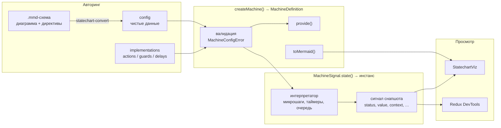
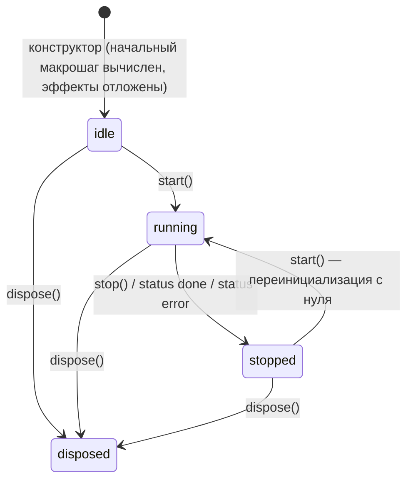
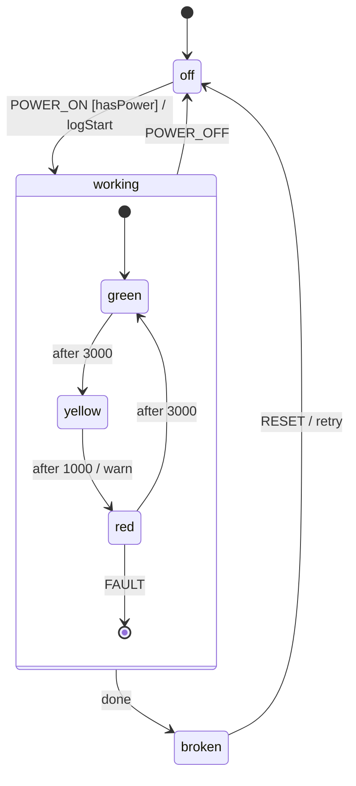
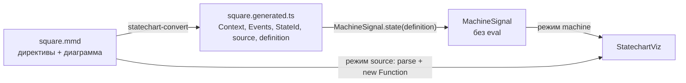

# Модуль Statechart

Модуль Statechart — конечные автоматы (стейтчарты) поверх [сигналов][signals]: вложенные, параллельные, финальные и history-состояния, `entry` / `exit`, `always`, `after`, `onDone`, гварды и действия. Собственный рантайм, без внешних зависимостей.

Что даёт модуль:

- **Декларативное описание** — машина это чистые данные (конфиг) плюс таблица реализаций по именам. Конфиг сериализуем, поэтому его можно показать, экспортировать и разобрать обратно.
- **Авторинг схемой** — машину можно описать одним `.mmd`-файлом (mermaid `stateDiagram-v2` + директивы `%% @…`): [конвертер][converter] генерирует типизированный `createMachine`, [viz][viz] показывает живую диаграмму. См. [Авторинг машины в .mmd](#авторинг-машины-в-mmd).
- **Инстанс как сигнал** — `MachineSignal.state(definition)` возвращает callable-сигнал снапшота: его можно читать в `Computed` / `Effect`, подписываться через `.obs`, использовать в React через `useSignal`.
- **Экспорт диаграммы** — `toMermaid()` возвращает `stateDiagram-v2` на диалекте конвертера: годится и для документации, и для viz, и для обратного разбора в конфиг.
- **Devtools** — снапшот виден в Redux DevTools как обычный сигнал.
- **Строгая валидация** — всё, что рантайм не реализует, падает с понятной ошибкой в `createMachine()`, а не игнорируется молча.

## Содержание

- [Концепция: описание и инстанс](#концепция-описание-и-инстанс)
- [Быстрый старт](#быстрый-старт)
- [Формат конфигурации](#формат-конфигурации)
- [Реализации: actions, guards, delays](#реализации-actions-guards-delays)
- [MachineSignal.state](#machinesignalstate)
- [Интеграция с сигналами и React](#интеграция-с-сигналами-и-react)
- [Devtools](#devtools)
- [Экспорт в Mermaid: toMermaid](#экспорт-в-mermaid-tomermaid)
- [Авторинг машины в .mmd](#авторинг-машины-в-mmd)
- [Тестирование](#тестирование)
- [Совместимость со сторонним тулингом](#совместимость-со-сторонним-тулингом)


## Концепция: описание и инстанс

Модуль разделяет два слоя.

| | Описание — `MachineDefinition` | Инстанс — `MachineSignal.state()` |
|---|---|---|
| Что это | чистые данные конфига + таблица реализаций | текущее состояние, очередь событий, таймеры |
| Состояние | нет | есть |
| Создаётся | один раз на модуль, через `createMachine()` | сколько угодно раз на одно описание |
| Жизненный цикл | нет | `start()` / `stop()` / `dispose()` |
| Зачем | якорь вывода типов; валидация один раз; `provide()` для подмены реализаций в тестах; `toMermaid()` | связка с `State` / `Batcher` / devtools |



Описание не имеет состояния, поэтому одно и то же `definition` можно безопасно передавать в любое число инстансов, в тесты и в экспортёры.


## Быстрый старт

```typescript
import { assign, createMachine, MachineSignal } from "@fozy-labs/rx-toolkit";

interface LightContext {
    ready: boolean;
    cycles: number;
}

type LightEvent = { type: "TIMER" } | { type: "SET_READY"; ready: boolean };

// Описание: конфиг + таблица реализаций по именам
export const trafficLight = createMachine(
    {
        id: "trafficLight",
        initial: "green",
        context: { ready: false, cycles: 0 },
        types: {} as { context: LightContext; events: LightEvent },
        states: {
            green: { after: { 3000: "yellow" } },
            yellow: { on: { TIMER: { target: "red", guard: "isReady", actions: "warn" } } },
            red: {
                on: {
                    TIMER: {
                        target: "green",
                        actions: assign({ cycles: ({ context }) => context.cycles + 1 }),
                    },
                },
            },
        },
        on: {
            SET_READY: { actions: assign({ ready: ({ event }) => event.ready }) },
        },
    },
    {
        actions: {
            warn: ({ context }) => console.warn(`Switching to red after ${context.cycles} cycles`),
        },
        guards: {
            isReady: ({ context }) => context.ready,
        },
    },
);

// Инстанс: callable-сигнал снапшота, запускается сразу (autoStart: true)
const light$ = MachineSignal.state(trafficLight, { key: "trafficLight" });

light$().value; // "green"  — чтение с отслеживанием зависимостей (как у Signal.state)
light$.peek().context.cycles; // 0 — чтение без отслеживания

light$.send({ type: "SET_READY", ready: true });
light$.matches("green"); // true
light$.can({ type: "TIMER" }); // false — в green нет перехода по TIMER

// ... через 3000 мс сработает after и машина перейдёт в yellow
light$.send({ type: "TIMER" }); // yellow → red (guard isReady пропустил, warn выполнен)

const subscription = light$.obs.subscribe((snapshot) => console.log(snapshot.value));

subscription.unsubscribe();
light$.dispose(); // снять таймеры, завершить сигнал, отписаться от devtools
```

Важные моменты, которые видно уже в этом примере:

- Действия и гварды в конфиге — **строковые имена**, реализации лежат отдельно. Так конфиг остаётся сериализуемым: его можно вывести диаграммой и показать в devtools.
- `types: {} as { context: ...; events: ... }` — только для вывода типов; в рантайме ключ игнорируется.
- Сам `send()` синхронный: один вызов — один макрошаг — одна публикация снапшота внутри `Batcher.run`.


## Формат конфигурации

Конфиг — чистые данные. Всё, что в таблицах ниже не перечислено, **отклоняется** в `createMachine()` (см. [Что не поддерживается](#что-не-поддерживается)).

### Ключи стейт-ноды

| Ключ | Значение | Примечания |
|---|---|---|
| `id` | `string` | уникальный id для таргетов `#id`; по умолчанию `<machineId>.<путь>` |
| `type` | `"atomic" \| "compound" \| "parallel" \| "final" \| "history"` | выводится из `states` / `history`, если не указан |
| `initial` | `string` | ключ начального дочернего состояния (только `compound`); только строка, объектная форма не принимается |
| `states` | `Record<string, StateNodeConfig>` | вложенные состояния; ключи без `.` (ключи вида `$final`, `$0` — как у конвертера — допустимы) |
| `on` | `Record<EventDescriptor, Transition>` | переходы по событиям |
| `always` | `Transition` | eventless-переходы, перепроверяются после каждого микрошага |
| `after` | `Record<number \| string, Transition>` | отложенные переходы: миллисекунды или именованная задержка из `delays` |
| `entry` / `exit` | `Actions` | действия при входе / выходе |
| `onDone` | `Transition` | для `compound` (достигнут финальный потомок) и `parallel` (все регионы финальны); на корне запрещён |
| `history` | `"shallow" \| "deep" \| true` | только для history-нод; `true` = `"shallow"` |
| `target` | `string` | таргет history-ноды по умолчанию, если история ещё не записана; должен резолвиться в обычное состояние — другая history-нода в роли дефолтного таргета (в т.ч. через цепочку) отклоняется `createMachine` с `MachineConfigError` |
| `output` | значение или `({ context, event }) => value` | только для `final` и корня |
| `tags` | `string \| string[]` | попадают в `snapshot.tags` |
| `description`, `meta` | `string`, plain object | данные для тулинга, в рантайме не используются |

Корень дополнительно принимает:

| Ключ | Значение | Примечания |
|---|---|---|
| `context` | объект или `() => объект` | объект **разделяется всеми инстансами**; для объектов на инстанс используйте фабрику |
| `types` | `{ context?, events?, output?, tags?, meta? }` | только для вывода типов, в рантайме игнорируется |
| `output` | значение или `({ context, event }) => value` | результат машины при входе в финальное состояние верхнего уровня |
| `source` | `string` | исходный текст `.mmd`-схемы, из которой машина сгенерирована конвертером; доступен как `definition.source`, сохраняется в `provide()`; в рантайме не используется |

Корень должен быть `compound` (есть `states` и `initial`) или `parallel`.

### Переходы

Значение перехода в `on` / `after` / `always` / `onDone`:

- строка-таргет: `TIMER: "red"`;
- объект: `{ target?, actions?, guard?, reenter?, description?, meta? }`;
- массив объектов — **выигрывает первый с прошедшим гвардом**;
- `target` может быть массивом только для одновременного входа в несколько регионов одного `parallel`-состояния;
- без `target` — targetless-переход: действия выполняются, состояние не меняется (`exit` / `entry` не срабатывают);
- `reenter: true` — выйти и заново войти в исходное состояние, даже если цель — его потомок (по умолчанию `false`).

Форматы таргетов:

| Таргет | Разрешается как |
|---|---|
| `"sibling"` | ключ соседнего состояния (относительно родителя); `"sibling.child"` спускается в потомков |
| `".child"` | относительно самого исходного состояния |
| `"#id"` | по id стейт-ноды |
| `"#id.child.path"` | по id и дальше по ключам потомков |

Ключи `on`: точный тип события (`"TIMER"`), частичный wildcard (`"user.*"`) и catch-all `"*"`.

```typescript
import { createMachine } from "@fozy-labs/rx-toolkit";

type PlayerEvent =
    | { type: "PLAY" }
    | { type: "PAUSE" }
    | { type: "RESUME" }
    | { type: "SPEED" }
    | { type: "STOP" }
    | { type: "log.info"; message: string }
    | { type: "log.error"; message: string };

export const player = createMachine({
    id: "player",
    initial: "idle",
    types: {} as { events: PlayerEvent },
    states: {
        idle: { on: { PLAY: "playing" } },
        playing: {
            initial: "normal",
            states: {
                normal: { on: { SPEED: "fast" } },
                fast: { on: { SPEED: "normal" } },
                // history-нода: RESUME возвращает в последний активный подрежим
                hist: { type: "history", history: "shallow" },
            },
            on: {
                PAUSE: "paused",
                STOP: { target: "#player.stopped", reenter: true },
            },
        },
        paused: { on: { RESUME: "playing.hist" } },
        stopped: { type: "final" },
    },
    on: {
        // wildcard по префиксу — обработать любое событие log.*
        "log.*": { actions: ({ event }) => console.log(event.message) },
    },
});
```

### Параллельные и финальные состояния, `onDone`, `output`

```typescript
import { createMachine } from "@fozy-labs/rx-toolkit";

type WizardEvent = { type: "NEXT" } | { type: "TOGGLE" } | { type: "RESET" };

export const wizard = createMachine({
    id: "wizard",
    type: "parallel",
    types: {} as { events: WizardEvent },
    states: {
        form: {
            initial: "step1",
            states: {
                step1: { on: { NEXT: "step2" } },
                step2: { on: { NEXT: "done" } },
                done: { type: "final", output: { submitted: true } },
            },
            // сработает, когда регион form дойдёт до финального потомка
            onDone: { actions: ({ event }) => console.log(event.output) },
        },
        theme: {
            initial: "light",
            states: {
                light: { on: { TOGGLE: "dark" } },
                dark: { on: { TOGGLE: "light" } },
            },
        },
    },
});
```

Событие `onDone` имеет тип `xstate.done.state.<id>` и несёт `output` финального потомка ([почему такой префикс][xstate]). Вход в финальное состояние **верхнего уровня** завершает машину: `snapshot.status` становится `"done"`, `snapshot.output` — результат корневого `output`, таймеры снимаются, дальнейшие события игнорируются.

### Типизация

- `createMachine<TContext, TEvent, TOutput>(config, implementations?)`. `TContext` выводится из `context` / `types.context`, `TEvent` — из `types.events` (по умолчанию `AnyEventObject` — любой `{ type: string }` с `unknown`-полями), `TOutput` — из `types.output`.
- Внутри `on.<EVENT>` тип `event` сужается до соответствующего члена объединения; в `entry` / `exit` / `always` / `after` `event` — всё объединение целиком.
- Экспортируемые типы: `MachineConfig`, `StateNodeConfig`, `TransitionConfig`, `EventObject`, `AnyEventObject`, `StateValue`, `MachineSnapshot`, `MachineImplementations`, `StatechartOptions`, `MachineStateSignal` и др. — все из корня пакета.

### Что не поддерживается

Любой из следующих ключей роняет `createMachine()` с `MachineConfigError`, чей `message` содержит путь до проблемного объекта (`states.foo.on.BAR[0]: 'invoke' is not supported`):

| Категория | Ключи / конструкции |
|---|---|
| Акторная модель | `invoke`, `spawn`, `services`, `actors`, `system`, `input`, `sendTo`, `sendParent`, `stopChild` |
| Прочее | `emit`, `enqueueActions`, `strict`, `onDone` на корне, `initial` в объектной форме |
| Зарезервированные события в `on` | системные типы `xstate.init` и `xstate.stop`, а также события акторной системы (`xstate.error.*`, `xstate.done.actor.*`, `xstate.snapshot.*`, `xstate.promise.*`). Семейства `xstate.done.state.*` / `xstate.after.*` и wildcard `xstate.*` разрешены — они срабатывают |
| Неизвестные ключи | любые другие ключи стейт-ноды, перехода, объекта `{ type, params }` или таблицы реализаций |
| Builtin-объекты вручную | `{ type: "xstate.assign", ... }` — используйте экспортируемые `assign()` и т. д. |
| Ключи и креаторы чужих диалектов | перечислены в [совместимости][xstate] |

```typescript
import { createMachine, MachineConfigError } from "@fozy-labs/rx-toolkit";

try {
    createMachine({
        initial: "a",
        states: {
            a: { on: { GO: { target: "b", cond: "isOk" } } } as never,
            b: {},
        },
    });
} catch (error) {
    if (error instanceof MachineConfigError) {
        console.log(error.path); // "states.a.on.GO[0]"
        console.log(error.detail); // "'cond' has been renamed to 'guard'"
    }
}
```

Имена действий / гвардов / задержек, которых нет в таблице реализаций, проверяются **лениво** — при создании инстанса (`MachineSignal.state()` / `new Statechart()`), чтобы `definition.provide()` мог дополнить таблицу после `createMachine()`.


## Реализации: actions, guards, delays

Второй аргумент `createMachine` (и аргумент `provide()`):

```typescript
interface MachineImplementations<TContext, TEvent> {
    actions?: Record<string, ActionImplementation>; // (args, params) => void  |  builtin-действие
    guards?: Record<string, GuardImplementation>; // (args, params) => boolean |  builtin-гвард
    delays?: Record<string, DelayImplementation>; // number | (args, params) => number
}
```

`args` — всегда `{ context, event }`. Реализации из таблицы получают `params` из ссылки `{ type, params }` в конфиге; их тип на уровне таблицы не выводится, поэтому объявляйте параметр явно.

Функции в таблице (и рецепт `mutate`) могут объявлять `event` у́же полного union'а событий машины — так конвертер сужает тип события до переходов, которые ссылаются на реализацию: `({ context }: GuardArgs<Context, Extract<Events, { type: "POWER_ON" }>>) => context.power`. TypeScript соответствие сужения конфигу не проверяет — за него отвечает конфиг (у конвертера — по построению).

### Формы действий и гвардов в конфиге

| Форма | Действие | Гвард |
|---|---|---|
| Имя из таблицы | `"warn"` | `"isReady"` |
| Ссылка с параметрами | `{ type: "notify", params: { level: "info" } }` | `{ type: "isAbove", params: { limit: 10 } }` |
| Параметры из аргументов | `{ type: "notify", params: ({ event }) => ({ ... }) }` | аналогично |
| Инлайн-функция | `({ context, event }) => { ... }` | `({ context }) => boolean` |
| Builtin | `assign(...)`, `mutate(...)`, `raise(...)`, `cancel(...)`, `log(...)` | `and([...])`, `or([...])`, `not(...)`, `stateIn(...)` |

Инлайн-функции удобны в прототипах, но в диаграмме и в devtools они видны только по имени функции (анонимные — как `anonymous`). Для машин, которые вы собираетесь смотреть глазами, предпочитайте имена из таблицы.

```typescript
import { createMachine } from "@fozy-labs/rx-toolkit";

interface CounterContext {
    count: number;
}

type CounterEvent = { type: "INC"; by: number } | { type: "RESET" };

export const counter = createMachine(
    {
        id: "counter",
        initial: "active",
        context: { count: 0 },
        types: {} as { context: CounterContext; events: CounterEvent },
        states: {
            active: {
                on: {
                    INC: [
                        // первый переход с прошедшим гвардом выигрывает
                        { guard: { type: "isAbove", params: { limit: 100 } }, target: "overflow" },
                        { actions: { type: "notify", params: ({ event }) => ({ text: `+${event.by}` }) } },
                    ],
                    RESET: { actions: "reset" },
                },
            },
            overflow: { type: "final" },
        },
    },
    {
        actions: {
            notify: (_args, params: { text: string }) => console.log(params.text),
            reset: ({ context }) => console.log(`reset from ${context.count}`),
        },
        guards: {
            isAbove: ({ context }, params: { limit: number }) => context.count > params.limit,
        },
    },
);
```

Порядок выполнения действий: `exit` исходных состояний → действия перехода → `entry` целевых; `assign` применяется в том же порядке, и последующие действия уже видят обновлённый `context`. Пользовательские действия исполняются синхронно внутри макрошага, **до** публикации нового снапшота — `peek()` изнутри действия вернёт ещё предыдущий снапшот.

### Builtin-действия

Импортируются из корня пакета. Это декларативные объекты (технически — замороженные функции с брендом); **вызывать их напрямую нельзя**, только класть в `entry` / `exit` / `actions` или в таблицу `actions`.

| Builtin | Описание |
|---|---|
| `assign(partial \| ({ context, event }) => partial)` | обновляет `context` shallow-merge'ем; в объектной форме каждое поле — значение или функция `({ context, event }) => value` |
| `mutate(({ context, event }) => void)` | обновляет `context` через Immer-draft: рецепт мутирует `context` на месте, результат — новый объект (нетронутые части разделяются с предыдущим, предыдущий не меняется), возвращаемое значение рецепта игнорируется. Draft'ятся plain-объекты и массивы; `Map` / `Set` / экземпляры классов передаются как есть. Это носитель тел `@action` конвертера |
| `raise(event \| ({ context, event }) => event, { delay?, id? }?)` | отправляет событие самой машине: без `delay` — во внутреннюю очередь текущего макрошага, с `delay` — по таймеру (`delay` — миллисекунды, имя из `delays` или функция) |
| `cancel(id \| ({ context, event }) => id)` | отменяет отложенный `raise` по его `id` (или `after`-таймер по типу его события `xstate.after.<delay>.<id>`) |
| `log(value? \| ({ context, event }) => value, label?)` | пишет в `logger` инстанса (по умолчанию `console.log`); без аргументов — `{ context, event }` |

```typescript
import { assign, cancel, createMachine, log, raise } from "@fozy-labs/rx-toolkit";

interface SearchContext {
    query: string;
}

type SearchEvent = { type: "TYPE"; value: string } | { type: "SEARCH" } | { type: "RESULTS" };

export const search = createMachine(
    {
        id: "search",
        initial: "idle",
        context: { query: "" },
        types: {} as { context: SearchContext; events: SearchEvent },
        states: {
            idle: {
                on: {
                    TYPE: {
                        actions: [
                            assign({ query: ({ event }) => event.value }),
                            // дебаунс: перезапланировать SEARCH, отменив предыдущий
                            cancel("debounce"),
                            raise({ type: "SEARCH" }, { delay: "debounce", id: "debounce" }),
                        ],
                    },
                    SEARCH: { target: "searching", guard: "hasQuery" },
                },
            },
            searching: {
                entry: log(({ context }) => `searching: ${context.query}`, "search"),
                on: { RESULTS: "idle" },
            },
        },
    },
    {
        guards: { hasQuery: ({ context }) => context.query.length > 0 },
        delays: { debounce: 300 },
    },
);
```

### Builtin-гварды

| Builtin | Описание |
|---|---|
| `and([g1, g2, ...])` | все гварды истинны |
| `or([g1, g2, ...])` | хотя бы один истинен |
| `not(g)` | отрицание |
| `stateIn(stateValue)` | машина находится в состоянии: `"#id"` проверяет членство ноды, любая другая строка/объект — семантика `matches()` |

Аргументы комбинаторов — те же формы гвардов: имена, `{ type, params }`, инлайн-предикаты, другие builtin'ы. Builtin-гвард можно положить и в таблицу `guards` под именем; именованные гварды не должны ссылаться друг на друга по кругу — это проверяется при создании инстанса.

```typescript
import { and, createMachine, not, or, stateIn } from "@fozy-labs/rx-toolkit";

interface DoorContext {
    locked: boolean;
    alarmArmed: boolean;
}

type DoorEvent = { type: "OPEN" } | { type: "TOGGLE_LIGHT" };

export const house = createMachine(
    {
        id: "house",
        type: "parallel",
        context: { locked: true, alarmArmed: false },
        types: {} as { context: DoorContext; events: DoorEvent },
        states: {
            door: {
                initial: "closed",
                states: {
                    closed: {
                        on: {
                            OPEN: {
                                target: "open",
                                guard: and([not("isLocked"), or([stateIn("#house.light.on"), "isDaytime"])]),
                            },
                        },
                    },
                    open: {},
                },
            },
            light: {
                initial: "off",
                states: {
                    off: { on: { TOGGLE_LIGHT: "on" } },
                    on: { on: { TOGGLE_LIGHT: "off" } },
                },
            },
        },
    },
    {
        guards: {
            isLocked: ({ context }) => context.locked,
            isDaytime: () => new Date().getHours() < 20,
            // builtin-гвард под именем
            canOpen: not("isLocked"),
        },
    },
);
```

### Задержки

`after`-ключи и `delay` у `raise` могут быть числом (миллисекунды) или именем из `delays`. Реализация задержки — число либо функция `({ context, event }, params) => number`; результат, не являющийся числом, приводит к ошибке рантайма.


## MachineSignal.state

```typescript
MachineSignal.state(definition, options?): MachineStateSignal<TContext, TEvent, TOutput>
```

`options` — объект `StatechartOptions` или просто строка-ключ для devtools (как `Signal.state(value, "key")`).

### Опции

| Опция | По умолчанию | Описание |
|---|---|---|
| `key` | `"Statechart/<machine id>"` | ключ в Redux DevTools; семантика как у `SignalOptions.key` с `base: "Statechart"` (`{base}` → `Statechart`). Без ключа первый живой инстанс описания получает `Statechart/<machine id>`, одновременно живущие с ним инстансы того же описания — `Statechart/<machine id>#2`, `#3`, … (наименьший свободный номер; освобождается в `dispose()`). Для стабильного осмысленного имени задавайте ключ |
| `isDisabled` | `undefined` | отключить Redux DevTools для инстанса |
| `inspector` | `SharedOptions.MACHINE_DEVTOOLS` | внешний инспектор машины; `null` отключает (см. [совместимость][xstate]) |
| `autoStart` | `true` | вызвать `start()` в конструкторе. При `false` начальный снапшот всё равно вычисляется, но его эффекты и очередь событий ждут первого `start()` |
| `clock` | `globalThis` | `{ setTimeout, clearTimeout }` для `after` и отложенных `raise`; подменяется в тестах |
| `onError` | `undefined` | приёмник ошибок рантайма; без него ошибка бросается из `send()` / `start()` |
| `logger` | `console.log` | приёмник builtin'а `log()` |
| `maxMicrosteps` | `10000` | защита от бесконечных `always` / `raise`-циклов в одном макрошаге |

### Члены callable-сигнала

| Член | Описание |
|---|---|
| `()` / `get()` | текущий снапшот с регистрацией зависимости (внутри `Computed` / `Effect`) |
| `peek()` | снапшот без регистрации зависимости |
| `obs` | `Observable<MachineSnapshot>` — публикация раз в макрошаг, только при изменении |
| `definition` | исходное `MachineDefinition` |
| `status` | статус **движка**: `"idle"` до `start()`, `"running"`, `"stopped"` после `stop()` / done / error, `"disposed"` |
| `send(event)` | синхронно обработать событие (один макрошаг). До `start()` — в очередь; после stop / done / error / dispose — игнорируется |
| `matches(stateValue)` | находится ли машина в состоянии: частичное совпадение по родителю, путь строкой (`"a.b"`) или вложенный объект |
| `can(event)` | выберет ли событие хотя бы один незапрещённый переход на текущем снапшоте |
| `start()` | запустить (после `stop()` / done / error — переинициализация с нуля); после `dispose()` бросает |
| `stop()` | обработать `xstate.stop`: снапшот со `status: "stopped"`, таймеры сняты, очередь очищена; `exit`-действия **не** выполняются |
| `dispose()` / `[Symbol.dispose]` | остановить, завершить сигнал (убрать из DevTools), отпустить инспектор. Идемпотентно |

### Снапшот

```typescript
type MachineSnapshot<TContext, TOutput> = {
    readonly status: "active" | "done" | "error" | "stopped";
    readonly value: StateValue; // "green" | { playing: "fast" } | { form: "step1", theme: "dark" }
    readonly context: TContext;
    readonly tags: readonly string[]; // теги всех активных нод
    readonly output: TOutput | undefined; // только при status: "done"
    readonly error: unknown; // только при status: "error"
};
```

Снапшот — неизменяемый объект; новый создаётся только когда макрошаг что-то изменил, иначе ссылка стабильна (`Object.is`), и производные сигналы не пересчитываются. Тип — размеченное объединение по `status`, поэтому после проверки `snapshot.status === "done"` поле `output` имеет тип `TOutput`.

Не путайте два статуса: `light$.status` описывает движок (запущен / остановлен / освобождён), `light$().status` — состояние самой машины.

### matches и can

```typescript
import { MachineSignal } from "@fozy-labs/rx-toolkit";

const player$ = MachineSignal.state(player);
player$.send({ type: "PLAY" });

player$.matches("playing"); // true — частичное совпадение по родителю
player$.matches("playing.normal"); // true — путь строкой
player$.matches({ playing: "normal" }); // true — вложенный объект
player$.matches("paused"); // false

player$.can({ type: "PAUSE" }); // true
player$.can({ type: "RESUME" }); // false
```

`can()` — чистый запрос к текущему снапшоту: работает и на незапущенном (`autoStart: false`) инстансе. На снапшоте со `status` отличным от `"active"` и после `dispose()` всегда `false`.

### Жизненный цикл движка



При `autoStart: true` (по умолчанию) инстанс сразу оказывается в `running`. `send()` из действия (реентерабельный вызов) ставится в очередь и обрабатывается после текущего макрошага; все снапшоты такой серии публикуются в одном `Batcher.run`.

То же относится к вызовам из синхронных подписчиков `obs` и из `Signal.effect` / `Computed`, реагирующих на новый снапшот: события, отправленные во время серии, дообрабатываются, пока очередь не опустеет (каждый раунд — свой `Batcher.run`, так что эффекты видят каждый снапшот). `stop()` и `dispose()` изнутри серии откладываются до её конца. `start()` изнутри серии (например, эффект, перезапускающий машину по `done` / `error` / `stopped`) выполняется после серии — и после `onError`; если ошибка серии не обработана (нет `onError`), она бросается из `send()`, а запрошенный перезапуск отбрасывается: машина остаётся в состоянии `error`, согласованном с исключением.

### Таймеры

- `after: { 3000: "yellow" }` планирует событие `xstate.after.3000.<id ноды>` через `clock.setTimeout`; выход из состояния снимает таймер.
- `raise(event, { delay, id })` — отложенное событие; `cancel(id)` его отменяет. Повторный `raise` с тем же `id` при ещё живом таймере **заменяет** его.
- `stop()`, `dispose()`, вход в финальное состояние верхнего уровня и ошибка снимают все таймеры.
- Отложенные события доставляются через ту же очередь, что и `send()`, поэтому таймер, сработавший во время обработки другого события, не вклинивается в середину макрошага.

Для тестов подменяйте `clock` или используйте `vi.useFakeTimers()`: клок по умолчанию обращается к `globalThis.setTimeout` в момент вызова, так что фейковые таймеры, установленные после импорта, работают.

### Ошибки

Ошибка, брошенная действием, гвардом, задержкой, `output`-маппером или защитой от бесконечного цикла:

1. публикуется снапшот со `status: "error"` и полем `error` поверх последнего корректного состояния (`value` / `context` сохраняются);
2. таймеры снимаются, очередь очищается, движок переходит в `stopped`, последующие события игнорируются;
3. если задан `options.onError` — он вызывается после завершения батча; иначе ошибка бросается из `send()` / `start()` (или из конструктора при `autoStart`). Ошибка из таймерного события без `onError` всплывает как необработанное исключение колбэка таймера.

Ошибка на начальном макрошаге (например, бросающий начальный `assign`) даёт снапшот `status: "error"` с пред-инициализационными `value` / `context` и синхронный throw из конструктора / `start()`.

После ошибки машину можно перезапустить: `start()` переинициализирует её с нуля — в том числе из `onError` или из `Signal.effect`, реагирующего на снапшот со `status: "error"` (перезапуск из эффекта выполняется после `onError`; без `onError` ошибка бросается из `send()`, а перезапуск отбрасывается).

```typescript
import { MachineSignal } from "@fozy-labs/rx-toolkit";

const counter$ = MachineSignal.state(counter, {
    key: "counter",
    onError: (error) => console.error("machine failed", error),
});

if (counter$().status === "error") {
    counter$.start(); // свежий context, начальное состояние
}
```

### Класс Statechart

`MachineSignal.state()` — тонкий фасад над движком `Statechart`; тот экспортируется для продвинутой композиции (например, когда движок нужно хранить как поле класса). Это те же опции и те же методы, но снапшот лежит в поле `state: ReadonlySignal<MachineSnapshot>`, а не в самом объекте; дополнительно есть `getSnapshot()` (алиас `state.peek()`) и `sessionId` (id сессии инспектора).

```typescript
import { Statechart } from "@fozy-labs/rx-toolkit";

const engine = new Statechart(trafficLight, { key: "trafficLight/engine" });

engine.state(); // MachineSnapshot — чтение с отслеживанием
engine.state.peek().value;
engine.send({ type: "TIMER" });
engine.status; // "running"
engine.dispose();
```

Соотношение `MachineSignal` / `Statechart` такое же, как `Signal.state` / `State` и `LocalSignal.state` / `LocalState` в [сигналах][signals].


## Интеграция с сигналами и React

Снапшот машины — обычный сигнал: его можно читать в `Computed` / `Effect`, комбинировать через RxJS и передавать в `useSignal`.

```typescript
import { Signal } from "@fozy-labs/rx-toolkit";

const light$ = MachineSignal.state(trafficLight, "trafficLight");

const isStopSignal$ = Signal.compute(() => light$.matches("red") || light$.matches("yellow"));

const dispose = Signal.effect(() => {
    console.log(`light: ${JSON.stringify(light$().value)}, cycles: ${light$().context.cycles}`);
});
```

Обратите внимание: `matches()` / `can()` читают текущий снапшот **без** регистрации зависимости. Чтобы `Computed` пересчитывался, прочитайте сигнал явно (`light$()`) или вычисляйте из его значения (`light$().value`).

В React:

```tsx
import { useSignal } from "@fozy-labs/rx-toolkit";

function TrafficLight() {
    const snapshot = useSignal(light$);

    return (
        <div>
            <span>{String(snapshot.value)}</span>
            <button onClick={() => light$.send({ type: "TIMER" })} disabled={!light$.can({ type: "TIMER" })}>
                Далее
            </button>
        </div>
    );
}
```

Отдельного React-хука у модуля нет; `useSignal` достаточно, поскольку `MachineStateSignal` реализует `obs` / `peek`.

Инстанс на время жизни компонента создавайте через ленивый инициализатор `useState(() => MachineSignal.state(...))`.
Callable-сигнал — это функция, поэтому в `useState` / `setState` его нужно передавать **только через thunk**:
`setMachine$(() => MachineSignal.state(def))`. Прямой вызов `setMachine$(MachineSignal.state(def))` React воспримет как
updater, вызовет его и сохранит возвращённый снапшот вместо сигнала (симптом — `signal$.peek is not a function` в `useSignal`). Про правила использования сигналов в React — [React интеграция][react].


## Devtools

Снапшот живёт в `State` с `base: "Statechart"`: без ключа запись называется `Statechart/<machine id>` (одновременно живущие инстансы того же описания — `Statechart/<machine id>#2`, `#3`, …), с ключом — как вы указали. Каждый макрошаг публикуется с именем действия, равным типу события (`TIMER`, `xstate.init`, `xstate.after.3000.trafficLight.green`, `xstate.stop`). `dispose()` убирает запись. Подробности — в [документации по devtools][devtools].

Живую диаграмму с подсветкой активных состояний даёт [`StatechartViz`](#viz). Опция `inspector` подключает внешний инспектор — см. [совместимость][xstate].


## Экспорт в Mermaid: toMermaid

`definition.toMermaid(options?)` возвращает `stateDiagram-v2` на диалекте [конвертера][converter]: mermaid рендерит текст как есть, а конвертер разбирает его обратно в конфиг (для машин в пределах mermaid-подмножества). У машины, сгенерированной из `.mmd`-файла, исходный текст доступен как `definition.source` — viz показывает именно его; `toMermaid()` нужен машинам, написанным конфигом.

```typescript
console.log(trafficLight.toMermaid());
```



Правила вывода:

| Конфиг | Диаграмма |
|---|---|
| `id` машины | `%% @machine <id>` сразу после заголовка; у машины без `id` директивы нет |
| `context` — JSON-значение (plain-объекты, массивы, строки, конечные числа, булевы, `null`) | `%% @context initial: <JSON>`; фабрика или не-JSON (`undefined`, функции, `NaN`, `Date`, циклы) — директивы нет |
| ключ состояния | id состояния: ключ как есть (символы вне `[A-Za-z0-9_]` → `_`); при повторе ключа в другом родителе — путь через `_` (`p2_idle`) |
| `initial` | `[*] --> <initial>` в своей области |
| `on: { EVENT: { target, guard, actions } }` | `A --> B: EVENT [guard] / a, b` |
| `after: { 3000: … }` / `after: { name: … }` | `A --> B: after 3000` / `after name` |
| `onDone` | `A --> B: done` |
| `always` | без триггера: `A --> B`, с guard / actions — `A --> B: [g] / a` |
| несколько кандидатов одного события | по строке на кандидата в порядке конфига (первый истинный guard выигрывает) |
| `$final`, в который ведут только переходы соседей (и хотя бы один) | `A --> [*]: EVENT` внутри области; само состояние не объявляется |
| прочие финальные состояния (в том числе `$final` с `description` / `entry` / `exit`, `$final`-initial, вход извне области, недостижимый) | `X --> [*]` |
| compound | `state X { … }` |
| `parallel` | регионы через `--` без собственных id; регион с собственными переходами, `entry` / `exit`, `description` или входящим переходом остаётся именованным блоком |
| `description` | `state "описание" as X` (`"` → `'`, переносы строк → пробел) |
| `entry` / `exit` | `note right of X` … `end note` со строками `entry / a, b` и `exit / c` |

Переход, чьи источник и цель — соседи в одной области, пишется внутри неё; переход через границу областей — на верхнем уровне после дерева (mermaid переносит состояние в последний блок, где оно упомянуто, а упоминания на верхнем уровне нейтральны). Состояние, которое в своей области больше ничем не упомянуто, объявляется голой строкой с id.

Конструкции вне mermaid-подмножества конвертер не читает; mermaid рендерит их нормально:

| Конфиг | Диаграмма |
|---|---|
| history-нода | `state "H" as X` / `state "H*" as X` и стрелка `X --> target: default` |
| переходы, `entry` / `exit` на корне, корень `parallel` | корень оборачивается в блок `state <machineId> { … }` |
| targetless-переход | петля `A --> A: EVENT / a` |
| несколько целей (регионы `parallel`) | по строке на цель |
| инлайн-функции, ссылки `{ type }` | имя функции (`anonymous` у безымянных) / `type` |
| builtin-гварды | `and(g1, not(g2))`, `stateIn(a.x)` |
| builtin-действия | `assign`, `mutate`, `raise EVENT`, `cancel`, `log` |
| wildcard-события | `*`, `user.*` |
| `output`, `tags`, `meta`, `reenter`, `description` переходов | не выводятся |

Опции `ToMermaidOptions`:

| Опция | По умолчанию | Описание |
|---|---|---|
| `direction` | `"TB"` | `"TB"` или `"LR"` |
| `includeActions` | `true` | `/ action1, action2` в подписях переходов, заметки для `entry` / `exit` |
| `includeGuards` | `true` | `[guard]` в подписях переходов |

Вывод детерминирован (порядок документа), поэтому диаграмму можно хранить в репозитории и проверять снапшот-тестом.

### Round-trip с конвертером

Для машины в пределах mermaid-подмножества `parse(definition.toMermaid())` ([конвертер][converter]) восстанавливает конфиг по структуре и именам: `id`, `initial`, дерево `states`, переходы с именами guards / actions / delays, регионы `$0` / `$1`, `$final`, `description`. Гарантия закреплена round-trip-тестами конвертера. Не восстанавливается:

- тела guards / actions / delays и `@context type` — у конфига их нет, поэтому `toMermaid()` не выводит директивы `@guard` / `@action` / `@delay` / `@context type`. Чтобы передать результат конвертеру или режиму `source` viz, эти директивы дописываются вручную: парсер отвергает необъявленные имена;
- `context` не-JSON (фабрика, `Date`, …) — директивы `@context initial` нет;
- конструкции вне подмножества из таблицы выше — конвертер их не читает.

Id состояний в диаграмме — ключи конфига (правило в таблице выше): при повторе ключа в другом родителе или символах вне `[A-Za-z0-9_]` id отличается от ключа, и viz в режиме `machine` такое состояние не подсвечивает (см. [ограничения viz][viz-limits]).


## Авторинг машины в `.mmd`

Машину можно описать одним самодостаточным файлом — mermaid `stateDiagram-v2` с директивами `%% @…` (id машины, тип и начальное значение `context`, payload событий, тела guards / actions / delays). Файл остаётся валидным mermaid и рендерится без плагинов. Подмножество mermaid, грамматика подписи перехода и директивы описаны в [README конвертера][converter] — это их единственный дом.



Сгенерированный файл — обычный TypeScript: `createMachine<Context, Events>(config, implementations)`, где тела директив типизированы `Context` и `Events` файла, а тип `event` сужен до переходов, которые ссылаются на реализацию; `config.source` хранит исходный текст, и viz показывает его вместо [`toMermaid()`](#экспорт-в-mermaid-tomermaid). Перед записью конвертер прогоняет конфиг через `createMachine`, так что невалидная машина падает при конвертации, а не в рантайме. Пример — `apps/demos/src/examples/statechart/square.mmd` и `square.generated.ts` рядом.

Где исполняется код из схемы:

| Потребитель | Как исполняет тела | Проверка типов |
|---|---|---|
| Приложение | `*.generated.ts` — обычный TS, без eval | `tsc` против `Context` / `Events` файла |
| Viz, режим `source` | `new Function("context", "event", body)` | нет — ошибка в теле проявляется в рантайме |
| Ядро библиотеки | никогда | — |

Следствия для хоста режима `source` (CSP `unsafe-eval`, чужой `.mmd` — чужой код) — в [README viz][viz-csp].

### Viz

`StatechartViz` — React-компонент: диаграмма mermaid с подсветкой активных состояний, отправка событий кликом по переходу, лог событий и `context`. Режим `machine` принимает запущенный `MachineSignal.state(...)` и рендерит `definition.source ?? definition.toMermaid()`; режим `source` — текст `.mmd`. Пропсы, режимы и ограничения — в [README viz][viz].

```bash
npm install --save-dev @fozy-labs/statechart-converter
npm install @fozy-labs/statechart-viz
```

```tsx
import { MachineSignal } from "@fozy-labs/rx-toolkit";
import { StatechartViz } from "@fozy-labs/statechart-viz";
import { definition as square } from "./square.generated";

const square$ = MachineSignal.state(square);
<StatechartViz machine={square$} />;
```

Конвертер и viz — отдельные пакеты репозитория [fozy-labs/statechart][statechart-repo], не часть `@fozy-labs/rx-toolkit`.


## Тестирование

### provide(): подмена реализаций

`definition.provide({ actions?, guards?, delays? })` возвращает **новое** описание с объединёнными таблицами (новые значения побеждают). Форма реализаций проверяется сразу, соответствие именам из конфига — при создании инстанса. Это позволяет описывать машину с пустой таблицей и заполнять её в тестах, либо подменять побочные эффекты.

```typescript
import { MachineSignal } from "@fozy-labs/rx-toolkit";

it("switches to red only when ready", () => {
    const warn = vi.fn();
    const testLight = trafficLight.provide({
        actions: { warn },
        guards: { isReady: () => true },
    });

    const light$ = MachineSignal.state(testLight, { key: "test", isDisabled: true, inspector: null });
    light$.send({ type: "TIMER" }); // green: перехода по TIMER нет
    expect(light$.peek().value).toBe("green");
    expect(warn).not.toHaveBeenCalled();

    light$.dispose();
});
```

### Таймеры и часы

Для детерминированных тестов `after` / отложенных `raise` либо используйте `vi.useFakeTimers()` до создания инстанса, либо передайте собственный `clock`:

```typescript
import { MachineSignal, type MachineClock } from "@fozy-labs/rx-toolkit";

it("goes yellow after the delay", () => {
    vi.useFakeTimers();
    const light$ = MachineSignal.state(trafficLight, { isDisabled: true, inspector: null });

    vi.advanceTimersByTime(3000);
    expect(light$.peek().value).toBe("yellow");

    light$.dispose();
    vi.useRealTimers();
});

// ручные часы: таймеры срабатывают по вызову flush()
function createManualClock(): MachineClock & { flush(): void } {
    const pending = new Map<number, () => void>();
    let id = 0;
    return {
        setTimeout: (callback) => {
            pending.set(++id, callback);
            return id;
        },
        clearTimeout: (handle) => {
            pending.delete(handle as number);
        },
        flush: () => {
            const callbacks = [...pending.values()];
            pending.clear();
            callbacks.forEach((callback) => callback());
        },
    };
}
```

### Что ещё полезно в тестах

- `isDisabled: true` и `inspector: null` отключают devtools для инстанса, чтобы тесты не зависели от глобальных `DefaultOptions`.
- `autoStart: false` позволяет проверить начальный снапшот и `can()` до запуска, а затем накопить события в очереди и запустить `start()`.
- `onError` превращает ошибки действий в проверяемые вызовы вместо исключений из `send()`.
- `MachineConfigError` имеет поля `path` и `detail` — удобно для точечных проверок валидации.


## Совместимость со сторонним тулингом

Формат конфига совпадает с XState v5, а системные события носят префикс `xstate.` — это открывает сторонние инструменты (инспектор, экстрактор, импорт диаграммы) и ничего не требует от вас, если они не нужны. Все относящиеся сюда факты — экспорт `toXStateSource()`, адаптер `statelyInspector()`, отличия семантики, отвергаемые ключи чужих диалектов — собраны в одном документе: [Совместимость с XState и Stately][xstate].


[signals]: ../signals/README.md
[react]: ../usage/react/README.md
[devtools]: ../devtools/README.md
[xstate]: ./xstate.md
[statechart-repo]: https://github.com/fozy-labs/statechart
[converter]: https://github.com/fozy-labs/statechart/blob/main/packages/converter/README.md
[viz]: https://github.com/fozy-labs/statechart/blob/main/packages/viz/README.md
[viz-limits]: https://github.com/fozy-labs/statechart/blob/main/packages/viz/README.md#ограничения
[viz-csp]: https://github.com/fozy-labs/statechart/blob/main/packages/viz/README.md#правило-eval--csp
